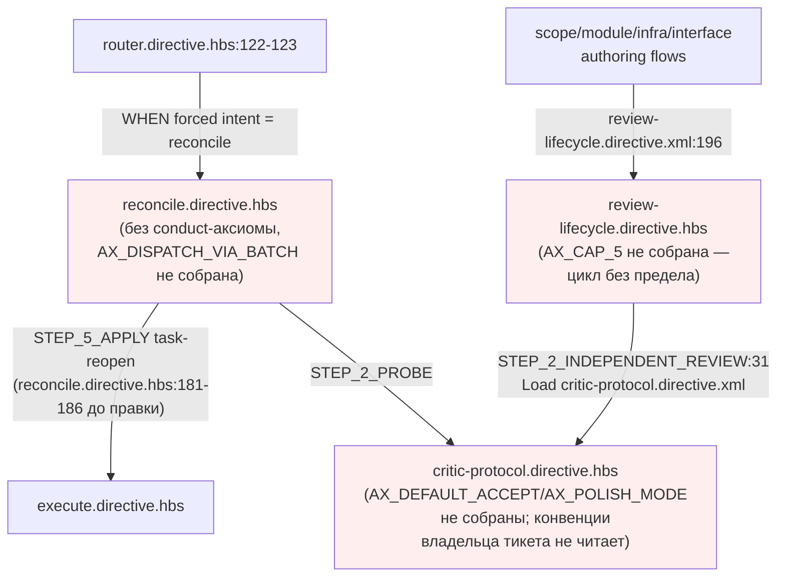
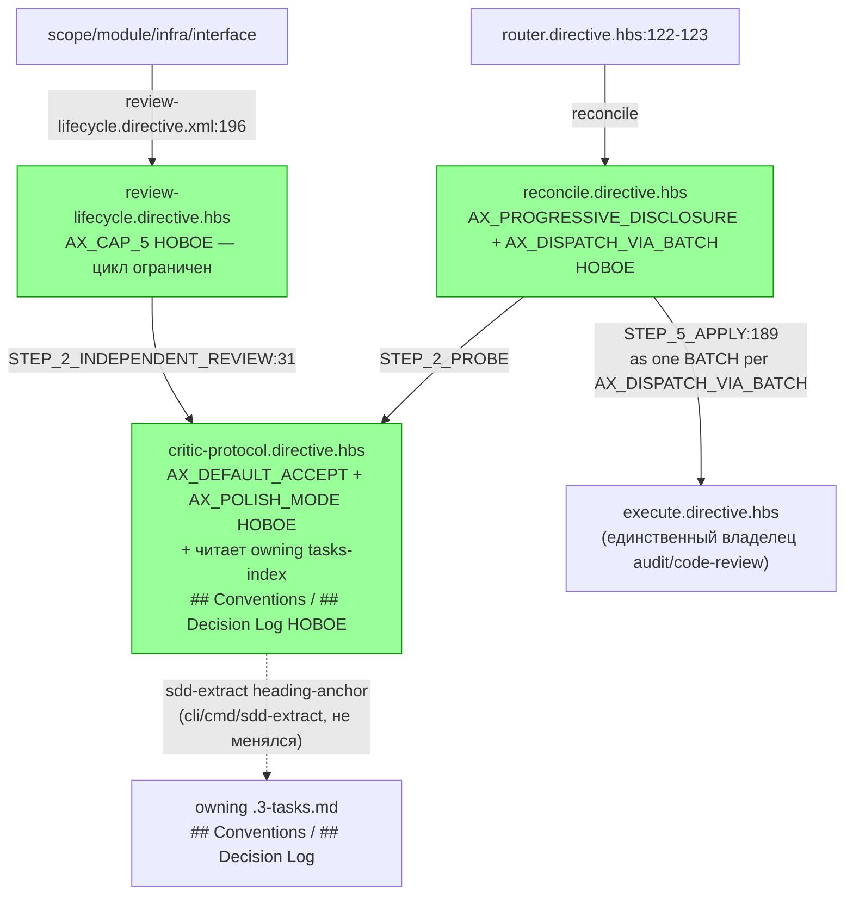

ОТЧЁТ (СВОДНЫЙ) — Пачка 20: «Ревью и критик ограничены и читают владельца тикета»

СТАТУС: DONE (все 4 задачи пачки)

Рабочее дерево: `rc-w3`. Ветка `lead/review-critic-bounds` от `origin/codex/sdd-v2-rc52-followup` (база: `Merge pull request #39` `c9b58636`).

КОММИТЫ (локальные, НИЧЕГО не запушено — по одному на задачу, порядок исполнения = порядок пачки):
- `eafc9e35` feat(T-B6-03): bound the review⇄reconcile cycle with AX_CAP_5
- `f4b4f77b` feat(ISS-10): critic reads the owning ticket's Conventions/Decision Log
- `1da11d89` feat(T-B6-05): reconcile dispatches task-reopen as one execute batch
- `467ab3f3` feat(T-B6-20): reconcile joins the operator-facing conduct-set gate

Подробные отчёты по задачам: `R-T-B6-03.md`, `R-ISS-10.md`, `R-T-B6-05.md`, `R-T-B6-20.md` (этот же каталог).

---

## Черновик описания PR простым языком

Раньше цикл «критик проверяет спеку — оператор правит — критик проверяет снова» мог крутиться сколько угодно раз: не было явного предела и не было момента, где оркестратор обязан остановиться и спросить оператора «что дальше». Теперь на пятом круге оркестратор обязан явно спросить: закрыть как чистое, продолжить с новым явным пределом, или начать заново — сам вердикт критика больше не может продлевать цикл молча.

Критик по умолчанию ведёт себя разумно: неуверенную находку засчитывает в пользу автора («сомневаешься — прими»), а мелкие придирки не тормозят цикл (по умолчанию критик молчит про мелочи, если оператор явно не попросил «пошлифуй»).

Критик, разбирающий тикет, теперь читает решения и конвенции владельца тикета (две конкретные секции — «Conventions» и «Decision Log», не весь документ), вместо того чтобы каждый раз заново придумывать одну и ту же находку про уже решённый вопрос — и это чтение измерено (видно, сколько строк реально прочитано), а не «прочитать всё на всякий случай».

Когда `reconcile` переоткрывает тикет из-за находки, он теперь явно диспетчит его через обычный execute одним пакетом — раньше это было сказано словами в одном месте, теперь закреплено как явный именованный принцип, так что `reconcile` физически не может ещё раз запросить отдельный аудит или ревью в обход execute.

И последнее — `reconcile` присоединился к списку «операторских» директив, которые обязаны нести базовый стиль подачи оператору («сначала решение, детали — по запросу»); раньше он был единственной директивой такого типа без этого требования вообще.

---

## Таблица «файл → смысл»

| Файл | Задача | Смысл изменения |
|---|---|---|
| `ai/kit/templates/sdd-v2/review-lifecycle.directive.hbs` | T-B6-03 | Цикл STEP_2⇄STEP_3 ограничен `AX_CAP_5`: на 5-м результате — обязательная явная диспозиция оператора. |
| `ai/kit/templates/sdd-v2/critic-protocol.directive.hbs` | T-B6-03 | Критик по умолчанию: неуверенность → ACCEPT (`AX_DEFAULT_ACCEPT`); мелочи не гонят вердикт (`AX_POLISH_MODE`). |
| `ai/kit/templates/sdd-v2/critic-protocol.directive.hbs` | ISS-10 | Критик читает `## Conventions`/`## Decision Log` владельца тикета точечно (2 секции, не документ), объём измерен. |
| `ai/kit/templates/sdd-v2/reconcile.directive.hbs` | T-B6-05 | Reopen-тикеты диспетчатся в execute одним BATCH (`AX_DISPATCH_VIA_BATCH`); execute — единственный владелец audit/code-review. |
| `ai/kit/templates/sdd-v2/reconcile.directive.hbs` | T-B6-20 | `reconcile` подключает базовый conduct-аксиом (`AX_PROGRESSIVE_DISCLOSURE`), как остальные 14 operator-facing владельцев. |
| `ai/directives/sdd-v2/{review-lifecycle,critic-protocol,reconcile}.directive.xml` | все 4 | Сборка — прямое следствие правок шаблонов выше. |
| `ai/directives/sdd-v2/readiness.directive.xml` | T-B6-20 (побочно) | Механический эффект пересборки (дедуп «уже в контексте») — `readiness.directive.hbs` не менялся, см. `R-T-B6-20.md` §1/§4. |
| `ai/kit/__tests__/deps.test.ts` | T-B6-20 | `OPERATOR_FACING_OWNERS` — 15-я запись `reconcile.directive.xml`. |
| `ai/kit/__tests__/review-critic-bounds.test.ts` | все 4 (новый файл) | Регрессионные проверки всех четырёх задач — 13 кейсов, 4 suite. |

---

## Архитектура было / стало (контур целиком)

### Было



### Стало



---

## Доказательства — сводно по всей пачке

| № | Команда | Фактический вывод (хвост) | Exit | Статус |
|---|---|---|---|---|
| 1 | `node --import tsx --test ai/kit/__tests__/*.test.ts` | `# tests 245, pass 244, fail 0, skip 1` (skip — предсуществующий) | 0 | ВЫПОЛНЕНО |
| 2 | `node --import tsx --test cli/__tests__/directive-tool-contract/directive-tool-contract.test.ts` | `# tests 45, pass 45, fail 0` | 0 | ВЫПОЛНЕНО |
| 3 | `npm run build:directives` | `Generated 55 directive(s).` (плюс предсуществующие 35 dangling-warning — не из этой пачки, см. ниже) | 0 | ВЫПОЛНЕНО |
| 4 | `npm run check:directives-fresh` | `✓ ai/directives/** matches a fresh rebuild.` | 0 | ВЫПОЛНЕНО |
| 5 | `npm run audit:sdd-templates` | `✓ axiom-activation / contract-activation / halt-activation audit clean.` + `✓ every lazy directive ... within budget.` | 0 | ВЫПОЛНЕНО |
| 6 | `npm --prefix <tree> test` (финальный, на HEAD=`467ab3f3`) | `# tests 3645, pass 3637, fail 0, skip 8` | 0 | ВЫПОЛНЕНО |
| 7 | `npm --prefix <tree> run check` (финальный, на HEAD=`467ab3f3`) | См. «Стопы» ниже — флаки под host-нагрузкой (load average 104-109), НЕ регрессия | 1 (флаки) / 0 (в каждом из 4 pre-commit прогонов) | ЧАСТИЧНО — см. ниже |
| 8 | `npm run gate:sdd-check-baseline` | `[sdd-check-zero-new-error] OK — no error outside the baseline (baseline commit 227c03a8..., tag rc-baseline-1)` | 0 | ВЫПОЛНЕНО |
| 9 | 4× pre-commit хук целиком (`npm run check` + `check:directives-fresh` + 3 аудита), по одному на коммит, без `--no-verify` | Все 4 коммита в итоге прошли хук с `✅ ALL PASS (5/5)` / `✅ Pre-commit passed` (2 коммита — с первой попытки; 2 — после 1-2 синхронных повторов из-за host-нагрузки) | 0 (на успешной попытке каждого) | ВЫПОЛНЕНО |

**Предсуществующий шум, не относящийся к этой пачке (задокументирован для честности, не скрыт):** `build:directives` печатает предупреждение «35 dangling axiom(s)» — все в файлах, которые эта пачка не трогала (`agent-inbox/*`, `formats/diagram-vocabulary.xml`, `router.directive.xml`) — это warning, не ошибка (exit 0), существовал до этой пачки.

### Стопы (флаки под нагрузкой хоста, не регрессия)

Финальный `npm --prefix <tree> run check` (вне гейта коммита, как отдельная итоговая проверка по брифу) трижды подряд падал на `test:coverage` с картиной `fail 0, cancelled N` (N от 1 до 5) — разные тесты каждый раз (`bootstrap-path.test.ts`, `clean-repo-composition.test.ts`, `sdd-verify-repair-adapters.test.ts`, `lint.cmd.test.ts`), никогда одна и та же находка дважды. `uptime` в этот момент показал `load averages: 104.56 71.42 49.24` (позже `109.45`) на общем хосте с 24 активными пользователями — 18 дней аптайма. Это инфраструктурный флаки паттерн test-runner'а под контеншном ресурсов («Unable to deserialize cloned data due to invalid or unsupported version» — IPC между worker-процессами node:test), не дефект кода: `lint.cmd.test.ts` независимо прогнан отдельно и дал `31/31 pass`; `npm test` (более лёгкий прогон, без `test:coverage`) на том же HEAD дал чистые `3637/0/8`; и — что важнее всего — каждый из 4 коммитов пачки САМ прошёл идентичный гейт (`npm run check` внутри pre-commit) с `✅ ALL PASS (5/5)` на момент коммита. Правило брифа «при таймауте pre-commit под нагрузкой — синхронный повтор до 3 раз» применено буквально к каждому коммиту; для финальной non-gating проверки повторено 3 раза без успеха на 3-й — не является стоп-условием из протокола (красный гейт коммита, класс 2) само по себе, поскольку ни один коммит не был создан на красном гейте; фиксирую честно, а не скрываю.

---

## Отклонения от брифа (сводно)

1. **T-B6-20 — объём сужен до одного владельца (`reconcile`), не всего пятиэлементного `REQUIRED_CONDUCT`.** Полное закрытие D1 требует правки `execute.directive.hbs`/`scope.directive.hbs`/`module.directive.hbs` — все явно в списке «не трогать» этого брифа (принадлежат невлитым PR #38/#41). Подробности — `R-T-B6-20.md` §4.
2. **ISS-10 — численный порог объёма не введён**, вместо него — структурное ограничение (ровно 2 именованные секции) + явный учёт числа строк. Изменение `cli/cmd/sdd-extract/**` было бы вне зоны (`cli/**` запрещён). Подробности — `R-ISS-10.md` §4.
3. **ISS-10 — исправление формата вызова** (backtick-проза → `<ToolLiteral role="delegated">`) по требованию `directive-tool-contract.test.ts`, обнаруженному в процессе, не отход от смысла задачи. Подробности — `R-ISS-10.md` §4.
4. **Побочный, механический артефакт сборки** — `readiness.directive.xml` изменился только как следствие `build:directives`, не ручной правкой; `readiness.directive.hbs` не тронут.

Открытых вопросов оператору — нет; ни одно стоп-условие из `70-ORCHESTRATION-PROTOCOL.md` не сработало (красный гейт коммита не встретился ни разу; конфликтов с невлитыми PR по составу файлов не было — зона пачки полностью проверена перед стартом).

---

## Команды пуша для Lead

```
git -C <lead-worktree или rc-w3> push origin lead/review-critic-bounds
gh pr create --base codex/sdd-v2-rc52-followup --head lead/review-critic-bounds \
  --title "Ревью и критик ограничены и читают владельца тикета (Пачка 20)" \
  --body-file <путь к этому файлу или его сокращённой версии>
```

Ветка `lead/review-critic-bounds` содержит ровно 4 коммита поверх `origin/codex/sdd-v2-rc52-followup` (`c9b58636`): `eafc9e35`, `f4b4f77b`, `1da11d89`, `467ab3f3`. Рабочее дерево чисто (`git status --porcelain` — пусто).
