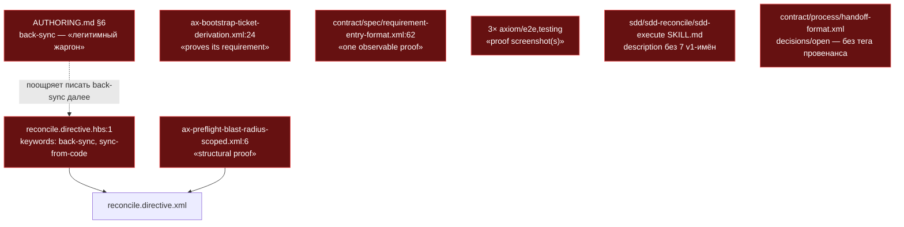

ОТЧЁТ (СВОДНЫЙ) — Пачка 21: «Обещания инструмента не шире механизма» (Волна 3)

СТАТУС: DONE (3/4 задачи полностью) + ЧАСТИЧНО (1/4 — ISS-11, грамматика сделана, обвязка блокирована зоной брифа)

Рабочее дерево: `rc-w3`. Ветка `lead/promises-not-wider` от `lead/review-critic-bounds` (PR #45, база `f0c1703f`). Релизную ветку `lead/promises-not-wider` в неё не мержить — стек поверх общего `reconcile.directive.hbs`.

КОММИТЫ (локальные, НИЧЕГО не запушено — 4 коммита, порядок исполнения = порядку брифа):
- `53249aa2` fix(T-B6-28): reconcile stops promising back-sync as a mechanism
- `8b4842ca` fix(T-B6-29): assurance wording matches what the mechanism checks
- `9c257d2d` fix(T-B6-07): retired v1 skill names live only as description triggers
- `19304ac4` fix(ISS-11): Handoff decisions/open entries carry a provenance tag

Подробные отчёты по задачам (каждый несёт полную таблицу файлов, обе mermaid-диаграммы, доказательства и отклонения): `R-T-B6-28.md`, `R-T-B6-29.md`, `R-T-B6-07.md`, `R-ISS-11.md` (этот же каталог).

---

## Черновик описания PR простым языком

Инструмент обещает ровно то, что делает — эта пачка снимает четыре места, где слова были сильнее механизма.

`reconcile` больше не называет несуществующий механизм «обратной синхронизации»: `sdd-sync` — это статус трекера (tracker-status/rollup), и теперь ключевые слова директивы и гайд по стилю директив говорят именно это, а не намекают на код, который сам себя правит по спеке.

Слова «доказано»/«проверено»/«100%» теперь стоят только там, где механизм действительно это проверяет. Там, где механизм лишь проверяет наличие, форму или связность (структурный факт, существование ID, факт запуска команды), текст так и говорит — введён закрытый словарь из четырёх уровней уверенности (механически проверено / оценено агентом / однократно замечено тестом / неизвестно), и явно зафиксировано: golden-тест доказывает, что поведение не изменилось, а не то, что оно было правильным. Заодно нашлась и была задокументирована уже существующая (не новая) проверка: диаграмма требований со ссылкой на несуществующий ID — это находка, а диаграмма общего назначения без единого ID — это нормально.

Пять забытых имён v1-скиллов (`/sdd-setup`, `/sdd-discover`, `/sdd-continue`, `/sdd-infra`, `/sdd-module-decomposition`) и ещё два (`/sdd-fix`, `/sdd-execute-batch`) теперь узнаются роутером — не как новые скиллы или обёртки (этого решение оператора прямо запрещает), а как явно названные старые имена в описании того v2-скилла, который эту работу теперь делает.

И последнее: строка Handoff между фазами теперь умеет отмечать, что факт был реально измерен, а не просто предположен или перенесён с предыдущего шага — грамматика тега `(measured|reported|assumed)` объявлена в общем контракте. Честно: обвязка, которая реально проверяет и предупреждает на непомеченных записях, в эту пачку не попала — она живёт в файлах, явно закрытых для этого брифа (`sdd-log.cmd.ts`, шаг семантического аудита), и первая попытка обойти это упёрлась в собственный же гейт репозитория «код без второго использования — подозрителен» (yagni). Грамматика задокументирована и готова, реализация ждёт отдельного брифа.

---

## Таблица «файл → смысл»

| Файл | Задача(и) | Смысл изменения |
|---|---|---|
| `ai/kit/templates/sdd-v2/reconcile.directive.hbs:1` | T-B6-28 | keywords: `back-sync` убран, `sync-from-code` → `from-code` (реальное имя режима). |
| `ai/kit/AUTHORING.md` §6 (жаргон-список) | T-B6-28 | `back-sync` убран из «легитимного жаргона»; единственное упоминание — явное отрицание. |
| `ai/kit/AUTHORING.md` §13 (новый раздел) | T-B6-29 | Закрытый словарь уверенности + golden-формулировка + правило exact/approximate по языку сканера. |
| `ai/kit/axiom/process/ax-preflight-blast-radius-scoped.xml:6` | T-B6-29 | «structural proof» → «mechanically checked structural fact». |
| `ai/kit/axiom/scaffold/ax-bootstrap-ticket-derivation.xml:24` | T-B6-29 | «command proves its requirement» → «…exercises its requirement» (agent-reviewed, не механическое доказательство). |
| `ai/kit/contract/spec/requirement-entry-format.xml:62` | T-B6-29 | Шаблонное поле Verification: «one observable proof» → «one observable check». |
| `ai/kit/axiom/e2e/ax-e2e-proof-screenshot-always.xml`, `ax-e2e-visual-regression-gated.xml`, `ax-e2e-first.xml` | T-B6-29 | Прозаический термин «proof screenshot» → «render-evidence screenshot» в трёх местах; canon ID `AX_E2E_PROOF_SCREENSHOT_ALWAYS` не тронут. |
| `ai/skills/sdd/SKILL.md`, `sdd-reconcile/SKILL.md`, `sdd-execute/SKILL.md` (`description:`) | T-B6-07 | 7 v1-имён добавлены как явные триггеры в description существующих скиллов; новых скиллов/обёрток — 0. |
| `ai/kit/contract/process/handoff-format.xml` | ISS-11 | Грамматика тега провенанса `(measured\|reported\|assumed)` для `decisions`, `(tag; extent)` для `open`; untagged ⇒ `assumed`/нет extent. |
| `cli/cmd/sdd-log/sdd-log.types.ts` (комментарий у `COMPLETE_HANDOFF_PAYLOAD_RE:252`) | ISS-11 | Задокументирована грамматика; сам regex не менялся (уже принимал тег как свободный текст). |
| `ai/directives/sdd-v2/reconcile.directive.xml`, `infra.directive.xml`, `execute.directive.xml`, `scaffold/steps/STEP_1_DERIVE.xml`, `phase-execution-protocol/steps/STEP_4_HANDOFF.xml`, `formats/requirement-entry-format.xml` | все | Механическая пересборка — прямое следствие правок аксиом/контрактов/шаблонов выше, ни один `.hbs`-источник из списка «не трогать» руками не редактировался. |
| `ai/kit/__tests__/back-sync-not-promised.test.ts` | T-B6-28 | Новый — grep-замок «back-sync только как отрицание». |
| `ai/kit/__tests__/assurance-wording-not-overpromised.test.ts` | T-B6-29 | Новый — grep-замок на 4 конкретные фразы (не блокирует легитимные `proof`/`verified`). |
| `ai/kit/__tests__/v1-skill-names-as-triggers.test.ts` | T-B6-07 | Новый — «каждое имя = ровно один владелец» + «число скиллов не выросло». |

---

## Архитектура было / стало (контур целиком)

### Было (до пачки 21, на `f0c1703f`)



### Стало (после пачки 21, HEAD=`19304ac4`)

```mermaid
flowchart TD
  KW2["reconcile.directive.hbs:1\nkeywords: from-code (back-sync убран)"]
  AUTH2["AUTHORING.md §6 + §13 (новый)\nback-sync — только отрицание;\nсловарь уверенности объявлен"]
  PRE2["ax-preflight…:6\n«mechanically checked structural fact»"]
  BOOT2["ax-bootstrap…:24\n«exercises its requirement»"]
  REQ2["formats/requirement-entry-format.xml:61\n«one observable check»"]
  E2E2["3× axiom/e2e,testing\n«render-evidence screenshot(s)»"]
  SKILLS2["sdd/sdd-reconcile/sdd-execute SKILL.md\n+ 7 v1-имён как триггеры"]
  HANDOFF2["contract/process/handoff-format.xml\ndecisions[k=v(tag)], open[id(tag; extent): text]"]
  LOCK1["back-sync-not-promised.test.ts"]
  LOCK2["assurance-wording-not-overpromised.test.ts"]
  LOCK3["v1-skill-names-as-triggers.test.ts"]
  DIAG["shared/sdd/check.ts:2476 checkDiagramCaptions\n(уже было — подтверждено, не создано)"]
  KW2 --> LOCK1
  AUTH2 --> LOCK1
  PRE2 --> LOCK2
  BOOT2 --> LOCK2
  REQ2 --> LOCK2
  E2E2 --> LOCK2
  AUTH2 -.-> LOCK2
  SKILLS2 --> LOCK3
  HANDOFF2 -.->|"обвязка (warn) — вне зоны,\nследующий бриф"| PENDING["sdd-log.cmd.ts / STEP_2_SEMANTIC\nНЕ ТРОНУТО"]
  style KW2 fill:#163,stroke:#3a3,color:#fff
  style AUTH2 fill:#163,stroke:#3a3,color:#fff
  style PRE2 fill:#163,stroke:#3a3,color:#fff
  style BOOT2 fill:#163,stroke:#3a3,color:#fff
  style REQ2 fill:#163,stroke:#3a3,color:#fff
  style E2E2 fill:#163,stroke:#3a3,color:#fff
  style SKILLS2 fill:#163,stroke:#3a3,color:#fff
  style HANDOFF2 fill:#163,stroke:#3a3,color:#fff
  style LOCK1 fill:#163,stroke:#3a3,color:#fff
  style LOCK2 fill:#163,stroke:#3a3,color:#fff
  style LOCK3 fill:#163,stroke:#3a3,color:#fff
  style DIAG fill:#369,stroke:#69c,color:#fff
  style PENDING fill:#661,stroke:#cc3,color:#fff
```



---

## Доказательства — сводно по всей пачке (после всех 4 коммитов, HEAD=`19304ac4`)

**1. `npm test` (deterministic topology).**
```
$ npm --prefix <rc-w3> test
# tests 3675
# pass 3667
# fail 0
# skipped 8
```
exit 0. ВЫПОЛНЕНО.

**2. `npm run check` (sdd-verify --profile full: type-check, test:coverage, lint, format, yagni).**
```
[sdd-verify] ✅ ALL PASS (5/5)
  ✅ type-check (4.3s)
  ✅ test:coverage (44.0s)
  ✅ lint (10.1s)
  ✅ format (2.2s)
  ✅ yagni (0.6s)
```
exit 0. ВЫПОЛНЕНО.

**3. `npm run audit:sdd-templates` (check:directives-fresh + audit:axioms + audit:contracts + audit:halts + check:directive-budgets).**
```
✓ ai/directives/** matches a fresh rebuild.
✓ axiom-activation audit clean — 28 template(s) checked.
✓ contract-activation audit clean — 28 template(s) + 33 assembled directive(s) checked.
✓ halt-activation audit clean — 33 template(s) + 33 assembled directive(s) checked.
✓ every lazy directive under ai/directives/sdd-v2/** is within budget.
```
exit 0. ВЫПОЛНЕНО.

**4. `npm run check:directives-fresh` (отдельно).**
```
✓ ai/directives/** matches a fresh rebuild.
```
exit 0. ВЫПОЛНЕНО.

**5. `npm run gate:sdd-check-baseline`.**
```
[sdd-check-zero-new-error] OK — no error outside the baseline (baseline commit 227c03a83830124fe2aa22541dd5374beb8a53c6, tag rc-baseline-1).
```
exit 0. ВЫПОЛНЕНО.

**6. Per-задача grep-замки — см. §3 в каждом `R-<id>.md`.** Сводно: `back-sync-not-promised.test.ts` 2/2, `assurance-wording-not-overpromised.test.ts` 2/2, `v1-skill-names-as-triggers.test.ts` 9/9, `check-diagram-captions.test.ts` (не создан, перепроверен) 12/12, `directive-activation-announcement.test.ts` (LOCK-3, регрессия #16) 2/2 — все pass, все exit 0.

**Замеченная нестабильность гейта (не от этой пачки).** При одной из промежуточных попыток коммита `test:coverage` дал `cli/cmd/lint/__tests__/lint.cmd.test.ts` `uncaughtException` («Unable to deserialize cloned data due to invalid or unsupported version») — инфраструктурный флейк Node test-runner IPC, не связан ни с одним файлом этой пачки; изолированный повторный прогон того же теста — 31/31 pass. Коммит повторён синхронно и прошёл чисто.

---

## Отклонения и открытые вопросы (сводно; полный текст — в `R-<id>.md`)

1. **T-B6-28** — расширена правка на соседний keyword `sync-from-code` → `from-code` (тот же класс дефекта, назван доской рядом с `back-sync`).
2. **T-B6-29** — диаграммная половина D-43 (чекер существования ID в подписи диаграммы требований) уже существовала и уже тестировалась (`shared/sdd/check.ts:2476` `checkDiagramCaptions`) — подтверждена, не создавалась заново. Найдено и исправлено третье вхождение «proof screenshot» (`ax-e2e-first.xml:12`), не названное в исходном research-отчёте.
3. **T-B6-07** — `ai/skills/README.md` и `specs/ai-skills/ai-skills.spec.md` (дрейф `sdd-hooks-install`), названные в track-документе, оставлены нетронутыми — вне зоны брифа и/или под общим запретом `specs/**`.
4. **ISS-11 — главное отклонение пачки.** Задача выполнима только частично в заданной зоне: грамматика провенанса в контракте — сделана; фактическая проверка/warn (в `sdd-log.cmd.ts`) и правило аудита (`audit/steps/STEP_2_SEMANTIC.xml`) — оба явно исключены из зоны брифа («не трогать … `sdd-log.cmd.ts`», «не трогать `audit.directive.hbs`»). Первая попытка добавить чистые функции-парсеры в `sdd-log.types.ts` (единственный разрешённый файл) провалила гейт `yagni` (< 2 использований в production-коде) — единственные легальные способы снять находку требуют либо второго вызова в запрещённом файле, либо Usage Waiver в запрещённом `tasks/**`. Функции убраны, оставлена только документация грамматики. **Рекомендация Lead:** отдельный follow-up-бриф с доступом к `sdd-log.cmd.ts`/`STEP_2_SEMANTIC.xml` (координация с B2-14 — тот же скелет Handoff).
5. **Побочный ripple (все четыре задачи, где применимо).** Правки общих партиалов (`ax-preflight-blast-radius-scoped`, `ax-bootstrap-ticket-derivation`, `ax-e2e-first`, `HANDOFF_FORMAT`) механически регенерируют файлы из списков «не трогать» других PR (`reconcile.directive.xml`, `infra.directive.xml`, `scaffold/steps/STEP_1_DERIVE.xml`, `execute.directive.xml`, `phase-execution-protocol/steps/STEP_4_HANDOFF.xml`) — diff в каждом ограничен исключительно текстом изменённого партиала, ни один `.hbs`-источник из чужого списка не редактировался руками. Рекомендую Lead перепроверить `check:directives-fresh` после ребейза на PR #38 (execute/phase-*) и пачку 15 (shared/sdd/check.ts, sdd-log.types.ts — в этой пачке пересечения по факту не случилось, оба файла не совпали построчно с тем, что могла тронуть пачка 15).

**Команда пуша (для Lead):**
```
git push origin lead/promises-not-wider
gh pr create --base codex/sdd-v2-rc52-followup --head lead/promises-not-wider --draft \
  --title "Пачка 21: обещания инструмента не шире механизма" \
  --body-file ai/drafts/research/sdd-v1-to-v2-transfer/_raw/reports/R-BATCH-21-promises-not-wider.md
```
