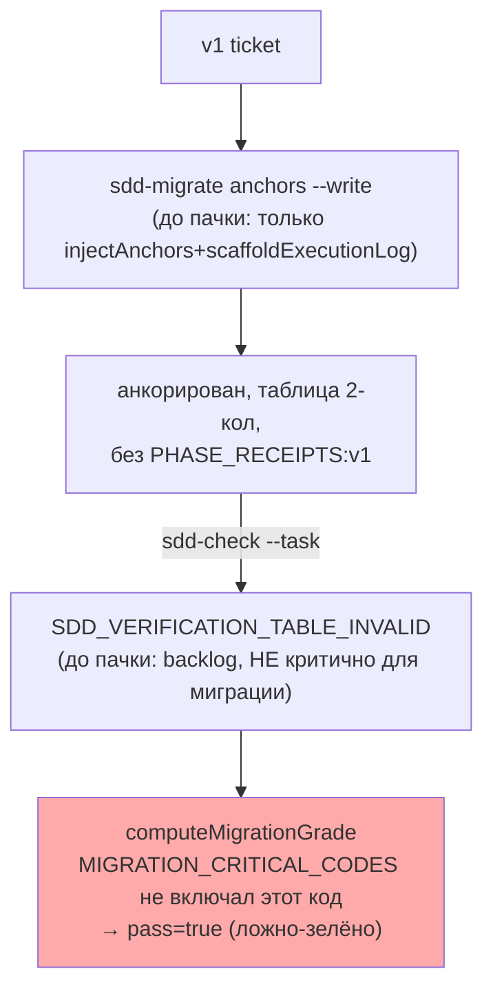
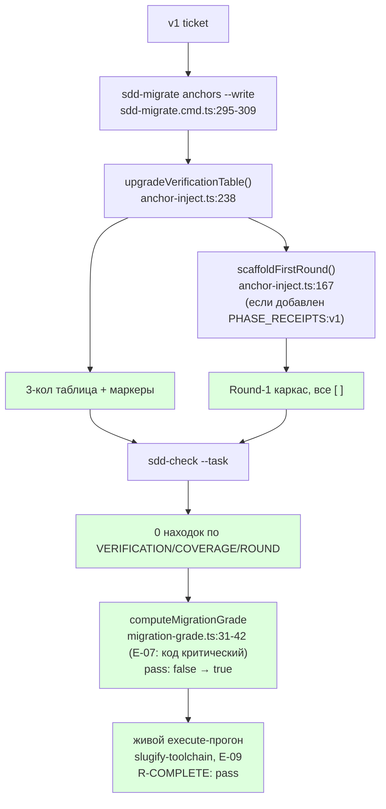

# Пачка 22 — «Мигратор сначала доказывает дефект, потом лечит»

Ветка `lead/migrator-red-first` (от `lead/eval-reproducible` = PR #43, `c51cab65`). Задачи в порядке
L-15 (red-first): **E-03 → E-07 → E-06 → E-09**. Полные таблицы/доказательства — в `R-E-03.md`,
`R-E-07.md`, `R-E-06.md`, `R-E-09.md`.

## Черновик описания PR (простым языком)

Раньше мигратор доводил v1-тикет только до "анкоров" (расставлял `<!--SECTION:NAME-->` метки), но
таблицу проверки не трогал — она оставалась в старом 2-колоночном формате, который современный
`sdd-check`/`sdd-task` отвергает. Это был реальный дефект: живой прогон флоу на мигрированном тикете
упирался именно в него. Проблема была в том, что бар, который должен ловить этот дефект
(`SDD_VERIFICATION_TABLE_INVALID` в списке критических кодов миграции), раньше не считался
критическим — миграция могла "пройти", хотя реально оставляла тикет неисполнимым.

Эта пачка чинит порядок работы, а не только код: сначала (E-07) бар исполнимости стал критическим —
и мы ДОКАЗАЛИ, что на немигрированном тикете он красный. Только после этого (E-06) мигратор получил
способность чинить именно эту таблицу (и добавлять сопутствующие маркеры `PHASE_RECEIPTS:v1`/
`COVERAGE_POLICY:v1`, и — там, где это не ломает Execution Log — каркас первого раунда). Тот же
бар на том же тикете стал зелёным — не потому что бар ослабили, а потому что мигратор реально
доработали. До этого (E-03) числа прогонов эвала были пересобраны на свежей сборке (после фикса
`3d5f66a7`, который гарантирует, что песочница всегда получает свежий `dist`) — старые числа считать
нельзя. После всего (E-09) — первый живой прогон, где полное правило завершённости (`R-COMPLETE`:
артефакт + DONE + закрытый раунд + оба receipt'а) дало реальный `pass` на живой сессии модели, не на
синтетике.

## Таблица «файл → смысл»

| Файл | Смысл | Задача |
|---|---|---|
| `ai/flow-eval/scripts/session-metrics.py` | Ledger переезжает в постоянный `results/` (D-62); `state_metrics()` обобщён под любую фикстуру | E-03 |
| `.prettierignore` | Исключена генерируемая таблица `RESULTS.md` (padding-конфликт с prettier, вскрыт первыми реальными данными) | E-03 |
| `ai/flow-eval/results/2026-09-10-infra-log-summary[-2,-3]/`, `metrics-ledger.jsonl` | 3 живых прогона golden-фикстуры, 2 из них golden-верифицированы вручную, 2 записи в ledger | E-03 |
| `ai/flow-eval/migration-grade.ts` | `MIGRATION_CRITICAL_CODES` += `SDD_VERIFICATION_TABLE_INVALID`, `SDD_COVERAGE_POLICY_INVALID` | E-07 |
| `ai/flow-eval/__tests__/migration-grade.test.ts` | 4 новых both-way теста на РЕАЛЬНО захваченном (не синтетическом) выводе `sdd-check` | E-07 |
| `ai/flow-eval/docs/EVAL-SPEC.md` | Словарь правил MIGRATION обновлён до 5 кодов | E-07 |
| `shared/sdd/anchor-inject.ts` | +`upgradeVerificationTable` (2-кол→3-кол + маркеры), +`scaffoldFirstRound` (Round-1 каркас) | E-06 |
| `cli/cmd/sdd-migrate/sdd-migrate.cmd.ts` | `anchors --write` теперь вызывает обе новые функции | E-06 |
| `ai/flow-eval/__tests__/fixtures/fixture-detmig/` + `fixture-detmig.test.ts` | Сквозной тест: RED (sdd-check) → реальный мигратор → GREEN + `computeMigrationGrade` FAIL→PASS | E-06 |
| `ai/flow-eval/results/2026-09-10-slugify-toolchain[-2]/` | 2 живых прогона execute-фазы, R-COMPLETE pass оба раза | E-09 |

## Mermaid: было → стало (весь контур)





## Доказательства (сводно; полные — в R-<id>.md каждой задачи)

| Задача | Команда | Результат | Exit |
|---|---|---|---|
| E-03 | 2× живой прогон `infra-log-summary` + ручной `golden/verify.sh` | `PASS` оба раза | 0 |
| E-03 | `npm run results:table:check` | up to date | 0 |
| E-07 | `node --test ai/flow-eval/__tests__/migration-grade.test.ts` | 11/11 pass (было 7/7) | 0 |
| E-06 | `node --test ai/flow-eval/__tests__/fixture-detmig.test.ts` | 4/4 pass (RED→мигратор→GREEN→grade PASS) | 0 |
| E-06 | `node --test cli/cmd/sdd-migrate/__tests__/sdd-migrate.cmd.test.ts shared/sdd/__tests__/anchor-inject.test.ts` | 39/39 pass | 0 |
| E-09 | 2× живой execute-прогон `slugify-toolchain` (см. R-E-09.md) | R-COMPLETE: pass оба раза (на диске: DONE, receipts, реальный код) | см. R-E-09.md |
| batch | `npm --prefix <tree> run test:sdd-flow-eval` | 206-211/207-211 pass, 1 известный предсуществующий (`harness.test.ts`, R-BATCH-07) | 1 (не блокирует) |
| batch | `npm --prefix <tree> run type-check` | чисто | 0 |
| batch | `npm --prefix <tree> run flow-eval:docs-check` | OK, 0 [UNVERIFIED] | 0 |
| batch | `npm --prefix <tree> run gate:sdd-check-baseline` | no error outside baseline | 0 |
| batch | `npm --prefix <tree> run check` (после ретраев — предсуществующие флейки `test:coverage`/`lint.cmd.test.ts` IPC-краш, D-10/REL-15) | ALL PASS (5/5) | 0 |

## Отклонения и открытые вопросы (сводно — детали в R-<id>.md)

1. **E-03**: интерпретация `metrics-ledger.jsonl` — файл был жёстко привязан к ОДНОЙ фикстуре
   (infra-base/cloud-ios) и жил в gitignore'нном `.results/`; обобщён и перемещён в `results/` (D-62).
   Открыт вопрос: верна ли эта интерпретация приёмки.
2. **E-07**: «проверки SCOPE_TYPE» из формулировки доски — в коде НЕТ отдельного sdd-check кода за
   некорректный `SCOPE_TYPE` (только `sdd-state`'s отдельный `specSchema` report, не finding-код).
   Не добавлен новый код (вышло бы за пределы зоны `migration-grade.ts`, задело бы `shared/sdd/check.ts`
   — явно «не трогать»). Покрыт только `SDD_COVERAGE_POLICY_INVALID` (PHASE_RECEIPTS:v1-осведомлённый).
   Открытый вопрос Lead/оператору.
3. **E-06**: `scaffoldFirstRound` — необходимое следствие добавления `PHASE_RECEIPTS:v1` (иначе
   получаем новый дефект `SDD_EXECUTION_LOG_ROUND_MISSING` вместо старого), не заявленное явно в
   тексте брифа буквально. Мигратор spec-уровня (перенос/переименование SCOPE_TYPE-маркера на самой
   спеке) не тронут — принадлежит отдельному, более крупному механизму (`migration-plan.ts`).
4. **E-09**: см. R-E-09.md — судья (LLM) дал вердикт `fail` на первом прогоне, детерминированные
   гейты (R1, R-COMPLETE) оба дали `pass`; расследование показало, что судья прав в наблюдении
   (`spec-schema=invalid` на `specs/slugify/slugify.spec.md`), но неправ в выводе — это
   ПРЕДСУЩЕСТВУЮЩЕЕ состояние фикстуры (не тронуто воркером, `git diff --stat` подтверждает), не
   дефект execute-фазы этого тикета. Судья — диагностика, не бар (D-28/L-14); детерминированный бар
   решает. Два побочных дефекта харнесса найдены и вынесены отдельными `spawn_task` (не в этой
   пачке): (а) `provision.ts`'s `canonicalScope()` генерирует BOOTSTRAP_REQUIREMENTS прозой, а не
   таблицей → `spec-schema=invalid` на КАЖДОЙ фикстуре, построенной этим хелпером; (б) `cli.ts` теряет
   результат одного из двух правил качества в `summary.json`, когда оба посчитаны и оба прошли.

## Команды пуша для Lead

RC не пушит самостоятельно. После независимой проверки `plan-verifier`:
```
git push origin lead/migrator-red-first
```
(новая ветка, PR базируется на `lead/eval-reproducible`/PR #43 согласно брифу пачки 22.)
