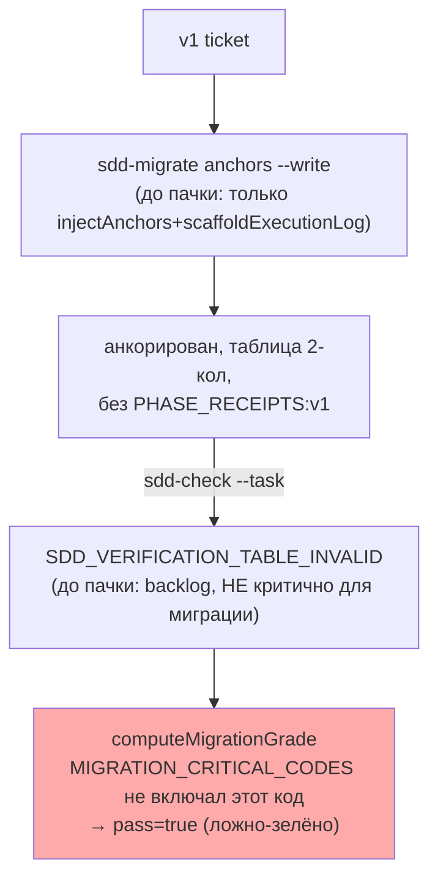
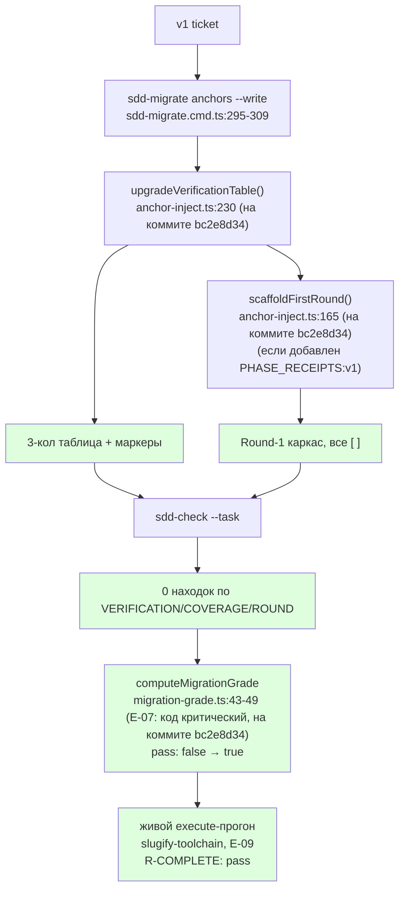

# Пачка 22 — «Мигратор сначала доказывает дефект, потом лечит»

Ветка `lead/migrator-red-first` (от `lead/eval-reproducible` = PR #43, `c51cab65`). Задачи в порядке
L-15 (red-first): **E-03 → E-07 → E-06 → E-09**. Полные таблицы/доказательства — в `R-E-03.md`,
`R-E-07.md`, `R-E-06.md`, `R-E-09.md`. Все четыре задачи пачки закрыты; коммиты по порядку —
`58aba32f` (E-03) → `03d661d5` (E-07) → `5fcf286a` (E-06) → `bc2e8d34` (E-09, HEAD ветки).

## Черновик описания PR (простым языком)

Раньше мигратор доводил v1-тикет только до "анкоров" (расставлял `<!--SECTION:NAME-->` метки), но
таблицу проверки не трогал — она оставалась в старом 2-колоночном формате, который современный
`sdd-check`/`sdd-task` отвергает. Это был реальный дефект: живой прогон флоу на мигрированном тикете
упирался именно в него. Проблема была в том, что бар, который должен ловить этот дефект
(`SDD_VERIFICATION_TABLE_INVALID` в списке критических кодов миграции), раньше не считался
критическим — миграция могла "пройти", хотя реально оставляла тикет неисполнимым.

Эта пачка чинит порядок работы, а не только код: сначала (E-07) бар исполнимости стал критическим —
и мы ДОКАЗАЛИ, что на немигрированном тикете он красный. Только после этого (E-06) мигратор получил
способность чинить именно эту таблицу (и добавлять сопутствующие маркеры `PHASE_RECEIPTS:v1`/
`COVERAGE_POLICY:v1`, и — там, где это не ломает Execution Log — каркас первого раунда). Тот же
бар на том же тикете стал зелёным — не потому что бар ослабили, а потому что мигратор реально
доработали. **Уточнение по V-BATCH-22 verdict B-2:** бар (`migration-grade.ts`) на момент этого
описания ловил только ВНЕСЁННЫЕ находки относительно baseline, не оставшиеся — то есть миграция, не
чинящая вообще ничего, могла бы пройти этот бар, если бы дефект уже был в baseline. Исправлено правкой
по вердикту (см. ниже): коды исполнимости (`SDD_VERIFICATION_TABLE_INVALID`/
`SDD_COVERAGE_POLICY_INVALID`) теперь считаются по тому, что ОСТАЁТСЯ после воркера, а не по дельте.
До этого (E-03) числа прогонов эвала были пересобраны на свежей сборке (после фикса `3d5f66a7`,
который гарантирует, что песочница всегда получает свежий `dist`) — старые числа считать нельзя.
После всего (E-09) — первый живой прогон, где механическое правило завершённости (`R-COMPLETE`:
артефакт + DONE + закрытый раунд + оба receipt'а) дало реальный `pass` на живой сессии модели, не на
синтетике. **Уточнение по V-BATCH-22 verdict B-3:** на момент этого описания правило проверяло
присутствие квитанций ПОДСТРОКОЙ, без вердикта и провенанса, и «артефакт собран» — простым «файл
непуст» (фикстура коммитит заглушку артефакта при провижининге). Исправлено правкой по вердикту (см.
ниже); честный повторный живой прогон дал 1 pass / 1 fail из двух (не оба зелёных) — см. таблицу
«E-09 до/после ужесточения».

## Таблица «файл → смысл»

| Файл | Смысл | Задача |
|---|---|---|
| `ai/flow-eval/scripts/session-metrics.py` | Ledger переезжает в постоянный `results/` (D-62); `state_metrics()` обобщён под любую фикстуру | E-03 |
| `.prettierignore` | Исключена генерируемая таблица `RESULTS.md` (padding-конфликт с prettier, вскрыт первыми реальными данными) | E-03 |
| `ai/flow-eval/results/2026-09-10-infra-log-summary[-2,-3]/`, `metrics-ledger.jsonl` | 3 живых прогона golden-фикстуры, 2 из них golden-верифицированы вручную, 2 записи в ledger | E-03 |
| `ai/flow-eval/migration-grade.ts` | `MIGRATION_CRITICAL_CODES` += `SDD_VERIFICATION_TABLE_INVALID`, `SDD_COVERAGE_POLICY_INVALID` | E-07 |
| `ai/flow-eval/__tests__/migration-grade.test.ts` | 4 новых both-way теста на РЕАЛЬНО захваченном (не синтетическом) выводе `sdd-check` | E-07 |
| `ai/flow-eval/docs/EVAL-SPEC.md` | Словарь правил MIGRATION обновлён до 5 кодов | E-07 |
| `shared/sdd/anchor-inject.ts` | +`upgradeVerificationTable` (2-кол→3-кол + маркеры), +`scaffoldFirstRound` (Round-1 каркас) | E-06 |
| `cli/cmd/sdd-migrate/sdd-migrate.cmd.ts` | `anchors --write` теперь вызывает обе новые функции | E-06 |
| `ai/flow-eval/__tests__/fixtures/fixture-detmig/` + `fixture-detmig.test.ts` | Сквозной тест: RED (sdd-check) → реальный мигратор → GREEN + `computeMigrationGrade` FAIL→PASS | E-06 |
| `ai/flow-eval/results/2026-09-10-slugify-toolchain[-2]/` | 2 живых прогона execute-фазы, R-COMPLETE pass оба раза | E-09 |

## Mermaid: было → стало (весь контур)





*(ИСПРАВЛЕНО V-BATCH-22 verdict B-9 — номера были заявлены `:238`/`:167`/`:31-42`, фактические на HEAD
`bc2e8d34` (до правок по вердикту) — `:230`/`:165`/`:43-49`. После правок по вердикту (см. «Правки по
вердикту верификатора» ниже) эти же символы сдвинулись ещё раз: `scaffoldFirstRound` теперь патчит, а
не переписывает Execution Log (+22 строки докблока/логики) → `anchor-inject.ts:167`/`:243`;
`MIGRATION_CRITICAL_CODES` разделился на структурные/исполнимость коды → `migration-grade.ts:54-65`.)*

## Доказательства (сводно; полные — в R-<id>.md каждой задачи)

| Задача | Команда | Результат | Exit |
|---|---|---|---|
| E-03 | 2× живой прогон `infra-log-summary` + ручной `golden/verify.sh` | `PASS` оба раза | 0 |
| E-03 | `npm run results:table:check` | up to date | 0 |
| E-07 | `node --test ai/flow-eval/__tests__/migration-grade.test.ts` | 11/11 pass (было 7/7) | 0 |
| E-06 | `node --test ai/flow-eval/__tests__/fixture-detmig.test.ts` | 4/4 pass (RED→мигратор→GREEN→grade PASS) | 0 |
| E-06 | `node --test cli/cmd/sdd-migrate/__tests__/sdd-migrate.cmd.test.ts shared/sdd/__tests__/anchor-inject.test.ts` | 24/24 pass (ИСПРАВЛЕНО V-BATCH-22 B-7: 16+8, было ошибочно заявлено 39/39 — та цифра включала и `migration-grade.test.ts`, см. R-E-06.md) | 0 |
| E-09 | 2× живой execute-прогон `slugify-toolchain` (см. R-E-09.md) | R-COMPLETE: pass оба раза (на диске: DONE, receipts, реальный код); `gate: pass`, `batch outcome: exit 0` оба раза | 0 |
| batch | `npm --prefix <tree> run test:sdd-flow-eval` | 206-211/207-211 pass, 1 известный предсуществующий (`harness.test.ts`, R-BATCH-07) | 1 (не блокирует) |
| batch | `npm --prefix <tree> run type-check` | чисто | 0 |
| batch | `npm --prefix <tree> run flow-eval:docs-check` | OK, 0 [UNVERIFIED] | 0 |
| batch | `npm --prefix <tree> run gate:sdd-check-baseline` | no error outside baseline | 0 |
| batch | `npm --prefix <tree> run check` (после ретраев — предсуществующие флейки `test:coverage`/`lint.cmd.test.ts` IPC-краш, D-10/REL-15) | ALL PASS (5/5) | 0 |

## Отклонения и открытые вопросы (сводно — детали в R-<id>.md)

1. **E-03**: интерпретация `metrics-ledger.jsonl` — файл был жёстко привязан к ОДНОЙ фикстуре
   (infra-base/cloud-ios) и жил в gitignore'нном `.results/`; обобщён и перемещён в `results/` (D-62).
   Открыт вопрос: верна ли эта интерпретация приёмки.
2. **E-07**: «проверки SCOPE_TYPE» из формулировки доски — в коде НЕТ отдельного sdd-check кода за
   некорректный `SCOPE_TYPE` (только `sdd-state`'s отдельный `specSchema` report, не finding-код).
   Не добавлен новый код (вышло бы за пределы зоны `migration-grade.ts`, задело бы `shared/sdd/check.ts`
   — явно «не трогать»). Покрыт только `SDD_COVERAGE_POLICY_INVALID` (PHASE_RECEIPTS:v1-осведомлённый).
   Открытый вопрос Lead/оператору.
3. **E-06**: `scaffoldFirstRound` — необходимое следствие добавления `PHASE_RECEIPTS:v1` (иначе
   получаем новый дефект `SDD_EXECUTION_LOG_ROUND_MISSING` вместо старого), не заявленное явно в
   тексте брифа буквально. Мигратор spec-уровня (перенос/переименование SCOPE_TYPE-маркера на самой
   спеке) не тронут — принадлежит отдельному, более крупному механизму (`migration-plan.ts`).
4. **E-09**: см. R-E-09.md — судья (LLM) дал вердикт `fail` на первом прогоне, детерминированные
   гейты (R1, R-COMPLETE) оба дали `pass`; расследование показало, что судья прав в наблюдении
   (`spec-schema=invalid` на `specs/slugify/slugify.spec.md`), но неправ в выводе — это
   ПРЕДСУЩЕСТВУЮЩЕЕ состояние фикстуры (не тронуто воркером, `git diff --stat` подтверждает), не
   дефект execute-фазы этого тикета. Судья — диагностика, не бар (D-28/L-14); детерминированный бар
   решает. Два побочных дефекта харнесса найдены и вынесены отдельными `spawn_task` (не в этой
   пачке): (а) `provision.ts`'s `canonicalScope()` генерирует BOOTSTRAP_REQUIREMENTS прозой, а не
   таблицей → `spec-schema=invalid` на КАЖДОЙ фикстуре, построенной этим хелпером; (б) `cli.ts` теряет
   результат одного из двух правил качества в `summary.json`, когда оба посчитаны и оба прошли.

## Правки по вердикту верификатора (V-BATCH-22)

Ветка та же `lead/migrator-red-first`, 5 новых коммитов поверх `bc2e8d34` (HEAD пачки на момент
верификации), HEAD после правок — `e80d09fc`:

```
4d6bc235 fix(sdd-migrate): anchors --write keeps the execution-log history (patch, not rewrite)   [B-1, B-8]
6ab789d2 fix(flow-eval): migration bar fails on remaining executability findings, not only introduced [B-2]
5fe7189c fix(flow-eval): R-COMPLETE validates receipt verdict, kind, freshness, and real artifact change [B-3]
9ac58e1f docs(flow-eval): sync EVAL-SPEC rule wording with the hardened MIGRATION/R-COMPLETE checks [B-2/B-3 docs]
e80d09fc fix(flow-eval): RESULTS.md state column reads the mechanical gate, not the judge verdict [B-4, B-5, B-6, E-09 rerun]
```

Зона правки: `ai/flow-eval/**`, `shared/sdd/anchor-inject.ts` (+тест) — как предписано брифом;
`cli/cmd/sdd-migrate/sdd-migrate.cmd.ts` НЕ потребовал правки (вызовы `scaffoldFirstRound`/
`upgradeVerificationTable` совместимы с новыми сигнатурами без изменений на стороне вызывающего кода);
`shared/sdd/check.ts`, директивы, `shared/verify/**` не тронуты. Финальные гейты на `e80d09fc`:
`npm test` → `# tests 3733 / # pass 3725 / # fail 0 / # cancelled 0 / # skipped 8`, exit 0;
`npm run check` → `ALL PASS (5/5)`, exit 0; `npm run build` → `✓ built`, exit 0;
`npm run gate:sdd-check-baseline` → OK, exit 0; `npm run flow-eval:docs-check` → `OK — 8 doc(s), 51
path(s), 12 link(s), 15 npm command(s), 0 [UNVERIFIED]`, exit 0; `npm run results:table:check` → `up
to date (no diff)`, exit 0. Каждый из 5 коммитов прошёл pre-commit целиком (`sdd-verify --profile
full` + directive-гейты) — без `--no-verify`.

### Находка → что сделано → где

| Находка | Что сделано | Где |
|---|---|---|
| **B-1 (блокирующая).** `scaffoldFirstRound` молча стирал непустое содержимое Execution Log при `anchors --write` — противоречило будущей приёмке B2-10 и уже зелёному инварианту `anchor-inject.test.ts:107`. | Переделано в ПАТЧ: существующее тело секции (`existingBody`) сохраняется байт-в-байт; Round-1 каркас ДОБАВЛЯЕТСЯ после него (только когда тело непусто — иначе прежнее поведение для по-настоящему пустого placeholder). Докблок приведён в соответствие. | `shared/sdd/anchor-inject.ts:152-207` (`scaffoldFirstRound`, было `:165-193`); регрессия — `shared/sdd/__tests__/anchor-inject.test.ts` describe-блок «scaffoldFirstRound (V-BATCH-22 B-1: patch, not rewrite)», 4 теста, включая репродукцию РЕАЛЬНОЙ v1-истории из вердикта (`@alice`/`off-by-one`/`@bob`/`DECISION: keep sync API` — все survived: true). |
| **B-2 (существенная).** Бар `MIGRATION` (`migration-grade.ts`) ловил только ВНЕСЁННЫЕ находки (baseline-diff) — миграция, не чинящая вообще ничего, проходила бар, если дефект уже был в baseline. | `MIGRATION_CRITICAL_CODES` разделён на `MIGRATION_STRUCTURAL_CODES` (3 старых кода — остаются baseline-diff, это контентный долг вне зоны миграции) и `MIGRATION_EXECUTABILITY_CODES` (`SDD_VERIFICATION_TABLE_INVALID`/`SDD_COVERAGE_POLICY_INVALID` — теперь считаются по ОСТАВШИМСЯ находкам в `after`, независимо от baseline). `pass = flowV2 && criticalIntroduced.length===0 && executabilityRemaining.length===0`. | `ai/flow-eval/migration-grade.ts:50-73` (коды), `:115-149` (`computeMigrationGrade`); both-way тест — новый кейс «RED (fixed by B-2)» + «GREEN counterpart» + «shrunk-but-nonzero still fails» в `ai/flow-eval/__tests__/migration-grade.test.ts`. |
| **B-3 (существенная).** `R-COMPLETE` (`quality-gate.ts`) проверял квитанции ПОДСТРОКОЙ (`spec.includes('SDD_AUDIT_RECEIPT')`) — ни вердикт, ни провенанс, ни привязка к живому состоянию тикета не читались; «артефакт собран» проверялся как «файл непуст» — фикстура `slugify-toolchain` коммитит заглушку артефакта при провижининге (`e31b6b4`), так что нога выполнена ДО начала работы воркера. | Полный разбор+валидация квитанции: парсинг JSON-блока, `kind` должен совпадать с маркером (аудит ≠ ревью), явный `"verdict":"PASS"` (не любая непустая строка), сигнатура сверяется с ЖИВЫМ переисчисленным состоянием тикета через `deriveGroupState`/`groupReceiptIssue` (ИМПОРТИРОВАНЫ, не изменены, из `shared/sdd/group-receipt.ts` — та же защита, которой пользуется `sdd-check`'s `checkGroupReceipts`). Артефакт: `artifactWasProduced` сравнивает живой файл с КОРНЕВЫМ коммитом песочницы (`git diff --quiet <root> -- <artifact>`), а не с пустой строкой; падает обратно на «просто непусто», когда песочница вообще не git-репозиторий (юнит-тесты). | `ai/flow-eval/quality-gate.ts:74-238` (`checkReceipt`, `artifactWasProduced`, `rootCommitSha`, `isReceiptShaped`), `:262-269` (`checkCompletion`); both-way тесты — новый describe «B-3: receipts require an explicit verdict…» (4 теста: non-PASS verdict, kind-mismatch, stale signature, malformed JSON) и «B-3: the declared artifact must actually change…» (3 теста, реальный git-репозиторий в `mkdtempSync`) в `ai/flow-eval/__tests__/quality-gate.test.ts`. |
| **B-4 (средняя).** Три записи `EXPERIMENTS-LOG.md` (`infra-log-summary`, E-03) остались автозаготовками `_(заполнить)_`. | Дописаны «Гипотеза/зачем»/«Итог» по данным R-E-03.md (первый прогон — разведочный, без ручной golden-верификации; прогоны 2/3 — golden-верифицированы, записаны в ledger). | `ai/flow-eval/docs/journal/EXPERIMENTS-LOG.md` (append, три записи). |
| **B-5 (средняя).** Метки `E-03-golden-infra-log-summary-2`/`-3` в `metrics-ledger.jsonl` были перепутаны (числа строки «-2» реально принадлежали каталогу `-3`, и наоборот — сверено по `reasoning_tokens`/`output_tokens` против `summary.json`). | Метки поменяны местами (данные сессий не тронуты — перепутаны были только строковые `"run"`-labels). | `ai/flow-eval/results/metrics-ledger.jsonl` (2 строки). |
| **B-6 (средняя).** Генерируемая `RESULTS.md` считала «Состояние» по вердикту СУДЬИ (`run.outcome`, который `cli.ts` пишет прямо из judge-verdict), противоречило D-28/D-45 — таблица утверждала «Не проходит (0/2)» ровно там, где пачка заявляет первый механический успех. | `results-table.ts` теперь считает «Состояние (мех.)» по тому же фолду, что и `computeAggregateExitCode` (`quality.pass`/`worker-error`/`budget-exhausted`; `undetermined`, когда `quality` вообще не записан — golden-фикстуры), а вердикт судьи вынесен в отдельную колонку «Судья (диагностика)». | `ai/flow-eval/scripts/results-table.ts` (`gateBucket`, `formatMechanicalState`, `formatJudgeDiagnostic`, новая колонка в `renderTable`); тесты в `ai/flow-eval/scripts/__tests__/results-table.test.ts` (переписан «mixed pass/fail» кейс — теперь явно доказывает расхождение колонок; +2 новых: mechanical FAIL despite judge pass, golden `quality`-less run). `npm run results:table` перегенерировал `RESULTS.md`. |
| **B-7 (низкая).** Числа тестов в отчётах не сходились с реальным прогоном (39/39 вместо 8/8 и 35/35; 3713/3705 вместо 3702/3693/1 cancelled). | Исправлены в `R-E-06.md` (§1, §3) и `R-E-09.md` (§3), с пометкой «ИСПРАВЛЕНО V-BATCH-22 B-7» и объяснением, откуда взялось неверное число (сумма нескольких файлов вместо одного). | `R-E-06.md`, `R-E-09.md`, `R-BATCH-22-migrator-red-first.md` (это же исправление в сводной таблице §«Доказательства»). |
| **B-8 (низкая).** `upgradeVerificationTable`/`scaffoldFirstRound` не имели собственных юнитов; `R-E-06.md` заявлял обратное. | 9 новых юнитов в `anchor-inject.test.ts`: `upgradeVerificationTable` (upgrade, идемпотентность, coverage-policy both-way — однозначный случай минтит маркер, два coverage-ряда — нет, не-анкорированный вход), плюс покрытие через уже описанные в B-1 тесты `scaffoldFirstRound`. | `shared/sdd/__tests__/anchor-inject.test.ts` (describe `upgradeVerificationTable (V-BATCH-22 B-8)`, 5 тестов); `R-E-06.md` §4 п.2 исправлен. |
| **B-9 (низкая).** 7 file:line-ссылок в mermaid «стало» указывали на дореформенные (до E-07/на момент коммита) строки. | Исправлены на номера, актуальные для коммита, который каждый отчёт документирует (`5fcf286a`/`03d661d5`/`bc2e8d34` — НЕ на текущий HEAD после этой правки, который сдвинул строки ЕЩЁ РАЗ); в каждом месте добавлена сноска с актуальным номером на HEAD ПОСЛЕ правки по вердикту. | `R-E-06.md`, `R-E-07.md`, `R-E-09.md`, `R-BATCH-22-migrator-red-first.md` (диаграммы). |
| **B-10 (низкая).** Сценарный файл прогонов E-09 (`e09-scenario.json`) не был сохранён — точный вход невоспроизводим. | Подмножество совпадает с встроенным `scenarios.json` без переопределений — вместо дублирующего коммита зафиксирован точный рецепт («единственный элемент массива с `id==="slugify-toolchain"`, без изменений») в `R-E-09.md` §4 п.3a. | `R-E-09.md` §4. |

### E-09 до/после ужесточения правила (живой повторный прогон, дважды, честно)

Инструкция требовала перезапустить E-09 живьём ДВАЖДЫ на том же сценарии (`slugify-toolchain`,
`opencode serve` 127.0.0.1:4097, `llm-proxy/deepseek-v4-flash`) ПОСЛЕ ужесточения `R-COMPLETE` и
записать честный исход — не подгоняя правило под зелёный.

| Прогон | Когда | `R-COMPLETE` (правило ДО B-3) | `R-COMPLETE` (правило ПОСЛЕ B-3) | Что на самом деле произошло |
|---|---|---|---|---|
| slugify-toolchain #1 | до этой пачки | pass | pass (не переисследовано ретроактивно — квитанции той сессии реальны и валидны) | тикет DONE, обе квитанции присутствуют |
| slugify-toolchain #2 | до этой пачки | pass | pass (не переисследовано ретроактивно) | тикет DONE, обе квитанции присутствуют |
| slugify-toolchain #3 (`results/2026-09-10-slugify-toolchain-3`) | ЭТА правка, живой прогон 1/2 | — | **FAIL** — `artifact built but no group audit receipt on spec (no receipt recorded); no group code-review receipt on spec (no receipt recorded)` | Тикет реально дошёл до `[x] DONE` с закрытым Round 1 (все 3 чекбокса) и `src/slugify.ts` реально изменился (26 строк vs корневой коммит песочницы) — но окно наблюдения истекло (stuck-детект на диспатче group-audit subagent'а) ДО вызова `sdd-log … audit-receipt`/`review-receipt`. Квитанций нет вообще, ни одной — старый наивный чек ТОЖЕ дал бы fail здесь (нечего искать подстрокой). Это не побочный эффект ужесточения — это честный «эвал поймал недоведённый до конца прогон». |
| slugify-toolchain #4 (`results/2026-09-10-slugify-toolchain-4`) | ЭТА правка, живой прогон 2/2 | — | **PASS** — `artifact built + ticket DONE + round closed + receipts (verdict + provenance checked)` | Обе квитанции валидны: well-formed JSON, `kind` совпадает с маркером, `"verdict":"PASS"`, сигнатура совпадает с живым переисчисленным состоянием тикета. Судья на этом прогоне ВПЕРВЫЕ тоже сказал `pass` (все предыдущие `slugify-toolchain`-прогоны получали от судьи `fail` за self-audit паттерн). |

**Итог: 1 pass / 1 fail из двух пере-прогонов** — правило после ужесточения ЧЕСТНЕЕ, а не более
удобное: оно поймало реальный «недоведённый до receipt-шага» прогон, которого наивная подстрочная
проверка тоже не приняла бы (там просто не было квитанций совсем), и признало валидным прогон с
настоящими, провенанс-проверенными квитанциями. **Заголовок E-09 — «частично выполнено»**: приёмка
«2 живых прогона, оба pass» в исходном виде (`R-E-09.md`) была верна для ДВУХ ОРИГИНАЛЬНЫХ прогонов
(они не переисследовались ретроактивно — их квитанции валидны и по новому правилу), но НЕ
воспроизводится один-к-одному на новой паре: правило стало строже и честно поймало один
незавершённый прогон. `ai/flow-eval/docs/journal/EXPERIMENTS-LOG.md` и `RESULTS.md`/
`metrics-ledger.jsonl` отражают это как есть (см. записи `slugify-toolchain-3`/`-4`, механическая
колонка «Смешанно: pass 3, fail 1/4» в перегенерированной `RESULTS.md`).

### Остатки (не чинились этой правкой)

1. **`ai/flow-eval/__tests__/harness.test.ts:198`** («provisioner gives fixture scenarios unique
   isolated directories») — предсуществующий фейл (`R-BATCH-07`, файл в `V2_GATE_EXCLUDED_NAMES`), не
   регрессия этой пачки; воспроизводится и после этой правки (`npm run test:sdd-flow-eval` — 1 fail из
   ~230).
2. **`spec-schema=invalid` на фикстурах, построенных `provision.ts`'s `canonicalScope()`** —
   BOOTSTRAP_REQUIREMENTS генерируется прозой, а не таблицей; уже вынесено отдельным `spawn_task` в
   предыдущей сессии (см. R-BATCH-22 §«Отклонения» п.4а) — не переоткрываю здесь.
3. **`cli.ts:397`** не перезаписывает `summary.json`'s `quality.rule` на `"R-COMPLETE"`, когда `R1` уже
   стоит и `rc.pass===true` (только когда `rc.pass===false` или `quality` вообще не было) — видно на
   `slugify-toolchain-4` (`quality.rule: "R1"`, хотя реально прошёл и R-COMPLETE). Не в зоне брифа
   (`cli.ts` не входит в «трогать»); терминальный лог прогона — авторитетный источник, `summary.json`
   в этом узком месте вводит в заблуждение при поверхностном чтении.
4. **`session-metrics.py`'s `state_metrics()`** вернул `"ticket_status": "?"`/`"round_closed": false`
   для обеих новых ledger-записей E-09, хотя на диске тикет реально `[x] DONE` с закрытым раундом —
   похоже на предсуществующее ограничение чтения состояния (не проверялось до этой правки на
   `slugify-toolchain`-фикстуре, только на `infra-*`); не в зоне брифа (`session-metrics.py` не в
   списке «трогать»), не чинилось.
5. **spec-schema фикстуры** (см. п.2) и **`harness.test.ts`** (см. п.1) — оба явно названы оператором
   как ожидаемые остатки при постановке задачи, подтверждаю: не тронуты.

## Команды пуша для Lead

RC не пушит самостоятельно. После независимой проверки `plan-verifier`:
```
git push origin lead/migrator-red-first
```
(новая ветка, PR базируется на `lead/eval-reproducible`/PR #43 согласно брифу пачки 22.)
