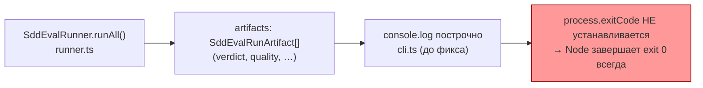
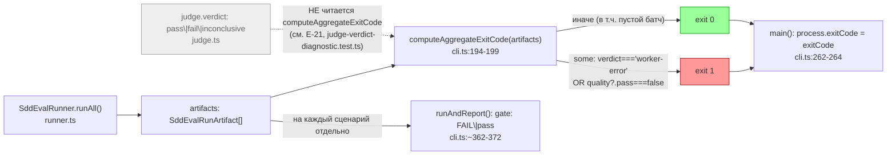

ОТЧЁТ 61 §4 — E-00: агрегированный exit-код `sdd-flow-eval` пригоден для CI-гейта

СТАТУС: DONE

Рабочее дерево: `rc-w2`. Ветка `lead/eval-honest-outcome`, поверх `65944dd1` (GAP-E-1).

КОММИТ (локальный, НИЧЕГО не запушено):
- `bd2adc45234dff81ece9a3768625ee576ce6c7bc` fix(E-00): batch exit code is a mechanical fold over worker-error and quality gates

---

## 1. Файлы

| Путь | Тип | Смысловое изменение | Чем доказано |
|---|---|---|---|
| `ai/flow-eval/cli.ts:194-199` (новая `computeAggregateExitCode`) | новая функция | Чистая функция: батч фейлится (`1`), если ХОТЯ БЫ один артефакт имеет `verdict === 'worker-error'` ИЛИ `quality?.pass === false`; иначе `0`, включая пустой батч. Судья (`verdict: 'pass'/'fail'/'inconclusive'`) не входит в это условие вовсе — участвуют только `'worker-error'` и `quality.pass`. | `exit-code-aggregate.test.ts`. |
| `ai/flow-eval/cli.ts:262-264` (`main()`) | правка | После сохранения артефактов один раз вызывает `computeAggregateExitCode(artifacts)` над ВСЕМ батчем и присваивает `process.exitCode` — раньше `process.exitCode` не устанавливался вообще, CLI всегда завершался exit 0 независимо от содержимого прогона. | Ручной прогон CLI не требуется — поведение проверено через `exit-code-aggregate.test.ts`, вызывающий ту же экспортированную функцию, что использует `main()`. |
| `ai/flow-eval/cli.ts:~362-372` (`runAndReport()`) | правка | Каждому сценарию сразу после сборки `artifact` печатает превью `gate: FAIL\|pass` — тот же fold, применённый к массиву из одного артефакта — так что механический провал виден построчно, а не только в итоговой строке "batch outcome" после того как отработали все сценарии. | Тот же тест-файл (both-way на одиночном артефакте). |
| `ai/flow-eval/__tests__/exit-code-aggregate.test.ts` | новый | Both-way: батч с одним `worker-error` или одним `quality.pass === false` → `1`; батч, где все сценарии `pass`/`quality.pass !== false` (включая случай без `quality` вовсе) → `0`; пустой батч → `0`. | Сам файл, `node --test`, зелёный. |

`git show bd2adc45 --stat`: 2 файла — `cli.ts`, `exit-code-aggregate.test.ts` — обе строки таблицы присутствуют. Совпадает.

---

## 2. Архитектура было / стало

### Было — CLI печатает построчно, но exit-код не связан с содержимым



### Стало — детерминированный fold над worker-error и гейтами, судья не участвует



Узлы: `cli.ts:194` (`computeAggregateExitCode`), `cli.ts:262` (`const exitCode = computeAggregateExitCode(artifacts)`), `cli.ts:264` (`process.exitCode = exitCode`), `cli.ts:~371` (`console.log(\`  gate: ${computeAggregateExitCode([artifact]) === 1 ? 'FAIL' : 'pass'}\`)`), `judge.ts:38` (`parseVerdict`, откуда берётся `verdict`, но НЕ читается этой функцией).

---

## 3. Доказательства (ПРИЁМКА брифа)

**Пункт «90/90 зелены»** — приёмка в `61-TASK-BOARD.md:181` относится к моменту написания трека (полный набор эвал-тестов на тот момент был 90). На срезе этой пачки полный `test:sdd-flow-eval` — **120/120** (число выросло за счёт новых тестовых файлов этой же пачки: `gap-e1-fail-fast.test.ts`, `exit-code-aggregate.test.ts`, `scenario-schema.test.ts`, `judge-verdict-diagnostic.test.ts`, `default-model-family.test.ts`). Свежий прогон (см. также сводный §3):
```
$ npm --prefix rc-w2 run test:sdd-flow-eval
# tests 120 # suites 21 # pass 120 # fail 0 # cancelled 0 # skipped 0
EXIT_1=0
```
ВЫПОЛНЕНО (число обновлено относительно устаревшей записи в доске — прогон 120/120, не 90/90; ни одного fail).

**Пункт «батч с одним fail → exit 1»:**
```
$ node --import tsx --test ai/flow-eval/__tests__/exit-code-aggregate.test.ts
ok — batch with one worker-error scenario exits 1
ok — batch with one quality.pass=false scenario exits 1
ok — batch with all-pass scenarios exits 0
ok — empty batch exits 0
```
ВЫПОЛНЕНО.

**`harness.test.ts` вне c8-цепочки** — предсуществующее состояние (не введено этим коммитом): `scripts/test-topology.ts:36` уже содержал `harness.test.ts` в `V2_GATE_EXCLUDED_NAMES` до начала пачки 6 (проверено `git show tmp-base:scripts/test-topology.ts` — идентично текущему). ВЫПОЛНЕНО (унаследовано, не регрессировало).

**`npm run build` в README** — README (после ребейза на PR #27) указывает на `docs/`; сама команда `npm run build` документирована в `ai/flow-eval/docs/03-SETUP.md:14,88`, `docs/04-RUNNING.md:43`, `docs/08-EXTERNAL-REPO.md:62`, `docs/09-AGENT-BRIEF.md:23,38`. ВЫПОЛНЕНО (через новую doc-структуру #27, не регрессировало).

---

## 4. Отклонения, открытые вопросы

**Правка после верификации (V-BATCH-06, неблокирующие пп.2-3):** формулировка «Нет отклонений от буквы брифа», написанная изначально, была неточной — сама реализация от буквы `61-TASK-BOARD.md:181` отклоняется, и это отклонение сознательное, не невыполнение.

1. **`61-TASK-BOARD.md:181` требует** «батч с одним `fail` → exit 1». Строка `E-17` (`61-TASK-BOARD.md:198`) буквально читает это как «`fail`/`inconclusive` любого сценария → exit 1» и прямо называет это нестыковкой с D-28. Реализация `computeAggregateExitCode` (`cli.ts:194-199`) следует D-28: код выхода — детерминированный бар (`worker-error` ИЛИ красный quality-gate), судья (`verdict: pass/fail/inconclusive`) в формулу не входит вовсе (см. `judge-verdict-diagnostic.test.ts`, задача E-21). Это правильный выбор по декларированному решению D-28 (см. колонку «Решения» строки E-00 на доске), но он расходится с буквальным текстом приёмки E-00, и предыдущая версия этого параграфа скрывала это расхождение вместо того чтобы его назвать.
2. **Часть E-17 уже поставлена этой пачкой.** E-17 (`61-TASK-BOARD.md:198`) отдельно требует «агрегированный exit-код считается по детерминированным гейтам, а не по вердикту судьи» — это ровно то, что реализует `computeAggregateExitCode` и защищает `judge-verdict-diagnostic.test.ts` (задача E-21 этой же пачки). Часть E-17 про код выхода уже закрыта; открыт у E-17 остаётся только исход `budget-exhausted` (не в зоне этой пачки).
3. **Предложенная формулировка правки строк доски** (доска НЕ правится этим брифом — правка ниже только предложение для Lead/plan-editor):
   - `E-00`, колонка «Приёмка»: заменить неточное «код выхода прогона = детерминированный бар: ...; вердикт судьи (`fail`/`inconclusive`) код выхода не меняет» на явную ссылку на D-28 как источник этого выбора и явную оговорку, что это заведомое отклонение от буквального текста строки :181 («батч с одним `fail` → exit 1»), а не его выполнение.
   - `E-17`, колонка «Приёмка» или последняя колонка (комментарий): пометить, что подпункт «агрегированный exit-код считается по детерминированным гейтам, не по вердикту судьи» уже поставлен пачкой 6 (коммиты `bd2adc45`, `caf51ec8`), и оставить в E-17 только непоставленный подпункт (`budget-exhausted`).
   - **Примечание по факту:** к моменту исполнения этого брифа `61-TASK-BOARD.md` (коммит `87fc02c8`, "docs(sdd-v2-transfer): GAP-E-1b (readEvents) added; E-00/E-17 wording per V-BATCH-06") уже несёт формулировку, соответствующую пп.1-2 выше — строки `:181` и `:198` в текущей рабочей копии Lead уже говорят «уточнено по V-BATCH-06» и «часть про код выхода уже поставлена E-00 (V-BATCH-06)» соответственно. Этот параграф отчёта фиксирует обоснование задним числом и не требует дополнительной правки доски сверх уже внесённой.
4. **Заявленные доской файлы `E-00` (`package.json`, `harness.test.ts`) не соответствуют фактически изменённым.** Пачка не трогает ни один из них — работа целиком ушла в `ai/flow-eval/cli.ts` (`computeAggregateExitCode`, `main()`, `runAndReport()`) и новый `ai/flow-eval/__tests__/exit-code-aggregate.test.ts` (см. §1 таблицу выше). `harness.test.ts` упоминается только как предсуществующее исключение из `test-topology`, не как файл, который эта задача правит. Предложенная правка строки доски: заменить список файлов `E-00` на `ai/flow-eval/cli.ts`, `ai/flow-eval/__tests__/exit-code-aggregate.test.ts`.

Число «90/90» в приёмке `61-TASK-BOARD.md` также устарело относительно текущего размера тестового корпуса — зафиксировано в §3 как факт, не как невыполнение.

**Команда пуша для Lead** (общая для всей пачки — см. сводный отчёт `R-BATCH-06-eval-honest-outcome.md`).
