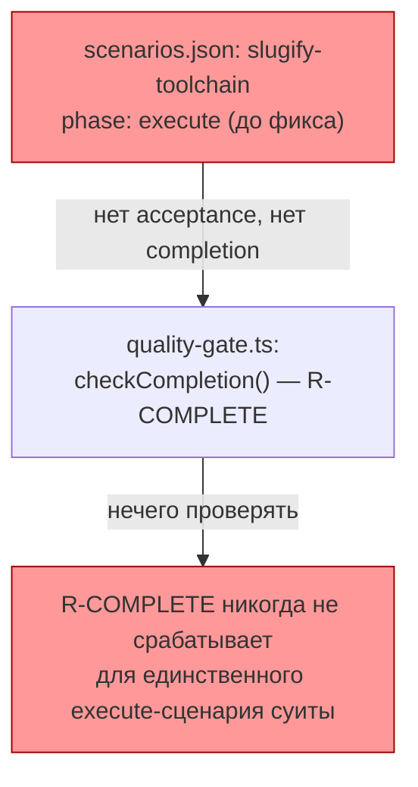
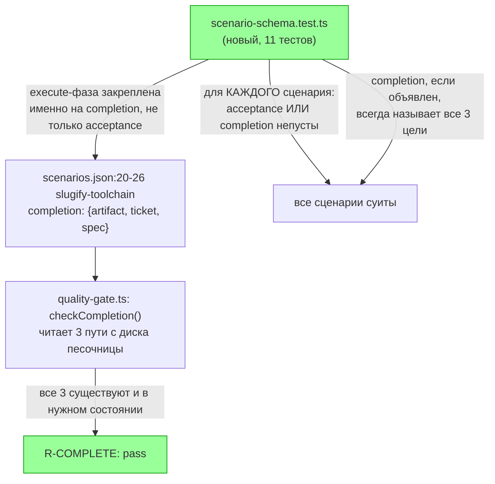

ОТЧЁТ 61 §4 — E-02: у `slugify-toolchain` объявлены `completion`/`acceptance`

СТАТУС: DONE

Рабочее дерево: `rc-w2`. Ветка `lead/eval-honest-outcome`, поверх `b34ffd8a` (E-01).

КОММИТ (локальный, НИЧЕГО не запушено):
- `cd70021490528b0281419201d1b8529601b60064` feat(E-02): every canonical scenario declares completion or acceptance

---

## 1. Файлы

| Путь | Тип | Смысловое изменение | Чем доказано |
|---|---|---|---|
| `ai/flow-eval/scenarios.json:20-26` (сценарий `slugify-toolchain`, `phase: execute`) | правка | Единственный execute-сценарий канонической суиты не объявлял ни `completion`, ни `acceptance` — именно там, где должен включаться R-COMPLETE (механический ответ на «заброшенный артефакт»), он никогда не срабатывал. Добавлен блок `completion` с реальными путями фикстуры: `artifact: src/slugify.ts`, `ticket: specs/slugify/core/core.task.SLG-slug.md`, `spec: specs/slugify/core/core.spec.md` — сверены с `provision.ts` и существующими assertions в `harness.test.ts` для execute-сценария. | `scenario-schema.test.ts` (тест 11: «slugify-toolchain names the exact fixture paths R-COMPLETE reads from disk»). |
| `ai/flow-eval/__tests__/scenario-schema.test.ts` | новый | Механически проверяет для КАЖДОГО сценария: хотя бы одно из `acceptance`/`completion` присутствует и непусто; объявленный `completion` всегда называет все три цели (`artifact`+`ticket`+`spec`), никогда не частично; execute-фазовые сценарии закреплены на РЕАЛЬНОМ объявлении `completion` (не только схемной валидности через один `acceptance`). Третий («not required») путь исключения сознательно НЕ добавлен — ни одному сценарию он не нужен, а неиспользуемый эскейп-хэтч хуже отсутствующего. | Сам файл, 11 тестов, `node --test`, зелёный. |

`git show cd700214 --stat`: 2 файла — обе строки таблицы присутствуют. Совпадает.

---

## 2. Архитектура было / стало

### Было — единственный execute-сценарий не объявлял ни одного сигнала завершения



### Стало — completion называет реальные пути фикстуры, схема проверяет каждый сценарий



Узлы: `scenarios.json:20` (`"id": "slugify-toolchain"`), `scenarios.json:25-29` (новый блок `completion`), `quality-gate.ts` (`checkCompletion`, потребитель — не тронут этим коммитом, только вход данных).

---

## 3. Доказательства (ПРИЁМКА брифа)

**Пункт «суита зелёная»:**
```
$ node --import tsx --test ai/flow-eval/__tests__/scenario-schema.test.ts
1..11 — все ok, включая:
  ok - a declared `completion` always names all three targets (never a partial R-COMPLETE)
  ok - the execute-phase scenario(s) declare R-COMPLETE completion targets, not just acceptance
  ok - slugify-toolchain names the exact fixture paths R-COMPLETE reads from disk
```
Полный `test:sdd-flow-eval` (см. сводный §3): 120/120, 0 fail — суита в целом зелёная. ВЫПОЛНЕНО.

---

## 4. Отклонения, открытые вопросы

Нет. Автор коммита сознательно НЕ добавил третий exemption-путь («не требуется, вот почему») — обоснование в самом commit message: ни одному текущему сценарию он не нужен, а неиспользуемый эскейп-хэтч создаёт ложное впечатление, что исключение где-то применяется. Согласен с этим решением — не расширяю зря.

**Команда пуша для Lead** (общая для всей пачки — см. сводный отчёт `R-BATCH-06-eval-honest-outcome.md`).
