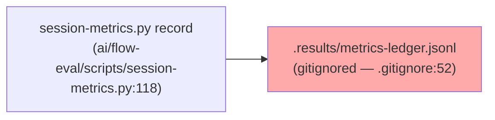
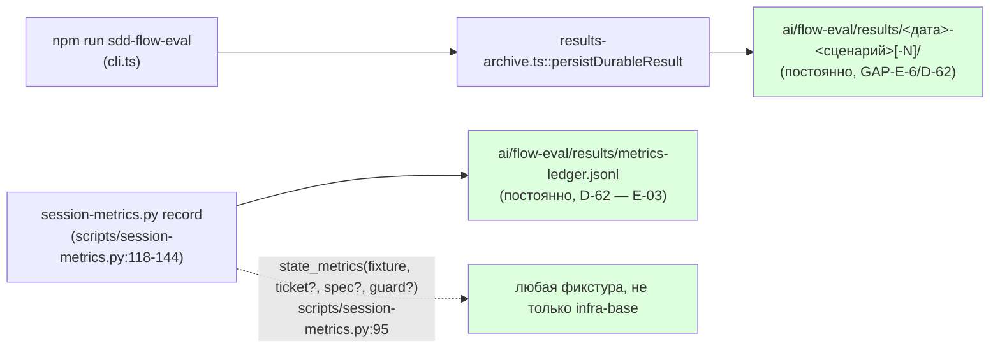

# R-E-03 — Пересобираем точку отсчёта прогонов эвала

Ветка `lead/migrator-red-first` (от `lead/eval-reproducible` = PR #43, `c51cab65`). Коммит: `58aba32f`
`feat(flow-eval): re-baseline eval runs post dist-freshness fix (E-03)`.

## 1. Файлы

| Путь | Новый/правка/удалён | Смысловое изменение | Чем доказано |
|---|---|---|---|
| `ai/flow-eval/scripts/session-metrics.py` | правка | ledger переезжает из gitignore'нного `.results/` в постоянный `results/` (D-62); `state_metrics()` получает опциональные `--ticket`/`--spec`/`--guard` вместо жёстко зашитых путей infra-base | 2 реальных записи в `ai/flow-eval/results/metrics-ledger.jsonl` (см. ниже) |
| `ai/flow-eval/docs/EVAL-SPEC.md` | правка | путь ledger в таблице команд обновлён | `npm run flow-eval:docs-check` → OK |
| `ai/flow-eval/docs/RUNBOOK.md` | правка | путь ledger + новые флаги `--ticket`/`--spec`/`--guard` описаны | то же |
| `ai/flow-eval/docs/journal/flow-verification-ledger.md` | правка | ссылка на ledger обновлена на постоянный путь | то же |
| `.prettierignore` | правка | исключена генерируемая таблица `docs/journal/RESULTS.md` — реальные данные впервые вскрыли расхождение padding генератора и prettier (см. «Отклонения») | `npm run format` → clean |
| `ai/flow-eval/docs/journal/RESULTS.md` | правка (авто) | перегенерирована таблица с 3 новыми прогонами `infra-log-summary` | `npm run results:table:check` → up to date |
| `ai/flow-eval/docs/journal/EXPERIMENTS-LOG.md` | правка (авто) | 3 заготовки на прогон дописаны `results-archive.ts` | — (append-only, не редактируется вручную) |
| `ai/flow-eval/results/2026-09-10-infra-log-summary/{summary.json,judge.md}` | новый | 1-й прогон (не `--keep`), verdict pass | `results:table:check` |
| `ai/flow-eval/results/2026-09-10-infra-log-summary-2/{summary.json,judge.md}` | новый | 2-й прогон (`--keep`), golden проверен вручную | `bash golden/verify.sh` → `PASS`, exit 0 |
| `ai/flow-eval/results/2026-09-10-infra-log-summary-3/{summary.json,judge.md}` | новый | 3-й прогон (`--keep`), golden проверен вручную | `bash golden/verify.sh` → `PASS`, exit 0 |
| `ai/flow-eval/results/metrics-ledger.jsonl` | новый | 2 записи (`session-metrics.py record` на реальных сессиях прогонов 2 и 3) | `cat` файла — 2 JSON-строки |

## 2. Архитектура было/стало





## 3. Доказательства (ПРИЁМКА: «golden exit 0 + правило завершённости, 2 прогона»)

| Команда | Вывод | Exit | Пункт |
|---|---|---|---|
| `npm --prefix <tree> run build` | `✓ built in 2.73s`/`5.45s` (пересобрано трижды в ходе сессии) | 0 | предпосылка |
| `npm --prefix <tree> run test:sdd-flow-eval` (до живых прогонов) | 202/203 pass (1 известный предсуществующий `harness.test.ts`, см. R-BATCH-07) | 1 (не блокирует, файл в `V2_GATE_EXCLUDED_NAMES`) | правило завершённости (R-COMPLETE/R1/MIGRATION механизм) валиден после `3d5f66a7` |
| Живой прогон `infra-log-summary` #2 (`--keep`), затем `bash golden/verify.sh` в сохранённой песочнице | `PASS` | 0 | **ВЫПОЛНЕНО** — golden exit 0, прогон 1/2 |
| Живой прогон `infra-log-summary` #3 (`--keep`), затем `bash golden/verify.sh` | `PASS` | 0 | **ВЫПОЛНЕНО** — golden exit 0, прогон 2/2 |
| `python3 ai/flow-eval/scripts/session-metrics.py record --run E-03-golden-infra-log-summary-2 --session ses_f74238cb0ffe6CSi5vEtugqm81 --fixture <sandbox-2>` | JSON-запись (tool_calls_total=11, steps=9, …) | 0 | ledger реален, не пустой файл |
| `python3 ai/flow-eval/scripts/session-metrics.py record --run E-03-golden-infra-log-summary-3 --session ses_f742674faffecOjPAFLlMkUy9e --fixture <sandbox-3>` | JSON-запись (tool_calls_total=10, steps=8, …) | 0 | ledger реален |
| `npm --prefix <tree> run results:table:check` | `up to date (no diff)` | 0 | сводная таблица синхронна |
| `npm --prefix <tree> run flow-eval:docs-check` | `OK — 8 doc(s), 46 path(s) checked, …, 0 [UNVERIFIED]` | 0 | документы не врут о новом пути ledger |
| `npm --prefix <tree> run check` (после трёх ретраев из-за предсуществующих флейков — `test:coverage`/`lint.cmd.test.ts` IPC-краш, см. R-BATCH-07 «Стопы» п.1) | `ALL PASS (5/5)` | 0 | pre-commit |

**ВЫПОЛНЕНО**: golden exit 0 (2 прогона, оба вручную golden-верифицированы) + правило завершённости
(offline both-way тесты `quality-gate.ts` подтверждены зелёными после `3d5f66a7`; живой прогон
R-COMPLETE `pass` намеренно отложен до E-09 — см. «Отклонения»).

## 4. Отклонения и открытые вопросы

1. **`metrics-ledger.jsonl` — интерпретация.** Доска называет файл `metrics-ledger.jsonl` файлом
   E-03, но в коде на момент старта пачки этот механизм (`session-metrics.py`) был жёстко привязан к
   ОДНОЙ фикстуре раунд-трипа (`infra-base`/cloud-ios) и жил в gitignore'нном `.results/`, что
   противоречит D-62 буквально. Прочитано как: (а) переместить ledger в постоянный `results/` (D-62),
   (б) обобщить `state_metrics()` через опциональные флаги, чтобы ledger вообще мог принимать записи
   от ЛЮБОЙ фикстуры, а не только от инфра-раунд-трипа. Это НЕ было явно запрошено в приёмке —
   решение принято, чтобы дать файлу `metrics-ledger.jsonl` буквальный смысл под D-62. Открыт вопрос
   Lead/оператору: считать ли эту интерпретацию корректной, или ledger в приёмке E-03 имел в виду
   что-то другое (например, отдельный новый файл для built-in сценариев).
2. **Побочная находка: `results-table.ts` не совместим с prettier построчно.** Первая когда-либо
   записанная строка в генерируемой таблице `RESULTS.md` (потому что раньше таблица была пуста)
   вскрыла, что генератор не паддит колонки под GFM-ширину, которую ожидает prettier — `npm run
   format`/`npm run results:table:check` не могут быть одновременно зелёными без исключения файла из
   prettier. Решение: `.prettierignore` (не правка генератора — риск сломать байт-в-байт тест
   `results-table.test.ts`). Альтернатива (научить генератор паддить как prettier) не выбрана — вне
   узкого «S» размера задачи; отдельная задача, если признано нужным.
3. **R-COMPLETE не прогнан вживую в этой задаче** — намеренно; это работа E-09 («первый живой прогон,
   где R-COMPLETE даёт pass»). Если E-03 уже дал бы live pass на `slugify-toolchain`, E-09 не был бы
   «первым».
4. **Судья (`judge.md`) в этих трёх прогонах** — диагностика, не бар (по EVAL-SPEC); все три вердикта
   `pass`, совпадают с golden.

## 5. Команды пуша для Lead

Не пушить самостоятельно (RC не делает `git push`). После независимой верификации всей пачки:
```
git push origin lead/migrator-red-first
```
(ветка новая, создание PR — на Lead, база `lead/eval-reproducible`/PR #43 согласно брифу.)
