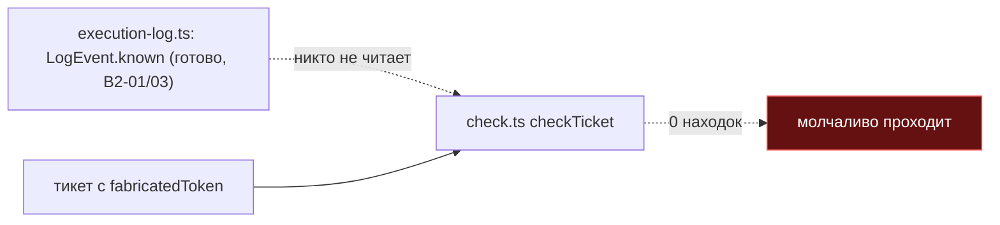
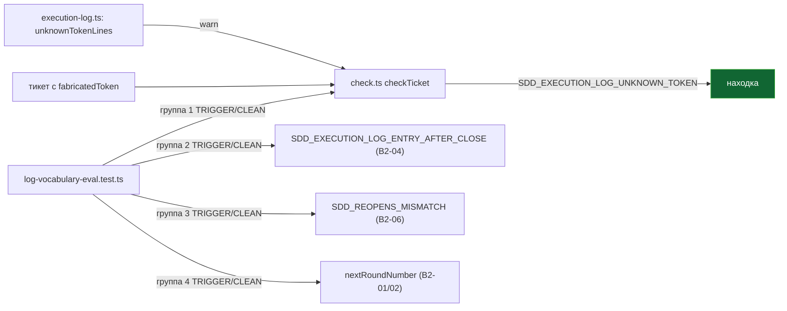

ОТЧЁТ 50 §4 — E-05: `E-G3-log-vocabulary` — 4 both-way группы поверх `execution-log.ts`

СТАТУС: DONE

Рабочее дерево: `rc-v6`. Ветка `lead/reopen-by-cause`, поверх B2-18 (`96ac2097`).

КОММИТ:
- `f2c64a56` test(E-05): 4 both-way groups lock the log-vocabulary eval (E-G3-log-vocabulary)

---

## 1. Диагностика (до написания фикстур)

Проверено покрытие каждой из 4 групп ДО написания новых тестов:

| Группа | Покрыта интеграционно (через `checkTicket`) до E-05? | Находка |
|---|---|---|
| 1. неизвестный токен | **НЕТ** | `isVocabularyToken`/`LogEvent.known` уже существуют (B2-01/B2-03), но `SDD_EXECUTION_LOG_UNKNOWN_TOKEN` НИГДЕ не вызывался в `check.ts` — механическая проверка отсутствовала целиком, несмотря на готовую инфраструктуру. |
| 2. правка закрытого раунда | Да — `analyzeRoundClosures`/`SDD_EXECUTION_LOG_ENTRY_AFTER_CLOSE` (B2-04), DA-lazy-asm golden. | — |
| 3. рассинхрон Reopens | Да — B2-06 (эта же пачка, `checkReopens`-логика в `check.ts`), `reopens.test.ts`. | — |
| 4. `nextRoundNumber` по секции | Да — `execution-log.test.ts`'s «case 1». | — |

Вывод: 3 из 4 групп уже имели интеграционные both-way тесты (просто не собранные в одном явном «eval»-файле); группа 1 требовала НОВОГО кода, не только фикстур.

## 2. Файлы

| Путь | Тип | Смысловое изменение | Чем доказано |
|---|---|---|---|
| `shared/sdd/execution-log.ts` | правка | Новый `unknownTokenLines(logBody)` — обходит все Round'ы (`phases`/`close.extra`/`close.done`/`trailing`) и собирает `raw`-строки, чей `token !== null && !known && marker === null` (явное исключение маркерных строк — иначе legacy инлайновая `✅ RESOLVED: …` строка читает свой эмодзи как «токен» и ложно триггерит). Обнаружено golden-фикстурой DA-lazy-asm в процессе: без исключения маркера тест `check-round-close.test.ts` падал 11 ложными находками. | `check-round-close.test.ts` — 11/11 зелёных (golden не тронут). |
| `shared/sdd/check.ts` | правка | `checkTicket` теперь вызывает `unknownTokenLines` и пишет `SDD_EXECUTION_LOG_UNKNOWN_TOKEN` (**warn**, по L-3). | `log-vocabulary-eval.test.ts` группа 1. |
| `shared/sdd/__tests__/log-vocabulary-eval.test.ts` | новый | 4 группы × 2 (TRIGGER/CLEAN) = 8 тестов, все через `checkTicket`/`nextRoundNumber` на синтетических тикетах (полные META+EXECUTION_LOG+Audit Rounds документы, не голые строки парсера). | сам файл. |

`git show --stat f2c64a56` — 3 файла (+206/−0). Совпадает.

---

## 3. Архитектура было / стало

### Было — группа 1 не имела механической проверки



### Стало — все 4 группы механически проверены и залочены



---

## 4. Доказательства (ПРИЁМКА брифа)

1. **«4 both-way группы»** — ВЫПОЛНЕНО.
   ```
   $ node --import tsx --test shared/sdd/__tests__/log-vocabulary-eval.test.ts
   # tests 8 / pass 8 / fail 0   (4 группы × TRIGGER+CLEAN)
   ```
2. **Регресс не внесён в реальный корпус** — ВЫПОЛНЕНО.
   ```
   $ node --import tsx --test shared/sdd/__tests__/check-round-close.test.ts
   # tests 11 / pass 11 / fail 0
   ```
3. **Весь `shared/sdd`** — ВЫПОЛНЕНО.
   ```
   $ find shared/sdd/__tests__ -maxdepth 1 -name '*.test.ts' | xargs node --import tsx --test
   # tests 966 / pass 966 / fail 0
   ```
4. **Полный прогон + акцептанс пачки** — ВЫПОЛНЕНО.
   ```
   $ npm run check                    → [sdd-verify] ✅ ALL PASS (5/5)
   $ npm test                         → 3726 tests, 3716 pass, 0 fail, 10 skipped
   $ npm run build && node dist/gennady.js sdd-check --all .
     → [sdd-check] 192 error(s), 1034 warning(s) across 212 file(s)
   $ npm run gate:sdd-check-baseline  → OK — no error outside the baseline (227c03a8)
   $ npm run check:directives-fresh  → ✓ matches a fresh rebuild
   $ npm run audit:sdd-templates     → все 4 под-аудита ✓ clean
   ```

---

## 5. Отклонения и открытые вопросы

- **Новый производственный код за пределами буквального списка файлов E-05** («Файлы: синтетические тикеты»): `shared/sdd/check.ts` и `shared/sdd/execution-log.ts` получили реальную правку (не только тесты), потому что группа 1 («неизвестный токен») была МЕХАНИЧЕСКИ НЕ РЕАЛИЗОВАНА — тестировать было нечего. Оба файла входят в общую «Зону» брифа пачки (перечислены явно на верхнем уровне брифа), так что это не выход за пределы полномочий, но является отклонением от буквального «файлы: синтетические тикеты» узкой строки задачи E-05 в `61-TASK-BOARD.md`. Альтернатива (не проверять группу 1 вовсе, или проверять её только на уровне парсера `isVocabularyToken`) была отвергнута — она не давала бы честного «both-way» на уровне `checkTicket`, ради чего и затевалась пачка.
- Ни B2-01, ни B2-03 (обе `ВЫПОЛНЕНО`) не заявляли явно ответственность за подключение `SDD_EXECUTION_LOG_UNKNOWN_TOKEN` к `check.ts` — их «Чем доказываем» колонки называют только парсер/словарь. Разрыв мог быть case-oversight на границе задач; починен здесь, а не отложен, поскольку E-05 буквально требует «both-way тесты: неизвестный токен» и без кода это невыполнимо.
- **192 error(s)** от `sdd-check --all` — совпадает с известным «долгом» проекта (baseline `227c03a8`/`rc-baseline-1`), НОЛЬ новых ошибок сверх baseline подтверждено гейтом. Число предупреждений (1034) выросло по сравнению с базовым прогоном ДО этой пачки — ожидаемо: 5 новых `warn`-кодов (`SDD_REOPENS_MISMATCH`/`_PENDING`, `SDD_EXECUTION_LOG_UNKNOWN_TOKEN`) добавлены во ВСЕЙ пачке 15, что и является целью задач B2-06/E-05 (сделать проблему видимой, не проваливая гейт).

**Команды пуша для Lead:**
```
git push origin lead/reopen-by-cause
```
