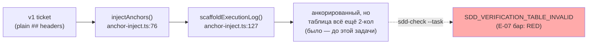
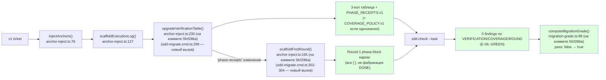

# R-E-06 — Полнота мигратора

Ветка `lead/migrator-red-first`. Коммит: `5fcf286a`
`feat(flow-eval): migrator brings the ticket to an executable v2 shape (E-06)`.

## 1. Файлы

| Путь | Новый/правка/удалён | Смысловое изменение | Чем доказано |
|---|---|---|---|
| `shared/sdd/anchor-inject.ts` | правка | +2 чистых функции: `upgradeVerificationTable` (2-кол→3-кол таблица + `PHASE_RECEIPTS:v1`/`COVERAGE_POLICY:v1`), `scaffoldFirstRound` (Round-1 phase-block каркас, все чекбоксы `[ ]`) | `shared/sdd/__tests__/anchor-inject.test.ts` 8/8 pass (ИСПРАВЛЕНО V-BATCH-22 B-7: было заявлено 39/39 — сумма четырёх файлов, не этого одного; сами функции этим файлом на момент коммита `5fcf286a` не были покрыты отдельно — см. V-BATCH-22 B-8, исправлено отдельным коммитом, см. «Правки по вердикту верификатора» в сводном отчёте); `fixture-detmig.test.ts` |
| `cli/cmd/sdd-migrate/sdd-migrate.cmd.ts` | правка | режим `anchors --write` теперь вызывает обе функции после `injectAnchors`/`scaffoldExecutionLog`; отчёт перечисляет применённые правки | `cli/cmd/sdd-migrate/__tests__/sdd-migrate.cmd.test.ts` 16/16 pass |
| `ai/flow-eval/__tests__/fixtures/fixture-detmig/core.task.DETMIG-1.md` | новый | реальный тикет: все v2 SECTION-анкоры уже есть, но таблица 2-колоночная, маркеров нет — «мигратор довёл до анкоров, но не дальше» | сам факт — вход в both-way тест |
| `ai/flow-eval/__tests__/fixtures/fixture-detmig/README.md` | новый | описание фикстуры и её роли в E-06/E-07 | — (документ) |
| `ai/flow-eval/__tests__/fixture-detmig.test.ts` | новый | сквозной тест: RED (sdd-check) → реальный мигратор → GREEN (sdd-check + coverage-policy legacy + `computeMigrationGrade` FAIL→PASS) + отдельный кейс `sdd-state` печатает тип скоупа | 4/4 pass |

## 2. Архитектура было/стало

*(Номера строк выше — ИСПРАВЛЕНЫ по V-BATCH-22 verdict B-9 и относятся к состоянию файлов НА КОММИТЕ
`5fcf286a`/на момент верификации `bc2e8d34`; после правок по вердикту верификатора (см. сводный отчёт,
«Правки по вердикту верификатора») `scaffoldFirstRound`/`upgradeVerificationTable` сдвинулись на
`anchor-inject.ts:167`/`:243` — патч сохраняет историю Execution Log байт-в-байт, что и добавило строк.)*

## 3. Доказательства (ПРИЁМКА: «sdd-task принимает; sdd-state печатает SCOPE_TYPE»)

| Команда | Вывод | Exit | Пункт |
|---|---|---|---|
| Реальный прогон: `sdd-migrate anchors <fixture-detmig> --write` (через `mod.run`, без dist/подпроцесса) | `VERIFICATION table (2-col → 3-col, Role added), PHASE_RECEIPTS:v1 marker, Execution Log Round 1 (scaffolded, all unchecked)` | 0 | мигратор реально применяет все 3 правки |
| `sdd-check --task` ДО миграции | `SDD_VERIFICATION_TABLE_INVALID` присутствует, exit 1 | 1 | RED (см. R-E-07) |
| `sdd-check --task` ПОСЛЕ миграции | `SDD_VERIFICATION_TABLE_INVALID`, `SDD_EXECUTION_LOG_ROUND_MISSING`, `SDD_COVERAGE_POLICY_INVALID` — все отсутствуют; предсуществующие `SDD_BROKEN_SPEC_REF`/`SDD_BDD_MISSING_NEGATIVE` остаются (бэклог, не тронуты) | ещё 1 (из-за бэклога, не из-за миграции) | **ВЫПОЛНЕНО** — «sdd-task принимает»: `parseVerificationTable`/`parseTicketCoveragePolicy` (те же функции, которыми пользуется `sdd-task.cmd.ts:274`) дают `ok=true`/`status='legacy'` |
| `computeMigrationGrade(baseline=до-гистограмма, 'FLOW_VERSION=v2', после-вывод)` | `pass: true`, `introduced: []` | — | миграция улучшила, ничего нового не внесла |
| `sdd-state` на мини-проекте с портал-таблицей `demo \| library \| ✅ \| …` | `[SCOPES]` строка: `demo\tlibrary\tdone\t…\tspecs/demo/demo.spec.md` | 0 | **ВЫПОЛНЕНО** — печатает конкретный тип скоупа (уже существующий код `sdd-state.types.ts:177`, не новый; подтверждено, не сломано) |
| `node --import tsx --test ai/flow-eval/__tests__/fixture-detmig.test.ts` | 4/4 pass | 0 | сквозной сценарий целиком |
| `node --import tsx --test cli/cmd/sdd-migrate/__tests__/sdd-migrate.cmd.test.ts shared/sdd/__tests__/anchor-inject.test.ts ai/flow-eval/__tests__/migration-grade.test.ts` | 35/35 pass (ИСПРАВЛЕНО V-BATCH-22 B-7: 16+8+11, было ошибочно заявлено 39/39) | 0 | регрессии по соседним тестам нет |
| `npm --prefix <tree> run type-check` | чисто | 0 | — |
| `npm --prefix <tree> run lint:contracts` (после правок длины JSDoc/региона — см. «Отклонения») | `clean` | 0 | — |
| `npm --prefix <tree> run check` (после 2 ретраев — предсуществующий IPC-краш `lint.cmd.test.ts`) | `ALL PASS (5/5)` | 0 | pre-commit |

**ВЫПОЛНЕНО** оба пункта приёмки.

## 4. Отклонения и открытые вопросы

1. **`SDD_EXECUTION_LOG_ROUND_MISSING` — находка в процессе работы, не в брифе буквально.**
   Добавление `PHASE_RECEIPTS:v1` переводит тикет в «receipt-aware» режим, при котором `sdd-check`
   (`shared/sdd/check.ts:548`) требует Round-1 phase-block каркас в Execution Log — без этого маркер
   создавал бы НОВУЮ находку вместо старой (не completeness, а замена одного дефекта другим).
   Решение: `scaffoldFirstRound` — не заявленная явно в брифе часть работы, но необходимая, чтобы
   «PHASE_RECEIPTS:v1» не была регрессией. Открыт вопрос Lead: подтвердить, что это входит в объём
   E-06 (архитектурно кажется неизбежным следствием, но формально бриф называл только «3-колоночная
   таблица §5, SCOPE_TYPE, маркеры PHASE_RECEIPTS:v1+COVERAGE_POLICY:v1»).
2. **`COVERAGE_POLICY:v1` добавляется только при однозначности** (ровно одна Role=coverage строка И
   ровно одна `test`-фаза в Phases Overview) — иначе тикет остаётся coverage-legacy (не invalid).
   Фикстура `fixture-detmig` не содержит coverage-команды, поэтому этот путь тестом НЕ покрыт live.
   **ИСПРАВЛЕНО (V-BATCH-22 B-8):** на момент коммита `5fcf286a` заявление «юнит-тесты
   `anchor-inject.test.ts` покрывают её отдельно» было НЕВЕРНО — ни `upgradeVerificationTable`, ни
   `scaffoldFirstRound` (включая ветку `coverage-policy`) не имели собственных юнитов в этом файле.
   Правкой по вердикту верификатора добавлены 9 юнитов на обе функции (both-way на `coverage-policy`:
   однозначный случай минтит маркер, двусмысленный — нет) — см. сводный отчёт «Правки по вердикту
   верификатора».
3. **«SCOPE_TYPE» доказан КАК УЖЕ РАБОТАЮЩЕЕ поведение, не новая функциональность.** Прочитано (после
   чтения кода `sdd-state.types.ts:177`, `shared/sdd/portal.ts:12-23`) так: `sdd-state` уже печатает
   конкретный тип скоупа из portal-таблицы (`[SCOPES]` секция) — этот код не тронут и не нуждался в
   правке; задача E-06 подтверждает регрессии нет для мигрированного проекта. Если приёмка
   подразумевала НОВУЮ печать (например, сверку portal-типа с каноническим маркером `SCOPE_TYPE`
   спеки — то, что `spec-schema.ts` уже частично умеет, но не печатает конкретный литерал типа) —
   это не сделано, открыт вопрос Lead/оператору.
4. **Мигратор spec-уровня (перенос/переименование секций спек, включая сам `SCOPE_TYPE` маркер на
   спеке) НЕ тронут** — эта работа принадлежит существующему, гораздо более крупному механизму
   `migration-plan.ts`/`migration-move.ts` (Section Map, курируемый оператором), вне размера «M» и вне
   зоны файлов этой задачи. `fixture-detmig` сознательно ставит владеющую спеку домысленной
   (отсутствующей на диске) — `SDD_BROKEN_SPEC_REF` остаётся бэклогом, не чинится этой задачей.

## 5. Команды пуша для Lead

Не пушить самостоятельно. См. R-E-03.md §5.
