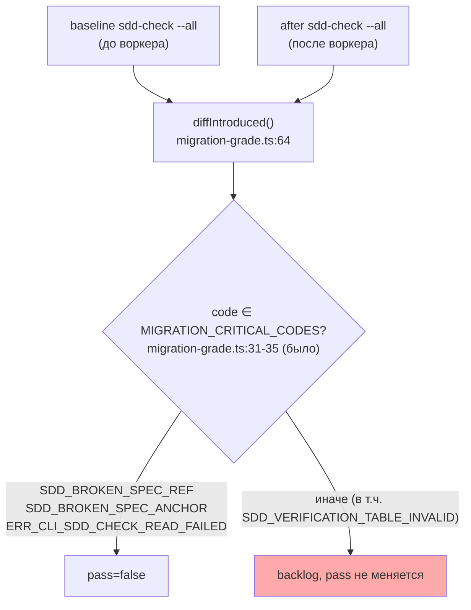
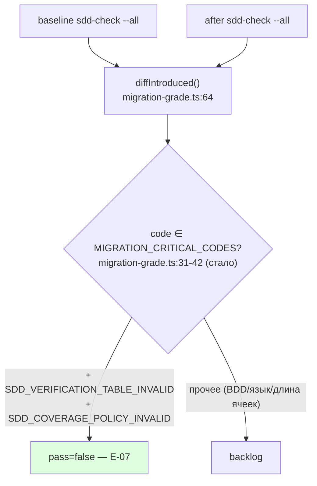

# R-E-07 — Бар исполнимости (red-first)

Ветка `lead/migrator-red-first`. Коммит: `03d661d5`
`feat(flow-eval): red-first executability bar for migration (E-07)`.

## 1. Файлы

| Путь | Новый/правка/удалён | Смысловое изменение | Чем доказано |
|---|---|---|---|
| `ai/flow-eval/migration-grade.ts` | правка | `MIGRATION_CRITICAL_CODES` пополнен `SDD_VERIFICATION_TABLE_INVALID` и `SDD_COVERAGE_POLICY_INVALID` | 11/11 юнит-тестов (было 7) |
| `ai/flow-eval/__tests__/migration-grade.test.ts` | правка | новый describe-блок «E-07…» — 4 both-way теста на ЗАМОРОЖЕННОМ, реально захваченном выводе `sdd-check --task` | `node --import tsx --test ai/flow-eval/__tests__/migration-grade.test.ts` → 11/11 pass |
| `ai/flow-eval/docs/EVAL-SPEC.md` | правка | словарь правил MIGRATION обновлён до 5 кодов (часть A и часть B) | `npm run flow-eval:docs-check` → OK |

## 2. Архитектура было/стало

## 3. Доказательства (ПРИЁМКА: «both-way юнит на замороженных выводах»)

| Команда | Вывод | Exit | Пункт |
|---|---|---|---|
| Реальный захват (не в коммите, воспроизводимо): `sdd-check --task` на hand-built тикете с 2-кол. таблицей | `core.task.DEMO-1.md:66: error: SDD_VERIFICATION_TABLE_INVALID  Verification table line 1: expected header Command \| Required by \| Role` | 1 | строка заморожена в тесте буквально |
| Реальный захват: `sdd-check --task` на тикете с маркером `COVERAGE_POLICY:v1` и невалидными полями | `core.task.DEMO-2.md:66: error: SDD_COVERAGE_POLICY_INVALID  required coverage needs exactly one table row with Role=coverage (found 0); required coverage needs exactly one Coverage Owner Phase (\`P<N>\`)` | 1 | строка заморожена в тесте буквально |
| `node --import tsx --test ai/flow-eval/__tests__/migration-grade.test.ts` | 11/11 pass (было 7/7) | 0 | **ВЫПОЛНЕНО** — RED доказан на замороженном выводе |
| `npm --prefix <tree> run test:sdd-flow-eval` | 206/207 pass (было 202/203; +4 новых, тот же предсуществующий `harness.test.ts`) | 1 (не блокирует) | регрессии нет |
| `npm --prefix <tree> run type-check` | чисто | 0 | — |
| `npm --prefix <tree> run flow-eval:docs-check` | `OK` | 0 | документ синхронен с кодом |
| `npm --prefix <tree> run check` (после 2 ретраев — предсуществующий IPC-краш `lint.cmd.test.ts` под нагрузкой) | `ALL PASS (5/5)` | 0 | pre-commit |

**ВЫПОЛНЕНО**: код добавлен в `MIGRATION_CRITICAL_CODES`; both-way юнит на замороженных (реально
захваченных) выводах доказывает RED на не мигрированном тикете (анкоры уже есть — так же, как
`sdd-migrate anchors` производит сегодня, — но таблица ещё 2-колоночная) ДО того, как мигратор
получил способность её чинить (E-06, следующая задача, в момент этого коммита ещё не существует).
Порядок L-15 соблюдён буквально: коммит `03d661d5` (E-07) предшествует `5fcf286a` (E-06).

## 4. Отклонения и открытые вопросы

1. **«Проверки SCOPE_TYPE» из формулировки доски не стали отдельным кодом.** Строка доски: «Бар
   исполнимости (red-first): `SDD_VERIFICATION_TABLE_INVALID` (+ проверки `SCOPE_TYPE`/`PHASE_RECEIPTS:v1`)
   в `MIGRATION_CRITICAL_CODES`». Исследование кода (`shared/sdd/spec-schema.ts`, `shared/sdd/check.ts`)
   показало: в `sdd-check` НЕТ отдельного кода ошибки за некорректный/отсутствующий `SCOPE_TYPE` —
   это диагностируется только через `sdd-state`'s `specSchema` (report, не finding-код), не попадающий
   в `parseFindingHistogram`. Добавить НОВЫЙ код специально под это значило бы выйти за объявленную
   зону задачи (`migration-grade.ts` + его тест) в `shared/sdd/check.ts` (явно в списке «не трогать»).
   Прочитано так: «PHASE_RECEIPTS:v1» покрыт схема-осведомлённым `SDD_COVERAGE_POLICY_INVALID`
   (единственный существующий код, срабатывающий именно когда маркер `PHASE_RECEIPTS:v1`/
   `COVERAGE_POLICY:v1` присутствует, но поля некорректны); «SCOPE_TYPE» — оставлен как открытый
   вопрос Lead/оператору: либо признать, что для него сейчас честно нечего добавить в
   `MIGRATION_CRITICAL_CODES` (нет кода), либо завести отдельную задачу на новый sdd-check код (это
   было бы работой вне зоны `shared/sdd/check.ts`, требующей отдельного брифа).
2. **`ERR_CLI_SDD_CHECK_READ_FAILED` и остальные 3 прежних кода не тронуты** — уже были критическими
   до этой задачи, не переоценивались.

## 5. Команды пуша для Lead

Не пушить самостоятельно. См. R-E-03.md §5 — тот же push одной командой на всю пачку.
