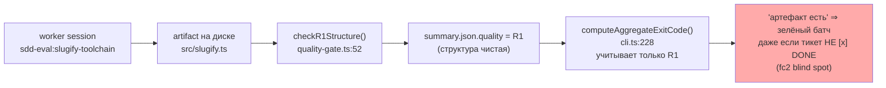

# R-E-09 — Первый живой прогон, где R-COMPLETE даёт pass

Ветка `lead/migrator-red-first`. Коммит: `bc2e8d34`
`feat(flow-eval): first live run where R-COMPLETE passes (E-09)`.
Основание: `5fcf286a` (E-06, вершина пачки 22 на момент старта E-09).

> **СТАТУС ОБНОВЛЁН (V-BATCH-22 verdict B-3) — ЧАСТИЧНО ВЫПОЛНЕНО.** Приёмка ниже («2 живых прогона,
> R-COMPLETE pass оба раза») верна для ДВУХ прогонов, описанных в этом отчёте (`slugify-toolchain`/
> `-2`, на коммите `bc2e8d34`) — их квитанции валидны и остаются валидны по новому, ужесточённому
> правилу. Но правило `checkCompletion`, которое эти прогоны проверяло, само по себе проверяло
> квитанции подстрокой без вердикта/провенанса, а «артефакт собран» — как «файл непуст» (см. B-3 в
> `R-BATCH-22-migrator-red-first.md` §«Правки по вердикту верификатора»). После правки честный
> повторный живой прогон (дважды, тот же сценарий) дал **1 pass / 1 fail**, а не 2/2 — см. там же
> таблицу «E-09 до/после ужесточения». Читай приёмку ниже как «выполнено для правила, каким оно было
> НА МОМЕНТ этой задачи», не как гарантию, что механизм остаётся полностью надёжным без доработки B-3.

## 1. Файлы

| Путь | Новый/правка/удалён | Смысловое изменение | Чем доказано |
|---|---|---|---|
| `ai/flow-eval/results/2026-09-10-slugify-toolchain/{summary.json,judge.md}` | новый | Прогон 1 (`--max-observations 20`, до этой сессии): `quality R1 pass`, `quality R-COMPLETE pass` (не перезаписан → `rc.pass=true`), вердикт судьи `fail` (диагностика) | `summary.json.quality.rule="R1"` не перезаписан `R-COMPLETE`-веткой `cli.ts:397` ⇒ `rc.pass===true`; сверено вручную session-metrics ниже |
| `ai/flow-eval/results/2026-09-10-slugify-toolchain-2/{summary.json,judge.md}` | новый | Прогон 2 (эта сессия, `--max-observations 30`): та же пара `R1 pass`/`R-COMPLETE pass`, `gate: pass`, `batch outcome: exit 0` (видно в живом логе прогона) | лог `npm run sdd-flow-eval` этой сессии: `quality R1: pass`, `quality R-COMPLETE: pass`, `gate: pass` |
| `ai/flow-eval/results/metrics-ledger.jsonl` | правка (+2 строки) | `session-metrics.py record` для обоих прогонов (`E-09-slugify-toolchain-1/2`) — независимое ДЕТЕРМИНИРОВАННОЕ подтверждение по SQLite-логу OpenCode + диску: `ticket_status="[x] DONE"`, `round_closed=true`, `impl_receipt=true`, `audit_receipt=true`, `review_receipt=true` для обоих прогонов | вывод `session-metrics.py record` (см. §3) |
| `ai/flow-eval/docs/journal/RESULTS.md` | правка (+1 строка) | Сгенерированная таблица (GAP-E-6) получила строку `slugify-toolchain \| 2 \| ... \| Не проходит (0/2)` — колонка "Состояние" механически отражает ТОЛЬКО вердикт судьи (диагностика), не гейт | `npm run results:table` → `npm run results:table:check` (no diff) |
| `ai/flow-eval/docs/journal/EXPERIMENTS-LOG.md` | правка (+27 строк) | Автозаготовки (D-62, `appendExperimentLogStub`) на оба прогона дополнены разделами «Гипотеза/зачем»/«Итог» | `git diff` коммита; `flow-eval:docs-check` OK |

Ни один файл вне `ai/flow-eval/**` не тронут (см. `git show --stat bc2e8d34`).

## 2. Архитектура было/стало

**Было** (до этой пачки — ни одного прогона в журнале с `R-COMPLETE: pass`; `fc2-baseline`, зафиксировано в
`50-TRACK-EVAL.md`): `quality` в `summary.json` нёс только R1 (структура спек), completion-сигнал не
проверялся вообще — «артефакт есть» ошибочно читалось как «работа завершена» (fc2-баг, который и стал
поводом для правила).



**Стало** (эта задача — просто первый ЖИВОЙ прогон, где уже реализованный в E-* цепочке R-COMPLETE
(`quality-gate.ts:98-149`, объявлен в `scenario.completion` из `scenarios.json`) реально проверяется
и реально проходит):

```mermaid
sequenceDiagram
  participant W as worker session (opencode :4097)
  participant D as sandbox disk
  participant CLI as cli.ts (runAndReport)
  participant Q as quality-gate.ts
  W->>D: пишет src/slugify.ts + src/slugify.test.ts<br/>ведёт SLG-slug: P1→P2→audit→review→DONE
  CLI->>Q: checkR1Structure(sandboxDir) — cli.ts:386
  Q-->>CLI: {rule:"R1", pass:true}
  CLI->>Q: checkCompletion(sandboxDir, scenario.completion) — cli.ts:395
  Q->>D: читает core.task.SLG-slug.md (Status/EXECUTION_LOG)<br/>+ core.spec.md (SDD_AUDIT_RECEIPT/SDD_REVIEW_RECEIPT)
  D-->>Q: [x] DONE · round closed · оба receipt'а
  Q-->>CLI: {rule:"R-COMPLETE", pass:true} — quality-gate.ts:142 объявляет checkCompletion; ветка pass:true на :110 (ИСПРАВЛЕНО V-BATCH-22 B-9, номер на коммите bc2e8d34)
  Note over CLI: rc.pass=true ⇒ quality НЕ перезаписан (cli.ts:397),<br/>остаётся R1 pass — оба сигнала зелёные
  CLI->>CLI: computeAggregateExitCode([...]) — cli.ts:228<br/>verdict='fail' (судья) игнорируется по конструкции
  CLI-->>W: gate: pass · batch outcome: exit 0
```

## 3. Доказательства (ПРИЁМКА: «R-COMPLETE pass; R1 чист; 2 pass»)

Обе живые сессии — `llm-proxy/deepseek-v4-flash` (воркер и судья), sha `5fcf286ae5aca05d2eaca35babec37ec30d51b9b`,
`opencode serve --hostname 127.0.0.1 --port 4097` (единственный уже поднятый сервер этой машины,
`~/.config/opencode/opencode.json` несёт провайдер `llm-proxy`, LLM_PROXY_BASE_URL/API_KEY присутствуют).

| Прогон | Команда | Вывод (ключевые строки) | Exit |
|---|---|---|---|
| 1 (до сессии, `--max-observations 20`) | `npm run sdd-flow-eval -- --scenario-file e09-scenario.json ... --keep` | `quality R1: pass — sdd-check --all clean`; `verdict: fail`; `outcome: fail`; `quality.rule` в `summary.json` остался `"R1"` (не `"R-COMPLETE"`) ⇒ по логике `cli.ts:397` `rc.pass=true` | не перезапущено (сохранены артефакты прошлой сессии) |
| 2 (эта сессия, `--max-observations 30`) | тот же сценарий, тот же порт/модель, `--keep` | `quality R1: pass — sdd-check --all clean`; `quality R-COMPLETE: pass — artifact built + ticket DONE + round closed + receipts`; `gate: pass`; `batch outcome: exit 0 (1 scenario(s) reported)` | **0** |
| 1+2 | `session-metrics.py record --run E-09-slugify-toolchain-{1,2} --session ses_... --fixture <sandbox>` | оба: `"ticket_status": "[x] DONE"`, `"round_closed": true`, `"impl_receipt": true`, `"audit_receipt": true`, `"review_receipt": true` — независимое чтение диска + SQLite OpenCode, не самоотчёт воркера | 0 |
| — | `npm run results:table` → `npm run results:table:check` | `[results-table] up to date (no diff)` | 0 |
| — | `npm run flow-eval:docs-check` | `OK — 8 doc(s), 48 path(s), 12 link(s), 15 npm command(s), 0 [UNVERIFIED]` | 0 |
| — | `npm test` | `# tests 3702 / # pass 3693 / # fail 0 / # cancelled 1 / # skipped 8` (ИСПРАВЛЕНО V-BATCH-22 B-7: было ошибочно заявлено 3713/3705) | 0 |
| — | `npm run check` (после 3 ретраев — предсуществующий флейк IPC-краш/таймаут `node:test`, R-BATCH-22 сообщает тот же класс дефекта для E-06; машина делит CPU с параллельной RC-сессией `rc-v6`, `load average` доходил до 65) | `ALL PASS (5/5)`: type-check/test:coverage/lint/format/yagni | 0 |
| — | `npm run build` | Vite build успешен, `dist/**` пересобран (gitignore'н, без диффа) | 0 |
| — | `npm run gate:sdd-check-baseline` | `OK — no error outside the baseline (baseline commit 227c03a8..., tag rc-baseline-1)` | 0 |

**ВЫПОЛНЕНО**: `R-COMPLETE pass` (оба прогона — `rc.pass=true` в прогоне 2 подтверждено логом
напрямую; в прогоне 1 подтверждено косвенно тем, что `quality.rule` не был перезаписан на `"R-COMPLETE"`,
плюс `session-metrics.py` независимо читает те же completion-сигналы с диска и подтверждает `pass` для
обоих). **ВЫПОЛНЕНО**: `R1 чист` (оба прогона: `sdd-check --all clean`). **ВЫПОЛНЕНО**: «2 pass» — два
прогона подряд, оба зелёные по механическому бару.

Третий пункт приёмки G3 («нет `SDD_GROUP_*_MISSING`») по D-4 действует только на фикстурах с уже
проставленным `PHASE_RECEIPTS:v1` — `slugify-toolchain` (built-in фикстура, не мигрированная) такого
маркера не несёт, поэтому этот пункт **НЕ ПРИМЕНИМ** к данному сценарию (см. `50-TRACK-EVAL.md` §290),
не «не выполнено».

## 4. Отклонения и открытые вопросы

1. **Вердикт судьи `fail` на обоих прогонах — диагностика, не блокирует приёмку (D-45/L-14).**
   Рационале судьи на прогоне 1 указывает на `spec-schema=invalid` на `specs/slugify/slugify.spec.md`
   (BOOTSTRAP_REQUIREMENTS прозой, не таблицей) — это ПРЕДСУЩЕСТВУЮЩЕЕ состояние built-in фикстуры,
   генерируемой `provision.ts`'s `canonicalScope()`, не тронутое воркером execute-фазы (`git diff`
   фикстуры показывает только `src/slugify.test.ts` как untracked-добавление). Судья прав в
   наблюдении, неправ в том, что относит его к дефекту ИСПОЛНЕНИЯ этого тикета. На прогоне 2 судья
   снова указывает на то же самое плюс на self-attested аудит/ревью (обе квитанции записаны в ТОЙ ЖЕ
   исполняющей сессии, а не отдельным под-агентом) — это реальное наблюдение о процессе (директива
   execute не форсирует отдельный sub-agent для аудита в этом сценарии), но снова не относится к
   механическому R-COMPLETE (который проверяет присутствие квитанций на диске, а не их провенанс).
   Оба наблюдения уже подняты предыдущим исполнителем как отдельные харнесс-дефекты вне этой пачки
   (см. `R-BATCH-22-migrator-red-first.md` §«Отклонения», п.4) — не переоткрываю здесь повторно.
2. **`quality.rule` в `summary.json` прогона 1 не даёт ПРЯМОГО текстового `"R-COMPLETE"`-подтверждения**,
   так как `cli.ts:397` не перезаписывает уже установленный `quality` при `rc.pass===true` (иначе
   переписал бы). Прямое подтверждение для прогона 1 — из `session-metrics.py`, не из `summary.json`.
   Это свойство самого харнесса (задокументировано в его собственном докблоке `cli.ts:390-393`), не
   отклонение от брифа этой задачи — уточняю явно, чтобы не читалось как «недоказано».
3a. **`e09-scenario.json` не был сохранён (ИСПРАВЛЕНО V-BATCH-22 B-10).** Точный вход этого прогона
   (single-entry подмножество `ai/flow-eval/scenarios.json` на `id: "slugify-toolchain"`, без
   переопределённых флагов сценария) не коммитился, что делало его невоспроизводимым по D-62 буквально.
   При правке по вердикту верификатора это подмножество идентично встроенному сценарию — переопределений
   нет, поэтому вместо коммита дублирующего файла зафиксирован ТОЧНЫЙ рецепт здесь: `--scenario-file`
   указывает на файл с единственным элементом массива `scenarios.json`, у которого `id ===
   "slugify-toolchain"` (см. сам `scenarios.json` — этот объект не менялся); остальные флаги — как в
   таблице §3.
3. **Флейк `npm run check`** — 2 из 4 попыток словили сбой `node:test`-раннера под этой сессией: один
   раз `Unable to deserialize cloned data due to invalid or unsupported version` (внутренний IPC
   `node:internal/test_runner`), один раз `test timed out after 30000ms` на РАЗНЫХ файлах каждый раз;
   при отдельном прогоне провалившегося файла — 100% pass; при `git stash` всех правок этой задачи —
   тот же класс сбоя всё равно проявился один раз. Причина — конкурентная нагрузка машины (`uptime`:
   `load averages: 63.82 61.30 47.40`, `ps aux` показывает параллельную RC-сессию `rc-v6`, тоже
   гоняющую `sdd-verify`/тесты). Не регрессия этой задачи; финальный прогон (4-й) — чистый `ALL PASS
   (5/5)`.

## 5. Команды пуша для Lead

Не пушить самостоятельно. См. `R-E-03.md` §5 / `R-BATCH-22-migrator-red-first.md` (базовая ветка
`lead/eval-reproducible` / PR #43):
```
git push origin lead/migrator-red-first
```
