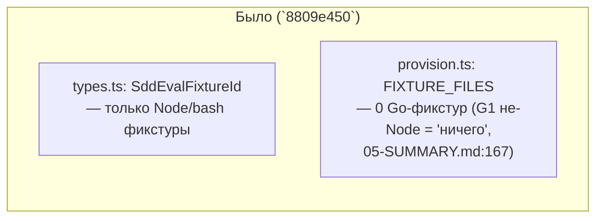
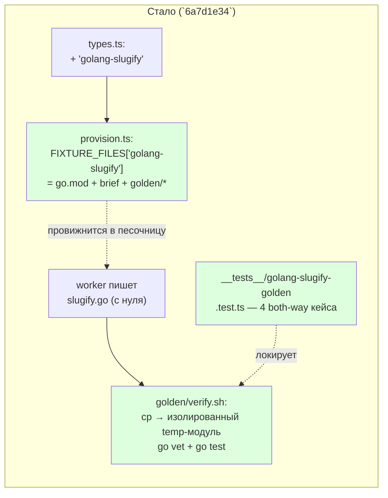

ОТЧЁТ Пачка 7/Бриф E-11 — «фикстура `golang-slugify` в `provision.ts`» (Волна 0,
`50-TRACK-EVAL.md`, готовит почву для `E-12`)

СТАТУС: ВЫПОЛНЕНО.

КОММИТ: `6a7d1e34` `feat(E-11): golang-slugify fixture — deterministic golden both-way`, ветка
`lead/eval-reproducible`, база `8809e450` (GAP-E-2).

## 1. Файлы

| Путь | Тип правки | Смысловое изменение | Чем доказано |
|---|---|---|---|
| `ai/flow-eval/types.ts` | правка | `SddEvalFixtureId` получил `'golang-slugify'` с комментарием, объясняющим, почему фикстура НЕ подключена к `scenarios.json`/фазе `execute`: `shared/sdd/readiness.ts` по-прежнему хардкожен на node-профиль (см. ledger finding A7, GAP-E-5) — репозиторий без `package.json` не может пройти `EXECUTION_READY`; это работа `E-12` (заблокирована golang-пресетом), не этой задачи | тип используется в `provision.ts` (компилируется, `npm run type-check` зелёный) |
| `ai/flow-eval/provision.ts` | правка | Новый блок констант (`GOLANG_SLUGIFY_BRIEF`, `GOLANG_SLUGIFY_GOLDEN_TEST_TMPL`, `GOLANG_SLUGIFY_VERIFY`) + запись `FIXTURE_FILES['golang-slugify']`: `go.mod` (готовый) + `inputs/brief.md` + `golden/golden_test.go.tmpl` (НЕ `.go` — никогда не компилируется на месте) + `golden/verify.sh` (копирует `slugify.go` воркера + шаблон в изолированный temp-модуль `goldencheck`, гоняет `go vet`+`go test` там) | `ai/flow-eval/__tests__/golang-slugify-golden.test.ts` (4 кейса) |
| `ai/flow-eval/__tests__/golang-slugify-golden.test.ts` | новый | Both-way (реальный `go` toolchain, самотест пропускается чисто, если `go` не найден на PATH): корректная референсная реализация → PASS; заведомо неверная (identity-функция) → FAIL с диффом `go test`; отсутствующий `slugify.go` → FAIL на проверке существования, до вызова Go-тулинга; корень фикстуры остаётся чистым buildable Go-модулем (`go build ./...`/`go vet ./...` зелёные) даже когда `golden/*.tmpl` лежит рядом | сам прогон файла (§3) |

## 2. Архитектура — было / стало





## 3. Доказательства

| Пункт приёмки | Команда | Вывод | Статус |
|---|---|---|---|
| golden both-way | `node --import tsx --test ai/flow-eval/__tests__/golang-slugify-golden.test.ts` | 4/4 зелёных: ACCEPTS reference / REJECTS wrong / REJECTS missing / root stays buildable | ВЫПОЛНЕНО |
| фикстура не ломает существующий инвариант «coverage обязателен для всех фикстур» | `node --import tsx --test ai/flow-eval/__tests__/fixture-coverage.test.ts` | тест сам фильтрует по наличию `package.json` — `golang-slugify` (без него) корректно вне области этого чек, как и остальные `infra-*`/bash-фикстуры | ВЫПОЛНЕНО |

## 4. Отклонения и открытые вопросы

Не подключена к `scenarios.json`/фазе `execute` — сознательное сужение, а не недоделка: задача-
доска называет это отдельным пунктом `E-12` («детерминированный аналог E-12 для go», зависит от
`V-09`, golang readiness-пресет, который не входит в эту пачку). Подключение сегодня дало бы
фикстуру, которая гарантированно проваливает `EXECUTION_READY` на любом реальном прогоне — это не
«golden both-way» проблема, а архитектурный разрыв readiness/verify, зафиксированный отдельно
(ledger finding A7).

Команда пуша для Lead (после независимой верификации всей пачки 7):
```
git push origin lead/eval-reproducible
```
