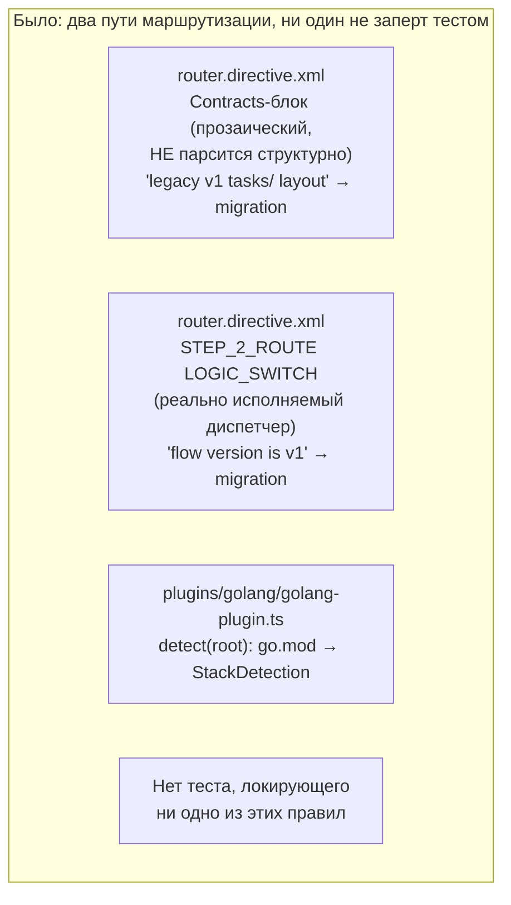
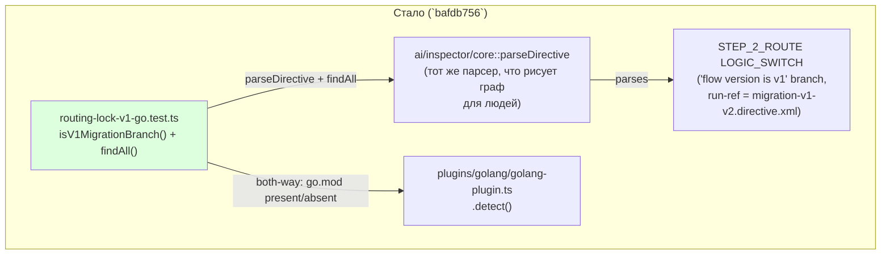

ОТЧЁТ Пачка 7/Бриф E-15 — «детерминированный лок маршрутизации на парсере `ai/inspector/core`
(v1-раскладка/`go.mod`-ветка)» (Волна 0, `50-TRACK-EVAL.md`, закрывает поверхность №1 из §1.10
дёшево)

СТАТУС: ВЫПОЛНЕНО.

КОММИТ: `bafdb756` `test(E-15): deterministic routing lock on v1-layout and go.mod branches`,
ветка `lead/eval-reproducible`, база `6a7d1e34` (E-11). Директивы и код `ai/inspector/**`/
`plugins/**` НЕ редактировались («директивы как есть») — только новый тест-файл в
`ai/flow-eval/__tests__/`.

## 1. Файлы

| Путь | Тип правки | Смысловое изменение | Чем доказано |
|---|---|---|---|
| `ai/flow-eval/__tests__/routing-lock-v1-go.test.ts` | новый | Два независимых both-way лока: (1) парсит РЕАЛЬНЫЙ `ai/directives/sdd-v2/router.directive.xml` через `ai/inspector/core::parseDirective` и утверждает наличие `branch`-узла с условием, называющим `v1`, и дочерним `run`-узлом с `ref === migration-v1-v2.directive.xml`; мутационный (both-way) кейс убирает именно этот `READ_AND_USE_DIRECTIVE`-вызов текстовым якорем (не номером строки) и доказывает, что лок реагирует на текст, а не проходит вхолостую; (2) `plugins/golang/golang-plugin.ts::detect()` распознаёт `go.mod` как стек `golang`, и НЕ распознаёт его отсутствие | сам прогон файла (§3) |

## 2. Архитектура — было / стало





## 3. Доказательства

| Пункт приёмки | Команда | Вывод | Статус |
|---|---|---|---|
| both-way (v1-layout → migration directive) | `node --import tsx --test ai/flow-eval/__tests__/routing-lock-v1-go.test.ts` | 4/4 зелёных: позитив находит branch+run; мутация (текстовый якорь на условие STEP_2_ROUTE, не номер строки) убирает найденное; go.mod present → `stack:'golang'`; go.mod absent → `null` | ВЫПОЛНЕНО |

## 4. Отклонения и открытые вопросы

Router.directive.xml формулирует правило «v1 → migration» ДВАЖДЫ: один раз как прозаическую
рекомендацию внутри `<Contracts>` (парсер `ai/inspector/core` структурно НЕ разбирает `<LogicSwitch>`
внутри `<Contracts>` — только как прямого потомка корня директивы или внутри `<Action>`), и один раз
как реальный диспетчер `STEP_2_ROUTE`. Первая (ошибочная) попытка теста таргетировала прозаическую
копию и находила 0 совпадений — именно так и был найден этот факт о границах парсера. Финальный тест
локирует ВТОРУЮ (реально исполняемую и реально парсящуюся) копию — это не отклонение от задачи по
существу (замок «на парсере ai/inspector/core» по-прежнему верен), но стоит явно зафиксировать: если
Lead/оператор считали важным именно прозаическую формулировку, эта сессия предлагает уточнение
задачи, а не полагается на своё прочтение молча.

Команда пуша для Lead (после независимой верификации всей пачки 7):
```
git push origin lead/eval-reproducible
```
