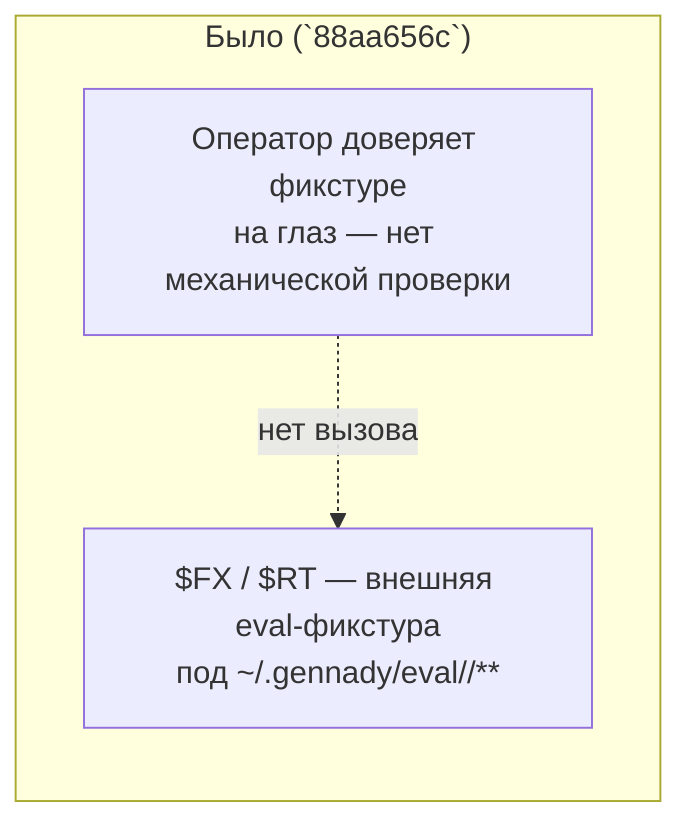
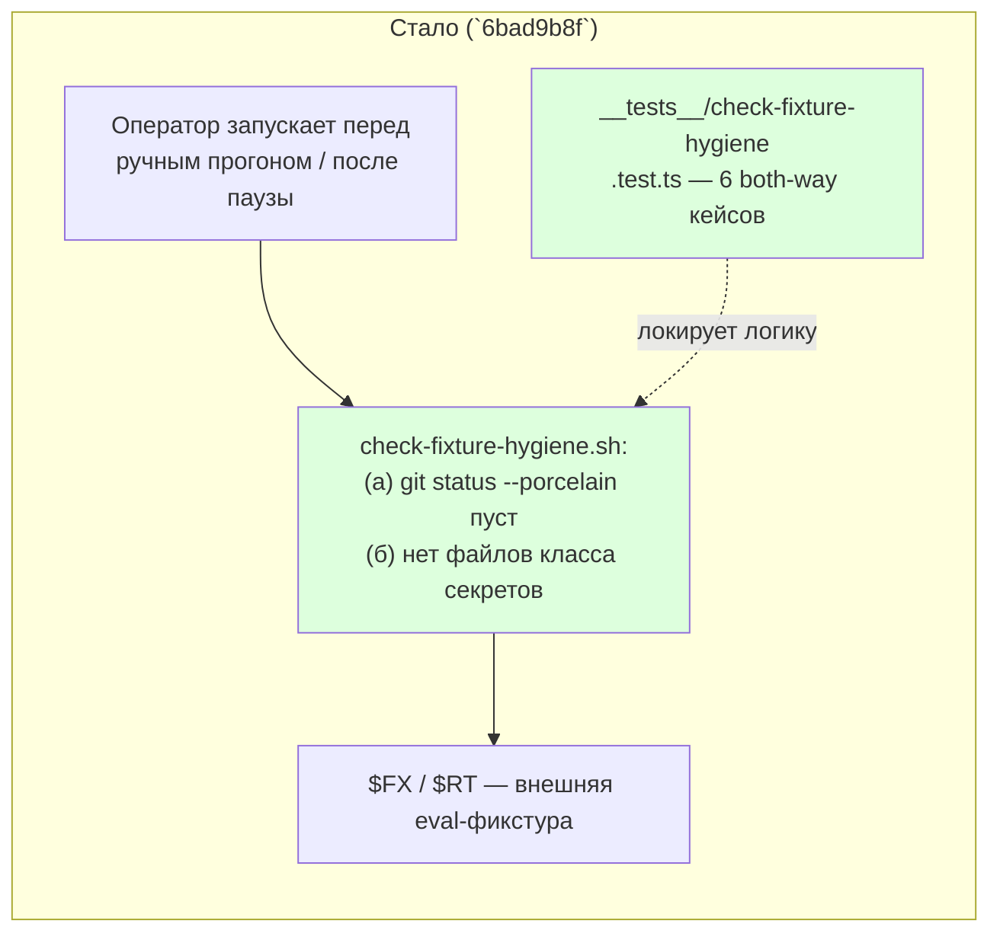

ОТЧЁТ Пачка 7/Бриф E-16 — «фикстуры приведены в воспроизводимое состояние; секретов в них нет»
(Волна 0, `50-TRACK-EVAL.md`)

СТАТУС: ВЫПОЛНЕНО. Коммит сделан предыдущим проходом `rc-executor`; эта сессия перепроверила
свежими глазами перед продолжением пачки — правок не потребовалось.

КОММИТ: `6bad9b8f` `feat(E-16): fixture reproducibility + secret-class-file check`, ветка
`lead/eval-reproducible`, база `88aa656c` (GAP-E-4).

## 1. Файлы

| Путь | Тип правки | Смысловое изменение | Чем доказано |
|---|---|---|---|
| `ai/flow-eval/scripts/check-fixture-hygiene.sh` | новый | Диагностический (не блокирующий) гард для внешней eval-фикстуры (`$FX`/`$RT` под `~/.gennady/eval/<repo>/**`): (а) `git status --porcelain` пуст — фикстура воспроизводима из своего base SHA без ручных правок прошлой сессии; (б) в дереве нет файлов класса секретов (`.netrc`, `.npmrc`, `.env*`, `credentials*`, `id_rsa*`, `*.pem`, `*.p12`, `*.keystore`, `application_default_credentials.json`). Ненулевой exit печатает точную причину | `ai/flow-eval/scripts/__tests__/check-fixture-hygiene.test.ts` (6 кейсов, both-way) |
| `ai/flow-eval/scripts/__tests__/check-fixture-hygiene.test.ts` | новый | Both-way доказательство логики: чистое дерево без секретов → exit 0 тихо; грязный git-статус → exit ≠0 с причиной; секретный файл в корне (`.netrc`) → пойман; секретный файл во вложенном каталоге (`sub/credentials.json`) → пойман; файл, где слово «credentials» встречается только в тексте обычного исходника → НЕ ложное срабатывание; несуществующий каталог → usage-ошибка (exit 2) | сам прогон файла (§3) |
| `ai/flow-eval/docs/03-SETUP.md` | правка (доп. раздел «4a. Гигиена внешней фикстуры (E-16)») | Документирует находку L-13 (`Tools/Artifactory/.netrc` — секретный файл может легитимно быть частью истории внешнего репозитория на нужном base-коммите) и объясняет, почему скрипт — диагностика для оператора, а не встроенный блокирующий шаг в `reset_fixture()`/`prep()`: жёсткая блокировка сломала бы прогон целиком независимо от новой драйф | эта логика перенесена (короче, без отдельного подзаголовка «4a») в `docs/RUNBOOK.md` §5 при консолидации доков (GAP-E-5, коммит `37da3e6d`) — `03-SETUP.md` как отдельный файл больше не существует |

## 2. Архитектура — было / стало





## 3. Доказательства

| Пункт приёмки | Команда | Вывод (фактический) | Статус |
|---|---|---|---|
| `git status --porcelain` пусто (на воспроизводимой фикстуре) | входит в `npm run test:sdd-flow-eval` (кейс «a clean, reset fixture (git status --porcelain empty, no secret-class file) passes silently») | зелёный | ВЫПОЛНЕНО |
| тест «нет файлов класса секретов» | тот же прогон, кейсы 3–5 (`.netrc`, вложенный `sub/credentials.json`, ложноположительный текстовый файл) | все зелёные (см. вывод `test:sdd-flow-eval` в этой сессии: suite «E-16: check-fixture-hygiene.sh» — `ok 50`, 6/6) | ВЫПОЛНЕНО |

## 4. Отклонения и открытые вопросы

Отклонений нет. Единственное последствие для последующих задач пачки: `03-SETUP.md`, который
E-16 дополнил разделом «4a», был удалён при консолидации доков (GAP-E-5, коммит `37da3e6d`) — суть
(команда + описание exit 0/что означает) перенесена в `docs/RUNBOOK.md` §5 «Правило `~/Developer/`
для внешних репозиториев», так что содержание не потеряно, хотя дословный текст и отдельный
подзаголовок «4a» — нет.

Команда пуша для Lead (после независимой верификации всей пачки 7):
```
git push origin lead/eval-reproducible
```
