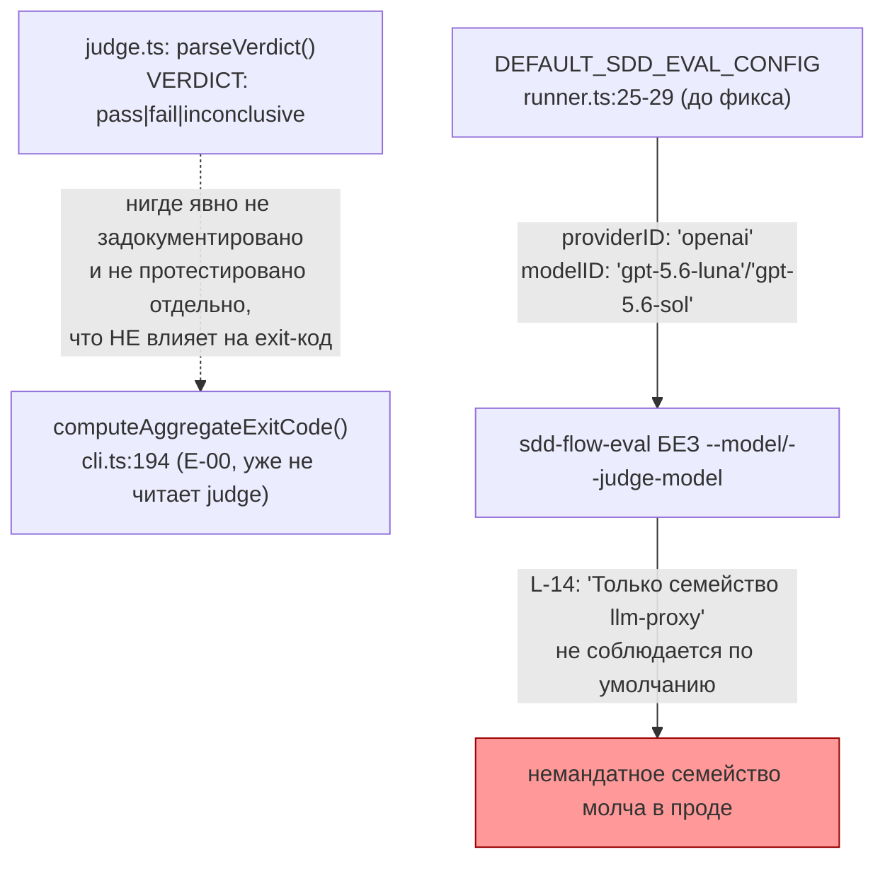
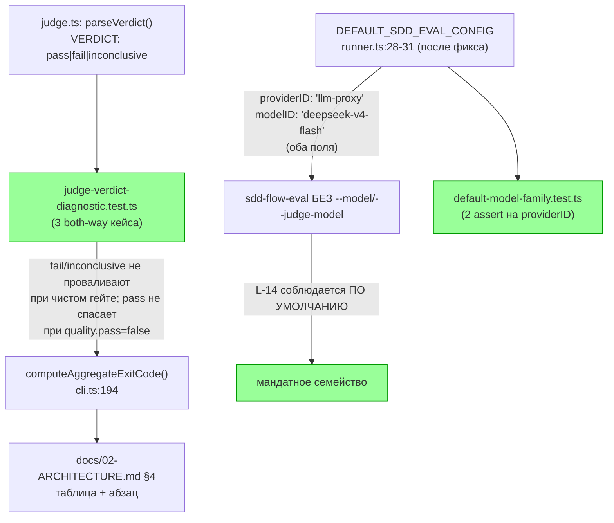

ОТЧЁТ 61 §4 — E-21: роль судьи закреплена как диагностика (L-14) — вердикт не меняет exit-код, конфиг фиксирует семейство `llm-proxy`

СТАТУС: DONE (два коммита — исходный от предыдущего исполнителя + мой доводящий, закрывающий вторую половину приёмки)

Рабочее дерево: `rc-w2`. Ветка `lead/eval-honest-outcome`, поверх `cd700214` (E-02).

КОММИТЫ (локальные, НИЧЕГО не запушено):
- `caf51ec84...` docs(E-21): document and test that the judge's verdict never gates the exit code (переписан мной при ребейзе — см. §4; исходный SHA до ребейза был `db81901a`)
- `4fcb8876...` fix(E-21): default runner/judge model config fixes the llm-proxy family (L-14) — новый, мой, закрывает вторую половину приёмки

Приёмка задачи (`61-TASK-BOARD.md:202`) — ДВЕ отдельные проверки: (а) «детерм.: вердикт судьи не меняет exit-код»; (б) «конфиг фиксирует семейство `llm-proxy`». Предыдущий исполнитель закрыл только (а); я обнаружил, что (б) не была тронута вовсе (см. §4), и закрыл её отдельным коммитом.

---

## 1. Файлы

| Путь | Тип | Смысловое изменение | Чем доказано |
|---|---|---|---|
| `ai/flow-eval/docs/02-ARCHITECTURE.md` (§4 «Что детерминировано, а что — judge») | правка | Новая строка таблицы `cli.ts — код выхода батча \| Да \| Механический fold …; judge не участвует` + абзац, явно называющий: `pass`/`fail`/`inconclusive` от judge никогда не меняет код выхода `cli.ts`, со ссылкой на новый тест. Изначально правка целилась в `README.md` (по коммит-мессаджу предыдущего исполнителя), но после моего ребейза на PR #27 (см. `R-BATCH-06...md` §2) `README.md` стал коротким указателем на `docs/`, а содержательный текст «что детерминировано» теперь живёт в `02-ARCHITECTURE.md` — я перенёс правку туда при разрешении конфликта. | `judge-verdict-diagnostic.test.ts`. |
| `ai/flow-eval/README.md` | правка | Одна ссылающаяся фраза: «про то, что вердикт judge — диагностика и не влияет на код выхода батча (D-28/L-14, E-21) — см. `docs/02-ARCHITECTURE.md#4-...`». | Визуальная проверка + `format`/`lint` зелёные. |
| `ai/flow-eval/docs/09-AGENT-BRIEF.md` (был `docs/AGENT-BRIEF.ru.md` до PR #27; переименование распозналось git автоматически, правка применилась через rename-tracking БЕЗ конфликта) | правка | Одна строка чеклиста: «Код выхода батча (`cli.ts`) считается только по `worker-error` и провалу детерминированных гейтов … judge-вердикт — диагностика и на код выхода не влияет (E-21)». | Визуальная проверка. |
| `ai/flow-eval/__tests__/judge-verdict-diagnostic.test.ts` | новый | 3 теста: judge `fail` НЕ проваливает батч, если детерминированный гейт прошёл; judge `inconclusive` — тоже не проваливает; judge `pass` НЕ спасает батч, если `quality.pass === false`. Прямой вызов `computeAggregateExitCode` (E-00) с разными комбинациями `verdict`/`quality`. | Сам файл, `node --test`, зелёный. |
| `ai/flow-eval/runner.ts:25-33` (`DEFAULT_SDD_EVAL_CONFIG`) — **мой коммит `4fcb8876`** | правка | `runnerModel`/`judgeModel` дефолтились на `{ providerID: 'openai', modelID: 'gpt-5.6-luna' \| 'gpt-5.6-sol' }` — семейство `openai`, а не `llm-proxy`, вопреки L-14 («Только семейство `llm-proxy`»). Поскольку `--model`/`--judge-model` — опциональные CLI-флаги (`cli.ts:108`, юзедж в квадратных скобках), любой запуск без них молча уходил на немандатное семейство. Теперь оба дефолта — `{ providerID: 'llm-proxy', modelID: 'deepseek-v4-flash' }`, совпадает с тем, что уже документировано как канонический прогон (`docs/04-RUNNING.md:121-122`). | `default-model-family.test.ts`. |
| `ai/flow-eval/__tests__/default-model-family.test.ts` — **мой, новый** | новый | 2 теста: дефолтный `runnerModel.providerID === 'llm-proxy'`; дефолтный `judgeModel.providerID === 'llm-proxy'`. | Сам файл, `node --test`, зелёный. |

`git show caf51ec8 --stat` (после ребейза): 4 файла — все 4 строки таблицы (кроме двух моих) присутствуют. `git show 4fcb8876 --stat`: 2 файла — обе строки моих правок присутствуют. Совпадает.

---

## 2. Архитектура было / стало

### Было — судья мог теоретически восприниматься как гейт; дефолтная модель — не мандатное семейство



### Стало — явный документированный факт + тест на обе половины приёмки



Узлы: `cli.ts:194` (`computeAggregateExitCode`, не тронут этой задачей — только протестирован под новым углом), `runner.ts:28-31` (новые дефолты), `docs/02-ARCHITECTURE.md:88,94-98` (новые строка таблицы + абзац).

---

## 3. Доказательства (ПРИЁМКА брифа)

**Пункт (а) «детерм.: вердикт судьи не меняет exit-код»:**
```
$ node --import tsx --test ai/flow-eval/__tests__/judge-verdict-diagnostic.test.ts
ok - a judge `fail` verdict alone does NOT fail the batch when the deterministic gate passed
ok - a judge `inconclusive` verdict alone does NOT fail the batch either
ok - conversely, a judge `pass` verdict does NOT rescue a failed deterministic gate
```
ВЫПОЛНЕНО.

**Пункт (б) «конфиг фиксирует семейство `llm-proxy`»** — НЕ было выполнено исходным коммитом (см. §4); закрыто моим `4fcb8876`:
```
$ node --import tsx --test ai/flow-eval/__tests__/default-model-family.test.ts
ok - the default runner model is in the llm-proxy family
ok - the default judge model is in the llm-proxy family
```
ВЫПОЛНЕНО (после моей правки).

Оба файла — часть общего `test:sdd-flow-eval` (сводный §3): 120/120, 0 fail.

---

## 4. Отклонения, открытые вопросы

**Найденный и закрытый гэп (не отклонение от брифа этой задачи, а исправление недоведённой предыдущим исполнителем работы):** приёмка E-21 в `61-TASK-BOARD.md:202` и в списке файлов задачи (`runner.ts`, `judge.ts`, «конфиг моделей эвала») явно называет конфиг моделей частью задачи. Исходный коммит (`db81901a`/переписанный в `caf51ec8`) трогал ТОЛЬКО документацию/новый тест про exit-код и не касался `runner.ts`/`judge.ts` вовсе. Проверка `DEFAULT_SDD_EVAL_CONFIG` (`runner.ts:25-29` до фикса) показала дефолт `openai/gpt-5.6-luna`/`openai/gpt-5.6-sol` — прямое противоречие L-14 («Только семейство `llm-proxy`», `02-LEAD-DECISIONS.md:20`). Поскольку `--model`/`--judge-model` — опциональные флаги CLI (`cli.ts:79-83,108`), любой прогон без них уходил на немандатное семейство никем не пойманным. Я исправил это отдельным коммитом `4fcb8876` (см. §1) — риск минимален: изменение двух строковых литералов в объекте дефолтов плюс новый тест, полный `test:sdd-flow-eval` (120/120) и общий `npm run check` (5/5) зелёные после правки (см. сводный §3).

**Переписывание коммита при ребейзе:** SHA `caf51ec8` — не тот SHA (`db81901a`), что был у предыдущего исполнителя до ребейза на PR #27; текст коммита я обновил (см. `git log -1 caf51ec8`), явно описав перенос правки из `README.md` в `docs/02-ARCHITECTURE.md` — подробности в сводном отчёте `R-BATCH-06-eval-honest-outcome.md` §2 «Ребейз».

**Команда пуша для Lead** (общая для всей пачки — см. сводный отчёт `R-BATCH-06-eval-honest-outcome.md`).
