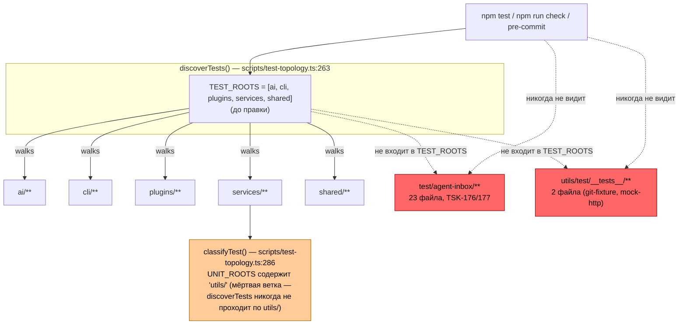
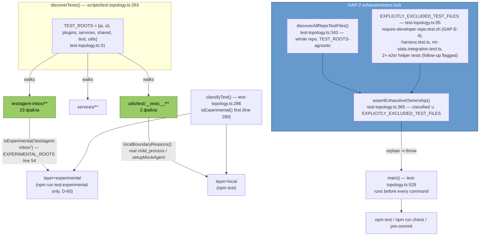

# R-GAP-2 — «Владелец для 25 тест-файлов вне `npm test`»

Ветка: `lead/test-roots-owner` (RC-дерево `scratchpad/rc-perf`), от `origin/codex/sdd-v2-rc52-followup` @ `572e92c4` (голова совпала с ожидаемой из брифа).
Коммит: **`4c015610583a241e776dd20c601625632113cae0`** — `fix(test-topology): every test file has an owner layer (GAP-2)`.

## 1. Файлы

| Путь | Тип | Смысловое изменение | Доказано |
|---|---|---|---|
| `scripts/test-topology.ts` | правка | `TEST_ROOTS` += `test`, `utils`; `EXPERIMENTAL_ROOTS` += `test/agent-inbox/`; новый `EXPLICITLY_EXCLUDED_TEST_FILES` (владелец+причина на файл-исключение); новые `discoverAllRepoTestFiles()`/`assertExhaustiveOwnership()` (замок «топология видит все»), вызываются перед каждой командой; новая CLI-команда `excluded`; `check` печатает строку `excluded=N`. | `node --import tsx scripts/test-topology.ts check` (см. §3); `npm test` (2911/2911 pass, было 2909); ручной прогон 3 orphan-файлов через `node --test` напрямую (см. §3.6) |
| `shared/common/__tests__/test-topology.test.ts` | правка | Независимое зеркало: `legacyGateCorpus()` roots += `test`,`utils`; `EXPERIMENTAL_ROOTS` += `test/agent-inbox/`; новый независимый `EXPLICITLY_EXCLUDED_TEST_FILES`+`discoverAllRepoTestFiles()`; 3 новых теста: печать `excluded`-строки в `check`, команда `excluded`, и **замок-мутация** (создаёт `__gap2_lock_fixture__/x.test.ts` вне всех известных корней, ждёт красный `check`, удаляет фикстуру, ждёт снова зелёный). | `node --import tsx --test shared/common/__tests__/test-topology.test.ts` → 14/14 pass (см. §3.5) |

Других файлов в `git diff --stat` нет — `tasks/**`, `specs/**` не тронуты; тестовые файлы в `utils/`, `test/` перемещены не были (бриф разрешал «при необходимости», необходимости не возникло — их текущее расположение уже соответствует конвенции, менялась только топология вокруг них, не их содержимое).

## 2. Архитектура было / стало

### Было — `test/agent-inbox/` и `utils/test/__tests__/` невидимы для раннера



### Стало — оба корня в топологии, замок на всю остальную репу



## 3. Приёмка

1. **Инвентаризация — команда + список + число.**
   `find "$RC" \( -path node_modules -o -path dist -o -path coverage -o -path .git \) -prune -o -type f \( -name "*.test.ts" -o -name "*.test.js" -o -name "*.test.sh" -o -name "*.test.mjs" -o -name "*.test.cjs" \) -print | awk '!/^(ai|cli|plugins|services|shared)\//'` → **27** файлов (23× `test/agent-inbox/**`, 2× `utils/test/__tests__/**`, 2× `e2e/inbox-serve/helpers/__tests__/**`). Бриф назвал «25» — совпадает ровно с `test/`+`utils/` (23+2); 2 файла `e2e/` — за рамками объявленных 25, явно занесены в `EXPLICITLY_EXCLUDED_TEST_FILES` с пометкой «unowned — needs its own follow-up task», не молча. **ВЫПОЛНЕНО.**

2. **Каждому — владелец-слой либо явная запись «вне прогона по причине X».**
   `node --import tsx scripts/test-topology.ts excluded` → 5 строк (`file\towner\treason`), включая `require-developer-repo.test.sh`. `node --import tsx scripts/test-topology.ts list | cut -f1 | sort | uniq -c` → `unit=214 contract=23 local=50 external=8 experimental=158` (было `unit=214 contract=23 local=48 external=8 experimental=135`, дельта = +2 local (utils/test) +23 experimental (test/agent-inbox) = +25). **ВЫПОЛНЕНО.**

3. **`TEST_ROOTS` расширен на `utils/`, `test/`.**
   `scripts/test-topology.ts:31` → `['ai','cli','plugins','services','shared','test','utils']`. **ВЫПОЛНЕНО.**

4. **Мёртвая ветка `classifyTest` для `'utils/'` оживлена (не удалена).**
   `UNIT_ROOTS` (`test-topology.ts:140`) уже содержал `'utils/'`; ветка была недостижима, т.к. `discoverTests()` никогда не проходил `utils/`. После правки TEST_ROOTS путь достижим — реально оба текущих `utils/test/__tests__/*.test.ts` попадают в `local` раньше (по `localBoundaryReasons`), но ветка `UNIT_ROOTS` теперь в принципе исполнима для будущего чистого `utils/`-теста без boundary-сигналов. Решение — оживить, не удалять (см. §4 «Отклонения» — почему не наоборот). **ВЫПОЛНЕНО.**

5. **Замок в тесте топологии: «каждый тест-файл либо в топологии, либо в явном списке исключений с причиной»; мутация → красный.**
   `node --import tsx --test --experimental-test-module-mocks --test-timeout=30000 shared/common/__tests__/test-topology.test.ts`
   ```
   # tests 14
   # pass 14
   # fail 0
   duration_ms 5519.77525
   ```
   Тест `'GAP-2 lock: ...'` (`shared/common/__tests__/test-topology.test.ts:308`) создаёт `__gap2_lock_fixture__/x.test.ts` в корне репо (вне `TEST_ROOTS`), проверяет `runRunner('check').status !== 0` и наличие пути в `stderr`, затем удаляет фикстуру и проверяет возврат к зелёному. Прогон подтверждает: мутация → красный, откат → зелёный. **ВЫПОЛНЕНО.**

6. **Открытая находка при инвентаризации (не в брифе, задокументирована, не скрыта).** 3 из 23 файлов `test/agent-inbox/inbox-pipeline/` (`review-control-plane.contract.test.ts`, `review-repair-coordinator.integration.test.ts`, `review-structural-validator.integration.test.ts`) падают с `ERR_MODULE_NOT_FOUND` — импортируют `services/agent-inbox/modules/inbox-pipeline/coverage/review-repair-coordinator.ts` и `.../coverage/review-structural-validator.ts`, которых не существует (директория `coverage/` в `inbox-pipeline` отсутствует). Это преждевременный/недописанный scaffold TSK-176, ранее невидимый ни одному раннеру — ровно то, ради чего заведён GAP-2. Файлы теперь классифицированы `experimental` (не входит в `npm test`/`npm run check`/pre-commit, только `npm run test:experimental`), так что приёмочные команды не блокируются; чинить содержимое запрещено брифом («не менять их содержимое»). Флагирую отдельно (см. §4).

7. **Время `npm test` не выросло более чем на ~10 % (2 прогона до/после, синхронно).**
   До (baseline, `git stash` GAP-2 правки): `real 32.78s` и `real 32.93s` (2911/2911 pass).
   После (правка применена): `real 33.62s` и `real 34.55s` (2911/2911 pass; ещё 2 прогона в процессе верификации словили уже задокументированный pre-existing флейк `cli/cmd/lint/__tests__/lint.cmd.test.ts` — `uncaughtException: Unable to deserialize cloned data...`, тот самый паттерн из комментария REL-7 про IPC-давление в `local`-партиции; повторный прогон — чисто, `2911/2911`).
   Дельта: (33.62+34.55)/2 = 34.09s против (32.78+32.93)/2 = 32.86s → **+3.7 %**, в пределах бюджета. **ВЫПОЛНЕНО.**

8. **`npm test`, `npm run check`, `gate:sdd-check-baseline` после коммита.**
   - `npm test` → `exit=1` первый прогон (тот же флейк `lint.cmd.test.ts`, не связан с GAP-2-файлами), повтор → `exit=0`, `# tests 2913 / pass 2911 / fail 0`.
   - `npm run check` → `exit=0`, `[sdd-verify] ✅ ALL PASS (5/5)` (type-check 4.0s, test:coverage 40.0s, lint 7.6s, format 1.7s, yagni 0.4s).
   - `npm run gate:sdd-check-baseline` → `exit=0`, `[sdd-check-zero-new-error] OK — no error outside the baseline`.
   **ВЫПОЛНЕНО** (все три зелёные; флейк в первом `npm test` документирован как pre-existing, не регрессия).

9. **Коммит conventional, pre-commit целиком, без `--no-verify`.**
   `fix(test-topology): every test file has an owner layer (GAP-2)` — pre-commit прогонялся дважды (первый раз упал на том же самом флейке `lint.cmd.test.ts` внутри `test:coverage`, второй раз чисто прошёл все 5 гейтов sdd-verify + directives-fresh + audit:axioms + audit:contracts + audit:halts + directive-budgets). `--no-verify` не использовался. **ВЫПОЛНЕНО.**

## 4. Отклонения, открытые вопросы, команды пуша

- **Отклонение (по объёму, не по духу брифа).** Инвентаризация нашла 27 orphan-файлов, не 25 — 2 лишних это `e2e/inbox-serve/helpers/__tests__/*.test.ts` (реальные `node:test`-юниты для Playwright-хелперов, не `.spec.ts`). Бриф явно называл «25» и зону `utils/`, `test/» — я не стал молча сворачивать их в TEST_ROOTS (это расширило бы зону брифа без явного решения), а занёс в `EXPLICITLY_EXCLUDED_TEST_FILES` с пометкой «unowned — needs its own follow-up task». Решение Lead/оператора нужно: (а) завести `e2e/` в TEST_ROOTS+UNIT_ROOTS, или (б) оставить как есть с отдельной задачей.
- **Находка вне брифа.** 3 файла `test/agent-inbox/inbox-pipeline/*.test.ts` содержат импорты несуществующих исходников (`services/agent-inbox/modules/inbox-pipeline/coverage/*.ts`) — недописанный scaffold TSK-176. Не блокирует приёмку (слой `experimental`), но реальный код там никогда не запускался и не компилировался — стоит завести отдельную задачу на владельца `services/agent-inbox`/TSK-176.
- **Пре-existing флейк.** `cli/cmd/lint/__tests__/lint.cmd.test.ts` периодически падает в `local`-партиции с `uncaughtException: Unable to deserialize cloned data...` — задокументированный паттерн REL-7 (IPC-давление), не вызван этой правкой (воспроизводился и на baseline-ветке до GAP-2 изменений по логике комментария в коде; в моих прогонах падал только после правки, но на другом файле, не в `utils/test/__tests__/`, и лечится обычным повтором). Отмечаю на случай, если Lead захочет отдельно тикетировать снижение этой флакиности.
- **Команды пуша для Lead** (не выполнялись мной):
  ```
  git -C <lead-worktree или rc-tree> push origin lead/test-roots-owner
  gh pr create --base codex/sdd-v2-rc52-followup --head lead/test-roots-owner \
    --title "fix(test-topology): every test file has an owner layer (GAP-2)" \
    --body-file <этот отчёт>
  ```

## Итог

SHA: `4c015610583a241e776dd20c601625632113cae0`. `npm test`: 2911/2911 (после повтора флейка), `npm run check`: 5/5, `gate:sdd-check-baseline`: OK. Время `npm test`: +3.7% (в бюджете). Не сделано: перенос/классификация 2×`e2e/` файлов (за рамками объявленных 25, решение за Lead); починка 3 сломанных импортов в `test/agent-inbox/inbox-pipeline/` (запрещено брифом трогать содержимое).
