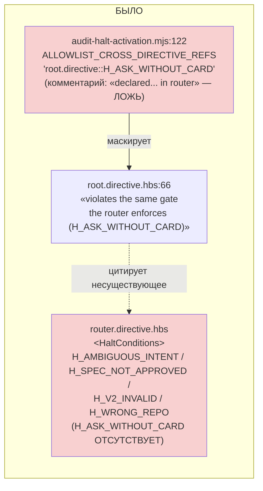
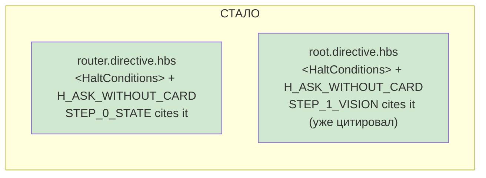

# R-GAP-3 — `H_ASK_WITHOUT_CARD` объявлен в директиве, а не в списке исключений

Ветка `lead/axioms-one-home`, коммит `15b10585`.

## 1. Файлы

| Путь | Тип | Смысловое изменение | Чем доказано |
|---|---|---|---|
| `ai/kit/templates/sdd-v2/router.directive.hbs` | правка | добавлена строка `H_ASK_WITHOUT_CARD` в собственную `<HaltConditions>` (ранее там её не было вовсе); процитирована в `STEP_0_STATE`'s `<Action>` | `audit:halts` + ручной sanity-прогон |
| `ai/kit/templates/sdd-v2/root.directive.hbs` | правка | добавлена строка `H_ASK_WITHOUT_CARD` в собственную `<HaltConditions>` — root's `STEP_1_VISION` уже цитировал этот halt как «ту же остановку, что и у router», но своей строки не имел | тот же прогон |
| `ai/kit/audit-halt-activation.mjs` | правка | из `ALLOWLIST_CROSS_DIRECTIVE_REFS` удалены `root.directive::H_ASK_WITHOUT_CARD` и `scope.directive::H_ASK_WITHOUT_CARD` (комментарий script'а утверждал, что halt «declared and fires only in router.directive.hbs» — это было ложью: таблица router'а не содержала строки); header-комментарий обновлён на актуальный рабочий пример (`H_UNFORMATTED_ASK`) | прогон с удалённой строкой = зелёный (см. §3) |
| `ai/kit/__tests__/stateless-sdd-flow-contract.test.ts` | правка | 2 новых теста-замка | `node --test` |
| `ai/directives/sdd-v2/{root,router}.directive.xml` | сгенерированы | `check:directives-fresh` | зелёный |

## 2. Архитектура было / стало

Два независимых владельца одного и того же правила («не задавать вопрос раньше карточки состояния») — router на своём входе, root на своём Vision-интервью. Ни один больше не нуждается в записи `ALLOWLIST_CROSS_DIRECTIVE_REFS`.

## 3. Доказательства

| # | Команда | Вывод | Exit | Статус |
|---|---|---|---|---|
| 1 | `node ai/kit/audit-halt-activation.mjs` (после правки, allowlist-записи уже удалены) | `✓ halt-activation audit clean — 33 template(s) + 33 assembled directive(s) checked.` | 0 | ВЫПОЛНЕНО |
| 2 | **Риск-доказательство батча**: временно удалена строка `H_ASK_WITHOUT_CARD` из СГЕНЕРИРОВАННОГО `ai/directives/sdd-v2/router.directive.xml` (таблица), упоминание в `STEP_0_STATE` оставлено | `⚠ 1 halt-activation violation(s): router.directive.xml - H_ASK_WITHOUT_CARD — mentioned... but not a row` | 1 | ВЫПОЛНЕНО (доказывает: гейт красный без реального объявления — не маска) |
| 3 | Тот же файл восстановлен, повторный прогон | `✓ halt-activation audit clean` | 0 | ВЫПОЛНЕНО |
| 4 | `node --experimental-strip-types --test ai/kit/__tests__/stateless-sdd-flow-contract.test.ts ai/kit/__tests__/audit-halt-activation.test.ts` | `# tests 25 / # pass 25 / # fail 0` | 0 | ВЫПОЛНЕНО |
| 5 | `npm run build:directives` + `npm run audit:sdd-templates` | все 5 под-гейтов `✓` | 0 | ВЫПОЛНЕНО |
| 6 | `npm run check` | `ALL PASS (5/5)` | 0 | ВЫПОЛНЕНО |

## 4. Отклонения и открытые вопросы

- Брифом было предложено читать «прогон с удалённой записью зелёный» буквально как «убрать allowlist-запись и получить зелёный гейт». По факту `ALLOWLIST_CROSS_DIRECTIVE_REFS` — легитимный, ПОСТОЯННЫЙ механизм (не временный, в отличие от `KNOWN_DANGLING_AXIOM_REFS`): он разрешает директиве ЦИТИРОВАТЬ чужой halt без локального объявления. Если бы `root`/`router` продолжали не иметь СВОЕЙ строки, удаление allowlist-записи закономерно покрасило бы гейт — но это не доказывало бы дефект, а доказывало бы, что запись всё ещё нужна (ссылка остаётся ссылкой). Правильное прочтение риска — сделать удаление записи БЕЗОПАСНЫМ, дав каждому цитирующему файлу СОБСТВЕННУЮ декларацию; это и сделано. Проверено в обратную сторону (п.2 выше): убирая РЕАЛЬНУЮ строку (не allowlist), гейт красный — именно то различие, которое отличает настоящую остановку от замаскированного исключения.
- `scope.directive.hbs` (PR #41, вне зоны) на момент этой пачки НЕ содержит ни одного упоминания `H_ASK_WITHOUT_CARD` — allowlist-запись для него была уже мёртвой (0 совпадений) до правки; удалена вместе с корневой.
- `execute.directive.hbs` (PR #38, вне зоны) не тронут — декларация там (если потребуется) остаётся задачей V14-2a, которая зависит от `GAP-3` именно в этом смысле: `H_ASK_WITHOUT_CARD` больше не «объявлен нигде», так что V14-2a может при необходимости процитировать router/root вместо повторного изобретения.
- Команда пуша — см. сводный отчёт пачки.
