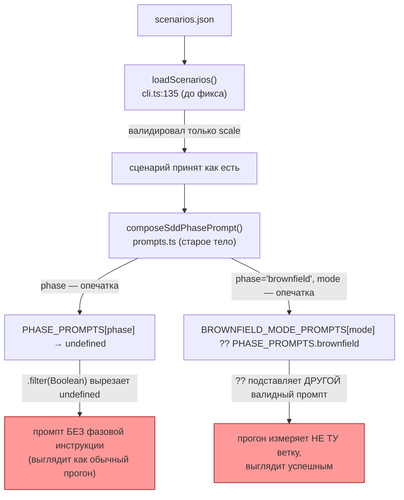
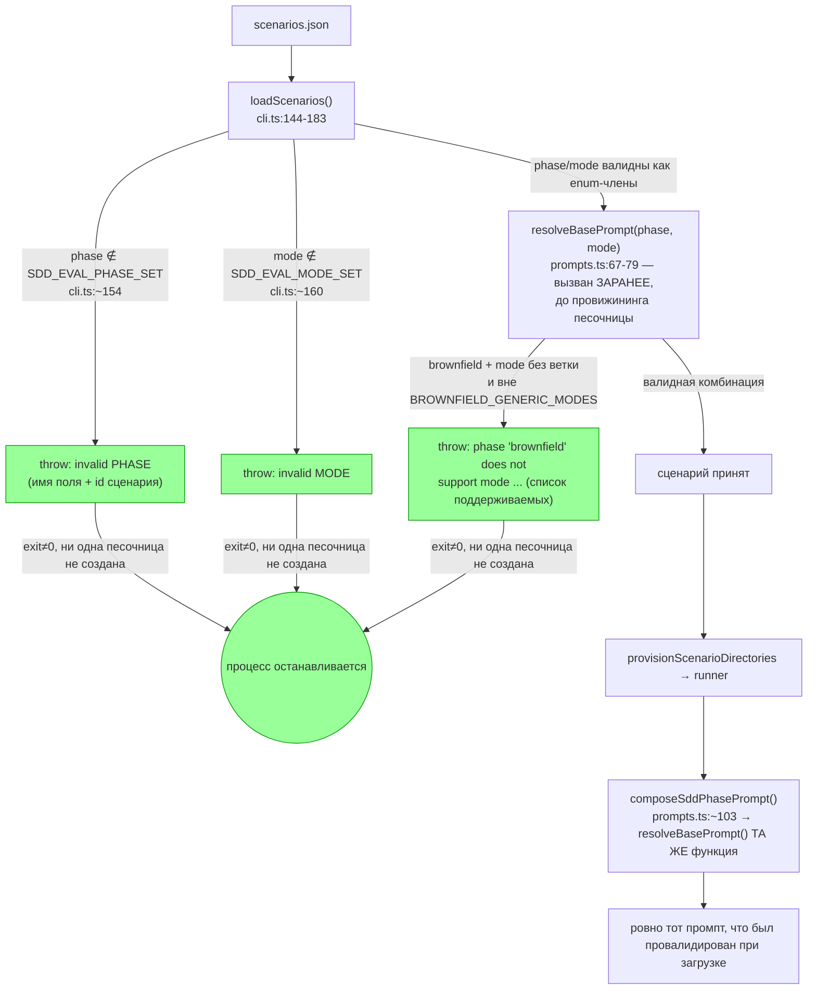

ОТЧЁТ 61 §4 — GAP-E-1: опечатка в фазе или режиме роняет прогон сразу, а не подменяет ветку

СТАТУС: DONE (обязательная приёмка ПРИЁМКА-колонки); открытый вопрос по описательной половине брифа — см. §4

Рабочее дерево: `rc-w2`. Ветка `lead/eval-honest-outcome`, поверх `84eeec60` (см. сводный отчёт пачки — новая база после ребейза на PR #27).

КОММИТ (локальный, НИЧЕГО не запушено):
- `65944dd16379a55f86284d2da56958714a2bad31` fix(GAP-E-1): fail-fast on unknown scenario phase/mode instead of a silent wrong-branch prompt

---

## 1. Файлы

| Путь | Тип | Смысловое изменение | Чем доказано |
|---|---|---|---|
| `ai/flow-eval/types.ts` | правка | `SDD_EVAL_PHASES`/`SDD_EVAL_MODES` стали runtime-массивами — единый источник истины для compile-time union и для рантайм-валидации (раньше типы существовали только как TS-union, без runtime-множества для проверки). | `gap-e1-fail-fast.test.ts`, `type-check`. |
| `ai/flow-eval/cli.ts:144-183` (`loadScenarios`) | правка | Валидирует `phase`/`mode` каждого сценария по этим множествам ДО провижининга песочницы; для `phase: 'brownfield'` дополнительно резолвит `mode` через `resolveBasePrompt` (ту же функцию, что использует `prompts.ts`), так что неподдерживаемая комбинация фейлит загрузку целиком, а не только тот сценарий, до которого дошёл раннер. | `gap-e1-fail-fast.test.ts` (both-way: валидный/невалидный `phase`, валидный/невалидный `mode`). |
| `ai/flow-eval/prompts.ts:67-79` (новая `resolveBasePrompt`) | новая функция | `phase !== 'brownfield'` → `PHASE_PROMPTS[phase]`; `brownfield` + известный `mode` → его собственный промпт; `brownfield` + один из двух легитимно-обобщённых `mode` (`modify-code-delta`/`fix-code-delta`) → общий brownfield-промпт; `brownfield` + любой другой `mode` → `throw` с именем фазы и режима. `composeSddPhasePrompt` (`prompts.ts:~103`) теперь вызывает эту функцию вместо старого `BROWNFIELD_MODE_PROMPTS[mode] ?? PHASE_PROMPTS.brownfield`. | `gap-e1-fail-fast.test.ts` (both-way на самой `resolveBasePrompt` И на `composeSddPhasePrompt` отдельно — см. `1..7`, тест 7 «the actual worker-facing entry point»). |
| `ai/flow-eval/__tests__/gap-e1-fail-fast.test.ts` | новый | 2 suite (11 тестов): «типовая опечатка `phase`/`mode` в `loadScenarios` → `throw`, называющий поле и id сценария» + «brownfield: неизвестный `mode` → `throw`, а не молчаливый общий промпт», плюс проверка, что легитимные два generic-режима по-прежнему работают. | Сам файл — `node --test`, зелёный (см. §3). |

`git show 65944dd1 --stat`: 4 файла (см. выше) — все 4 покрыты строками таблицы. Совпадает.

---

## 2. Архитектура было / стало

### Было — опечатка молча даёт пустой или ДРУГОЙ валидный промпт



### Стало — валидация до провижининга, throw вместо fallback



Узлы: `cli.ts:144` (`loadScenarios`), `cli.ts:154-166` (проверки `phase`/`mode` по множествам — см. диф §1), `cli.ts:~172-181` (вызов `resolveBasePrompt` внутри `loadScenarios`, оборачивающий throw в `scenario ${id} ${message}`), `prompts.ts:67` (`resolveBasePrompt`), `prompts.ts:~103` (`composeSddPhasePrompt`, теперь вызывающий `resolveBasePrompt`).

---

## 3. Доказательства (ПРИЁМКА брифа)

**Пункт 1: «опечатка в `phase` → exit≠0 с сообщением».**
```
$ node --import tsx --test ai/flow-eval/__tests__/gap-e1-fail-fast.test.ts
# Subtest: GAP-E-1: a typo in `phase` or `mode` fails the load, never a silently different branch
  ok — loadScenarios rejects an unknown phase, naming the field and scenario id
  ...
1..7 (suite) / 1..N (top) — все ok, см. итог ниже
```
ВЫПОЛНЕНО.

**Пункт 2: «опечатка в `mode` → exit≠0, а не другой валидный промпт».**
Проверено тестом 7 в той же suite: «composeSddPhasePrompt (the actual worker-facing entry point) throws for the same bad combination» — то есть проверка идёт не только на внутренней `resolveBasePrompt`, но и на реальной точке входа воркера. ВЫПОЛНЕНО.

**Полный прогон файла (часть общего `test:sdd-flow-eval`, см. сводный отчёт §3 за числа):** зелёный, 0 fail.

---

## 4. Отклонения, открытые вопросы

**Описательная (не приёмочная) часть брифа осталась не тронута этим коммитом — зафиксировано явно, не скрыто.** Полный текст задачи в `61-TASK-BOARD.md:202` формулирует ДВЕ вещи через «либо»: (а) «подключить `readEvents` в живом прогоне **либо** убрать события из evidence и доков» (мёртв канал `permission.asked`/`permission.updated`/`session.waiting` — `observer.ts:149-151` использует эти типы событий в эвристике `waiting`, но **живой** источник evidence, `SddEvalOpenCodeEvidenceSource`, конструируется в `cli.ts:281-284` без опции `readEvents`, поэтому `evidence.ts:151` подставляет дефолт `async () => []` — судья и наблюдатель в РЕАЛЬНОМ прогоне всегда получают `EVENTS []`); и (б) fail-fast на `phase`/`mode`. И в `61-TASK-BOARD.md` (колонка ПРИЁМКА), и в `62-BATCH-QUEUE.md` («Чем доказываем» для GAP-E-1) единственный измеримый критерий — пункт (б); пункт (а) не имеет проверяемого доказательства ни в одном из двух документов. Коммит `65944dd1` закрывает буквально всё, что можно проверить командой/тестом по этим двум документам.

Я НЕ стал сам решать «подключить или убрать» события: (1) это архитектурное решение (подписка на long-lived SSE-стрим OpenCode — `evidence.ts:20` прямо называет это причиной, почему `readEvents` вообще инъецируемый, а не встроенный, как `readTail`/`readStatus`/`readDiff`) с реальным риском регрессии наблюдателя/судьи; (2) проверить «подключить» без живого OpenCode-сервера нельзя, а живые LLM-прогоны в этой сессии запрещены; (3) «убрать» — тоже не тривиальная правка (4+ упоминания «события» в доках, эвристика `waiting` в `observer.ts:149-151`, поле `events` в контракте судьи) и рискует сломать зелёные тесты под нагрузкой без возможности перепроверить полный набор много раз. Передаю Lead/оператору как открытый вопрос с точным местом: **`ai/flow-eval/evidence.ts:151` (дефолт `readEvents`) + `ai/flow-eval/cli.ts:281-284` (конструктор без опции `readEvents`) + `ai/flow-eval/observer.ts:149-151` (потребитель событий)** — решение «подключить» или «убрать» не принято мной.

**Команда пуша для Lead** (общая для всей пачки — см. сводный отчёт `R-BATCH-06-eval-honest-outcome.md`).
