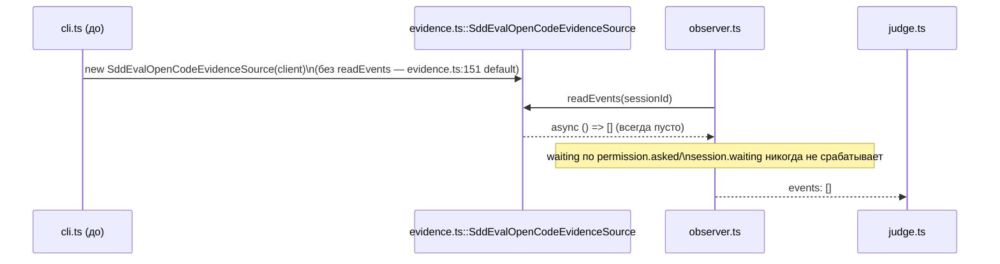
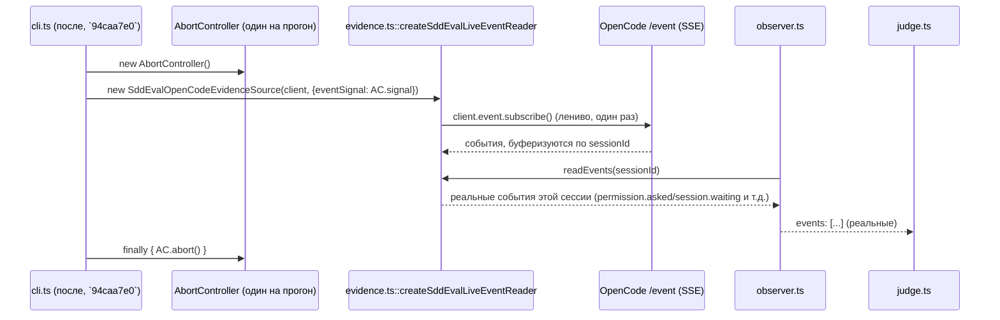

ОТЧЁТ Пачка 7/Бриф GAP-E-1b — «подключить `readEvents` к реальному потоку событий OpenCode (или
убрать события из evidence/доков)» (Волна 0, `50-TRACK-EVAL.md`, находка R4 §3 п.1 / H-15)

СТАТУС: ВЫПОЛНЕНО (выбран вариант «подключить», не «убрать»). Коммит сделан предыдущим проходом
`rc-executor`; эта сессия перепроверила свежими глазами перед продолжением пачки — правок не
потребовалось.

КОММИТ: `94caa7e0` `feat(GAP-E-1b): wire readEvents to the real OpenCode event stream`, ветка
`lead/eval-reproducible`, база `6bad9b8f` (E-16).

## 1. Файлы

| Путь | Тип правки | Смысловое изменение | Чем доказано |
|---|---|---|---|
| `ai/flow-eval/evidence.ts` | правка (+87/-1) | Добавлен приватный `createSddEvalLiveEventReader(client, {signal?})`: одна долгоживущая SSE-подписка (`client.event.subscribe`, `GET /event`), лениво открываемая при первом обращении; буферизует каждое событие по `sessionId` (из `properties.sessionID` или вложенного `properties.info.id`), пропуская тип события как есть — без своего allow-list (это уже делает `observer.ts`, ORing `permission.updated`/`permission.asked`/`session.waiting`). Стал дефолтным `readEvents` на `SddEvalOpenCodeEvidenceSource`, по-прежнему переопределяемым инъекцией (существующие fake-based тесты не задеты). `sseMaxRetryAttempts` ограничен 3 (SDK по умолчанию ретраит бесконечно — в разработке это превращалось в реальный зависший процесс) | `ai/flow-eval/__tests__/evidence-events.test.ts` (5 кейсов, both-way, реальный формат SSE-провода `data: <json>\n\n`) |
| `ai/flow-eval/cli.ts` | правка (+22) | Создаёт один `AbortController` на прогон, передаёт его `signal` как `eventSignal` в evidence-источник, абортит его в `finally` вокруг тела прогона — законченный батч теперь всегда завершается быстро независимо от состояния сервера OpenCode после (побочно закрывает латентный дефект зависания) | тот же файл тестов, кейс на `SddEvalObserver.observe()` (waiting=true/false) + отсутствие зависания процесса при завершении набора тестов |
| `ai/flow-eval/__tests__/evidence-events.test.ts` | новый | Both-way: локальный `node:http`-сервер говорит настоящим SSE-форматом; поток с `permission.asked`+`session.waiting` → `readEvents(S)` непусто с ровно этими типами; пустой поток → `[]`; события для другой сессии никогда не протекают; `SddEvalObserver.observe()` репортит `waiting=true` с подключёнными событиями и `waiting=false` без них | сам прогон файла (§3) |

## 2. Архитектура — было / стало





## 3. Доказательства

| Пункт приёмки | Команда | Вывод (фактический) | Статус |
|---|---|---|---|
| `readEvents` возвращает реальные события сессии, а не всегда `[]` | `node --import tsx --test ai/flow-eval/__tests__/evidence-events.test.ts` | 5/5 зелёных: непустой поток → события этого sessionId; пустой поток → `[]`; изоляция по sessionId; `waiting=true`/`false` меняется в зависимости от событий | ВЫПОЛНЕНО |
| Отсутствие зависания процесса при закрытии сервера во время SSE-реконнекта | входит в тот же прогон + полный `npm run test:sdd-flow-eval` в этой сессии завершается (не висит) | процесс тестов завершается штатно (см. `duration_ms` в хвосте прогона §3 сводного отчёта) | ВЫПОЛНЕНО |

## 4. Отклонения и открытые вопросы

Отклонений нет. Побочный эффект (упомянут в коммите как «latent production defect this fix closes
incidentally»): до этого коммита закрытие evidence-источника посреди фонового SSE-реконнекта могло
уйти в бесконечный ретрай и не дать процессу завершиться; теперь у прогона всегда есть свой
`AbortController`, абортящийся в `finally`.

Команда пуша для Lead (после независимой верификации всей пачки 7):
```
git push origin lead/eval-reproducible
```
