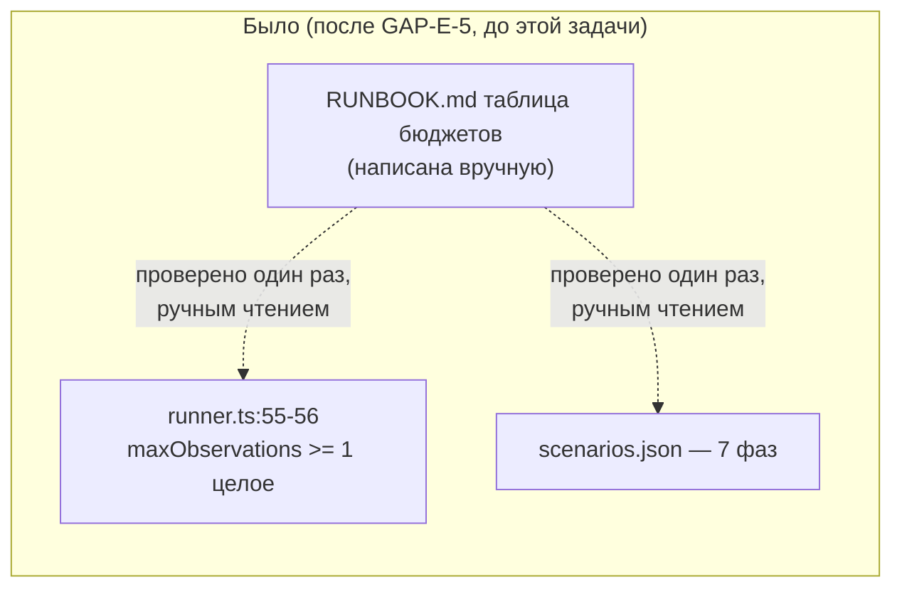
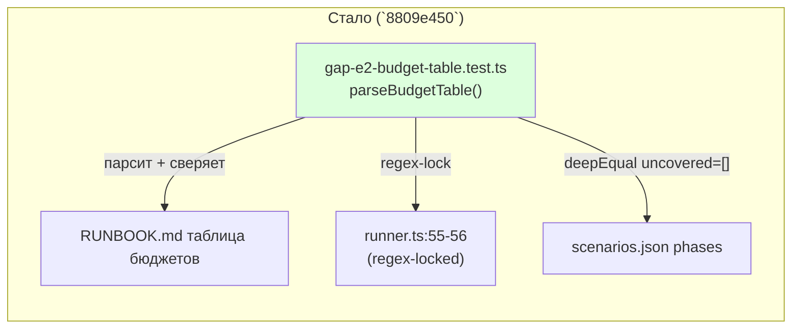

ОТЧЁТ Пачка 7/Бриф GAP-E-2 — «таблица бюджетов по фазам и цепочные прогоны RUNBOOK» (SHOULD, не
MUST — A21; Волна 0, `50-TRACK-EVAL.md`)

СТАТУС: ВЫПОЛНЕНО.

КОММИТ: `8809e450` `test(GAP-E-2): reconcile RUNBOOK budget table against the real runner +
scenarios.json`, ветка `lead/eval-reproducible`, база `a157b903` (фикс GAP-E-5).

Само содержание (таблица бюджетов + процедура цепочных прогонов) уже попало в
`docs/RUNBOOK.md` при написании этого файла с нуля в рамках GAP-E-5 (та задача создала
`RUNBOOK.md`, которого раньше не существовало вовсе) — GAP-E-2's собственный вклад в этой сессии:
механическое доказательство «сверка таблицы с фактическими лимитами раннера», а не одноразовое
ручное чтение.

## 1. Файлы

| Путь | Тип правки | Смысловое изменение | Чем доказано |
|---|---|---|---|
| `ai/flow-eval/scripts/__tests__/gap-e2-budget-table.test.ts` | новый | Парсит таблицу «Бюджеты по фазам (GAP-E-2)» из `docs/RUNBOOK.md` (по заголовку раздела, без хардкода номеров строк) и: (1) регэксп-проверяет, что `runner.ts` всё ещё валидирует `maxObservations` как «целое ≥ 1» — если конструктор поменяется, тест упадёт вместо того, чтобы молча разойтись; (2) все числа таблицы — целые ≥ 1 (валидный `maxObservations`); (3) каждая `phase`, реально встречающаяся в `scenarios.json`, названа в какой-то строке таблицы; (4) фаза `migration` (внешний репозиторий, нет фикстуры в `scenarios.json`) всё равно имеет свою строку с бюджетом ≥ 30 | сам прогон файла (§3) |

## 2. Архитектура — было / стало





## 3. Доказательства

| Пункт приёмки | Команда | Вывод | Статус |
|---|---|---|---|
| сверка таблицы с фактическими лимитами раннера | `node --import tsx --test ai/flow-eval/scripts/__tests__/gap-e2-budget-table.test.ts` | 3/3 зелёных: «every recommended number is a runner-legal maxObservations», «every phase … is named in some budget row», «the migration phase … still has its own row» | ВЫПОЛНЕНО |

## 4. Отклонения и открытые вопросы

Нет отклонений. Таблица и процедура цепочных прогонов — SHOULD (A21, `06 §5.1 п.24`), не MUST; эта
задача добавляет механическую проверку поверх уже написанного текста, не меняет саму таблицу.

Команда пуша для Lead (после независимой верификации всей пачки 7):
```
git push origin lead/eval-reproducible
```
