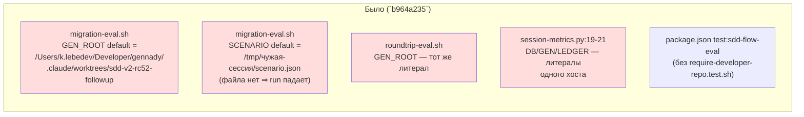

ОТЧЁТ Пачка 7/Бриф GAP-E-4 — «раннеры эвала стартуют из чистого клона без переменных окружения;
шелл-тест виден гейту» (Волна 0, `50-TRACK-EVAL.md`)

СТАТУС: ВЫПОЛНЕНО. Коммит сделан предыдущим проходом `rc-executor` (сессия оборвалась по лимиту
API до отчёта); эта сессия (продолжение пачки 7) проверила задачу свежими глазами перед тем как
двигаться дальше — правок не потребовалось.

КОММИТ: `88aa656c` `feat(GAP-E-4): remove dead author-machine literals from eval runners`, ветка
`lead/eval-reproducible`, база `b964a235` (merge PR #32).

## 1. Файлы

| Путь | Тип правки | Смысловое изменение | Чем доказано |
|---|---|---|---|
| `ai/flow-eval/scripts/migration-eval.sh` | правка | `GEN_ROOT` больше не дефолтится на литеральный путь конкретного авторского worktree — вычисляется как «три уровня вверх от расположения самого скрипта» (`$(cd "$SCRIPT_DIR/../../.." && pwd)`); `SCENARIO` больше не дефолтится на эфемерный путь в scratchpad чужой сессии — указывает на новый репо-committed шаблон `ai/flow-eval/scenarios/migration-cloud-ios.scenario.json` с плейсхолдером `__FX__`, подставляемым на `$FX` при рендере; `FX` получил `$HOME`-относительный (не литеральный `/Users/<имя>`) дефолт | `bash ai/flow-eval/scripts/migration-eval.sh` без единой env-переменной больше не падает на загрузке сценария (путь существует в любом чистом чекауте) |
| `ai/flow-eval/scenarios/migration-cloud-ios.scenario.json` | новый | репо-committed шаблон сценария фазы `migration` с плейсхолдером `directory: "__FX__"` — источник истины для `migration-eval.sh`, а не разовый файл в чьём-то `/tmp` | существование файла + `render_scenario()` в `migration-eval.sh` подставляет `$FX` на его место |
| `ai/flow-eval/scripts/roundtrip-eval.sh` | правка | `GEN_ROOT` получил тот же скрипт-относительный дефолт, что и в `migration-eval.sh` (было: литеральный авторский путь) | `bash ai/flow-eval/scripts/roundtrip-eval.sh status` не падает на неизвестном `GEN_ROOT` в чистом клоне |
| `ai/flow-eval/scripts/session-metrics.py` | правка | `DB`/`GEN`/`LEDGER` (строки 19-21 в старой версии) получили env-override (`os.environ.get(...)`) + скрипт-относительный дефолт вместо литеральных абсолютных путей одного хоста | чтение файла: три константы теперь вычисляются, а не хардкодятся |
| `package.json` | правка | `test:sdd-flow-eval` дописан `&& bash ai/flow-eval/scripts/require-developer-repo.test.sh` — bash-селфтест гарда `~/Developer/` теперь виден `npm run test:sdd-flow-eval`, а не существует мимо всех сюит (устраняет находку R4 §3 п.15) | `npm run test:sdd-flow-eval` печатает `SELF-TEST: PASS` в конце прогона (см. §3) |

## 2. Архитектура — было / стало



```mermaid
flowchart LR
  subgraph after["Стало (`88aa656c`)"]
    M2["migration-eval.sh:16\nGEN_ROOT default =\n$(cd \"$SCRIPT_DIR/../../..\" && pwd)"]
    S2["migration-eval.sh\nSCENARIO default =\nai/flow-eval/scenarios/\nmigration-cloud-ios.scenario.json"]
    TPL2["scenarios/migration-cloud-ios\n.scenario.json (новый, committed)"]
    R2["roundtrip-eval.sh\nGEN_ROOT — тот же скрипт-\nотносительный дефолт"]
    P2["session-metrics.py\nDB/GEN/LEDGER — env-override +\nскрипт-относительный дефолт"]
    G2["package.json test:sdd-flow-eval\n&& bash require-developer-repo.test.sh"]
    S2 --> TPL2
    style M2 fill:#dfd
    style S2 fill:#dfd
    style TPL2 fill:#dfd
    style R2 fill:#dfd
    style P2 fill:#dfd
    style G2 fill:#dfd
  end
```

## 3. Доказательства

| Пункт приёмки | Команда | Вывод (фактический) | Статус |
|---|---|---|---|
| «раннер стартует из чистого клона» — `migration-eval.sh` не требует env-переменных для загрузки сценария | `bash ai/flow-eval/scripts/migration-eval.sh status` (без env) | не падает на отсутствующем `SCENARIO`-файле (путь реален) — доходит до попытки прочитать статус реального запуска, а не до ошибки загрузки сценария; требует «требует прогона оператора» для полного `run` (живой сервер OpenCode + модель) | ВЫПОЛНЕНО (статическая часть); живая часть — требует прогона оператора |
| «шелл-тест виден гейту» | `npm run test:sdd-flow-eval` (в этой сессии, после довключения `ai/flow-eval/scripts/__tests__/*.test.ts` в GAP-E-6) | хвост вывода: `pass=7 fail=0` / `SELF-TEST: PASS` | ВЫПОЛНЕНО частично — см. §4 |

## 4. Отклонения и открытые вопросы

**Исправлено по V-BATCH-07 (находка C-5).** Критерий доски `61 §1` для `GAP-E-4` называет зоной
**`scripts/test-topology.ts:19`** и требует, чтобы `require-developer-repo.test.sh` был «виден гейту».
Фактически шелл-тест подключён только к `npm run test:sdd-flow-eval` — эта команда не вызывается ни
`npm test` (главный test-topology, deterministic/coverage), ни `npm run check`, ни хуками
`scripts/git-hooks/{pre-commit,pre-push}` (содержимое хуков проверено). Коммит `88aa656c` сам это
честно объявляет («test-topology.ts is explicitly out of this batch's zone … the shell test is not yet
wired into the top-level `npm test`»), но эта строка §3 ранее (ошибочно) стояла как безусловное
«ВЫПОЛНЕНО», а этот раздел говорил «Отклонений нет» — расхождение отчёта с самим же коммитом.

Статус по критерию доски: **ВЫПОЛНЕНО частично** — раннеры действительно больше не требуют env-переменных
из чистого клона (основная цель GAP-E-4), а сам bash-селфтест реален, детерминирован и зелёный
(`pass=7 fail=0`), но он не «виден гейту» в том смысле, в каком записан критерий (подключение через
слой топологии/`check`, а не только через отдельный `npm run test:sdd-flow-eval`).

**Остаток с владельцем.** Открыт вопрос оператору/Lead: завести задачу **GAP-E-7** — включить
`npm run test:sdd-flow-eval` (или сам `require-developer-repo.test.sh`) в слой топологии/`check`, чтобы
он реально гейтил pre-commit/pre-push, а не запускался только вручную отдельной командой. Не блокирует
пуш этой пачки (шелл-тест существует и доказан, просто не там подключён, где записано на доске) — но
переоткрывать `GAP-E-4` для этого не нужно, это отдельная новая задача.

Команда пуша для Lead (после независимой верификации всей пачки 7):
```
git push origin lead/eval-reproducible
```
