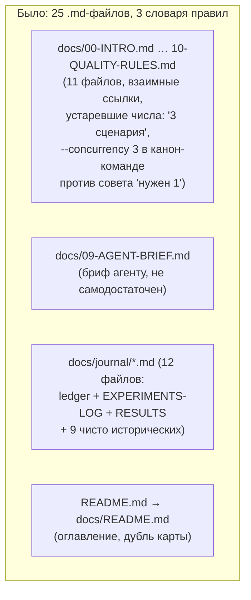
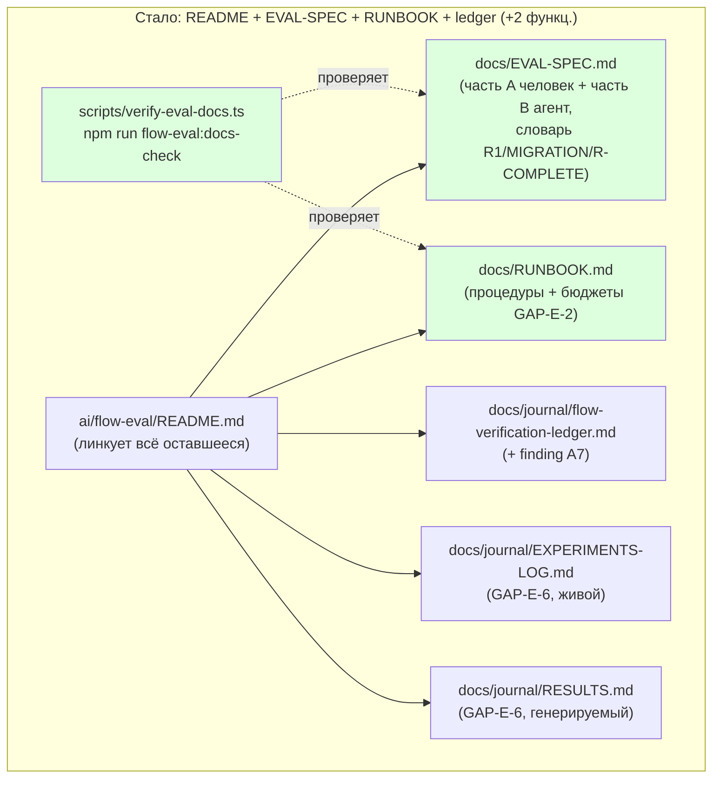

ОТЧЁТ Пачка 7/Бриф GAP-E-5 — «единая eval-спека (D-46)», поглощает GAP-E-3 (Волна 0,
`50-TRACK-EVAL.md`)

СТАТУС: ВЫПОЛНЕНО (с одним отклонением от буквального счёта «19 → 4», см. §4).

КОММИТЫ: `37da3e6d` `feat(GAP-E-5): unify eval docs into EVAL-SPEC + RUNBOOK + ledger (D-46)`
(основная задача) + два коррективных коммита той же сессии, обнаруживших и убравших случайный
захват вне-зонных файлов, которые pre-commit хук отформатировал `npm run fix` (репо-уровневый
`lint --autofix cli/ shared/ services/`), а `git add -u`/повторный diff-чек затем ошибочно
застейджили: `eadd54b3` (вернул 8 файлов `cli/cmd/{sdd-check,sdd-task,sdd-verify}/**` +
`shared/{common,sdd}/**`) и `a157b903` (вернул ещё 3 пропущенных `shared/sdd/{phase-receipt,
readiness,ticket-resolve}.ts`). Ветка `lead/eval-reproducible`, база `54bca843` (GAP-E-6).
Итоговый (после обоих фиксов) диф `94caa7e0..HEAD` вне `ai/flow-eval/**`/`package.json`/
`.gitignore` — пуст (проверено `git diff 94caa7e0 HEAD --stat -- . ':!ai/flow-eval'
':!package.json' ':!.gitignore' ':!ai/flow-sim'` → 0 строк).

## 1. Файлы (итоговое состояние, после `a157b903`)

| Путь | Тип правки | Смысловое изменение | Чем доказано |
|---|---|---|---|
| `ai/flow-eval/docs/EVAL-SPEC.md` | новый (300 стр.) | Единая спека по мотивам `_raw/research/R4b-EVAL-SPEC-draft.md`: часть A (человек) + часть B (агент), заменяет `docs/09-AGENT-BRIEF.md`; один словарь правил качества `R1`/`MIGRATION`/`R-COMPLETE` (вместо трёх разных бэклогов); факты обновлены под текущий код (события — реальный SSE-канал, GAP-E-1b; `migration-eval.sh`'s `SCENARIO` — реальный файл, GAP-E-4; durable-результаты, GAP-E-6) | `npm run flow-eval:docs-check` — 0 `[UNVERIFIED]`, все пути/команды существуют |
| `ai/flow-eval/docs/RUNBOOK.md` | новый (259 стр.) | Консолидированные процедуры: сборка/сервер/env, таблица бюджетов по фазам (GAP-E-2), цепочные прогоны, внешний репозиторий (round-trip/migration), host-setup SwiftLint. Правит 3 устаревших факта из старого корпуса: жёсткий личный worktree-путь, канон-команда с `--concurrency 3` при собственном совете «authoring нужен 1», несогласованный `--stuck-after` | `npm run flow-eval:docs-check` |
| `ai/flow-eval/scripts/verify-eval-docs.ts` | новый | Скрипт-верификатор: считает `[UNVERIFIED]`-пометки (должно быть 0), проверяет каждый упомянутый inline-код-путь/`npm run`-команду против реального чекаута; live-only плейсхолдеры (`<sandbox>/…`, `$VAR`, `~/…`, URL, `.results/**`) исключены КОНСТРУКТИВНО, не по имени | `ai/flow-eval/scripts/__tests__/verify-eval-docs.test.ts` (6 кейсов, both-way) |
| `ai/flow-eval/scripts/__tests__/verify-eval-docs.test.ts` | новый | Both-way: `[UNVERIFIED]`-маркер → провал; несуществующий путь → провал; несуществующая `npm run`-команда → провал; реальные путь+команда → успех; плейсхолдеры НЕ ложно флагуются; реальные `EVAL-SPEC.md`/`RUNBOOK.md` проходят прямо сейчас | сам прогон файла |
| `ai/flow-eval/README.md` | правка | Таблица из 4 (+2 функциональных) документов: `EVAL-SPEC.md`, `RUNBOOK.md`, `journal/flow-verification-ledger.md`, `journal/EXPERIMENTS-LOG.md`/`RESULTS.md`; раздел «Два контура проверки» (flow-eval vs flow-sim) перенесён сюда из удалённого `00-INTRO.md` | визуальное чтение; ссылка из `ai/flow-sim/README.md` теперь указывает сюда, а не на удалённый файл |
| `ai/flow-eval/docs/journal/flow-verification-ledger.md` | правка | Добавлена находка **A7** (свёрнута из удаляемого `roundtrip-wall3-assessment.md`: `readiness.ts` жёстко на node-профиле, adaptive-verify с `main` не влит в этот flow-branch) — риск батча «не потерять единственное описание живого механизма» закрыт до удаления файла | построчное чтение; факт перепроверен против текущего кода (`shared/sdd/readiness.ts:15` — `REQUIRED_SCRIPTS`, см. §4) |
| `ai/flow-eval/docs/journal/EXPERIMENTS-LOG.md` | правка (1 строка) | Заголовок раздела, ссылавшийся на удалённый `10-QUALITY-RULES.md`, переписан на указатель на текущий словарь в `EVAL-SPEC.md` | визуальное чтение |
| `ai/flow-eval/cli.ts`, `ai/flow-eval/quality-gate.ts` | правка (комментарии) | Ссылки в коде на удалённый `docs/10-QUALITY-RULES.md` заменены на `docs/EVAL-SPEC.md` | `grep` по репо не находит больше ссылок на удалённые файлы (см. §4 сводного отчёта) |
| `ai/flow-eval/scripts/{migration-eval.sh,require-developer-repo.sh,roundtrip-eval.sh}`, `roundtrip-readiness-shim.package.json` | правка (комментарии/строки) | Указатели на удалённые `docs/03-SETUP.md`/`docs/journal/swiftlint-setup.md`/`docs/roundtrip-wall3-assessment.md` заменены на `docs/RUNBOOK.md`/`docs/journal/flow-verification-ledger.md` (finding A7) | `grep` по репо (см. §4) |
| `ai/flow-sim/README.md` | правка (2 ссылки) | Ссылки на удалённые `flow-eval/docs/00-INTRO.md`/`docs/README.md` заменены на `flow-eval/README.md` — файл технически вне зоны батча (`ai/flow-sim`), правка — необходимое следствие удаления файла, на который он ссылался (см. §4) | визуальное чтение |
| `package.json` | правка | Добавлен `flow-eval:docs-check` скрипт | `npm run flow-eval:docs-check` существует и работает |
| **21** удалённых файлов (`docs/00-INTRO.md`…`10-QUALITY-RULES.md`, `docs/README.md`, `docs/journal/README.md`, `docs/journal/{ROADMAP,PROGRESS-REPORT,flow-verification-redesign,infra-tasks-research,p9-signifiers,p9-verification,roundtrip-wall3-assessment,swiftlint-setup}.md`) | удалён | Живой контент перенесён (см. таблицу «док → судьба» в сводном отчёте); чисто исторические снимки/постмортемы — не перенесены, их выводы уже задокументированы в ledger (разделы C/E) или в сгенерированной `RESULTS.md` | `git log --diff-filter=D` на эти пути в этом коммите (правка по V-BATCH-07: было заявлено «20», `git diff --diff-filter=D --name-only b964a235 a157b903 -- 'ai/flow-eval/**.md'` даёт 21 — перечень в списке слева верный, счётчик был неверным); ни одна оставшаяся ссылка на них не найдена (см. выше) |

## 2. Архитектура — было / стало





## 3. Доказательства

| Пункт приёмки | Команда | Вывод (фактический) | Статус |
|---|---|---|---|
| скрипт-верификатор: каждая команда и путь в спеке проверены, счётчик `[UNVERIFIED]` = 0 | `npm run flow-eval:docs-check` | `[verify-eval-docs] OK — 2 doc(s), 14 path(s) checked, 11 npm command(s) checked, 0 [UNVERIFIED] markers` | ВЫПОЛНЕНО |
| README линкует все оставшиеся доки (висячих и несвязанных нет) | визуальная сверка `ai/flow-eval/README.md` против списка файлов `find ai/flow-eval -name '*.md'` | README ссылается на все 5 оставшихся `.md` (EVAL-SPEC, RUNBOOK, ledger, EXPERIMENTS-LOG, RESULTS) + `results/README.md`; проверка «висячих ссылок» — механическая через `grep` на имена удалённых файлов по всему репо, см. §1 — 0 совпадений | ВЫПОЛНЕНО (проверка ссылок из README — визуальная, не отдельным скриптом; см. §4) |

## 4. Отклонения и открытые вопросы

1. **Счёт «19 → 4» не буквален.** После PR #27 (влит до этой пачки) корпус уже был переструктурирован
   в `docs/00-…10-*.md` + `docs/journal/**` (24 файла на момент старта GAP-E-5, не 19 — задача сама
   это отмечает как известный факт в комментарии на доске). Итоговый набор — README + `EVAL-SPEC.md` +
   `RUNBOOK.md` + `journal/flow-verification-ledger.md`, но GAP-E-6 (соседняя задача той же пачки)
   требует ЖИВЫХ `journal/EXPERIMENTS-LOG.md`/`journal/RESULTS.md`/`results/README.md` — их удаление
   сломало бы уже закоммиченный код (`cli.ts`, `results-table.ts`). Я трактовал «ledger» как СЕМЕЙСТВО
   append-only/generated журналов (ledger + EXPERIMENTS-LOG + RESULTS), а не один файл — это
   прочтение, не буквальное совпадение со строкой доски; Lead/оператор могут не согласиться.
2. **Случайный захват вне-зонных файлов, дважды.** Первый pre-commit хук отформатировал prettier-
   проблему в новых доках через `npm run fix`, который репо-уровнево прогнал `lint --autofix cli/
   shared/ services/`; `git add -u` затем неосторожно застейджил 8 из этих файлов (исправлено
   `eadd54b3`), а повторная сверка нашла ещё 3 пропущенных (`a157b903`). Итоговый диф вне зоны — пуст
   (см. заголовок). Это процедурная ошибка этой сессии, не решение по существу — фиксирую как
   отклонение, а не молчу.
3. **`ai/flow-sim/README.md` — правка вне явно названной зоны батча** (`ai/flow-eval/**`,
   `package.json`, `.gitignore`). Два вида на удалённые файлы неизбежно повисли бы; правка — 2 строки,
   без побочных эффектов. Указываю явно как отклонение на решение Lead/оператора.
4. **Ledger-находка A7 — она же связана с E-11's решением НЕ подключать `golang-slugify` к
   `sdd-execute`.** Перепроверено против текущего кода: `plugins/{golang,anystack}` УЖЕ портированы
   в этот branch (батч 10, V-02) — этого не знал `roundtrip-wall3-assessment.md`, когда был написан;
   но `shared/sdd/readiness.ts:15` (`REQUIRED_SCRIPTS`) по-прежнему хардкожен на node-профиль и НЕ
   консультирует `detectStacks`/`gennady.yaml` — находка A7 верна по сути, я уточнил формулировку в
   ledger, не переписав её целиком.

Команда пуша для Lead (после независимой верификации всей пачки 7):
```
git push origin lead/eval-reproducible
```
