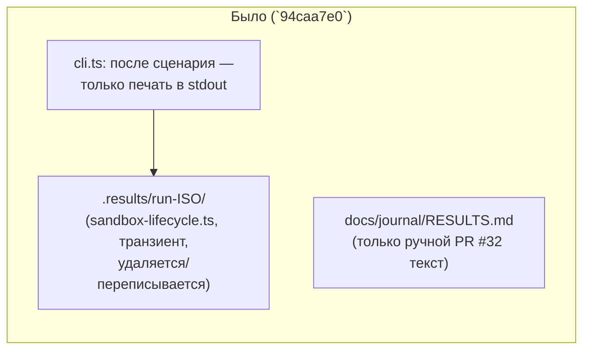
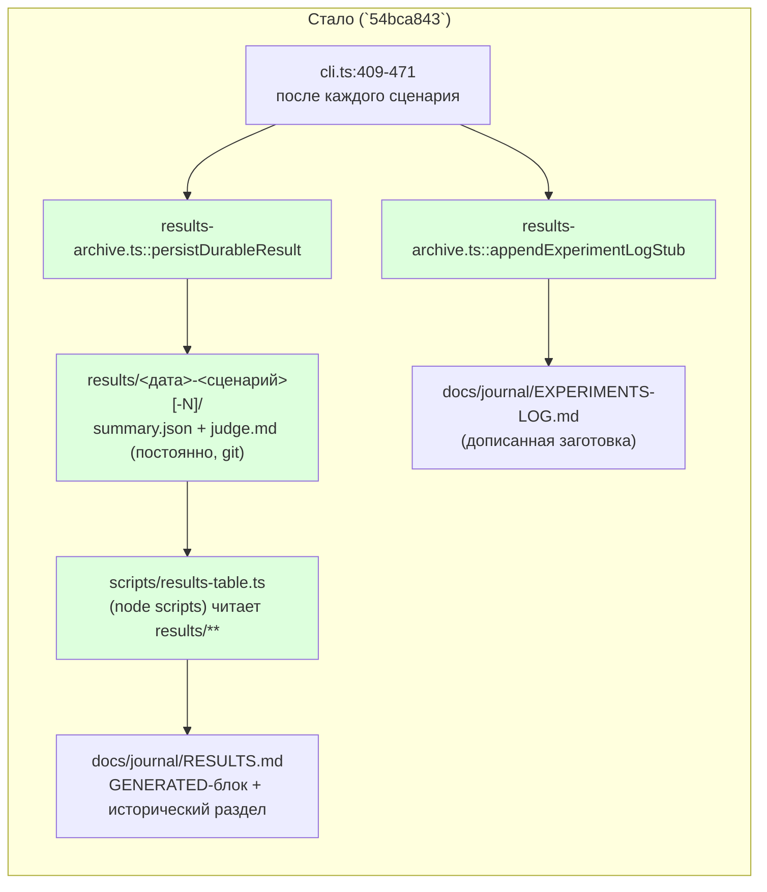

ОТЧЁТ Пачка 7/Бриф GAP-E-6 — «результаты эвалов в репозитории» (D-62, PR #32; Волна 0,
`50-TRACK-EVAL.md`)

СТАТУС: ВЫПОЛНЕНО.

КОММИТ: `54bca843` `feat(GAP-E-6): durable per-scenario results archive + generated RESULTS.md
table`, ветка `lead/eval-reproducible`, база `94caa7e0` (GAP-E-1b). Продолжение задачи,
начатой предыдущим проходом `rc-executor` (10 незакоммиченных файлов в дереве, последний шаг —
«un-export две функции в `results-table.ts`, переписать тест на запуск скрипта как подпроцесса»);
эта сессия довела un-export/подпроцесс-тест, добавила недостающее подключение теста к гейту и
закоммитила.

## 1. Файлы

| Путь | Тип правки | Смысловое изменение | Чем доказано |
|---|---|---|---|
| `ai/flow-eval/results-archive.ts` | новый | `persistDurableResult(resultsRoot, summary, {judgeFile?})` — пишет `results/<дата>-<сценарий>[-N]/summary.json`+`judge.md`, никогда не перезаписывая тот же день/сценарий (суффикс `-N`); `readAllDurableSummaries` читает все записи, пропуская битые; `resolveGitSha`; `appendExperimentLogStub` — одна заготовка-запись на прогон в `EXPERIMENTS-LOG.md`, append-only, best-effort (не роняет прогон, если файла журнала нет) | `ai/flow-eval/__tests__/results-archive.test.ts` (14 кейсов) |
| `ai/flow-eval/cli.ts` | правка (+91) | После каждого сценария: резолвит `sha` один раз на батч, собирает `SddEvalDurableSummary` (verdict/status/outcome/actions/durationMs/usage/quality/specFiles/бюджет), вызывает `persistDurableResult` (печатает `results → <path>`) и `appendExperimentLogStub`; оба — best-effort (ошибка логируется, не роняет прогон). Новые флаги `--results-dir`/использует существующий `--artifacts-dir` для транзиентного дерева | `ai/flow-eval/__tests__/results-archive.test.ts`, ручной прогон `sdd-flow-eval --help` показывает `--results-dir` в usage |
| `ai/flow-eval/scripts/results-table.ts` | новый | Регенерирует GENERATED-блок `docs/journal/RESULTS.md` из `results/**/summary.json` (медиана по сценарию: действия/время/токены, механический статус — «Проходит»/«Не проходит»/«Смешанно»/«budget-exhausted», никогда не изобретённая проза); CLI: `[--results-dir D] [--out F] [--check]` — `--check` только проверяет (exit 1 при диффе), не пишет. `renderGeneratedBlock`/`spliceGeneratedBlock` НЕ экспортированы (единственное использование — внутри файла) | `ai/flow-eval/scripts/__tests__/results-table.test.ts` (обе группы, both-way на замороженных фикстурах + freshness-тест на реальном `RESULTS.md`) |
| `ai/flow-eval/scripts/__tests__/results-table.test.ts` | новый | Both-way на СКОНСТРУИРОВАННЫХ фикстурах `summary.json` (не живой LLM): один прогон → точные числа; смена `actions` → другая таблица; два прогона → count=2 + медиана; смешанный pass/fail → «Смешанно: pass 1/2»; пустой каталог → плейсхолдер; сплайс трогает только маркированный блок; отсутствие маркеров → падает с текстом «markers not found». Тест приводит скрипт как РЕАЛЬНЫЙ подпроцесс (`--results-dir`/`--out`/`--check`), а не импортирует внутренности — обе функции-хелперы приватны | сам прогон файла (§3) |
| `ai/flow-eval/docs/journal/RESULTS.md` | правка | Новый раздел «Постоянные результаты (GAP-E-6, D-62)» с GENERATED-блоком (сейчас: «Пока нет ни одного постоянного результата»); исторический раздел PR #32 сохранён целиком, помечен «Исторические данные … до GAP-E-6» — формат таблицы и числа не потеряны | `npm run results:table:check` → `up to date (no diff)` |
| `ai/flow-eval/docs/journal/EXPERIMENTS-LOG.md` | правка | Раздел «Правило записи на прогон (GAP-E-6, D-62)» — шаблон заготовки, объясняет автоматическое дописывание | визуальное чтение + сам механизм протестирован в `results-archive.test.ts` |
| `ai/flow-eval/results/README.md` | новый | Объясняет формат `results/<дата>-<сценарий>[-N]/`, отличие от `.results/` (транзиент), ссылки на генератор/шаблон | — (документация) |
| `.gitignore` | правка | Комментарий над `ai/flow-eval/.results/` уточнён: это ТОЛЬКО транзиентный батч-каталог, НЕ `results/` (постоянный, не игнорируется) | построчное чтение + `results/README.md` существует и закоммичен |
| `ai/flow-eval/__tests__/results-archive.test.ts` | новый | Юнит-покрытие `persistDurableResult`/`readAllDurableSummaries`/`resolveGitSha`/`appendExperimentLogStub` — 14 кейсов | сам прогон файла |
| `package.json` | правка | `results:table`/`results:table:check` скрипты; `test:sdd-flow-eval`'s glob расширен на `ai/flow-eval/scripts/__tests__/*.test.ts` — ДО этой правки тесты в этой директории (включая уже существовавшие `check-fixture-hygiene.test.ts` из E-16 и `sdd-check-baseline-compare.test.ts`) не запускались НИКАКИМ npm-скриптом | `npm run test:sdd-flow-eval` теперь показывает суиты из `scripts/__tests__/` в своём выводе (было 0, стало все) |

## 2. Архитектура — было / стало





## 3. Доказательства

| Пункт приёмки | Команда | Вывод | Статус |
|---|---|---|---|
| both-way на замороженном summary.json: генератор даёт ожидаемую таблицу, изменение числа → дифф | `node --import tsx --test ai/flow-eval/scripts/__tests__/results-table.test.ts` | 7/7 зелёных (см. лог этой сессии: `ok 51`, 7 кейсов) | ВЫПОЛНЕНО |
| регенерация без диффа как тест свежести | `npm run results:table:check` | `[results-table] up to date (no diff)` | ВЫПОЛНЕНО |

## 4. Отклонения и открытые вопросы

Отклонение от буквы задачи-«продолжения»: предыдущий проход оставил `results-table.ts`'s
`renderGeneratedBlock`/`spliceGeneratedBlock` экспортированными и тест — импортирующим их напрямую;
эта сессия убрала экспорт (YAGNI — одно использование внутри файла) и переписала тест на реальный
подпроцесс, как и было указано последним шагом предыдущего прохода. Дополнительно (не было явно в
брифе, но необходимо для честности приёмки): расширила glob `test:sdd-flow-eval` на
`ai/flow-eval/scripts/__tests__/*.test.ts` — без этого ни один тест в этой директории (в т.ч. уже
существовавшие из E-16 и более ранних задач) не попадал ни в один npm-гейт.

Команда пуша для Lead (после независимой верификации всей пачки 7):
```
git push origin lead/eval-reproducible
```
