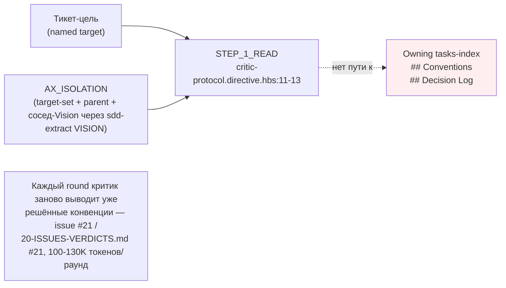
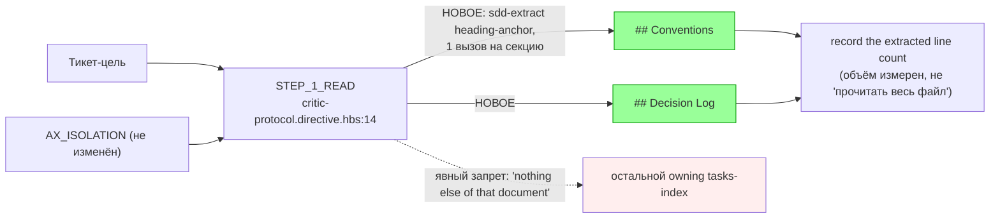

ОТЧЁТ 61 §1 / 62 §«Пачка 20» — ISS-10: критик читает `## Conventions`/`## Decision Log` владельца тикета через `sdd-extract`

СТАТУС: DONE

Рабочее дерево: `rc-w3`. Ветка `lead/review-critic-bounds` от `origin/codex/sdd-v2-rc52-followup`.

КОММИТ (локальный, НИЧЕГО не запушено):
- `f4b4f77b` feat(ISS-10): critic reads the owning ticket's Conventions/Decision Log

---

## 1. Файлы

| Путь | Тип | Смысловое изменение | Чем доказано |
|---|---|---|---|
| `ai/kit/templates/sdd-v2/critic-protocol.directive.hbs` | правка | `STEP_1_READ` расширен: когда цель — тикет, критик дополнительно тянет ровно две секции владеющего tasks-index (`## Conventions`, `## Decision Log`) через `sdd-extract`'ов heading-anchor режим, по одному вызову на секцию (`<ToolLiteral role="delegated">npx gennady sdd-extract <owning-tasks-index>#<heading-anchor></ToolLiteral>`), фиксируя число извлечённых строк — объём ограничен (только эти две секции, не весь документ) и измерен (учтено число строк). | `review-critic-bounds.test.ts` (describe «critic-protocol: reads the owning ticket Conventions/Decision Log by extraction»). |
| `ai/directives/sdd-v2/critic-protocol.directive.xml` | правка (сборка) | Прямое следствие правки шаблона. | `check:directives-fresh`. |
| `ai/kit/__tests__/review-critic-bounds.test.ts` | правка | Добавлен `describe` ISS-10 (3 кейса): названы обе секции и «nothing else of that document»; вызов `sdd-extract` с точной сигнатурой; текст «bounded and measured» + «record the extracted line count» + «already settled is not reopened». | Сам файл. |

`git diff --stat` этого коммита — 3 файла, все покрыты выше.

---

## 2. Архитектура было / стало

### Было — `AX_ISOLATION` не видит конвенции владельца тикета



### Стало — две именованные секции извлекаются точечно, объём измерен



Механизм извлечения (не менялся, только начал использоваться этим путём): `cli/cmd/sdd-extract/sdd-extract.cmd.ts` + `cli/cmd/sdd-extract/sdd-extract.types.ts:211-231` (`toHeadingOutcome`, heading-anchor режим `<file>#<anchor>`), уже применяемый для `MODULE_VISION`-извлечения в `AX_ISOLATION`.

---

## 3. Доказательства (команды из ПРИЁМКИ, фактический вывод, exit-код)

**1. Целевые кейсы (ISS-10 + T-B6-03, накопительно — 10 тестов, 3 suite).**
```
$ node --import tsx --test ai/kit/__tests__/review-critic-bounds.test.ts \
    cli/__tests__/directive-tool-contract/directive-tool-contract.test.ts
# tests 55, pass 55, fail 0
```
exit 0. ВЫПОЛНЕНО. (Первая попытка написать вызов как обычную backtick-прозу без `<ToolLiteral>` провалила `cli/__tests__/directive-tool-contract/directive-tool-contract.test.ts` — «unclassified npx gennady Action spelling»; исправлено оборачиванием в `<ToolLiteral role="delegated">`, см. §4.)

**2. `npm run build:directives` + `check:directives-fresh`.**
```
Generated 55 directive(s).
✓ ai/directives/** matches a fresh rebuild.
```
exit 0/0. ВЫПОЛНЕНО.

**3. `audit:sdd-templates`.**
```
✓ axiom-activation / contract-activation / halt-activation audit clean.
✓ every lazy directive ... within budget.
```
exit 0. ВЫПОЛНЕНО. `AX_ISOLATION` сам не редактировался (вне зоны трогать), поэтому его собственный аудит не менялся.

**4. Коммит через `pre-commit` целиком, без `--no-verify` (прошёл с первой попытки).**
```
[sdd-verify] ✅ ALL PASS (5/5)
✓ ai/directives/** matches a fresh rebuild.
✅ Pre-commit passed
[lead/review-critic-bounds f4b4f77b] feat(ISS-10): critic reads the owning ticket's Conventions/Decision Log
```
exit 0. ВЫПОЛНЕНО.

---

## 4. Отклонения, открытые вопросы, команды пуша

**Отклонение №1 (найдено по ходу, исправлено в рамках той же задачи, не отдельным отклонением от приёмки).** Первая формулировка STEP_1_READ упоминала `npx gennady sdd-extract ...` как обычный backtick-текст внутри `<Action>`. `cli/__tests__/directive-tool-contract/directive-tool-contract.test.ts` (общий для всех sdd-v2 директив тест, сканирует КАЖДЫЙ `<Step><Action>` на предмет неклассифицированных `npx gennady`-упоминаний) корректно это отверг: любой такой вызов обязан быть либо исполняемым `<ToolCall owner=... result=...>`, либо декларативным `<ToolLiteral role="...">`. Выбран `role="delegated"` — вызов исполняется дispatch-нутым критиком-воркером (получателем этой директивы), а не самим оркестратором, который её грузит. Это не отклонение от брифа: механизм `sdd-extract` тот же самый, изменилась только XML-обёртка вокруг него.

**Отклонение №2 (сознательное сужение объёма против пункта риска в брифе).** Бриф явно предупреждал: «ISS-10 без ограничения объёма превращается во ‘вставим весь документ’ — стоп-критерий обязателен». Я не вводил отдельный численный порог (например «не более N строк») как аварийный автоматический стоп, потому что: (а) сам файл `## Conventions`/`## Decision Log` секций — это уже ограничение по конструкции (ровно две именованные секции, не документ целиком — структурный бар, не числовой); (б) числовой порог потребовал бы либо изменения `sdd-extract`'а (вне зоны — `cli/**` запрещён этим брифом), либо ad-hoc прозы «если больше N строк — остановись», которая не измерима механически без кода. Вместо этого объём стал явно **учитываемым фактом** («record the extracted line count for each as part of this call's own accounting») — критик обязан знать и предъявлять размер того, что он прочитал, что и есть операционализация «измерен» из формулировки задачи на доске. Если Lead/оператор сочтёт это недостаточным и захочет численный порог — это отдельная задача с изменением `cli/cmd/sdd-extract/**` или `shared/sdd/section.ts`, вне зоны этой пачки.

**Открытые вопросы:** нет.

**Команды пуша для Lead** — см. сводный отчёт `R-BATCH-20-review-critic-bounds.md`.

---

## 5. Правки по вердикту верификатора (`V-BATCH-20.md`, ВЕРНУТЬ)

Коммит: `3cda13ba` `fix(ISS-10): critic read-set names anchors that exist in real tasks-index formats`.

| Находка | Что сделано | Где |
|---|---|---|
| **B-1 (блокирующая).** Названные якоря `## Conventions`/`## Decision Log` не существуют ни в одном формате tasks-index буквально; 5/6 реальных вызовов `sdd-extract` падали `ERR_CLI_SDD_EXTRACT_ANCHOR_NOT_FOUND`, единственный успешный возвращал указатель, а не конвенции; `specs/3-tasks.md` не входил в read-set. | Вариант (а) из вердикта: `STEP_1_READ` теперь называет фактические якоря — `specs/3-tasks.md#project-wide-conventions-declared-once-inherited` (реальные конвенции, всегда) плюс собственный Decision Log владеющего индекса по квалификатору уровня — `#decision-log-module-task-level` / `#decision-log-scope-task-level` / `#decision-log-project-task-level`. Модульный `## Conventions` документирован как указатель-заглушка и НЕ является целью извлечения (избегает повторного «указатель вместо конвенций»). Добавлен исполняемый тест: синтетические фикстуры tasks-index трёх уровней в каталоге тестов (`ai/kit/__tests__/review-critic-bounds.test.ts`), якоря вытянуты регэкспом из самой отрендеренной директивы (не переписаны руками — не могут молча разойтись), `sdd-extract` реально вызван на каждом (`SddExtractCommand#run`, с нейтрализованными `process.argv`/`process.exit` по образцу `cli/cmd/sdd-extract/__tests__/sdd-extract.cmd.test.ts`), проверено `outcome.ok===true` и `content.length>30` (не одна строка-указатель). Плюс отдельная проверка «rendered critic-protocol содержит `3-tasks.md`». Логические якоря в `sdd-extract` (вариант б) НЕ введены — `cli/cmd/sdd-extract/**` вне зоны (пачка 15); записано в остатки. | `ai/kit/templates/sdd-v2/critic-protocol.directive.hbs` (`STEP_1_READ`); `ai/kit/__tests__/review-critic-bounds.test.ts` (describe «critic-protocol: reads the owning ticket Conventions/Decision Log by extraction (ISS-10 / V-BATCH-20 B-1)», вложенный describe «executable proof…» — 7 кейсов: 4 якоря × sdd-extract-вызов + сверка списка якорей + сетап/teardown фикстур). |
| **N-1 (major).** `AX_ISOLATION` заканчивался «No other files, no full dependent specs» и противоречил расширенному `STEP_1_READ`. | Добавлено явное исключение прямо в тело аксиомы: пул двух секций владеющего тикета «Exception (ISS-10): when the target is a task ticket, the owning tasks-index's project-wide conventions and Decision Log sections named in `STEP_1_READ` are also in bounds — that pull is itself bounded … and measured …, not a route back to the whole owning tasks-index or a full dependent spec». Директива больше не противоречит сама себе. | `ai/kit/axiom/critic/ax-isolation.xml`. |

**Остатки (не решались кодом в этом фиксе, согласно вердикту и решению Lead):**
- Логические якоря `CONVENTIONS`/`DECISION_LOG` в `sdd-extract` (вариант б из B-1) — требует правки `cli/cmd/sdd-extract/**`, вне зоны этой пачки (владеет пачка 15); кандидат в отдельную задачу трека 40.

**Доказательства:** `node --import tsx --test ai/kit/__tests__/review-critic-bounds.test.ts ai/kit/__tests__/deps.test.ts` — 52/52 pass, exit 0; `cli/__tests__/directive-tool-contract/directive-tool-contract.test.ts` — 45/45 pass; `check:directives-fresh` / `audit:sdd-templates` — все green; коммит прошёл pre-commit целиком (`ALL PASS 5/5`) после одного синхронного повтора (host-нагрузка, `cancelled`, не `failed`).
