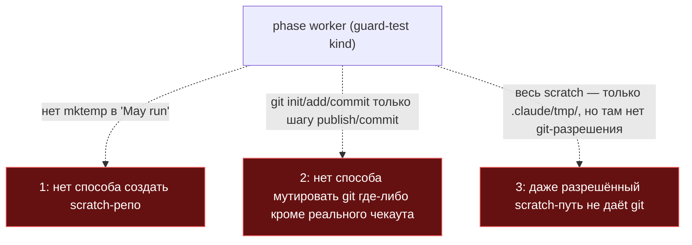
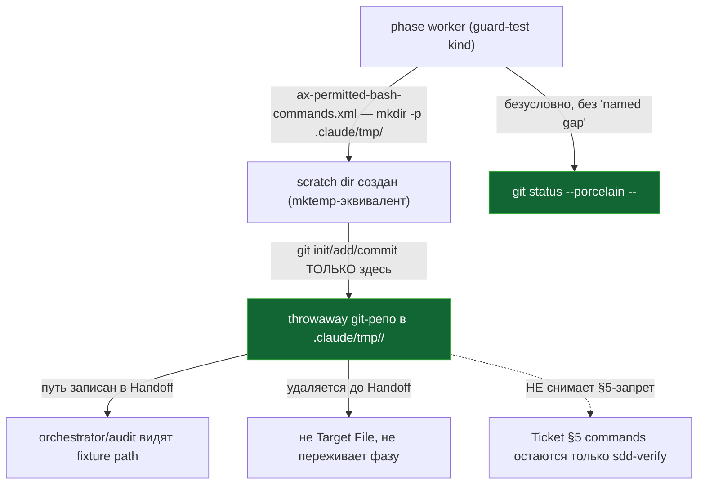

ОТЧЁТ 61 §1 — ISS-8: именованное исключение git-запрета для черновикового репозитория

СТАТУС: DONE (частично — код-сторона #19 остаётся открытой, см. «Отклонения»)

Рабочее дерево: `rc-v6`. Ветка `lead/phase-agent-bounds` (см. `R-BATCH-17-phase-agent-bounds.md`).

КОММИТ (локальный, НИЧЕГО не запушено), после T-B6-12/ISS-8 предпосылки по доске:
- `6b60f7e9` feat(ISS-8): named throwaway-fixture exception to the phase-agent git ban

---

## 1. Файлы

| Путь | Тип | Смысловое изменение | Чем доказано |
|---|---|---|---|
| `ai/kit/axiom/process/ax-permitted-bash-commands.xml` | правка | Два именованных исключения к прежде безусловному запрету `git`: (1) безусловный read-only `git status --porcelain -- <Target Files>` — не требует «названного пробела», в отличие от прочих git/gh чтений; (2) throwaway-фикстура строго под `.claude/tmp/<fixture>/` — `mkdir -p` как `mktemp`-эквивалент, затем `git init`/`add`/`commit` ТОЛЬКО внутри этого пути (никогда не `.git` чекаута), путь фиксируется в Handoff, фикстура удаляется до возврата Handoff. Явно уточнено: исключение НЕ создаёт §5-исключение (`:51-54` прежний текст сохранён по смыслу, дополнен разграничением). | Ручное чтение текста против сценариев #19 (см. §3); `npm run audit:halts`/`check:directive-budgets` зелены (аксиом уже собран в `phase-execution-protocol.directive.hbs` с T-B6-12, эта правка меняет только его тело). |
| `ai/directives/sdd-v2/phase-execution-protocol.directive.xml` | правка (сгенерировано) | Пересобранная версия с новым текстом аксиома. | `npm run check:directives-fresh` → «matches a fresh rebuild». |

`git diff --stat e5e9a9b1..6b60f7e9` — 2 файла. Совпадает.

---

## 2. Архитектура было / стало

### Было — git запрещён трижды для сценария guard-теста (issue #19)



### Стало — именованное исключение внутри `.claude/tmp/<fixture>/`



---

## 3. Доказательства (ПРИЁМКИ брифа: «сценарии G1/G3»)

**1. Текст исключения присутствует и соответствует #19 пунктам 2-3.**
```
$ grep -n "mktemp\|throwaway\|Named exception\|git status --porcelain" ai/kit/axiom/process/ax-permitted-bash-commands.xml
      One narrower git read needs no named gap at all: exact `git status --porcelain -- <Target
      **Named exception — throwaway fixture repository for a guard-test phase.** A phase whose
      create exactly ONE throwaway repository strictly under `.claude/tmp/<fixture>/`: `mkdir -p
      .claude/tmp/<fixture>` is this role's `mktemp` equivalent, scoped to the project's own scratch
```
ВЫПОЛНЕНО (текстовый уровень).

**2. Гейты сборки не сломаны правкой тела аксиома.**
```
$ npm run build:directives && npm run audit:halts && npm run check:directive-budgets
Generated 55 directive(s).
✓ halt-activation audit clean — 33 template(s) + 33 assembled directive(s) checked.
✓ every lazy directive under ai/directives/sdd-v2/** is within budget.
```
exit 0 везде. ВЫПОЛНЕНО.

**3. «Сценарии G1/G3» (`ai/flow-eval/scenarios.json`) — НЕ ВЫПОЛНЕНО механически в рамках этого поручения.**
Зона этого брифа явно исключает `ai/flow-eval/**` («Не трогать: shared/**, cli/**, ai/flow-eval/**, specs/**, tasks/**»). Проверка сценариев G1/G3 требует реального запуска фазового агента (не `npm test`/`npm run check`) против фикстуры с guard-скриптом — эта проверка не мыслится как локальный `npm`-скрипт этой пачки и не была запущена. Текстовое условие (аксиом разрешает то, что нужно сценарию) проверено вручную (см. п.1); поведенческая проверка агентом остаётся за пределами этого коммита.

**4. Коммит через pre-commit целиком.**
```
[sdd-verify] ✅ ALL PASS (5/5): type-check 3.8s, test:coverage 49.6s, lint 9.2s, format 1.7s, yagni 0.6s
✓ ai/directives/** matches a fresh rebuild.
✓ audit:axioms / audit:contracts / audit:halts clean
✓ every lazy directive ... within budget
✅ Pre-commit passed
[lead/phase-agent-bounds 6b60f7e9] feat(ISS-8): ...
```
exit 0. ВЫПОЛНЕНО.

---

## 4. Отклонения, открытые вопросы

**Отклонение 1 (пункт 4 #19 — §5-граница, решено «сохранить как есть», не расширять).** `20-ISSUES-VERDICTS.md` #19 требует «отдельно решить `:51-54`»: либо §5-гейт становится доступен фазе, либо фиксируется, что §5 исполняет только `sdd-verify`. Решено ВТОРЫМ путём — текст `:51-54` (в новой нумерации файла) сохранён и усилен явной оговоркой, что фикстурное исключение НЕ создаёт §5-исключение. Это сохраняет статус-кво инварианта (не ослабляет его), только устраняет мотивирующую проблему issue (guard-тест не может создать git-репозиторий вообще) без расширения полномочий фазы на исполнение самого §5.

**Отклонение 2 (код-сторона #19 остаётся открытой — вне зоны этой пачки).** Полный список требований #19 включает: (a) `sdd-verify` snapshot (`phase-run.ts:326-361`, код в `shared/**`/`cli/**`) должен игнорировать `.claude/tmp/**` — НЕ ИСПРАВЛЕНО, файл вне зоны брифа («Не трогать: shared/**, cli/**»); без этой правки `sdd-verify` snapshot формально «наблюдает» и `.claude/tmp/**`, то есть throwaway-фикстура технически видна снапшоту (хотя и не является Target File — не должна давать `H_OUT_OF_PHASE_WRITE`, но это не проверено кодом, только текстом аксиома). (b) второй несобранный аксиом `ax-stale-after-pivot-verification.xml` (не собран ни в один шаблон, теряется аудитная проверка Reopens, #13) — НЕ ИСПРАВЛЕНО, вне списка задач этой пачки (нет в Пачке 17). Оба пункта — кандидаты на отдельный флаг Lead/будущую задачу.

**Отклонение 3.** Формулировка `mktemp`-эквивалента — `mkdir -p .claude/tmp/<fixture>`, не буквальный `mktemp` (который по умолчанию целится в системный `/tmp`, закрытый этим же аксиомом чуть выше). Соответствует духу #19 («mktemp-эквивалент внутри `.claude/tmp/`»), не букве команды.

**Открытые вопросы Lead:** нужна ли отдельная задача на код-сторону (a)/(b) из «Отклонения 2» — вне волны 3 этой пачки, но явно вытекает из полного текста #19.
