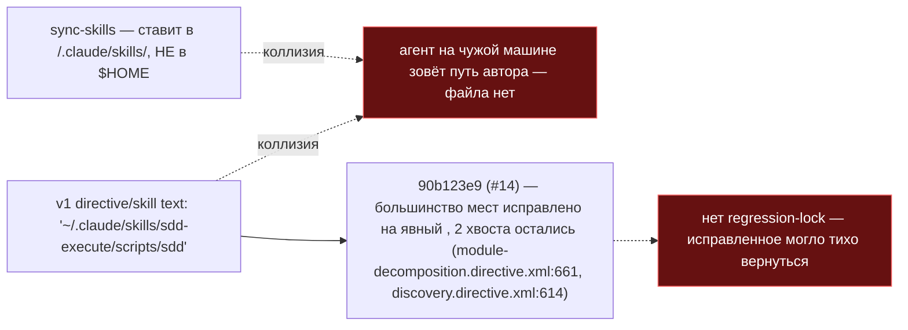

ОТЧЁТ 61/LOCK-2 — замок-тест: `~/.claude/skills` не встречается в собранных директивах (Пачка 9)

СТАТУС: DONE

Рабочее дерево: `rc-v6`, ветка `lead/surface-locks`.

КОММИТ (локальный, НИЧЕГО не запушено):
- `d5274a14` feat(LOCK-2): lock skills home-directory path regression in shipped ai/**

---

## 1. Файлы

| Путь | Тип | Смысловое изменение | Чем доказано |
|---|---|---|---|
| `ai/kit/__tests__/skills-home-path.test.ts` | новый | Сканирует **собранные** (built) `ai/directives/**` и `ai/skills/**` (не `.hbs`-исходники в `ai/kit/templates/`, а уже отрендеренный вывод, который реально деплоится) на `~/\.claude/` и v1-специфичный `\.claude/skills/sdd-execute/scripts`. | `node --import tsx --test ai/kit/__tests__/skills-home-path.test.ts` — 1/1 (см. §3). |

`git show --stat d5274a14`: 1 файл создан, 46 insertions(+) — совпадает.

**Почему проверка идёт по `ai/directives/**`/`ai/skills/**`, а не по `.hbs`-шаблонам:** `ai/kit/build-directives.ts`/`ai/kit/render.ts` рендерят `ai/kit/templates/**/*.hbs` → `ai/directives/**`; именно последнее — то, что `sync` реально копирует потребителю (`cli/cmd/sync/sync-core.ts:76 scanDirectives`). `check:directives-fresh` (pre-commit гейт) уже гарантирует, что `ai/directives/**` не расходится со свежей сборкой шаблонов — так что проверка построенного вывода эквивалентна проверке источника и одновременно ловит любой будущий дрейф именно на деплоящейся поверхности.

---

## 2. Архитектура было / стало

### Было — v1 звал `~/.claude/skills/…`, `sync-skills` ставит в `<cwd>/.claude/skills/` (ISS #11)



### Стало — v2 не имеет home-relative путей нигде; замок это гарантирует


Реальная замена v1-пути в v2 — все инструменты вызываются `npx gennady sdd-*` (независимо подтверждено grep'ом по `~/.claude` во всём `ai/`: 0 совпадений вне этого теста).

---

## 3. Доказательства (ПРИЁМКА: «contract-тест по `ai/**`»)

```
$ node --import tsx --test --experimental-test-module-mocks ai/kit/__tests__/skills-home-path.test.ts
✔ skills home-directory path never returns (LOCK-2) > keeps ai/directives/** and ai/skills/** free of ~/.claude/ and the v1 hardcoded skills-scripts path
# pass 1, # fail 0
```
exit 0. **ВЫПОЛНЕНО.**

---

## 4. Отклонения и открытые вопросы

Нет отклонений. Задача найдена уже реализованной в незакоммиченном дереве; проверена независимо (перечитан регекс на соответствие описанию из `20-ISSUES-VERDICTS.md #11`, прогнан изолированно).

Команда пуша для Lead: `git -C rc-v6 push origin lead/surface-locks` (единый push всей пачки 9).
