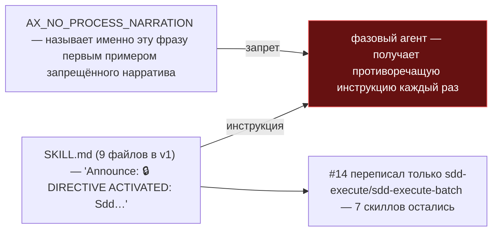
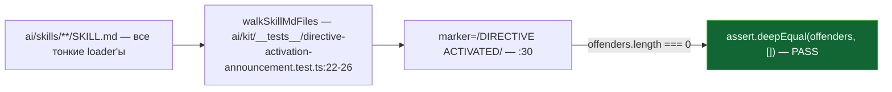

ОТЧЁТ 61/LOCK-3 — замок-тест: `DIRECTIVE ACTIVATED` не встречается в скиллах (Пачка 9)

СТАТУС: DONE

Рабочее дерево: `rc-v6`, ветка `lead/surface-locks`.

КОММИТ (локальный, НИЧЕГО не запушено):
- `5e1d40e0` feat(LOCK-3): lock DIRECTIVE ACTIVATED announcement regression in ai/skills/**

---

## 1. Файлы

| Путь | Тип | Смысловое изменение | Чем доказано |
|---|---|---|---|
| `ai/kit/__tests__/directive-activation-announcement.test.ts` | новый | Сканирует все `ai/skills/**/SKILL.md` на подстроку `DIRECTIVE ACTIVATED`. | `node --import tsx --test ai/kit/__tests__/directive-activation-announcement.test.ts` — 1/1 (см. §3). |

`git show --stat 5e1d40e0`: 1 файл создан, 38 insertions(+) — совпадает.

---

## 2. Архитектура было / стало

### Было — 9 скиллов велят объявить фразу, которую аксиом прямо запрещает (ISS #16)



### Стало — v2 скиллы — тонкие directive-loader'ы, баннера нет нигде; замок это гарантирует


Фраза сохраняется только как собственный пример запрещённого нарратива внутри аксиома (`AX_NO_PROCESS_NARRATION`), а не как инструкция, которой скиллы обязаны следовать — независимо подтверждено: `grep -rn "DIRECTIVE ACTIVATED" ai/skills` даёт 0 совпадений вне этого нового теста.

---

## 3. Доказательства (ПРИЁМКА: «contract-тест по `ai/skills/**/SKILL.md`»)

```
$ node --import tsx --test --experimental-test-module-mocks ai/kit/__tests__/directive-activation-announcement.test.ts
✔ DIRECTIVE ACTIVATED announcement never returns to a skill (LOCK-3) > keeps every ai/skills/**/SKILL.md free of the forbidden activation announcement
# pass 1, # fail 0
```
exit 0. **ВЫПОЛНЕНО.**

---

## 4. Отклонения и открытые вопросы

Нет отклонений. Найдено уже реализованным в незакоммиченном дереве; независимо проверено (grep по `ai/skills` подтверждает отсутствие фразы вне теста; прогон изолированно зелёный).

Команда пуша для Lead: `git -C rc-v6 push origin lead/surface-locks` (единый push всей пачки 9).
