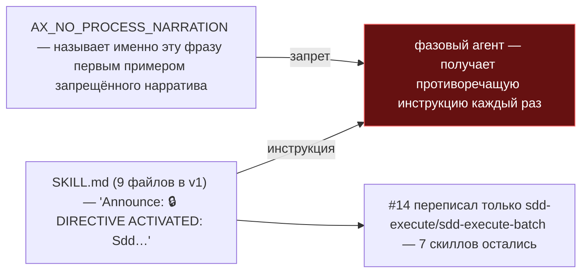
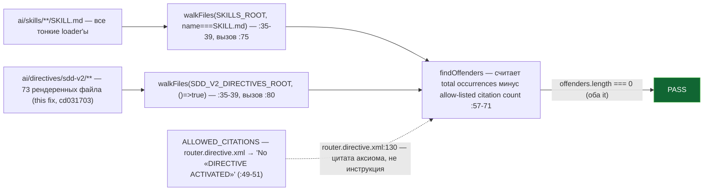

ОТЧЁТ 61/LOCK-3 — замок-тест: `DIRECTIVE ACTIVATED` не встречается в скиллах и dispatch-шаблонах (Пачка 9)

СТАТУС: DONE

Рабочее дерево: `rc-v6`, ветка `lead/surface-locks`.

КОММИТЫ (локальные, НИЧЕГО не запушено):
- `5e1d40e0` feat(LOCK-3): lock DIRECTIVE ACTIVATED announcement regression in ai/skills/**
- `cd031703` fix(lock-3): also lock the rendered ai/directives/sdd-v2/** dispatch templates — **правка по V-BATCH-09** (см. §5)

---

## 1. Файлы

| Путь | Тип | Смысловое изменение | Чем доказано |
|---|---|---|---|
| `ai/kit/__tests__/directive-activation-announcement.test.ts` | новый (`5e1d40e0`), правка (`cd031703`) | Сканирует все `ai/skills/**/SKILL.md` на подстроку `DIRECTIVE ACTIVATED` **и** (после правки) все файлы `ai/directives/sdd-v2/**` (73 файла), с allow-list на одну легитимную цитату аксиома в `router.directive.xml:130`. | `node --import tsx --test ai/kit/__tests__/directive-activation-announcement.test.ts` — 2/2 (см. §3). |

`git show --stat 5e1d40e0`: 1 файл создан, 38 insertions(+) — совпадает.
`git show --stat cd031703`: 1 файл изменён, 54 insertions(+), 11 deletions(-) — совпадает.

---

## 2. Архитектура было / стало

### Было — 9 скиллов велят объявить фразу, которую аксиом прямо запрещает (ISS #16)



### Стало — v2 скиллы и рендеренные dispatch-шаблоны свободны от баннера; замок покрывает обе поверхности


Фраза сохраняется в `ai/directives/sdd-v2/router.directive.xml:130` только как собственный пример запрещённого нарратива внутри аксиома (`AX_NO_PROCESS_NARRATION`: «No «DIRECTIVE ACTIVATED», no mode-detection narration...»), а не как инструкция, которой скиллы или dispatch-шаблоны обязаны следовать — независимо подтверждено: `grep -rn "DIRECTIVE ACTIVATED" ai/skills ai/directives/sdd-v2` даёт ровно одно совпадение вне этого теста, и это оно.

Both-way (V-BATCH-09, повторено этим исполнителем): вставлена строка `Announce: DIRECTIVE ACTIVATED: SddExecute` в конец `ai/directives/sdd-v2/execute.directive.xml` → второй `it` красный (offender = ровно этот файл); `git checkout --` восстанавливает файл → зелёный.

---

## 3. Доказательства (ПРИЁМКА: «contract-тест по `ai/skills/**/SKILL.md` **и rendered `ai/directives/sdd-v2/**`**» — `20-ISSUES-VERDICTS.md:272`)

```
$ node --import tsx --test ai/kit/__tests__/directive-activation-announcement.test.ts
✔ DIRECTIVE ACTIVATED announcement never returns to a skill or dispatch template (LOCK-3) > keeps every ai/skills/**/SKILL.md free of the forbidden activation announcement
✔ DIRECTIVE ACTIVATED announcement never returns to a skill or dispatch template (LOCK-3) > keeps every rendered ai/directives/sdd-v2/** file free of it too, except the axiom's own citation
# pass 2, # fail 0
```
exit 0. **ВЫПОЛНЕНО** (обе половины приёмки: скиллы и рендеренные dispatch-шаблоны).

Полный `npm test` после правки (см. `R-BATCH-09-surface-locks.md` §«Правки по V-BATCH-09» для точных чисел прогона всей пачки): `ok 98 - DIRECTIVE ACTIVATED announcement never returns to a skill or dispatch template (LOCK-3)`, 2/2 внутри suite.

---

## 4. Отклонения и открытые вопросы

**Правка по V-BATCH-09 (см. §5).** Первая версия этого отчёта писала «нет отклонений» — это было неточно: `20-ISSUES-VERDICTS.md:272` требует contract-тест по **обеим** поверхностям («в скиллах **и dispatch-шаблонах**»), а первая версия замка (`5e1d40e0`) покрывала только `SKILL.md`. Регрессия внутри рендеренного `*.directive.xml` (например, повторно внесённая строка `Announce: ... DIRECTIVE ACTIVATED`) прошла бы этот тест незамеченной. Найдено верификатором (`V-BATCH-09.md` §B, раздел LOCK-3), исправлено коммитом `cd031703` в этой сессии — теперь отклонений от `20-ISSUES-VERDICTS.md:272` нет.

## 5. Правка по V-BATCH-09

**Находка верификатора.** `V-BATCH-09.md`: «`20-ISSUES-VERDICTS.md:272` требует: Contract-тест по `ai/skills/**/SKILL.md` **и rendered `ai/directives/sdd-v2/**`**... Половина про директивы не реализована; фраза сегодня живёт в `ai/directives/sdd-v2/router.directive.xml:130`... `R-LOCK-3` §4 утверждает «нет отклонений» — это неточно.» Неблокирующее, но входит в обязательный список правок брифа.

**Правка.** Коммит `cd031703`: второй `it`, сканирующий все 73 файла под `ai/directives/sdd-v2/**` (не только `.directive.xml` верхнего уровня — рекурсивно, включая `agent-inbox/`, `audit/`, `formats/`, `guides/`, `phase-execution-protocol/`, `scaffold/` и их `steps/`). Единственная легитимная цитата (`router.directive.xml:130`, определение `AX_NO_PROCESS_NARRATION`) внесена в allow-list по точному тексту `'No «DIRECTIVE ACTIVATED»'` — allow-list считает фактические вхождения этой подстроки и сравнивает с общим числом вхождений маркера; превышение — offender.

**Доказательство both-way** (перепроверено этим исполнителем, не взято на веру): вставка `Announce: DIRECTIVE ACTIVATED: SddExecute` в `execute.directive.xml` → `not ok`, offender = этот файл; `git checkout --` → снова `ok`, 2/2.

Команда пуша для Lead: `git -C rc-v6 push origin lead/surface-locks` (единый push всей пачки 9, теперь 8 коммитов).
