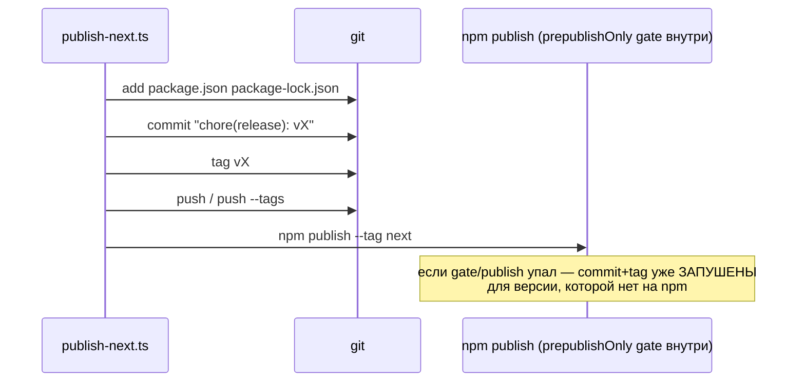
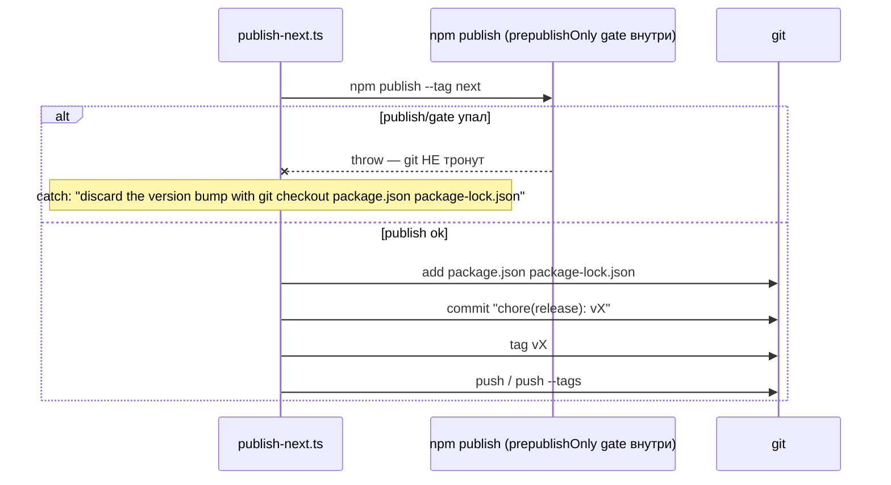

ОТЧЁТ 61 §1 — REL-1: publish-before-git порядок возвращён в `publish-next.ts`

СТАТУС: DONE

Рабочее дерево: `rc-w2`. Ветка `lead/release-package` (см. R-REL-2.md за деталями создания).

КОММИТ (локальный, НИЧЕГО не запушено):
- `2e62546cee90391d7297837f17e4322853c378c1` fix(REL-1): publish to npm before git commit/tag/push

---

## 1. Файлы

| Путь | Тип | Смысловое изменение | Чем доказано |
|---|---|---|---|
| `scripts/publish-next.ts` | правка | Порядок операций внутри `try{}` инвертирован обратно к main: `npm publish --tag next` теперь ПЕРВЫМ (гейт `prepublishOnly` внутри него абортит до git-эффектов), `git add/commit/tag/push` — только при успехе публикации. Сообщение в `catch` расширено — различает «npm publish упал, git не тронут, откати version bump» и «git-шаг упал ПОСЛЕ npm publish, пакет уже на npm, доверши руками» (портировано дословно из `main@d37d5910`, коммит `009ff59a`). | Диф идентичен main-блоку с точностью до смещения строк (см. §3 п.2); type-check зелёный; ручная проверка (автотеста нет ни на main, ни в RC — A1 P4 "none (manual)"). |

`git diff --stat origin/codex/sdd-v2-rc52-followup lead/release-package -- scripts/publish-next.ts`:
```
 scripts/publish-next.ts | 25 +++++++++++++++----------
 1 file changed, 15 insertions(+), 10 deletions(-)
```
1 файл из диффа — 1 строка таблицы. Совпадает.

---

## 2. Архитектура было / стало

### Было — git commit/tag/push ДО npm publish («phantom release» баг)


Узлы (RC до правки): `scripts/publish-next.ts` (порядок в `try{}`, git-блок первым, `npm publish` последним).

### Стало — npm publish (с гейтом) первым, git — только при успехе


Узлы: `scripts/publish-next.ts:257-278` (реордер `try{}`), `:270` (`run('npm', ['publish', '--tag', 'next'])` теперь первый вызов в блоке), `:273-277` (расширенное сообщение catch).

---

## 3. Доказательства (команды из ПРИЁМКИ, фактический вывод, exit-код)

**1. Ручная проверка — автотеста нет (заявлено в самой приёмке брифа: "ручная проверка (нет автотеста)").** Реального `npm publish`/`git push` не выполнялось (запрещено ролью — публикации делает только оператор/Lead, и задание прямо запрещает `npm publish`). Проверка = построчное сравнение с main.

**2. Диф реордеренного блока идентичен main (с точностью до смещения строк — обе версии на своих HEAD).**
```
$ diff <(git -C main show d37d5910:scripts/publish-next.ts | sed -n '255,285p') \
       <(sed -n '257,287p' rc-w2/scripts/publish-next.ts)
1,2d0
<   });
<
31a30,31
>   calculatingVersion();
> } catch (error) {
```
Единственная разница — сдвиг окна `sed` (границы функции в RC начинаются на 2 строки раньше из-за более раннего кода файла); сам блок `try{}` — байт-в-байт. ВЫПОЛНЕНО.

**3. `npm run type-check`.**
```
> tsc --noEmit
(без вывода — 0 ошибок)
```
exit 0. ВЫПОЛНЕНО.

**4. Полный прогон `npm run check` на коммите.**
```
[sdd-verify] ✅ ALL PASS (5/5)
  ✅ type-check (3.9s)  ✅ test:coverage (42.5s)  ✅ lint (2.5s)  ✅ format (1.6s)  ✅ yagni (0.6s)
```
exit 0. ВЫПОЛНЕНО.

**5. Коммит через `pre-commit` целиком, без `--no-verify`.**
```
$ git -C rc-w2 commit -m "fix(REL-1): ..."
✅ Pre-commit passed
[lead/release-package 2e62546c] fix(REL-1): publish to npm before git commit/tag/push
 1 file changed, 15 insertions(+), 10 deletions(-)
```
exit 0. ВЫПОЛНЕНО.

---

## 4. Отклонения, открытые вопросы, команды пуша

**Отклонения:** нет — портировано дословно, без адаптаций (файл идентичен между main и RC во всём, кроме этого блока и лог-префикса `[main]`, который в RC уже был идентичен main до правки).

**Открытый вопрос (не для этой задачи, зафиксирован для видимости):** REL-10 (в этой же пачке) установил версию `2.0.0-draft.1` — формат, который `parseAndBumpNextVersion()` (та же функция, чуть выше реордеренного блока, не тронута этой задачей) **не распознаёт** (регэксп принимает только `X.Y.Z` или `X.Y.Z-next.N`). Реальный запуск `npm run publish-next` против текущей версии упадёт на `calculatingVersion()` ДО достижения реордеренного блока этой задачи — т.е. REL-1 сам по себе корректен и не задет, но `publish-next.ts` в целом не готов к формату `-draft.N` без отдельной правки регэкспа (не входит в REL-1). Детали — см. `R-REL-10.md` §4.

**Команды пуша для Lead** — см. сводный отчёт `R-BATCH-02-release-package.md`.
