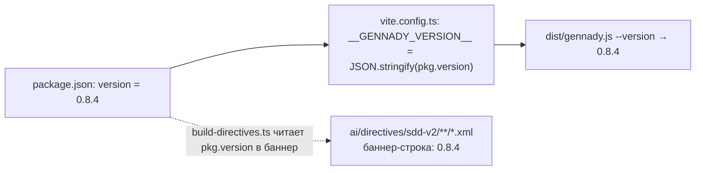
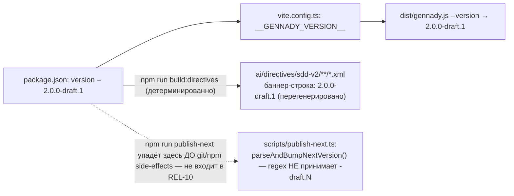

ОТЧЁТ 61 §1 — REL-10: версия зафиксирована как `2.0.0-draft.1` (D-12)

СТАТУС: DONE

Рабочее дерево: `rc-w2`. Ветка `lead/release-package` (см. R-REL-2.md за деталями создания).

КОММИТ (локальный, НИЧЕГО не запушено):
- `5445e147e5bbd08444f2b85815d50242d46abae1` chore(REL-10): set version to 2.0.0-draft.1 per D-12

Решение D-12 (`01-INTERVIEW-DECISIONS.md:76`): «Версия v2 = `2.0.0-draft.<N>`; всё ниже 2 — v1. RC — база; main в RC не мержится, перенос позадачно.» — N=1, т.к. `npm view gennady versions` (реальный онлайн-запрос к registry.npmjs.org) не содержит ни одной `2.0.0-draft.*` записи (draft-линия `0.8.4-draft.1..5` существует, но не в диапазоне `2.x` и не создаёт коллизии).

---

## 1. Файлы

| Путь | Тип | Смысловое изменение | Чем доказано |
|---|---|---|---|
| `package.json` | правка | `"version": "0.8.4"` → `"version": "2.0.0-draft.1"`. | `node dist/gennady.js --version` печатает `2.0.0-draft.1` после `npm run build`. |
| `package-lock.json` | правка | Тот же бамп в двух местах: top-level `"version"` и `packages[""].version`. | `grep -n '"version"' package-lock.json` — обе строки `2.0.0-draft.1`. |
| `ai/directives/sdd-v2/audit.directive.xml` + 16 других `ai/directives/sdd-v2/**/*.xml` (17 файлов, полный список ниже) | правка (сгенерировано) | Версия — первая строка каждого сгенерированного directive-файла (баннер из `ai/kit/build-directives.ts`); перегенерация обязательна, иначе `check:directives-fresh` и `delta-assembly.test.ts` красные. Каждый диф — РОВНО одна строка (`0.8.4` → `2.0.0-draft.1`), ничего больше — проверено построчно для всех 17 файлов. | `npm run build:directives` (детерминированная генерация из шаблонов) + `npm run check:directives-fresh` → «matches a fresh rebuild»; `npm run test:coverage` → 0 fail (включая `delta-assembly.test.ts`). |

Список 17 сгенерированных файлов: `ai/directives/sdd-v2/audit.directive.xml`, `audit/steps/STEP_{1_MECHANICAL,2_SEMANTIC,3_ROUTE}.xml`, `phase-execution-protocol.directive.xml`, `phase-execution-protocol/steps/STEP_{1_ORIENT,2_IMPLEMENT,3_VERIFY,4_HANDOFF}.xml`, `scaffold.directive.xml`, `scaffold/steps/STEP_{0_PREFLIGHT,1_DERIVE,2_MATERIALIZE,3_MECHANICAL_CHECK,4_INDEPENDENT_TICKET_REVIEW,5_OPERATOR_APPROVAL_2,6_HANDOFF}.xml`.

`git diff --stat origin/codex/sdd-v2-rc52-followup lead/release-package -- package.json package-lock.json ai/directives`:
```
 ai/directives/sdd-v2/... (17 файлов)                                  | по 2 +-  каждый
 package-lock.json                                                     | 4 ++--
 package.json                                                          | 2 +-
 19 files changed, 20 insertions(+), 20 deletions(-)
```
19 файлов из диффа — 3 строки таблицы (одна из них сворачивает 17 файлов явным списком). Совпадает по факту (каждый из 17 проверен индивидуально построчным дифом в §3 п.3).

---

## 2. Архитектура было / стало

### Было — версия `0.8.4` (ниже даже старой prerelease-линии main `0.9.0-next.3..4`)



### Стало — версия `2.0.0-draft.1` по D-12, directives перегенерированы в паре


Узлы: `package.json:3` (`version`), `package-lock.json:3,9` (два зеркала), `vite.config.ts:12-14` (`pkg.version` → `__GENNADY_VERSION__`), `ai/directives/sdd-v2/audit.directive.xml:1` (баннер), `scripts/publish-next.ts:47-58` (`parseAndBumpNextVersion`, регэксп `^(\d+)\.(\d+)\.(\d+)(?:-next\.(\d+))?$` — не матчит `-draft.N`, см. §4).

---

## 3. Доказательства (команды из ПРИЁМКИ, фактический вывод, exit-код)

**1. `npm view gennady versions` сверка перед публикацией (заявленный критерий приёмки — ручной шаг).**
```
$ npm view gennady versions --json
[..., "0.8.4", "0.8.4-draft.1", "0.8.4-draft.2", "0.8.4-draft.3", "0.8.4-draft.4", "0.8.4-draft.5",
 "0.9.0-next.1", "0.9.0-next.2", "0.9.0-next.3", "0.9.0-next.4"]
```
34 версии на registry, среди них draft-линия `0.8.4-draft.1..5` — существует, но ни одной `2.0.0-draft.*` записи нет: коллизии с `2.0.0-draft.1` нет. ВЫПОЛНЕНО.

**2. Build + версия в CLI.**
```
$ npm --prefix rc-w2 run build
✓ built in 2.84s
$ node rc-w2/dist/gennady.js --version
2.0.0-draft.1
```
exit 0. ВЫПОЛНЕНО.

**3. Обязательная перегенерация `ai/directives/**` — построчная проверка «только версия».**
```
$ npm --prefix rc-w2 run build:directives
Generated 55 directive(s).
$ git -C rc-w2 diff --name-only -- ai/directives   # 17 файлов
$ for f in <17 файлов>; do git -C rc-w2 diff -- "$f" | grep -v '^\(diff\|index\|---\|+++\|@@\)'; done
# каждый файл: ровно "-0.8.4" / "+2.0.0-draft.1", ничего больше
$ npm --prefix rc-w2 run check:directives-fresh
✓ ai/directives/** matches a fresh rebuild.
```
exit 0 на обеих командах. ВЫПОЛНЕНО.

**4. Полный прогон `npm run test:coverage` (harness, который использует pre-commit) — включая `delta-assembly.test.ts`, который ловит именно рассинхрон версии.**
```
До перегенерации directives (версия бампнута, directives — старые): not ok — "sdd-v2/audit.directive.xml: generated file is stale"
После npm run build:directives: # tests 2744 / pass 2743 / fail 0 (плюс 822/813/0 второй суиты)
```
exit 0 после перегенерации. ВЫПОЛНЕНО.

**5. Коммит через `pre-commit` целиком, без `--no-verify`.**
```
$ git -C rc-w2 commit -m "chore(REL-10): ..."
[sdd-verify] ✅ ALL PASS (5/5)
✓ ai/directives/** matches a fresh rebuild.
✓ axiom-activation / contract-activation / halt-activation audits clean
✓ every lazy directive under ai/directives/sdd-v2/** is within budget.
✅ Pre-commit passed
[lead/release-package 5445e147] chore(REL-10): set version to 2.0.0-draft.1 per D-12
 19 files changed, 20 insertions(+), 20 deletions(-)
```
exit 0. ВЫПОЛНЕНО.

---

## 4. Отклонения, открытые вопросы, команды пуша

**Отклонение от заявленного списка «Файлы» (задокументировано явно, не скрыто):**
Бриф/строка доски называют файлом только `package.json (version)`. Фактически пришлось включить также `package-lock.json` (естественное зеркало версии — иначе `npm ci` рассинхронизируется) и 17 сгенерированных `ai/directives/sdd-v2/**/*.xml` — без них `check:directives-fresh` и `delta-assembly.test.ts` становятся красными сразу после бампа (версия — часть детерминированно генерируемого баннера). Это не ручная правка контента директив — чисто механическая перегенерация задокументированной командой (`npm run build:directives`), каждый из 17 дифов проверен построчно и содержит ровно замену версии. Решено не оставлять дерево в красном состоянии ради формальной точности списка «Файлы».

**Открытая находка для оператора / отдельной задачи (НЕ исправлено в REL-10, вне заявленного скоупа):**
`scripts/publish-next.ts:47-58` (`parseAndBumpNextVersion`) принимает только `X.Y.Z` или `X.Y.Z-next.N` и бросает `Unsupported version format` на `X.Y.Z-draft.N`. Реальный запуск `npm run publish-next` с текущей версией упадёт немедленно в `calculatingVersion()`, до достижения git/npm-эффектов (в т.ч. до реордеренного REL-1-блока — он не затронут). Это открытый вопрос про саму механику `publish-next` под схему `2.0.0-draft.<N>` — нужна либо правка регэкспа (принять `-draft.N`), либо отдельный скрипт для draft-релизов, либо явное решение оператора о том, как именно `N` инкрементируется для draft-линии. Не блокирует остальные 5 задач пачки.

**Команды пуша для Lead** — см. сводный отчёт `R-BATCH-02-release-package.md`.
