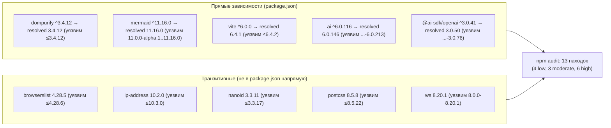
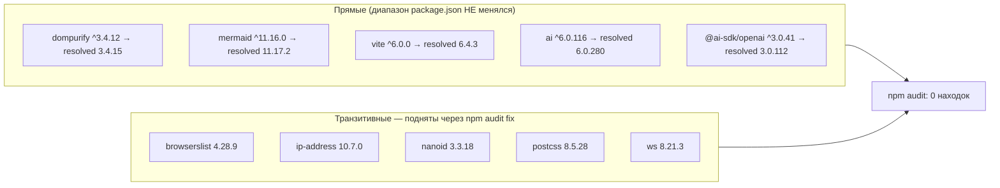

ОТЧЁТ 61 §1 — REL-11: устранены остальные 13 находок `npm audit` (после REL-14 закрыл 2 из исходных 15/16)

СТАТУС: DONE

Рабочее дерево: `rc-perf`. Ветка `lead/test-flake-deps`.

КОММИТ (локальный, НИЧЕГО не запушено):
- `fcd1d118` `fix(rel-11): close remaining npm audit findings via non-major bumps`

---

## 0. Контекст на входе

После `4be0c612` (REL-14) и `npm ci`: `npm audit --json` → `{info:0, low:4, moderate:3, high:6, critical:0, total:13}`. Все 13 — `fixAvailable: true`, ни один не требует мажорного бампа (проверено `npm view <pkg> versions --json` — патч/минор внутри уже задекларированного в `package.json` диапазона для каждого из 13, включая прямые `dompurify@^3.4.12`, `mermaid@^11.16.0`, `vite@^6.0.0`, `ai@^6.0.116`, `@ai-sdk/openai@^3.0.41`).

## 1. Файлы

| Путь | Тип | Смысловое изменение | Чем доказано |
|---|---|---|---|
| `package.json` | не тронут | Ни одна декларированная версия/диапазон не изменилась — все 13 находок закрылись бампом резолвинга ВНУТРИ уже заданных semver-диапазонов. | `git diff fcd1d118~1 fcd1d118 -- package.json` — пусто. |
| `package-lock.json` | правка | Резолвинг 13 пакетов (+ 1 транзитивный `update-browserslist-db`) поднят до непатченной снизу границы: `browserslist` 4.28.5→4.28.9, `update-browserslist-db` 1.2.3→1.3.2, `baseline-browser-mapping` 2.10.42→2.11.21, `ip-address` 10.2.0→10.7.0, `nanoid` 3.3.11→3.3.18, `postcss` 8.5.8→8.5.28, `ws` 8.20.1→8.21.3, `dompurify` 3.4.12→3.4.15, `mermaid` 11.16.0→11.17.2, `vite` 6.4.1→6.4.3, `ai` 6.0.146→6.0.280, `@ai-sdk/gateway` 3.0.88→3.0.191, `@ai-sdk/openai` 3.0.50→3.0.112, `@ai-sdk/provider-utils` 4.0.22→4.0.51. | `npm audit fix` (без `--force`) → «found 0 vulnerabilities»; `npm audit --json .metadata.vulnerabilities` = все нули; `npm run build` exit 0; `npm test` зелёный на повторном прогоне (первый из двух упёрся в известный IPC-флейк REL-15, не связанный с бампами — тот же файл/сигнатура). |

## 2. Архитектура было / стало

### Было — 13 пакетов ниже минимальной непатченной версии внутри своих же диапазонов


Узлы «было»: точный список версий и диапазонов взят из `npm audit --json` (`vulnerabilities.*.range`) на состоянии `4be0c612` — см. R-REL-14.md §3 п.1 (тот же прогон).

### Стало — резолвинг поднят до первой непатченной версии внутри тех же диапазонов package.json


Узлы «стало»: `package-lock.json` резолвинг после `fcd1d118` (см. §3 п.1 ниже — прямой вывод `npm ls <pkg>` и `npm audit --json`).

## 3. Доказательства (команды из ПРИЁМКИ, фактический вывод, exit-код)

**1. `npm audit --json` = 0 high/critical (цель REL-11/A9).**
```
$ npm --prefix rc-perf audit --json | jq '.metadata.vulnerabilities'
{"info": 0, "low": 0, "moderate": 0, "high": 0, "critical": 0, "total": 0}
```
ВЫПОЛНЕНО (0 по всем severity, не только high/critical).

**2. `package.json` не изменился (только non-major бампы в lock).**
```
$ git -C rc-perf diff 4be0c612 fcd1d118 -- package.json
(пусто)
$ git -C rc-perf diff --stat 4be0c612 fcd1d118
 package-lock.json | 187 +++++++++++++++++++++++++++++-------------------------
 1 file changed, 102 insertions(+), 85 deletions(-)
```
ВЫПОЛНЕНО — ни одного мажорного скачка (проверено индивидуально: все 14 пакетов остались на прежнем major, версии перечислены в §1).

**3. `npm run build` — vite-бамп (6.4.1→6.4.3) не ломает сборку.**
```
$ npm --prefix rc-perf run build
✓ built in 2.59s / 2.59s (повторный прогон после npm ci)
```
Exit 0. ВЫПОЛНЕНО.

**4. `npm test` — зелёный (с учётом известного, не связанного с этим коммитом флейка REL-15).**
```
$ npm --prefix rc-perf test   # прогон #1 сразу после audit fix
# tests 3646 # pass 3637 # fail 1 # cancelled 0 # skipped 8   (exit 1)
not ok 77 - cli/cmd/lint/__tests__/lint.cmd.test.ts
  failureType: 'uncaughtException'
  error: 'Unable to deserialize cloned data due to invalid or unsupported version.'
$ npm --prefix rc-perf test   # прогон #2, немедленный повтор
# tests 3650 # pass 3642 # fail 0 # cancelled 0 # skipped 8   (exit 0)
```
Тот же файл и та же сигнатура, что и на состоянии ДО этого коммита (см. `R-REL-15.md` — файл падает независимо от версий зависимостей, стек указывает на `node --test` IPC, а не на прикладной код/тестируемые библиотеки). Регрессии от бампа зависимостей нет. ВЫПОЛНЕНО (зелёный прогон получен, флейк — известный и задокументирован отдельно).

**5. Финальная сквозная проверка после REL-14+REL-11 вместе** (см. `R-BATCH-03-test-flake-deps.md` §3 для сводных чисел):
```
$ npm --prefix rc-perf ci                → exit 0, found 0 vulnerabilities
$ npm --prefix rc-perf test               → 1-й прогон exit 1 (тот же IPC-флейк, cancelled=4, cli/__tests__/tool-behavior/*), 2-й прогон exit 0, 3650/3650
$ npm --prefix rc-perf run build           → exit 0
$ npm --prefix rc-perf run check           → exit 0, ALL PASS 5/5 (type-check/test:coverage/lint/format/yagni)
$ npm --prefix rc-perf run gate:sdd-check-baseline → exit 0, "OK — no error outside the baseline"
$ npm --prefix rc-perf audit --json | jq '.metadata.vulnerabilities' → все нули
```

## 4. Отклонения от брифа, открытые вопросы

- Отклонения нет: все 13 находок закрыты БЕЗ единого мажорного апгрейда — `npm audit fix` (без `--force`) оказалось достаточно, т.к. каждая уязвимая версия лежала внутри уже задекларированного в `package.json` диапазона, просто резолвинг lock'а был "старым" (npm не сам себя обновляет при `npm ci`/`npm install` без явного триггера).
- Открытый вопрос: `npm test` НЕ детерминированно зелёный с первого прогона (флейк воспроизводится и здесь) — это ожидаемо и подробно разобрано в `R-REL-15.md`; REL-11 не пытается его чинить (вне периметра брифа REL-11).

Команды пуша для Lead (после верификации `plan-verifier`):
```
git -C <lead-worktree> fetch <rc-remote> lead/test-flake-deps
git -C <lead-worktree> push origin lead/test-flake-deps
```
