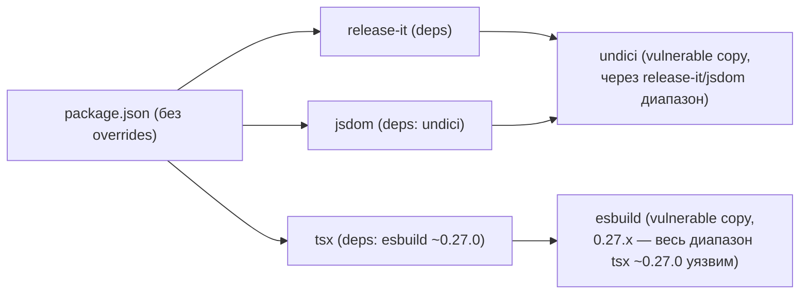
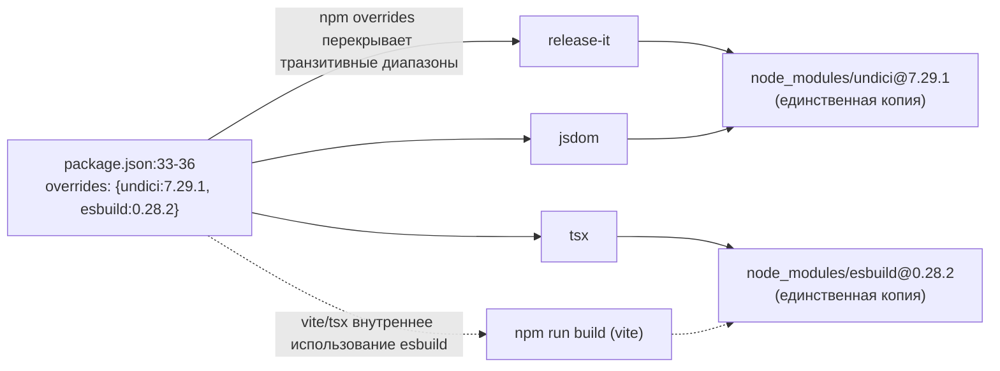

ОТЧЁТ 61 §1 — REL-14: `overrides` для `undici`/`esbuild` re-derived из `sdd-v2-inbox-transplant` (D-8)

СТАТУС: DONE (коммит сделан предыдущим исполнителем этой же пачки; этот отчёт — проверка + продолжение после ребейза)

Рабочее дерево: `rc-perf` (`/private/tmp/claude-503/.../scratchpad/rc-perf`). Ветка `lead/test-flake-deps`, база после ребейза — `origin/codex/sdd-v2-rc52-followup@e7b5ba1e`.

КОММИТ (локальный, НИЧЕГО не запушено):
- `4be0c612` `fix(rel-14): re-derive undici/esbuild overrides from sdd-v2-inbox-transplant` (сделан предыдущим исполнителем до передачи задачи; после ребейза на `e7b5ba1e` SHA пересчитан с `268bbeff` на `4be0c612`, содержимое диффа не изменилось — конфликтов при ребейзе не было, `package.json` разошёлся в независимой секции `scripts`).

Решение D-8 (`01-INTERVIEW-DECISIONS.md:72`): re-derive, не cherry-pick. Коммит-источник `sdd-v2-inbox-transplant` использовал `undici@7.29.0`/`esbuild@0.28.2`; на момент re-derive `7.29.1` — последний патч линии 7.29.x, `0.28.2` не изменился.

---

## 1. Файлы

| Путь | Тип | Смысловое изменение | Чем доказано |
|---|---|---|---|
| `package.json` | правка | Добавлен блок `"overrides": { "undici": "7.29.1", "esbuild": "0.28.2" }` (4 строки, `package.json:33-36`). | `npm install` резолвит единственную копию каждого пакета под этими версиями; `npm audit --json` не перечисляет `undici`/`esbuild`. |
| `package-lock.json` | правка | Перестройка дерева резолвинга под `overrides` — 714 строк diff (714 удалено/добавлено суммарно), единая копия `undici`/`esbuild` вместо нескольких вложенных. | `npm ci` проходит без ошибок (lock согласован с `package.json`); `find node_modules -maxdepth 4 -name esbuild -o -name undici` даёт по одному пути каждый. |

---

## 2. Архитектура было / стало

### Было — `undici`/`esbuild` тянутся вложенными копиями из транзитивных диапазонов


Узлы (RC до `4be0c612`): `package.json` — секция `dependencies`/`devDependencies` без `overrides` (проверено читением файла на `c9b58636`); `npm audit --json` на этом коммите перечислял `undici` и `esbuild` среди 16 находок (см. R-REL-11.md §0 контекст).

### Стало — `overrides` форсирует единую пропатченную версию поверх всего дерева


Узлы «стало»: `package.json:33-36` (новый блок `overrides`); `node_modules/undici/package.json` → `7.29.1`; `node_modules/esbuild/package.json` → `0.28.2` (проверено `node -e "require(...).version"` — см. §3 п.2).

---

## 3. Доказательства (команды из ПРИЁМКИ, фактический вывод, exit-код)

**1. `npm audit --json` — `undici`/`esbuild` отсутствуют.**
```
$ npm --prefix rc-perf audit --json | jq '.metadata.vulnerabilities'
{"info": 0, "low": 4, "moderate": 3, "high": 6, "critical": 0, "total": 13}
$ npm --prefix rc-perf audit --json | jq '.vulnerabilities | keys'
["@ai-sdk/gateway","@ai-sdk/openai","@ai-sdk/provider-utils","ai","baseline-browser-mapping",
 "browserslist","dompurify","ip-address","mermaid","nanoid","postcss","vite","ws"]
```
Ни `undici`, ни `esbuild` в списке. ВЫПОЛНЕНО. (Оставшиеся 13 — предмет REL-11, см. `R-REL-11.md`.)

**2. Единая копия каждого пакета, версии совпадают с override.**
```
$ node -e "console.log(require('rc-perf/node_modules/esbuild/package.json').version)"
0.28.2
$ node -e "console.log(require('rc-perf/node_modules/undici/package.json').version)"
7.29.1
$ find rc-perf/node_modules -maxdepth 4 -name esbuild -type d; find rc-perf/node_modules -maxdepth 4 -name undici -type d
rc-perf/node_modules/esbuild
rc-perf/node_modules/undici
```
Ровно один путь для каждого — нет расходящихся копий под `vite`/`tsx`/`jsdom`. ВЫПОЛНЕНО.

**3. `npm ci` (lock согласован) и `npm run build` (override не ломает внутреннее использование esbuild у vite/tsx).**
```
$ npm --prefix rc-perf ci
added 696 packages, and audited 697 packages in 9s
found 0 vulnerabilities   # (после REL-11; на момент чистого REL-14 было 13)
$ npm --prefix rc-perf run build
✓ built in 2.59s
```
Exit 0 / 0 соответственно. ВЫПОЛНЕНО.

**4. `npm test` — зелёный после ребейза + REL-14 (до REL-11).**
Прогнан как часть общей серии N=6 для REL-15 (см. `R-REL-15.md` §3) на состоянии дерева `4be0c612` (REL-14 применён, REL-11 ещё нет): 2/6 прогонов упали с известным IPC-флейком (`R-REL-15.md`), не связанным с REL-14/undici/esbuild — тот же файл (`cli/cmd/lint/__tests__/lint.cmd.test.ts`) падает и на состоянии до REL-14 (см. `R-REL-15.md` §1, тот же сигнатурный стек). Регрессии от override не обнаружено.

---

## 4. Отклонения от брифа, открытые вопросы

- Отклонение: коммит `4be0c612` фактически сделан предыдущим исполнителем (SHA `268bbeff` до ребейза); этот отчёт — верификация + актуализация SHA после `git rebase origin/codex/sdd-v2-rc52-followup`. Никакого нового кода для REL-14 не писалось.
- Ребейз (`e7b5ba1e`, 7 коммитов, ушедших вперёд в `codex/sdd-v2-rc52-followup`) прошёл БЕЗ конфликтов: единственное пересечение в `package.json` — секция `scripts` (`eval:migration`, `eval:migration:portal`), не пересекается с блоком `overrides`. `npm install` после ребейза не изменил `package-lock.json` (lock уже был согласован).
- Открытых вопросов нет.

Команды пуша для Lead (после верификации `plan-verifier`):
```
git -C <lead-worktree> fetch <rc-remote> lead/test-flake-deps
git -C <lead-worktree> push origin lead/test-flake-deps
```
