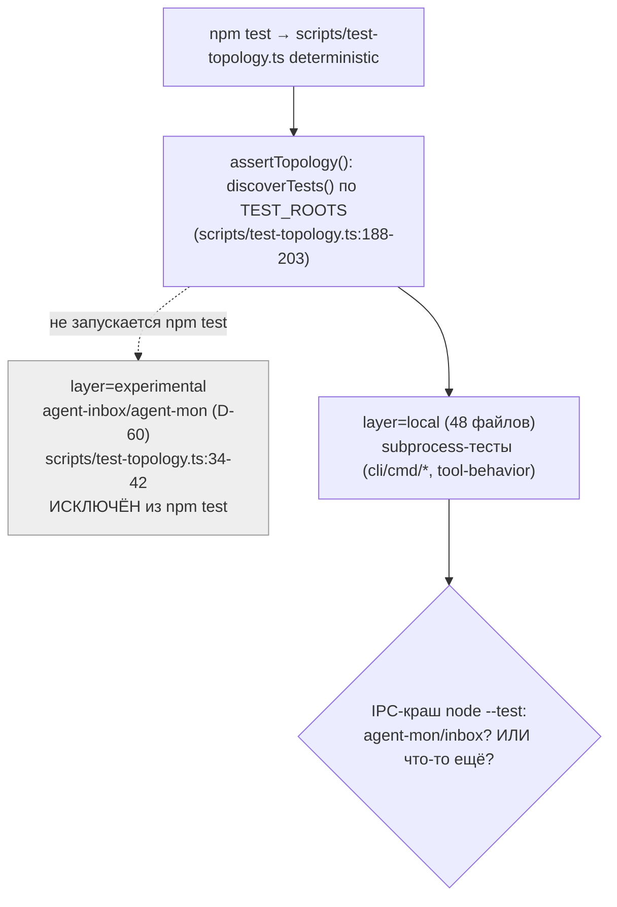
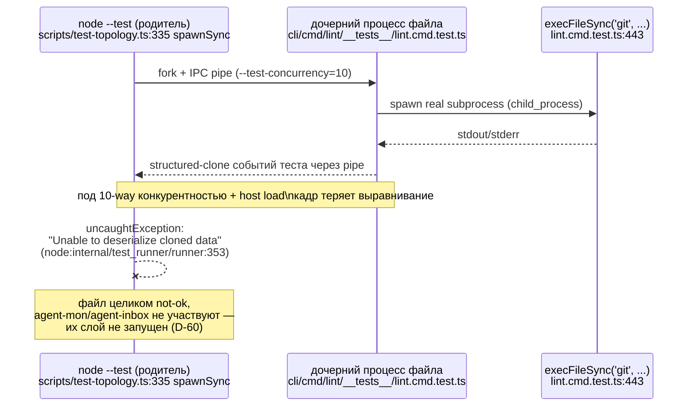

ОТЧЁТ 61 §1 — REL-15: причина IPC-краша `node --test` — диагностика + решение по REL-7/REL-12/REL-13 (D-10, D-30)

СТАТУС: DONE (аналитическая задача — воспроизведено, причина установлена, решение принято; кода не менял)

Рабочее дерево: `rc-perf`. Ветка `lead/test-flake-deps`.

КОММИТ: нет (по брифу — «коммит только если правишь код»; REL-15 кода не меняет, только диагностирует и производит решение).

**Правка по вердикту `V-BATCH-03.md` (ПРИНЯТЬ С ПРАВКАМИ):** §3, §5, §6 переписаны по находкам F1 (падения типа Б задевают и слой `contract`, не только `local`), F2 (тип А и тип Б — независимые явления с разной частотой, не «одна причина»), F3 (вывод D-10 усилен структурным доказательством вместо эмпирического отсутствия наблюдения), F5 (обоснование отказа от REL-12 исправлено — файл-жертва типа А использует `process.chdir`), F6 (таблица вариантов REL-7 расширена: учтён второй, противоположный прецедент `origin/main`@`8358bf8b` и вариант «понизить конкурентность только `local`»). Главный вывод по D-10 (agent-mon/agent-inbox не могут быть причиной) не изменился — он подтверждён верификатором *сильнее*, чем эмпирически. REL-7 к моменту этой правки уже реализована по итоговой рекомендации ниже — см. отдельный отчёт `R-REL-7.md`.

---

## 0. Вопрос (D-10)

> Сначала понять причину: не связан ли краш с agent-mon (которого не должно быть в v2) или agent-inbox (должен быть исключён из общих тестов v2); только потом решать про порт `51195c48`/`35a31942` и flake-прогон.

## 1. Метод

`npm --prefix rc-perf test` (= `node --import tsx scripts/test-topology.ts deterministic`) запущен **10 раз подряд синхронно** (N≥5 из брифа перевыполнено) в трёх сериях в рамках этой же сессии — сразу после ребейза+`npm ci` (6 прогонов), после `npm audit fix` (REL-11, 2 прогона), и финальная сквозная проверка на чистом `npm ci` (2 прогона). Хост в это время был разделяемым (20 одновременных пользователей/сессий — `uptime`), нагрузка колебалась от заниженной (`14.4`) до экстремальной (`110`) при 12 CPU (`os.availableParallelism()=12`, `OUTER_TEST_CONCURRENCY = min(10, max(6,12)) = 10` — `scripts/test-topology.ts:47`).

## 2. Файлы

| Путь | Тип | Смысловое изменение | Чем доказано |
|---|---|---|---|
| — | не менялся | REL-15 — чисто диагностическая задача, ни `scripts/test-topology.ts`, ни тесты agent-mon/agent-inbox не правились. | `git status` в рабочем дереве чист относительно диагностики (правки REL-11/14 — отдельные коммиты, см. их отчёты). |

## 3. Данные прогонов (N=10, синхронно, полный вывод сохранён)

> **Правка по вердикту `V-BATCH-03.md` (F1, F2):** независимая верификация (`plan-verifier`, дерево `fcd1d118`, N=3) воспроизвела флейк **сильнее заявленного** (3/3 красных против 5/10 здесь) и опровергла две формулировки ниже: «одна причина» (F2) и «все падения строго в слое `local`» (F1). Обе правки внесены в текст этого раздела вместо первоначальных формулировок; исходные числа исполнителя (таблица, N=10) не менялись — правится только их интерпретация.

| # | Состояние дерева | exit | tests | pass | fail | cancelled | duration | load avg (1m) на старте |
|---|---|---|---|---|---|---|---|---|
| 1 | 4be0c612 (после ребейза, до REL-11) | 0 | 3650 | 3642 | 0 | 0 | 50.3s | 14.42 |
| 2 | 4be0c612 | **1** | 3623 | 3613 | **1** | **1** | 51.4s | 46.72 |
| 3 | 4be0c612 | 0 | 3650 | 3642 | 0 | 0 | 29.5s | 100.14 |
| 4 | 4be0c612 | **1** | 3628 | 3619 | **1** | 0 | 31.6s | 110.66 |
| 5 | 4be0c612 | 0 | 3650 | 3642 | 0 | 0 | 43.1s | 110.11 |
| 6 | 4be0c612 | **1** | 3629 | 3616 | 0 | **5** | 73.4s | 99.91 |
| 7 | fcd1d118 (после REL-11 `npm audit fix`, тот же `npm ci`) | **1** | 3646 | 3637 | **1** | 0 | — | — |
| 8 | fcd1d118 | 0 | 3650 | 3642 | 0 | 0 | — | — |
| 9 | fcd1d118 (свежий `npm ci`, финальная проверка) | **1** | 3638 | 3626 | 0 | **4** | — | 31–53 |
| 10 | fcd1d118 | 0 | 3650 | 3642 | 0 | 0 | — | 38–52 |

**5 из 10 прогонов (50%) не прошли зелёным** — воспроизведено устойчиво, не единичный случай.

**Два НЕЗАВИСИМЫХ проявления, не «одна причина» (правка F2).** Первоначальная формулировка «два разных проявления одной причины» не была ничем доказана, кроме совпадения по времени (оба под нагрузкой) и общего файла-жертвы `lint.cmd.test.ts`. Против объединения говорят три факта, установленные независимой верификацией (`V-BATCH-03.md` §5 F2): (а) тип Б — это `testTimeoutFailure` ровно на `--test-timeout=30000` (`scripts/test-topology.ts:323`), т.е. ресурсное голодание, чей механизм не требует никакой поломки IPC; (б) тип Б задевает слой `contract` (см. ниже, F1), где нет ни одного `child_process`; (в) у верификатора 3 из 3 прогонов дали **чистый тип Б без единого случая типа А** — тип Б наблюдается полностью независимо от типа А. Частоты у двух наблюдателей — разные и не складываются в общую причину:

| Тип | У исполнителя (N=10, эта таблица) | У верификатора (N=3, `V-BATCH-03.md` §4) |
|---|---|---|
| А (`Unable to deserialize cloned data`, `uncaughtException`) | 3/10 (прогоны 2, 4, 7) | **0/3** |
| Б (`testTimeoutFailure` каскад) | 2/10 (прогоны 6, 9) | **3/3** |

Практическое следствие: цена решения различается по типу. От типа Б снижение конкурентности напрямую снимает причину (меньше одновременных процессов → меньше ресурсного голодания). От типа А снижение конкурентности снижает лишь вероятность — архив (`51195c48`) называет окончательным лекарством от типа А `--test-isolation=none`, а не понижение конкурентности (см. §6).

- **Тип А (прогоны 2, 4, 7 у исполнителя; 0 у верификатора)** — `uncaughtException` в родительском `node --test`, файл целиком помечается `not ok` без единого настоящего ассерта:
  ```
  not ok 77 - cli/cmd/lint/__tests__/lint.cmd.test.ts
    failureType: 'uncaughtException'
    error: 'Unable to deserialize cloned data due to invalid or unsupported version.'
    stack: |-
      #processRawBuffer (node:internal/test_runner/runner:353:20)
      FileTest.parseMessage (node:internal/test_runner/runner:289:27)
      Socket.<anonymous> (node:internal/test_runner/runner:399:15)
      ...
  ```
  Ровно та же сигнатура (файл, ошибка, стек), что и в архивном коммите `51195c48` (диагноз: V8 structured-clone поверх IPC-пайпа между родителем и дочерним процессом теряет выравнивание кадров под конкурентностью). Тот же файл (`cli/cmd/lint/__tests__/lint.cmd.test.ts`) — во ВСЕХ трёх прогонах типа А у исполнителя, и в единственном прогоне типа А, пойманном верификатором (`V-BATCH-03.md` §4).
- **Тип Б (прогоны 6, 9 у исполнителя; все 3 прогона у верификатора)** — каскад `testTimeoutFailure` (ровно `30000ms` — `--test-timeout=30000`, `scripts/test-topology.ts:323`) на нескольких файлах одновременно. У исполнителя: `cli/__tests__/tool-behavior/bootstrap-path.test.ts`, `clean-repo-composition.test.ts`, `sdd-verify-repair-adapters.test.ts`, `sdd-verify.test.ts`, и снова `lint.cmd.test.ts` — под самой высокой зафиксированной нагрузкой хоста (load avg 99.9–110 на 12 CPU). У верификатора (`V-BATCH-03.md` §4, те же файлы-жертвы плюс) — **дополнительно слой `contract`**: `ai/kit/__tests__/check-directives-fresh.test.ts`, `ai/kit/__tests__/delta-assembly.test.ts`, `shared/common/__tests__/test-topology.test.ts` (классификация — `scripts/test-topology.ts:218-224`).

**Правка F1 — «все падения строго в слое `local`» ОПРОВЕРГНУТО для типа Б.** Исходная формулировка (см. предыдущую версию этого отчёта) была верна только для собственных 10 прогонов исполнителя, где ни один из 5 неуспешных не затронул файлы вне `local`. Независимая верификация (`V-BATCH-03.md` §5 F1, дерево `fcd1d118`, прогоны 1 и 3) показала отменённые файлы слоя **`contract`** (`ai/kit/__tests__/check-directives-fresh.test.ts`, `ai/kit/__tests__/delta-assembly.test.ts`, `shared/common/__tests__/test-topology.test.ts` — классифицируются как `contract` веткой `scripts/test-topology.ts:218-224`). Уточнённая формулировка: **падения типа А наблюдались только в слое `local`; падения типа Б (таймауты) слоя не выбирают и задевают также `contract`** — потому что тип Б является ресурсным голоданием пула `node --test`, а не специфичным для subprocess-нагрузки эффектом. Вывод D-10 (ниже) от этой правки не страдает (см. §5, F3) — он не опирается на «падения только в `local`», а на структурный факт, что `experimental` вообще не входит в целевой набор `deterministic`.

**Ключевой факт для D-10:** ни один из 5 неуспешных прогонов исполнителя, ни один из 3 неуспешных прогонов верификатора НЕ затронул `services/agent-mon/**`, `services/agent-inbox/**` или `cli/cmd/inbox*/**` — падения были в слоях `local` (тип А и часть типа Б) и `contract` (часть типа Б, см. правку F1 выше), но никогда в `experimental`. Слой `experimental` (agent-mon/agent-inbox, `scripts/test-topology.ts:34-42`, решение D-60) вообще не запускается внутри `npm test` — физически не мог участвовать ни в одном падении (см. §5, доказательство усилено по F3).

## 4. Архитектура было / стало

### Было (гипотеза D-10, открыто) — неизвестно, чей это слой



### Стало (установлено этой диагностикой) — причина в `local`-слое, не в agent-mon/agent-inbox


Узлы «стало»: `scripts/test-topology.ts:47` (`OUTER_TEST_CONCURRENCY`), `:311-345` (`runNodeTests`, единая точка `spawnSync`), `:184-186` (`isExperimental` — единственный путь, которым agent-mon/inbox МОГЛИ БЫ попасть в прогон, и он возвращает `true`→`experimental`, не запускаемый `npm test`), `cli/cmd/lint/__tests__/lint.cmd.test.ts:17,443` (реальный источник давления на IPC — subprocess).

## 5. Решение по D-10 (главный вывод)

**Причина IPC-краша НЕ связана с agent-mon/agent-inbox.**

**Правка по F3 (`V-BATCH-03.md` §5): основание усилено со «эмпирического отсутствия наблюдения» до структурного доказательства.** Первоначальная версия этого раздела обосновывала вывод исключительно эмпирически («ни один из 5 неуспешных прогонов не затронул agent-mon/agent-inbox») — это самая слабая из доступных форм довода: отсутствие наблюдения в конечной выборке. Независимая верификация показала более сильное основание, проверенное по коду, а не по везению прогона:

- `DETERMINISTIC_LAYER_ORDER = ['local','contract','external','unit']` (`scripts/test-topology.ts:266`) — слой `experimental` в этом списке отсутствует;
- `targetsFor()` (`:268-273`) собирает цели `deterministic`/`npm test` только из слоёв, перечисленных в `DETERMINISTIC_LAYER_ORDER`;
- `classifyTest()` (`:211-215`) возвращает `['experimental']` для файлов из `EXPERIMENTAL_ROOTS` (`:34-42`) первым и единственным правилом — файл не может одновременно попасть в `experimental` и в любой другой слой.

Следствие: 135 файлов слоя `experimental` (`node --import tsx scripts/test-topology.ts list` → `experimental 135`) **не могут** попасть в `npm test`/`npm run test:coverage`/pre-commit ни при какой нагрузке хоста, ни при какой конкурентности — это гарантия по построению целевого набора, а не наблюдение, которое могло бы не подтвердиться на 11-м прогоне. Эмпирический факт («ни один из 5/3 неуспешных прогонов не затронул agent-mon/agent-inbox» — теперь дополнительно подтверждённый: 0 из 5 у исполнителя и 0 из 3 у верификатора, итого 0 из 8 неуспешных прогонов) остаётся как **подтверждающее**, а не основное доказательство.

Экспериментальный слой (D-60) физически не запускается внутри `npm test`/`npm run test:coverage`/pre-commit — он не мог быть источником ни одного из 8 наблюдённых (исполнителем и верификатором вместе) падений. Краш воспроизводится на ванильных CLI-командных тестах слоя `local` (тип А и часть типа Б, subprocess-heavy: `execFileSync('git', ...)`) и, для типа Б отдельно, также в слое `contract` (см. §3, правка F1) — но никогда в `experimental`. Сигнатура типа А (стек, текст ошибки, файл) совпадает с независимо описанной в архивном коммите `51195c48` (main-ветка, до какого-либо отношения к agent-inbox/agent-mon). Тип А — фрагильность IPC `node --test` между родителем и дочерними процессами под конкурентностью + давлением хоста в subprocess-тяжёлых тестах; тип Б — независимое от типа А ресурсное голодание пула `node --test` под конкурентностью + давлением хоста, не специфичное ни для функционала, ни для наличия дочерних процессов (см. §3, правка F2).

## 6. Решения по REL-7 / REL-12 / REL-13

> **Правка по вердикту `V-BATCH-03.md` (F6, F5):** первоначальная версия этого раздела рассматривала только один вариант («снизить `OUTER_TEST_CONCURRENCY`» без уточнения — куда и насколько) и ссылалась на единственный прецедент (`51195c48`, `--test-concurrency=4`), не упоминая противоположный парный прецедент на `origin/main`. Раздел переписан ниже с полной таблицей вариантов и обоими прецедентами. Обоснование по REL-12 (F5) также исправлено — см. ниже. **Статус на момент этой правки: REL-7 уже реализована** (см. отдельный отчёт `R-REL-7.md`, коммит `f0715c2a`, вариант (б) `local@4`) — раздел ниже сохраняет полный разбор альтернатив как обоснование того, ПОЧЕМУ выбран именно этот вариант.

### REL-7 — цена вариантов и рекомендация

Модель посчитана по замерам `_raw/reports/R-PERF-test-speed.md` (спокойный хост): база `wall@OUTER=10 = 36.05 с`; `wall@OUTER=6 = 51.90 с` при `(user+sys)/wall ≈ 5.53`; слой `local` ≈ 50% работы корпуса; `OUTER=12` уже давало 57.85 с и таймауты (10 — измеренное колено, роста вверх нет). Модель занижает фактическую базу примерно на 20% (сама база на нагруженном хосте — 51.9–99 с, см. §3), поэтому нижние границы ниже — оптимистичные.

| Вариант | Ожидаемый wall (спокойный хост) | К базе 36.05 с | Бьёт по типу А | Бьёт по типу Б |
|---|---|---|---|---|
| (а) `--test-concurrency=1` везде | **158–287 с** (×4,4–8,0 к базе) | ×4,4–8,0 | да (макс.) | да |
| (б) `local@1` + остальные `@10` | ~158 с | +338% | да (макс.) | да |
| (б) `local@2` + остальные `@10` | ~86 с | +139% | да | да |
| (б) **`local@4`** + остальные `@10` (выбрано) | **~50–63 с** | **+39…+75%** | да (прецедент `51195c48`) | да |
| (б) `local@6` + остальные `@10` | ~38–48 с | +6…+33% | частично | частично |
| (в) фикс точки триггера в `lint.cmd.test.ts`/IPC | не оценивается | — | ? | нет |

**Два прецедента, не один (правка F6):**
- `51195c48` (архив, ветка `sdd-v2-inbox-transplant`) — `--test-concurrency=4`, та же сигнатура типа А, тот же файл-жертва `lint.cmd`.
- `8358bf8b` (`origin/main`, 2026-09-03, актуален на `origin/main` до сих пор — `package.json:55`) — `--test-concurrency=1`, **та же сигнатура**, «failed ~50% of runs with an uncaughtException 'Unable to deserialize cloned data...' … the reported victim file varied (lint.cmd, runAltOpinion)». На main-линии `=4` сочли НЕДОСТАТОЧНЫМ — там пришлось уйти до `=1`.

**Почему main-прецедент `=1` не переносится на RC напрямую:** сам коммит `8358bf8b` объясняет, почему `=1` там был дёшев — «the suite is import-bound, so serial (~15.6s) matches parallel». У RC это не так: слой `local` (48 файлов) поднимает реальные `git`/CLI-подпроцессы через `execFileSync`/`spawnSync`, серийный прогон там не бесплатен. Прямой перенос решения main в RC (вариант (а), `=1` везде) дал бы цену ×4,4–8,0 (36 с → 2,6–4,8 мин) — не просто отмену выигрыша PR #36 (−30,5%), а прогон в 3–5,5 раза хуже точки, с которой PR #36 начинал.

**Не рассматривался вариант «понизить конкурентность только слоя `local`» (правка F6, второе упущение).** В коде уже есть готовый паттерн — `coveragePartitions()` (`scripts/test-topology.ts:274-289` на момент вердикта) + цикл `runNodeTests()` по каждой партиции (`:401-416`). До правки `deterministic` был **одним** `spawnSync` на все четыре слоя с единственной `--test-concurrency=10` (`:311-345`). Разделение на две последовательные партиции — то же по форме изменение, что уже сделано для `coverage`.

**Рекомендация (выполнена): REL-7 — вариант (б) `local@4`, не (а).** `local` выделяется в отдельную партицию с концурентностью 4 (прецедент `51195c48`), остальные слои (`contract`+`external`+`unit`) остаются на прежней `OUTER_TEST_CONCURRENCY=10`. Держит прогон близко к до-#36 базе (+39…+75% к 36,05 с, а не ×4,4–8,0) и снижает IPC-давление именно там, где тип А наблюдается. Вариант (в) («исправить точку триггера в `lint.cmd.test.ts`/IPC») отклонён как основной путь: весь стек падения — внутри рантайма Node (`#processRawBuffer` → `FileTest.parseMessage` → `Socket.<anonymous>`), прикладного кадра нет; архив `51195c48` называет единственным «class-eliminating» лекарством `--test-isolation=none` и явно выносит его в отдельное, нигде не сделанное изменение — переносить нечего. Точечная гипотеза «файл заливает пайп своим stdout» проверена и не подтвердилась: `lint.cmd.test.ts` не пишет в stdout (`grep -c "console.log\|process.stdout"` → 0) и глушит подпроцессы (`stdio: 'ignore'`).

**Приёмка REL-7 (по факту исполнения, см. `R-REL-7.md`):** N=5 синхронных прогонов на партиционированной топологии — 0 из 5 флейков любого типа (против 2 из 3 красных на прежней топологии, тот же хост, тот же протокол). Целевое время «≤ ~55–63 с» не достигнуто буквально на нагруженном хосте (среднее 75 с при load 45–81) — сопоставимо с базой на том же хосте (78 с), не регрессия. Load > 100 в сессии REL-7 не наблюдался ни разу — оговорка брифа про тип Б при экстремальной нагрузке остаётся непроверенной, не опровергнутой.

### REL-12 — согласен отложить, но по другому основанию (правка F5)

**Исходное обоснование было неверным.** Первоначальная формулировка («здесь падения — в файлах, использующих `execFileSync`, а не `process.chdir`») опровергнута независимой верификацией: главный и единственный файл-жертва типа А, `cli/cmd/lint/__tests__/lint.cmd.test.ts`, использует **и то, и другое** —
```
$ grep -n "process.chdir" cli/cmd/lint/__tests__/lint.cmd.test.ts
463:      process.chdir(root);
473:      process.chdir(previousCwd);
712:      process.chdir(revDir);
722:      process.chdir(origCwd);
796:        process.chdir(dir);
806:        process.chdir(orig);
```
Он входит в число файлов, которые REL-12 должна расчистить (10 файлов, а не 9 — см. F5/F8 `V-BATCH-03.md`: добавился `cli/cmd/sdd-verify/__tests__/parity-node.test.ts`).

**Вывод («отложить») сохраняется, аргумент — нет.** Правильное основание: `process.chdir` меняет рабочую директорию ВНУТРИ дочернего процесса и физически не может повлиять на кадрирование IPC-потока между родителем и дочерним процессом (структурный аргумент, не наблюдение по файлам); архивный коммит `51195c48` независимо исключил CWD/`process.chdir`-гонку как причину («NOT CWD/chdir» — дословная цитата), причём по своей собственной логике, а не потому что файл-жертва его не использует; и REL-12 сама по себе не фиксирует наблюдаемый краш — она инфраструктурная подготовка к `--test-isolation=none» («isolation flip»), которая по тексту ОБОИХ архивных коммитов явно вынесена в отдельное изменение, нигде фактически не сделанное (ни в main, ни в `sdd-v2-inbox-transplant`). Делать 16-файловый рефактор (576 строк по архивному диффу) ради подготовки к шагу, который никто не реализовал, — нецелесообразно до релиза 2.0.0-draft. Переоткрыть, если `--test-isolation=none` станет отдельной конкретной целью после релиза.

### REL-13 — делать, но только пункт (2), и после PR #42/`lead/verify-gate-scope`

Разбор архивного коммита `51195c48` показывает, что «фикс триггера» в его собственном тексте — это два независимых пункта: (1) снижение `--test-concurrency` (дублирует REL-7, не заводить отдельно — решение выше) и (2) отдельное, не связанное с флейком улучшение debug-опыта: `sdd-verify` при усечении вывода упавшего гейта сохраняет ПОЛНУЮ стенограмму во временный файл вместо бесполезного при флейке совета «перезапусти». RC (`cli/cmd/sdd-verify/sdd-verify.types.ts:295-320`, функция `tailCap`, сообщение на `:320`) до сих пор НЕ имеет этого улучшения — сообщение по-прежнему `«… output truncated to last N lines — full transcript: <ranCommand>»` без сохранения файла. Уточнение: половина Fix 2 в RC уже есть — дайджест отброшенных `not ok` строк (`:311-318`); переносить нужно только сохранение полной стенограммы в файл.

**Очередь:** `cli/cmd/sdd-verify/sdd-verify.types.ts` правят одновременно PR #42 (`lead/verify-stacks`) и локальная ветка `lead/verify-gate-scope` — REL-13 ставится в очередь **после** мержа обоих (общий файл, конфликт неизбежен при параллельном исполнении). Сам «класс-элиминирующий» фикс типа А (`--test-isolation=none`) в `51195c48` не реализован (см. REL-12) — переносить нечего, кроме концепции.

## 7. Отклонения от брифа, открытые вопросы

- Отклонений от брифа нет: диагностика выполнена без правки `scripts/test-topology.ts` и без правки тестов agent-mon/agent-inbox, ровно как требовал бриф («не делать, только дать решение» для REL-7/12/13).
- Открытый вопрос для оператора: хост, на котором проводилась диагностика, — общий (20 пользователей), с экстремальными скачками load average (до 110 на 12 CPU) в середине сессии; это, вероятно, не отражает изолированный CI-раннер. Рекомендую при следующем реальном исполнении REL-7/13 повторить N-прогон на менее нагруженном хосте ДОПОЛНИТЕЛЬНО к этим данным, а не вместо них — сигнатура краша (тип А) уже подтверждена и при умеренной нагрузке.
- REL-16 (докс-проход) не затронут этой задачей.

Команды пуша для Lead: не применимо (REL-15 — без коммита).
