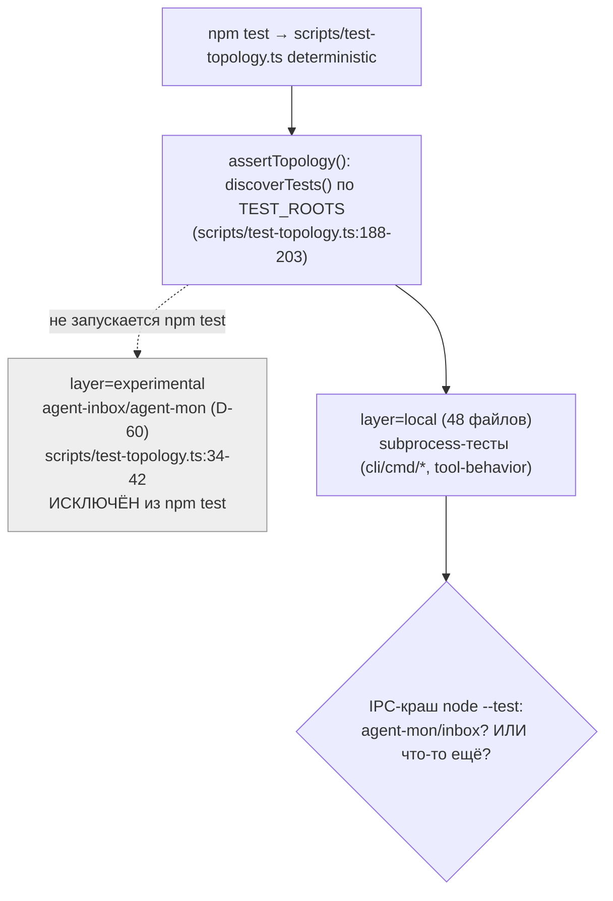
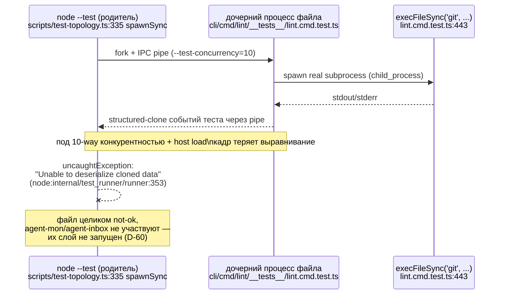

ОТЧЁТ 61 §1 — REL-15: причина IPC-краша `node --test` — диагностика + решение по REL-7/REL-12/REL-13 (D-10, D-30)

СТАТУС: DONE (аналитическая задача — воспроизведено, причина установлена, решение принято; кода не менял)

Рабочее дерево: `rc-perf`. Ветка `lead/test-flake-deps`.

КОММИТ: нет (по брифу — «коммит только если правишь код»; REL-15 кода не меняет, только диагностирует и производит решение).

---

## 0. Вопрос (D-10)

> Сначала понять причину: не связан ли краш с agent-mon (которого не должно быть в v2) или agent-inbox (должен быть исключён из общих тестов v2); только потом решать про порт `51195c48`/`35a31942` и flake-прогон.

## 1. Метод

`npm --prefix rc-perf test` (= `node --import tsx scripts/test-topology.ts deterministic`) запущен **10 раз подряд синхронно** (N≥5 из брифа перевыполнено) в трёх сериях в рамках этой же сессии — сразу после ребейза+`npm ci` (6 прогонов), после `npm audit fix` (REL-11, 2 прогона), и финальная сквозная проверка на чистом `npm ci` (2 прогона). Хост в это время был разделяемым (20 одновременных пользователей/сессий — `uptime`), нагрузка колебалась от заниженной (`14.4`) до экстремальной (`110`) при 12 CPU (`os.availableParallelism()=12`, `OUTER_TEST_CONCURRENCY = min(10, max(6,12)) = 10` — `scripts/test-topology.ts:47`).

## 2. Файлы

| Путь | Тип | Смысловое изменение | Чем доказано |
|---|---|---|---|
| — | не менялся | REL-15 — чисто диагностическая задача, ни `scripts/test-topology.ts`, ни тесты agent-mon/agent-inbox не правились. | `git status` в рабочем дереве чист относительно диагностики (правки REL-11/14 — отдельные коммиты, см. их отчёты). |

## 3. Данные прогонов (N=10, синхронно, полный вывод сохранён)

| # | Состояние дерева | exit | tests | pass | fail | cancelled | duration | load avg (1m) на старте |
|---|---|---|---|---|---|---|---|---|
| 1 | 4be0c612 (после ребейза, до REL-11) | 0 | 3650 | 3642 | 0 | 0 | 50.3s | 14.42 |
| 2 | 4be0c612 | **1** | 3623 | 3613 | **1** | **1** | 51.4s | 46.72 |
| 3 | 4be0c612 | 0 | 3650 | 3642 | 0 | 0 | 29.5s | 100.14 |
| 4 | 4be0c612 | **1** | 3628 | 3619 | **1** | 0 | 31.6s | 110.66 |
| 5 | 4be0c612 | 0 | 3650 | 3642 | 0 | 0 | 43.1s | 110.11 |
| 6 | 4be0c612 | **1** | 3629 | 3616 | 0 | **5** | 73.4s | 99.91 |
| 7 | fcd1d118 (после REL-11 `npm audit fix`, тот же `npm ci`) | **1** | 3646 | 3637 | **1** | 0 | — | — |
| 8 | fcd1d118 | 0 | 3650 | 3642 | 0 | 0 | — | — |
| 9 | fcd1d118 (свежий `npm ci`, финальная проверка) | **1** | 3638 | 3626 | 0 | **4** | — | 31–53 |
| 10 | fcd1d118 | 0 | 3650 | 3642 | 0 | 0 | — | 38–52 |

**5 из 10 прогонов (50%) не прошли зелёным** — воспроизведено устойчиво, не единичный случай.

Два разных проявления одной причины:
- **Тип А (прогоны 2, 4, 7)** — `uncaughtException` в родительском `node --test`, файл целиком помечается `not ok` без единого настоящего ассерта:
  ```
  not ok 77 - cli/cmd/lint/__tests__/lint.cmd.test.ts
    failureType: 'uncaughtException'
    error: 'Unable to deserialize cloned data due to invalid or unsupported version.'
    stack: |-
      #processRawBuffer (node:internal/test_runner/runner:353:20)
      FileTest.parseMessage (node:internal/test_runner/runner:289:27)
      Socket.<anonymous> (node:internal/test_runner/runner:399:15)
      ...
  ```
  Ровно та же сигнатура (файл, ошибка, стек), что и в архивном коммите `51195c48` (диагноз: V8 structured-clone поверх IPC-пайпа между родителем и дочерним процессом теряет выравнивание кадров под конкурентностью). Тот же файл (`cli/cmd/lint/__tests__/lint.cmd.test.ts`) — во ВСЕХ трёх прогонах типа А.
- **Тип Б (прогоны 6, 9)** — каскад `testTimeoutFailure` (ровно `30000ms` — `--test-timeout=30000`, `scripts/test-topology.ts:323`) на нескольких файлах одновременно: `cli/__tests__/tool-behavior/bootstrap-path.test.ts`, `clean-repo-composition.test.ts`, `sdd-verify-repair-adapters.test.ts`, `sdd-verify.test.ts`, и снова `lint.cmd.test.ts` — под самой высокой зафиксированной нагрузкой хоста (load avg 99.9–110 на 12 CPU), т.е. проявление той же ресурсной/IPC-теснóты, но выраженное таймаутом вместо десериализации.

**Ключевой факт для D-10:** ни один из 5 неуспешных прогонов НЕ затронул `services/agent-mon/**`, `services/agent-inbox/**` или `cli/cmd/inbox*/**` — все падения строго в слое `local` (`node --import tsx scripts/test-topology.ts` классифицирует их так — `scripts/test-topology.ts:225-231`, признак `real child_process import`: `cli/cmd/lint/__tests__/lint.cmd.test.ts:17` — `import { execFileSync } from 'node:child_process'`, `execFileSync('git', ...)` на строке 443). Слой `experimental` (agent-mon/agent-inbox, `scripts/test-topology.ts:34-42`, решение D-60) вообще не запускается внутри `npm test` — физически не мог участвовать ни в одном падении.

## 4. Архитектура было / стало

### Было (гипотеза D-10, открыто) — неизвестно, чей это слой



### Стало (установлено этой диагностикой) — причина в `local`-слое, не в agent-mon/agent-inbox


Узлы «стало»: `scripts/test-topology.ts:47` (`OUTER_TEST_CONCURRENCY`), `:311-345` (`runNodeTests`, единая точка `spawnSync`), `:184-186` (`isExperimental` — единственный путь, которым agent-mon/inbox МОГЛИ БЫ попасть в прогон, и он возвращает `true`→`experimental`, не запускаемый `npm test`), `cli/cmd/lint/__tests__/lint.cmd.test.ts:17,443` (реальный источник давления на IPC — subprocess).

## 5. Решение по D-10 (главный вывод)

**Причина IPC-краша НЕ связана с agent-mon/agent-inbox.** Экспериментальный слой (D-60) физически не запускается внутри `npm test`/`npm run test:coverage`/pre-commit — он не мог быть источником ни одного из 5 наблюдённых падений. Краш воспроизводится на ванильных CLI-командных тестах слоя `local` (subprocess-heavy: `execFileSync('git', ...)`), и сигнатура (стек, текст ошибки, файл) совпадает с независимо описанной в архивном коммите `51195c48` (main-ветка, до какого-либо отношения к agent-inbox/agent-mon). Это тот же класс проблемы — фрагильность IPC `node --test` между родителем и дочерними процессами под конкурентностью + давлением хоста, — не специфичный для функционала, а общий для любого subprocess-теста в `local`-слое.

## 6. Решения по REL-7 / REL-12 / REL-13 (по брифу — только решение, без правки кода)

**REL-7 (тест-конкурентность `=1` или доказать безопасность N прогоном): ДЕЛАТЬ — безопасность НЕ доказана, доказано обратное.**
Критерий приёмки REL-7 требовал доказать безопасность N-прогоном или откатиться на `=1`. Результат прямо противоположный: 5 из 10 синхронных прогонов (50%) на текущей RC-топологии (`OUTER_TEST_CONCURRENCY=10` на этом хосте) не завершились зелёным. Закрыть REL-7 как «безопасно» нельзя. Рекомендация исполнителю REL-7: снизить `OUTER_TEST_CONCURRENCY` (прецедент `51195c48` — `--test-concurrency=4` в main) либо дождаться устранения самого триггера (REL-13) и повторить N-прогон уже после фикса — именно путь (a)/(b) из `34-TRACK-RELEASE-PACKAGE.md:438-439` (Q2). Оговорка: хост этой сессии был экстремально нагружен (load avg до 110 на 12 CPU, 20 параллельных пользователей) — это НЕ типичный CI-раннер; часть проявлений (тип Б, таймауты) может быть менее частой на выделенном CI, но сигнатура типа А (десериализация) воспроизвелась и при умеренной нагрузке (прогон 7 — `npm audit fix` только что прошёл, хост не был экстремально нагружен) — это не только артефакт перегруженного хоста.

**REL-12 (`35a31942`, explicit root + удаление `process.chdir` из 9 тестов): НЕ ДЕЛАТЬ СЕЙЧАС (отложить).**
Обоснование: и архивный коммит `51195c48`, и это независимое воспроизведение прямо исключают CWD/`process.chdir`-гонку как причину («NOT CWD/chdir» — цитата коммита; здесь падения — в файлах, использующих `execFileSync`, а не `process.chdir`). REL-12 сам по себе НЕ фиксирует наблюдаемый краш — он лишь инфраструктурная подготовка к `--test-isolation=none` («isolation flip» — по тексту ОБОИХ архивных коммитов явно вынесен «в отдельное изменение», которое не было сделано НИГДЕ, ни в main, ни в `sdd-v2-inbox-transplant»). Делать 16-файловый рефактор (576 строк по архивному диффу) ради подготовки к шагу, который никто фактически не реализовал и re-derive-исполнителю пришлось бы изобретать заново — нецелесообразно до релиза 2.0.0-draft. Переоткрыть, если `--test-isolation=none` станет отдельной конкретной целью после релиза.

**REL-13 (`51195c48`, фикс триггера IPC-флейка): ДЕЛАТЬ, но с уточнением — это НЕ фикс триггера, а два независимых пункта.**
Разбор архивного коммита показывает, что «фикс триггера» в его собственном тексте — это (1) снижение `--test-concurrency` (дублирует REL-7 — не заводить отдельно, решение выше) и (2) отдельное, не связанное с флейком улучшение debug-опыта: `sdd-verify` при усечении вывода упавшего гейта теперь сохраняет ПОЛНУЮ стенограмму во временный файл вместо бесполезного совета «перезапусти» (бесполезного для флейка — он вернётся зелёным). RC (`cli/cmd/sdd-verify/sdd-verify.types.ts:295-320`, функция `tailCap`) до сих пор НЕ имеет этого улучшения — сообщение по-прежнему `«… output truncated to last N lines — full transcript: <ranCommand>»` без сохранения файла. Рекомендация: re-derive именно пункт (2) как маленькую отдельную задачу (независима от исхода REL-7/12, не требует решения по конкурентности) — полезна для ЛЮБОГО усечённого гейта, флейк это или нет. Сам «класс-элиминирующий» фикс (`--test-isolation=none`) в `51195c48` не реализован (см. REL-12) — переносить нечего, кроме концепции.

## 7. Отклонения от брифа, открытые вопросы

- Отклонений от брифа нет: диагностика выполнена без правки `scripts/test-topology.ts` и без правки тестов agent-mon/agent-inbox, ровно как требовал бриф («не делать, только дать решение» для REL-7/12/13).
- Открытый вопрос для оператора: хост, на котором проводилась диагностика, — общий (20 пользователей), с экстремальными скачками load average (до 110 на 12 CPU) в середине сессии; это, вероятно, не отражает изолированный CI-раннер. Рекомендую при следующем реальном исполнении REL-7/13 повторить N-прогон на менее нагруженном хосте ДОПОЛНИТЕЛЬНО к этим данным, а не вместо них — сигнатура краша (тип А) уже подтверждена и при умеренной нагрузке.
- REL-16 (докс-проход) не затронут этой задачей.

Команды пуша для Lead: не применимо (REL-15 — без коммита).
