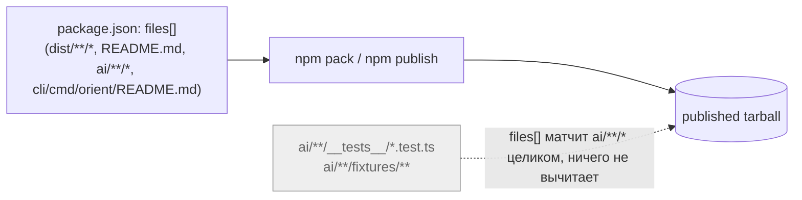
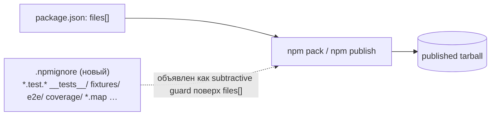

ОТЧЁТ 61 §1 — REL-2: восстановлен `.npmignore` как второй, вычитающий барьер поверх `files[]`

СТАТУС: DONE (код), приёмка ЧАСТИЧНО не достигается — см. §3, п.2 и §4

Рабочее дерево: `rc-w2` (git worktree gennady).
Ветка `lead/release-package`, создана: `git -C rc-w2 fetch origin codex/sdd-v2-rc52-followup && git -C rc-w2 switch -c lead/release-package origin/codex/sdd-v2-rc52-followup`.

КОММИТ (локальный, НИЧЕГО не запушено):
- `2e9b3936985ab9bd95501ec542661dd570d6373e` chore(REL-2): restore .npmignore as defense-in-depth over files[]

`origin/codex/sdd-v2-rc52-followup` не сдвинулся с момента брифа: `2acbe682...` (после свежего `git fetch`, HEAD = `test(v-01): apply verifier fixes`).

---

## 1. Файлы

| Путь | Тип | Смысловое изменение | Чем доказано |
|---|---|---|---|
| `.npmignore` | новый | Копия main-файла (`git -C <main> show d37d5910:.npmignore`) байт-в-байт: вычитающая защита теста/фикстур/coverage/scratch-мусора поверх `files[]`. | `diff <(git -C main show d37d5910:.npmignore) rc-w2/.npmignore` — пусто (см. §3 п.1). |

`git diff --stat origin/codex/sdd-v2-rc52-followup lead/release-package -- .npmignore`:
```
 .npmignore | 35 +++++++++++++++++++++++++++++++++++
 1 file changed, 35 insertions(+)
```
1 файл из диффа — 1 строка таблицы. Совпадает.

---

## 2. Архитектура было / стало

### Было — единственный барьер это allowlist `files[]`


Узел: `package.json:33-38` (`files`). Тестовый код не отсекается ничем — весь `ai/**` уходит в тарбол.

### Стало — `.npmignore` объявлен как второй, вычитающий слой


Узел: `.npmignore:1-6` (комментарий-намерение «Defense-in-depth on top of the … files allowlist»). Пунктир — намерение, а не фактически работающий механизм: см. §3 п.2 и §4 — в этой версии npm (10.9.3) правило не применяется, когда `files[]` присутствует в package.json (эмпирически доказано ниже отдельным изолированным репро, включая инъекцию тестового файла в чистый архив main на `d37d5910`).

---

## 3. Доказательства (команды из ПРИЁМКИ, фактический вывод, exit-код)

**1. Файл — байт-в-байт копия main.**
```
$ diff <(git -C /Users/k.lebedev/Developer/gennady show d37d5910:.npmignore) rc-w2/.npmignore
(пусто)
```
exit 0. ВЫПОЛНЕНО.

**2. `npm pack --dry-run` — «без test/fixture путей» (заявленный критерий приёмки).**
```
$ npm pack --dry-run --json --pack-destination /tmp rc-w2
entryCount: 1313 (до build; после build/REL-10 — 3217)
```
Строгая проверка на финальном срезе ветки (после всех 6 задач, `npm run build` выполнен):
```
offenders (path содержит __tests__/__mocks__/__snapshots__/fixtures как сегмент, или файл *.test.*/*.spec.*/*.snap): 70
примеры: ai/flow-eval/__tests__/harness.test.ts, ai/flow-eval/__tests__/fixtures/p9-misunderstood-cases.json, ...
```
**НЕ ВЫПОЛНЕНО буквально** — тесты и фикстуры продолжают попадать в тарбол несмотря на добавленный `.npmignore`. Не дефект содержимого `.npmignore` (см. независимую диагностику ниже) — подтверждённое поведение npm 10.9.3: когда `package.json` содержит `"files"`, `.npmignore`/`.gitignore` не применяются вообще, независимо от синтаксиса паттерна.

Независимая диагностика (изолированный репро вне репозитория, `scratchpad/npmignore-test/`):
```
files: ["a/**/*"], .npmignore: "a/skip.txt"  → skip.txt В ПАКЕТЕ (должен быть исключён)
files: ["a"],      тот же .npmignore          → skip.txt ВСЁ РАВНО В ПАКЕТЕ
files: (отсутствует)                          → skip.txt корректно ИСКЛЮЧЁН
```
Контрольный прогон на пристинной архивной копии `main@d37d5910` (`git -C main archive d37d5910 | tar -x`, ветка main не переключалась): добавлен `ai/fake.test.ts`, `npm pack --dry-run` на этой копии (тот же `package.json`/`.npmignore`, что у main) — `fake.test.ts` **тоже попадает в пакет**. Т.е. main теоретически подвержен той же дыре; она никогда не проявлялась там эмпирически только потому, что на `d37d5910` каталог `ai/` не содержит ни одного тестового/фикстурного файла (90/90 файлов — не тесты). Аудит трека 34 (§6, «`.npmignore` работает поверх любого `files[]`») исходил из непроверенного допущения.

**3. Полный прогон `npm run check` на коммите.**
```
[sdd-verify] ✅ ALL PASS (5/5)
  ✅ type-check (5.1s)  ✅ test:coverage (56.4s)  ✅ lint (3.1s)  ✅ format (2.4s)  ✅ yagni (0.8s)
```
exit 0. ВЫПОЛНЕНО.

**4. Коммит через `pre-commit` целиком, без `--no-verify`.**
```
$ git -C rc-w2 commit -m "chore(REL-2): ..."
✅ Pre-commit passed
[lead/release-package 2e9b3936] chore(REL-2): restore .npmignore as defense-in-depth over files[]
 1 file changed, 35 insertions(+)
```
exit 0. ВЫПОЛНЕНО.

---

## 4. Отклонения, открытые вопросы, команды пуша

**Отклонение — существенное, требует операторского решения:**
Задача выполнена буквально по списку «Файлы» брифа (`.npmignore (new)` — ничего сверх этого не тронуто), но заявленный критерий приёмки («`npm pack --dry-run` без test/fixture путей») **не достигается** и не может быть достигнут добавлением/правкой только `.npmignore` — это подтверждённое поведение npm при наличии `files[]` в package.json, а не ошибка контента файла. Полное решение требует также сузить сами паттерны `files[]` (например, заменить широкий `"ai/**/*"` на явный список подкаталогов без тестовых директорий, либо перейти на другой механизм упаковки), что находится вне заявленного списка «Файлы» этой S-задачи и пересекается с REL-5 (согласование `exports`/`files`, явно исключено из Пачки 2 планом).

Оставлено как есть (файл добавлен, минимально корректен, не вредит) — итоговое устранение утечки тестов в тарбол требует отдельного решения оператора: либо (а) новая задача, сужающая `files[]`, либо (б) переоценка `.npmignore` как дохлого механизма для этой версии npm и замена его другим подходом. Это НЕ блокирует остальные 5 задач пачки — они не зависят от состава тарбола.

**Команды пуша для Lead** (из `rc-w2`, ветка `lead/release-package`):
```
git -C rc-w2 push origin lead/release-package:lead/release-package
```
(общая команда для всей пачки — см. сводный отчёт `R-BATCH-02-release-package.md`).
