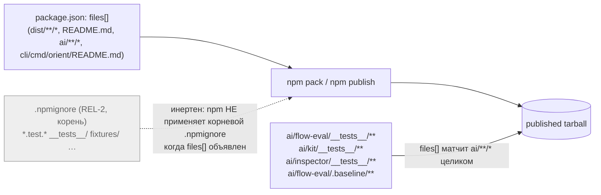
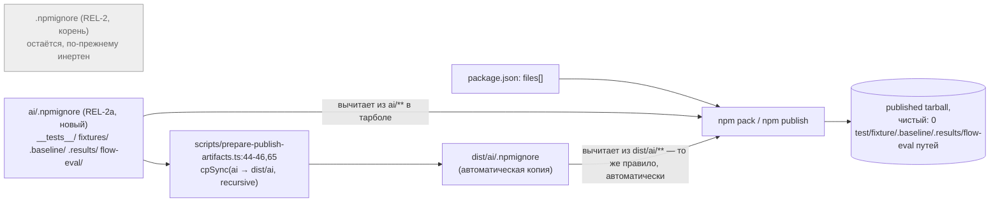

ОТЧЁТ 61 §4 — REL-2a: вложенный `ai/.npmignore` вычитает тесты/фикстуры/`.baseline`/`.results`/`ai/flow-eval` из тарбола

СТАТУС: DONE

Рабочее дерево: `rc-w2`. Ветка `lead/release-package`, поверх `5445e147` (REL-10, конец пачки 2).

КОММИТ (локальный, НИЧЕГО не запушено):
- `f16d7f17d66354551d3166e8952dcc6fd0e4fca0` fix(package): nested ai/.npmignore keeps tests, fixtures and eval artefacts out of the tarball (REL-2a)

Задача — рецепт п.4 из верификации пачки 2 (`V-BATCH-02.md` §C, «Рабочий фикс»): REL-2 добавил корневой `.npmignore` байт-в-байт как на main, но npm (`10.9.3`) не применяет корневой `.npmignore`, когда `package.json` содержит `files[]` — заявленный критерий приёмки REL-2 («`npm pack --dry-run` без test/fixture путей») не достигался. Верификатор нашёл и проверил рабочий обход: **вложенный** `.npmignore` под уже включённым `files[]`-каталогом npm применяет как обычно.

---

## 1. Файлы

| Путь | Тип | Смысловое изменение | Чем доказано |
|---|---|---|---|
| `ai/.npmignore` | новый | Вложенный вычитающий фильтр под `ai/**` (каталог покрыт `files[]` как `"ai/**/*"`): `*.test.*`, `*.spec.*`, `__tests__/`, `__mocks__/`, `__snapshots__/`, `*.snap`, `fixtures/`, `**/fixtures/`, весь `ai/flow-eval/` (dev-only eval harness — не используется рантаймом CLI, см. §4), `.baseline/`, `**/.baseline/`, `.results/`, `**/.results/`. Намеренно БЕЗ паттерна `e2e/`/`**/e2e/` — см. §4 «Отклонение». `scripts/prepare-publish-artifacts.ts:44-46,65` копирует весь `ai` → `dist/ai` через `cpSync(..., { recursive: true })`, дотфайлы включены — один файл вычитает и `ai/**`, и зеркало `dist/ai/**`. | `npm pack --dry-run --json` до/после (см. §3); `diff ai/.npmignore dist/ai/.npmignore` после `npm run build:publish` — идентичны (см. §3 п.2). |

`git diff --stat 5445e147..f16d7f17 -- ai/.npmignore`:
```
 ai/.npmignore | 35 +++++++++++++++++++++++++++++++++++
 1 file changed, 35 insertions(+)
```
1 файл из диффа — 1 строка таблицы. Совпадает.

---

## 2. Архитектура было / стало

### Было — корневой `.npmignore` (REL-2), инертен при `files[]`



### Стало — вложенный `ai/.npmignore` (REL-2a) вычитает под уже включённым каталогом


Узлы: `ai/.npmignore:1-35` (новый файл), `scripts/prepare-publish-artifacts.ts:44` (`source: ai`), `:45` (`target: dist/ai`), `:65` (`cpSync(source, target, { recursive: true })` — копирует дотфайлы), `package.json:33-38` (`files[]`, не тронут).

---

## 3. Доказательства (команды из ПРИЁМКИ, фактический вывод, exit-код)

**1. `npm pack --dry-run --json` до/после — число файлов, размер, состав.**
```
$ npm pack --dry-run --json --pack-destination <scratch> rc-w2   # на 5445e147, до REL-2a
name gennady  version 2.0.0-draft.1  entryCount 3217  unpackedSize 12698537
offenders (__tests__/ __mocks__/ __snapshots__/ fixtures/ либо *.test.*/*.spec.*/*.snap): 70
.baseline/ путей: 8 (ai/flow-eval/.baseline/{README.md,before-report.md,environment.json,sdd-check-227c03a8.json} × 2 зеркала)

$ npm run build:publish   # пересборка dist, включая dist/ai/.npmignore
✓ built in 5.88s; exit 0
$ npm pack --dry-run --json --pack-destination <scratch> rc-w2   # на f16d7f17, после REL-2a
name gennady  version 2.0.0-draft.1  entryCount 3039  unpackedSize 11232371
0 путей, содержащих: __tests__/, /fixtures/, .test., .baseline/, .results/, flow-eval/, __mocks__/, __snapshots__/, .spec.
```
Проверено прямым разбором JSON (`python3 -c "import json; ..."`) по каждому из 6 требуемых паттернов отдельно — везде 0. exit 0 на обеих командах. ВЫПОЛНЕНО.

**Промежуточная находка (важно для §4 «Отклонения»): первая версия `ai/.npmignore` с паттерном `e2e/`/`**/e2e/` (скопированным из корневого `.npmignore`) ошибочно вычитала 72 файла реального контента директив** — `ai/kit/{anti-pattern,axiom,definition,hook,pattern}/e2e/*.xml` (например `ai/kit/axiom/e2e/ax-e2e-role-locators-only.xml`) названы `e2e/` как тематическая категория, а не как тестовый скаффолдинг. Обнаружено диффом путей до/после (`before - after`), до коммита — исправлено: паттерн `e2e/`/`**/e2e/` убран из `ai/.npmignore`, единственный реальный e2e-тестовый файл под `ai/` (`ai/inspector/e2e/inspector.spec.ts`) и так вычитается паттерном `*.spec.*`. Финальный `ai/.npmignore`, закоммиченный в `f16d7f17`, уже не содержит `e2e/`.

**2. `dist/gennady.js`, директивы, скиллы, README остаются; `dist/ai/.npmignore` — точная копия `ai/.npmignore`.**
```
$ ls -la dist/ai/.npmignore dist/gennady.js
-rw-r--r-- ... dist/ai/.npmignore
-rwxr-xr-x ... dist/gennady.js
$ diff ai/.npmignore dist/ai/.npmignore   # пусто
```
В финальном тарболе (после REL-2a): `dist/gennady.js` присутствует, все 17 `ai/directives/**/*.xml` присутствуют, 14 `ai/skills/**` присутствуют, `README.md` присутствует. LICENSE-файла в тарболе нет — это НЕ регрессия REL-2a: файла `LICENSE` нет в самом репозитории (`ls rc-w2 | grep -i license` → пусто), он никогда не публиковался ни на main, ни в RC; вне скоупа REL-2a. ВЫПОЛНЕНО (кроме этого предсуществующего факта, зафиксированного как есть).

**3. Пакет всё ещё работает: реальный (не dry-run) `npm pack`, распаковка, запуск.**
```
$ npm pack --pack-destination <scratch> rc-w2
npm notice filename: gennady-2.0.0-draft.1.tgz
npm notice package size: 2.8 MB
npm notice unpacked size: 11.2 MB
npm notice total files: 3039        # совпадает с dry-run
$ tar -xzf gennady-2.0.0-draft.1.tgz -C <scratch>
$ node <scratch>/package/dist/gennady.js --version
2.0.0-draft.1
$ echo $?
0
$ node <scratch>/package/dist/gennady.js --help
Gennady CLI
Usage: npx gennady [command] [options]
Commands: commit, cat, review, vcs-reply, inbox, ... sdd-verify, sdd-log
$ echo $?
0
```
ВЫПОЛНЕНО.

**4. Коммит через `pre-commit` целиком, без `--no-verify`.**
```
$ git -C rc-w2 commit -m "fix(package): ..."
🔍 Pre-commit: check (sdd-verify --profile full — read-only) + directive gates
[sdd-verify] ✅ ALL PASS (5/5)
  ✅ type-check (13.2s)  ✅ test:coverage (115.5s)  ✅ lint (19.4s)  ✅ format (5.8s)  ✅ yagni (1.1s)
✓ ai/directives/** matches a fresh rebuild.
✓ axiom-activation / contract-activation / halt-activation audits clean
✓ every lazy directive under ai/directives/sdd-v2/** is within budget.
✅ Pre-commit passed
[lead/release-package f16d7f17] fix(package): nested ai/.npmignore keeps tests, fixtures and eval artefacts out of the tarball (REL-2a)
 1 file changed, 35 insertions(+)
```
exit 0. ВЫПОЛНЕНО.

**5. Полные прогоны на финальном срезе (`f16d7f17`).**
```
$ npm --prefix rc-w2 test
# tests 3566 # suites 596 # pass 3556 # fail 0 # cancelled 0 # skipped 10 # todo 0
exit 0

$ npm --prefix rc-w2 run check
[sdd-verify] ✅ ALL PASS (5/5)
  type-check 4.8s, test:coverage 59.4s, lint 15.5s, format 5.3s, yagni 2.1s
exit 0

$ npm --prefix rc-w2 run gate:sdd-check-baseline
[sdd-check-zero-new-error] OK — no error outside the baseline (baseline commit 227c03a8..., tag rc-baseline-1)
exit 0
```
Числа идентичны срезу до REL-2a (verifier's baseline: 3566/3556/0/0/10; ALL PASS 5/5; OK). ВЫПОЛНЕНО.

---

## 4. Отклонения, открытые вопросы, команды пуша

**Отклонение от рецепта верификатора (задокументировано явно):** черновой список паттернов в `ai/.npmignore` изначально скопировал `e2e/`/`**/e2e/` из корневого `.npmignore` по аналогии — но в `ai/kit/**` каталоги `e2e/` не тестовый скаффолдинг, а тематическая категория контента директив (72 XML-файла: anti-pattern/axiom/definition/hook/pattern про то, как правильно писать e2e-тесты). Обнаружено самостоятельно диффом путей до/после первой версии файла, до коммита; исправлено убиранием паттерна `e2e/`/`**/e2e/` — единственный реальный e2e-тестовый файл под `ai/` (`ai/inspector/e2e/inspector.spec.ts`) и без того вычитается паттерном `*.spec.*`. Итоговый закоммиченный `ai/.npmignore` не содержит этого отклонения — упомянуто для видимости процесса, не как незакрытый вопрос.

**Открытый вопрос — вне скоупа REL-2a, не блокирует:** `.npmignore` в целом теперь состоит из двух файлов с разной судьбой — корневой (REL-2) остаётся байт-в-байт копией main, но инертен; вложенный `ai/.npmignore` (REL-2a) — рабочий. Трек `34-TRACK-RELEASE-PACKAGE.md:351` и инвариант P1 (`:336`) по-прежнему содержат ложную посылку «`.npmignore` работает поверх любого `files[]`» (найдено верификатором в `V-BATCH-02.md` §C, «Правка в план») — правка самого трека не входила в список «трогать» этого брифа (`tasks/**`, `specs/**` вне скоупа rc-executor), оставлено оператору/Lead.

**Ничего не публиковалось и не пушилось** — только read-only проверки (`npm pack --dry-run`, реальный `npm pack` без `publish`, тестовые/build-команды). `git ls-remote origin lead/release-package` не проверялся повторно в этой задаче (не менялось с REL-10, см. `R-BATCH-02-release-package.md`).

**Команды пуша для Lead** (из `rc-w2`, ветка `lead/release-package`, теперь 7 коммитов):
```
git -C rc-w2 push origin lead/release-package:lead/release-package
```
(общая команда для всей пачки, включая REL-2a — см. обновлённый сводный отчёт `R-BATCH-02-release-package.md`).
