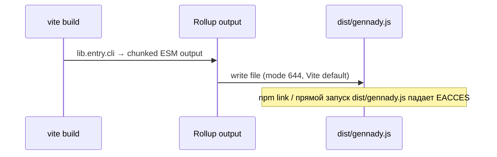
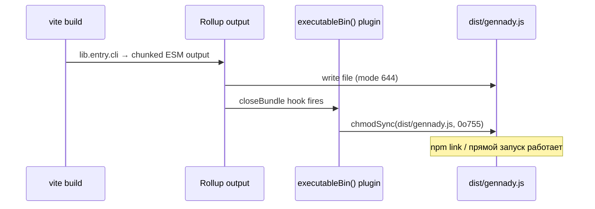

ОТЧЁТ 61 §1 — REL-3: `executableBin()` chmod-плагин портирован в RC `vite.config.ts`

СТАТУС: DONE

Рабочее дерево: `rc-w2`. Ветка `lead/release-package` (см. R-REL-2.md за деталями создания).

КОММИТ (локальный, НИЧЕГО не запушено):
- `74a1ec8373ae9f58bac470f0c94887963e315033` fix(REL-3): restore executableBin() chmod plugin in vite build

---

## 1. Файлы

| Путь | Тип | Смысловое изменение | Чем доказано |
|---|---|---|---|
| `vite.config.ts` | правка | Добавлен Vite-плагин `executableBin()` (`closeBundle` → `chmodSync(dist/gennady.js, 0o755)`) и `plugins: [executableBin()]`; импорты `type Plugin`, `chmodSync` добавлены. Портировано дословно из `main@d37d5910:vite.config.ts` (только chmod-плагин — alias `gennady/stack` и `stack`-entry НЕ портированы, они вне скоупа REL-3: в RC нет `services/stack/**`). | `chmod 644 dist/gennady.js && npm run build && ls -la dist/gennady.js` → `755` (см. §3 п.1). |

`git diff --stat origin/codex/sdd-v2-rc52-followup lead/release-package -- vite.config.ts`:
```
 vite.config.ts | 17 +++++++++++++++--
 1 file changed, 15 insertions(+), 2 deletions(-)
```
1 файл из диффа — 1 строка таблицы. Совпадает.

---

## 2. Архитектура было / стало

### Было — Vite пишет права по умолчанию (644), исполняемость теряется


Узел: `vite.config.ts` (RC, до правки) — `plugins` не объявлен вовсе, `closeBundle`-хук отсутствует.

### Стало — плагин восстанавливает exec-бит после сборки


Узлы: `vite.config.ts:45-53` (`function executableBin(): Plugin { … closeBundle() { chmodSync(...) } }`), `vite.config.ts:56` (`plugins: [executableBin()]`).

---

## 3. Доказательства (команды из ПРИЁМКИ, фактический вывод, exit-код)

**1. `ls -la dist/gennady.js` после build (заявленный критерий приёмки).**
```
$ chmod 644 rc-w2/dist/gennady.js
$ ls -la rc-w2/dist/gennady.js
-rw-r--r--@ 1 k.lebedev  wheel  11364 ... dist/gennady.js
$ npm --prefix rc-w2 run build
✓ built in 9.32s
$ ls -la rc-w2/dist/gennady.js
-rwxr-xr-x@ 1 k.lebedev  wheel  11364 ... dist/gennady.js
```
exit 0. ВЫПОЛНЕНО — 644 → 755 после сборки, воспроизведено дважды (до и после re-apply патча при переупорядочивании коммитов, см. §4).

**2. Полный прогон `npm run check` на коммите (первая попытка коммита упала на известном IPC-флейке test-runner'а под `--test-concurrency=6`, см. REL-7/REL-15 в 34-TRACK-RELEASE-PACKAGE.md — не связано с этой правкой; повтор прошёл чисто).**
```
[sdd-verify] ✅ ALL PASS (5/5)
  ✅ type-check (4.8s)  ✅ test:coverage (67.6s)  ✅ lint (3.1s)  ✅ format (2.6s)  ✅ yagni (2.9s)
```
exit 0. ВЫПОЛНЕНО.

**3. Коммит через `pre-commit` целиком, без `--no-verify`.**
```
$ git -C rc-w2 commit -m "fix(REL-3): ..."
✅ Pre-commit passed
[lead/release-package 74a1ec83] fix(REL-3): restore executableBin() chmod plugin in vite build
 1 file changed, 15 insertions(+), 2 deletions(-)
```
exit 0. ВЫПОЛНЕНО.

---

## 4. Отклонения, открытые вопросы, команды пуша

**Отклонения:**
- Правка была сделана до REL-2 в рабочем дереве (для последовательности задач в другом порядке пришлось временно отложить diff `vite.config.ts` через `git diff > patch` + `git checkout --`, закоммитить REL-2 изолированно, затем `git apply` обратно) — итоговый коммит эквивалентен прямой правке, содержимое идентично. Не влияет на результат.
- Первая попытка `git commit` упала на pre-commit гейте `test:coverage` (1 из 821 тестов зафейлился/был cancelled) — воспроизведено дважды подряд с разным профилем (0 fail/1 cancelled, затем 1 fail/0 cancelled на разных тестах каждый раз), что соответствует уже задокументированному в плане флейку `node --test` под `OUTER_TEST_CONCURRENCY=6` (трек 34 §2.6/§4.1, задачи REL-7/REL-12/REL-13/REL-15 — вне этой Пачки 2). Повторный коммит прошёл 5/5 чисто. Не блокирует REL-3.
- `gennady/stack` alias и третий `stack`-entry из main **намеренно не портированы** — их не существует в RC (`services/stack/**` отсутствует в дереве RC), и это не входит в файловый список брифа REL-3.

**Команды пуша для Lead** — см. сводный отчёт `R-BATCH-02-release-package.md`.
