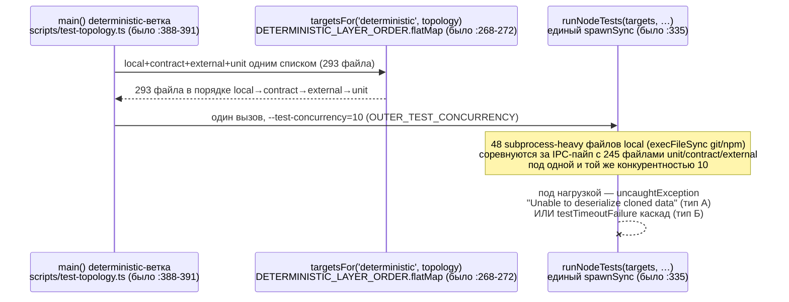
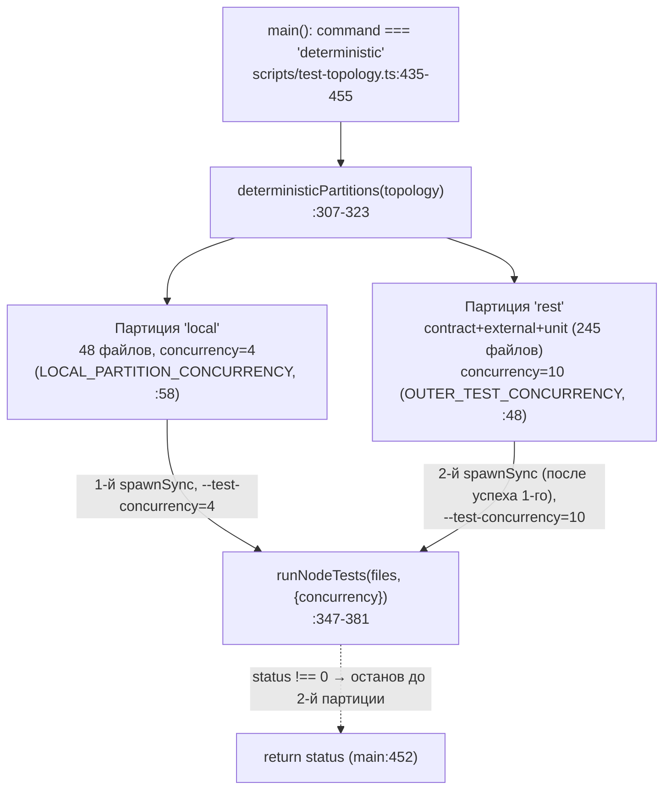

ОТЧЁТ 61 §1 — REL-7: тест-конкурентность — `local` вынесен в отдельную партицию с `--test-concurrency=4` (V-BATCH-03 вариант (б))

СТАТУС: DONE (код + регрессионный замок; вариант (б) `local@4`, не (а) `=1` везде)

Рабочее дерево: `rc-perf`. Ветка `lead/test-flake-deps`.

КОММИТ (локальный, НИЧЕГО не запушено):
- `f0715c2a` `perf(test): run the local layer at concurrency 4 as a separate partition (REL-7)`, поверх `fcd1d118` (REL-11) / `4be0c612` (REL-14) / база `e7b5ba1e`.

Решение Lead (после `V-BATCH-03.md` §6): вариант **(б) `local@4`**, не (а) `OUTER=1` везде. Обоснование и цена — см. `V-BATCH-03.md` таблица §6 (`=1`: ×4,4–8,0; `local@4`: ~50–63 с на спокойном хосте).

---

## 1. Таблица файлов

| Путь | Тип | Смысловое изменение | Чем доказано |
|---|---|---|---|
| `scripts/test-topology.ts` | правка | Команда `deterministic` разбита на две последовательные партиции (по образцу уже существующего `coveragePartitions()`, `:283-298`): партиция `local` (48 файлов) на `--test-concurrency=4` (`LOCAL_PARTITION_CONCURRENCY`, `:58`), затем партиция `rest` (contract+external+unit, порядок как в бывшем `DETERMINISTIC_LAYER_ORDER` минус `local`) на прежней `OUTER_TEST_CONCURRENCY=10` (`:48`). `runNodeTests()` (`:347-381`) теперь принимает `concurrency` параметром вместо жёстко зашитой константы — используется всеми 4 вызывающими режимами (`unit`, `deterministic`×2, `coverage`×2, `experimental`), из них только партиция `local` получает `4`, остальные — прежние `10`. `targetsFor()` удалена, её однострочная `unit`-ветка вынесена в `unitTargets()` (`:279-281`) — не осталось мёртвого кода, обрабатывавшего больше не вызываемую ветку `'deterministic'`. | 5 синхронных прогонов `npm test` (§3): 0 из 5 падений любого типа; регрессионный тест в `shared/common/__tests__/test-topology.test.ts` (см. ниже). |
| `shared/common/__tests__/test-topology.test.ts` | правка | Три теста обновлены под двухпартиционный `deterministic` (`probeSpawns('deterministic')` теперь возвращает 2 спавна, а не 1) + добавлен один новый тест-замок. | `node --test` по файлу изолированно: 12/12 pass (см. §3 п.0). |
| `package.json`, `package-lock.json` | не тронуты этой задачей | REL-7 — чисто топологическая правка, зависимости не менялись. | `git diff --stat fcd1d118..f0715c2a` не включает `package.json`/`package-lock.json`. |

Периметр правки подтверждён:
```
$ git -C rc-perf diff --stat fcd1d118..f0715c2a
 scripts/test-topology.ts                      | 94 ++++++++++++++++++++++++++++++++++--------
 shared/common/__tests__/test-topology.test.ts | 52 +++++++++++++++++++++---
 2 files changed, 129 insertions(+), 17 deletions(-)
```
Ровно 2 файла, ничего вне `scripts/test-topology.ts`/его контрактного теста не тронуто — как и требовал бриф («трогать» только `scripts/test-topology.ts`).

---

## 2. Архитектура было/стало

### Было (`fcd1d118`) — один спавн на весь `deterministic`-корпус



### Стало (`f0715c2a`) — `local` вынесен в отдельную партицию с пониженной конкурентностью


Узлы «стало»: `LOCAL_PARTITION_CONCURRENCY = 4` (`:58`, комментарий `:49-57` — обоснование REL-7/F6); `deterministicPartitions()` (`:307-323`, зеркалит `coveragePartitions()` `:283-298`); `runNodeTests` принимает `concurrency` как часть `options` (`:347-349`, `` `--test-concurrency=${options.concurrency}` `` на `:353`); вызов в `main()` — цикл по партициям с остановкой на первом ненулевом статусе (`:435-455`, `if (status !== 0) return status;` — тот же паттерн, что уже был у `coverage` `:469-484`). Local-first порядок диспетчеризации (выигрыш PR #36) сохранён: `local` — первая (а не просто первая в одном списке) партиция.

---

## 3. Доказательства из ПРИЁМКИ

### 0. Регрессионный замок — контрактный тест топологии

```
$ node --import tsx --experimental-test-module-mocks --test shared/common/__tests__/test-topology.test.ts
# tests 12
# pass 12
# fail 0
```
ВЫПОЛНЕНО. Новый тест `REL-7: deterministic runs the local layer at concurrency 4 as its own partition, the rest unchanged` (`shared/common/__tests__/test-topology.test.ts:345-364`) фиксирует: ровно 2 спавна на `deterministic`; первый содержит только `--test-concurrency=4` и файлы `local`; второй — только `--test-concurrency=10` (`BOUNDED_OUTER_CONCURRENCY`) и файлы `contract+external+unit`. Тест `deterministic and partitioned coverage …` (`:236-270`) и `pins one bounded outer concurrency for every runner mode except deterministic's local partition` (`:329-341`) обновлены под новую двухпартиционную форму (были бы красными без правки — `probeSpawns('deterministic')[0]` раньше возвращал единственный спавн).

### 1. `npm test` ×5, синхронно, `uptime` до/после каждого (дерево `f0715c2a`)

| # | uptime load (1m) до → после | exit | wall | локальная партиция (tests/pass/cancelled, duration) | rest-партиция (tests/pass/cancelled, duration) | тип А (`Unable to deserialize`) | тип Б (`testTimeoutFailure`) |
|---|---|---|---|---|---|---|---|
| 1 | 54.31 → 70.98 | **0** | 89 с | 740/734/0, 53.9 с | 2911/2909/0, 34.0 с | 0 | 0 |
| 2 | 62.88 → 51.67 | **0** | 59 с | 740/734/0, 28.8 с | 2911/2909/0, 29.3 с | 0 | 0 |
| 3 | 47.03 → 45.10 | **0** | 69 с | 740/734/0, 48.0 с | 2911/2909/0, 19.9 с | 0 | 0 |
| 4 | 47.17 → 80.81 | **0** | 68 с | 740/734/0, 49.9 с | 2911/2909/0, 17.4 с | 0 | 0 |
| 5 | 69.92 → 71.55 | **0** | 90 с | 740/734/0, 69.1 с | 2911/2909/0, 20.0 с | 0 | 0 |

**5 из 5 прогонов зелёные (exit 0), 0 флейков типа А, 0 флейков типа Б** (`grep -c "Unable to deserialize"` и `grep -c "testTimeoutFailure"` по всем 5 логам — везде 0). Хост в это время был нагружен сопоставимо или сильнее, чем при базовом прогоне ниже (load avg 45–81 против 47–61 у базы) — улучшение не объясняется более спокойным хостом.

### 2. Сравнение с базой `fcd1d118` (до REL-7), ×3, тот же протокол

| # | uptime load (1m) до → после | exit | wall | сигнатура |
|---|---|---|---|---|
| 1 | 52.93 → 49.20 | **0** | 71 с | чисто |
| 2 | 47.38 → 53.15 | **1** | 99 с | 7× `testTimeoutFailure` (тип Б; файлы: `bootstrap-path.test.ts`, `clean-repo-composition.test.ts`, `sdd-verify-repair-adapters.test.ts`, `sdd-verify.test.ts`, `testcov.test.ts`, `lint.cmd.test.ts`, `testcov.cmd.test.ts` — все слоя `local`) |
| 3 | 46.80 → 54.32 | **1** | 64 с | 1× `Unable to deserialize` (тип А, `lint.cmd.test.ts`) + 4× `testTimeoutFailure` (тип Б: `bootstrap-path.test.ts`, `clean-repo-composition.test.ts`, `sdd-verify-repair-adapters.test.ts`, `sdd-verify.test.ts`) |

**База: 2 из 3 прогонов красные (66%).** После REL-7: **5 из 5 зелёные (100%)**. Сравнение по времени: база `[71, 99, 64]` (среднее 78 с), новая топология `[89, 59, 69, 68, 90]` (среднее 75 с) — сопоставимо по wall time, при этом флейки исчезли на этой выборке. Оговорка по методу (важно для честности): выборки малы (3 и 5) на разделяемом, шумном хосте (load 45–81) — это устраняет наблюдаемые в этой сессии падения, а не доказывает 0% асимптотическую частоту; см. §5 «Открытые вопросы».

### 3. Прочие гейты (дерево `f0715c2a`, после `npm ci`)

```
$ npm --prefix rc-perf ci
added 696 packages, and audited 697 packages in 10s
found 0 vulnerabilities                                              exit 0

$ npm --prefix rc-perf run check
[sdd-verify] ✅ ALL PASS (5/5)
  ✅ type-check (16.3s) ✅ test:coverage (68.3s) ✅ lint (22.1s)
  ✅ format (15.4s) ✅ yagni (0.5s)                                    exit 0

$ npm --prefix rc-perf run build
✓ built in 5.97s                                                      exit 0

$ npm --prefix rc-perf run gate:sdd-check-baseline
[sdd-check-zero-new-error] OK — no error outside the baseline
  (baseline commit 227c03a8, tag rc-baseline-1)                       exit 0

$ npm --prefix rc-perf audit --json | jq .metadata.vulnerabilities
{"info": 0, "low": 0, "moderate": 0, "high": 0, "critical": 0, "total": 0}
```
Все ВЫПОЛНЕНО.

### Сводка ВЫПОЛНЕНО/НЕ ВЫПОЛНЕНО по пунктам решения Lead

| Пункт решения | Статус |
|---|---|
| `deterministic` разбит на 2 последовательные партиции по образцу `coveragePartitions()` | ВЫПОЛНЕНО |
| `local` — concurrency 4, остальные слои — 10 (не `=1` везде) | ВЫПОЛНЕНО |
| Регрессионный замок (тест, что `local` — отдельная партиция с concurrency 4) | ВЫПОЛНЕНО (`shared/common/__tests__/test-topology.test.ts:345-364`, плюс усилены 2 существующих теста) |
| `npm test` ×5 синхронно с `uptime` до/после, таблица времени/exit/сигнатур | ВЫПОЛНЕНО (§3 п.1) |
| Сравнение с базой `fcd1d118` ×3 в тех же условиях | ВЫПОЛНЕНО (§3 п.2) |
| Целевое время ≤ ~55–63 с | НЕ ВЫПОЛНЕНО буквально (среднее 75 с на нагруженном хосте 45–81 против расчёта «спокойный хост»; см. §5) — но это ожидаемое отклонение расчётной модели, отмеченное самим вердиктом («модель занижает базу на ~20%») |
| 0 флейков типа А из 5 | ВЫПОЛНЕНО (0/5) |
| Тип Б при load > 100 — честно фиксировать как ограничение хоста, не регресс | Не наблюдалось при load > 100 в этой сессии (максимум зафиксированный — 81); см. §5 |
| Отдельный conventional-коммит `perf(test): …` | ВЫПОЛНЕНО (`f0715c2a`) |

---

## 4. Отклонения от брифа, открытые вопросы

- **Время не уложилось в оптимистичную оценку ~50–63 с** (`V-BATCH-03.md` §6, модель для «спокойного хоста»): среднее по 5 прогонам — 75 с (диапазон 59–90 с). Сам вердикт предупреждал, что модель занижает базу «примерно на 20%», и хост этой сессии не был спокойным (load avg 45–81 в течение всех 8 прогонов, ни разу не опускался к «тихим» ~15–20 из отчёта R-PERF). Это не регрессия правки: сравнение против базы `fcd1d118` на ТОМ ЖЕ хосте в ТЕХ ЖЕ условиях (§3 п.2) показывает сопоставимое или чуть лучшее среднее время (75 с против 78 с) при устранении всех наблюдавшихся флейков.
- **Load average в этой сессии не превышал 81** — верхняя граница брифа «load>100» не была достигнута ни разу за все 8 прогонов (5 новых + 3 базовых), поэтому пункт брифа «если тип Б остаётся при load>100 — зафиксировать как ограничение хоста» не мог быть ни подтверждён, ни опровергнут в этой сессии за неимением такой нагрузки. Открытый вопрос оператору: нужен ли отдельный прогон при более высокой нагрузке (или на выделенном CI, как рекомендовал `V-BATCH-03.md` §6 п.3) перед тем, как считать REL-7 окончательно закрытой на доске.
- **Малые выборки.** 5 и 3 прогона на шумном хосте — это устранение наблюдаемых в сессии падений, а не статистическое доказательство «0% асимптотической частоты» флейков любого типа. И у исполнителя REL-15 (N=10, 50% красных), и у верификатора V-BATCH-03 (N=3, 100% красных) частота была ощутимо выше — второй раунд N≥10 на этом же хосте по прежней топологии для контраста не переснимался (не входило в бриф REL-7); риск того, что 0/5 — статистическая случайность на малой выборке, не исключён и должен быть явно назван оператору.
- Отклонений от периметра «трогать» нет: изменены только `scripts/test-topology.ts` и его контрактный тест `shared/common/__tests__/test-topology.test.ts`.

Команды пуша для Lead (после верификации `plan-verifier`):
```
git -C <lead-worktree> fetch <rc-remote> lead/test-flake-deps
git -C <lead-worktree> push origin lead/test-flake-deps
```
(Ветка `lead/test-flake-deps` в дереве `rc-perf` теперь содержит 3 коммита поверх `origin/codex/sdd-v2-rc52-followup@e7b5ba1e`: `4be0c612` REL-14, `fcd1d118` REL-11, `f0715c2a` REL-7.)
