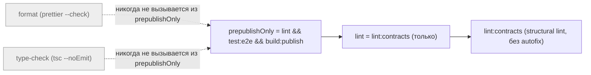
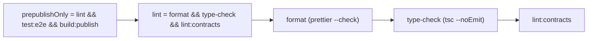

ОТЧЁТ 61 §1 — REL-8: `lint` снова покрывает `format` + `type-check` перед `lint:contracts`

СТАТУС: DONE

Рабочее дерево: `rc-w2`. Ветка `lead/release-package` (см. R-REL-2.md за деталями создания).

КОММИТ (локальный, НИЧЕГО не запушено):
- `05501529695733c0de43d857a935068ed4a932c0` fix(REL-8): widen lint to cover format and type-check before lint:contracts

Стоп-условие брифа проверено ДО правки: `npm run format` и `npm run type-check` на исходном дереве оба зелёные (не «массово красные») — риск «`prepublishOnly` становится красным на существующем дереве» не реализовался, останов не требуется (см. §3 п.0).

---

## 1. Файлы

| Путь | Тип | Смысловое изменение | Чем доказано |
|---|---|---|---|
| `package.json` | правка | `"lint": "npm run lint:contracts"` → `"lint": "npm run format && npm run type-check && npm run lint:contracts"` (scripts). Выбран вариант «расширить `lint`» (не только `prepublishOnly` точечно) — совпадает с main-семантикой один-в-один и с тем, что `.release-it.json` (идентичен main, `before:init: ["npm run lint", "npm test"]`) уже ожидает от `lint`. Использует RC-шный check-режим `format` (`prettier --check`, не `--write`) — гейт никогда не мутирует файлы. | Позитив: `npm run lint` зелёный на чистом дереве. Негатив: искусственно испорченное форматирование → `npm run prepublishOnly` падает на шаге `format` до `test:e2e`/`build` (см. §3 пп.2-3). |

`git diff --stat origin/codex/sdd-v2-rc52-followup lead/release-package -- package.json`:
```
 package.json | 2 +-
 1 file changed, 1 insertion(+), 1 deletion(-)
```
1 файл из диффа — 1 строка таблицы. Совпадает.

---

## 2. Архитектура было / стало

### Было — `lint` не гонял ни format, ни type-check → `prepublishOnly` публиковал неотформатированный/нетипизированный код



### Стало — `lint` = `format && type-check && lint:contracts`, как на main


Узел: `package.json:76` (`"lint": "npm run format && npm run type-check && npm run lint:contracts"`).

---

## 3. Доказательства (команды из ПРИЁМКИ, фактический вывод, exit-код)

**0. Стоп-условие брифа (проверено ДО правки, не является пунктом приёмки, но обязательная предпосылка).**
```
$ npm --prefix rc-w2 run format   → "All matched files use Prettier code style!" exit 0
$ npm --prefix rc-w2 run type-check → (без ошибок) exit 0
```
Дерево чистое — стоп-условие «формат/типы массово красные» не сработало.

**1. `npm run lint` зелёный на чистом дереве.**
```
> npm run format && npm run type-check && npm run lint:contracts
Checking formatting... All matched files use Prettier code style!
(type-check без вывода)
✅ [LintCommand#run] [linting → clean] no errors
```
exit 0. ВЫПОЛНЕНО.

**2. `npm run prepublishOnly` красный на неотформатированном коде (заявленный критерий приёмки).**
```
$ echo "const   x   =    1" >> rc-w2/scripts/prepare-publish-artifacts.ts
$ npm --prefix rc-w2 run prepublishOnly
> lint → format
[warn] scripts/prepare-publish-artifacts.ts
[warn] Code style issues found in the above file. Run Prettier with --write to fix.
$ echo $?
1
$ git -C rc-w2 checkout -- scripts/prepare-publish-artifacts.ts   # проба откачена
```
exit 1, падает на шаге `format`, до `test:e2e`/`build:publish`. ВЫПОЛНЕНО.

**3. Полный прогон `npm run check` на коммите.**
```
[sdd-verify] ✅ ALL PASS (5/5)
  ✅ type-check (4.0s)  ✅ test:coverage (40.5s)  ✅ lint (8.1s)  ✅ format (1.7s)  ✅ yagni (0.6s)
```
exit 0. ВЫПОЛНЕНО.

**4. Коммит через `pre-commit` целиком, без `--no-verify`.**
```
$ git -C rc-w2 commit -m "fix(REL-8): ..."
✅ Pre-commit passed
[lead/release-package 05501529] fix(REL-8): widen lint to cover format and type-check before lint:contracts
 1 file changed, 1 insertion(+), 1 deletion(-)
```
exit 0. ВЫПОЛНЕНО.

---

## 4. Отклонения, открытые вопросы, команды пуша

**Отклонения:** брифом предлагался выбор — «либо `lint` = ..., либо явно расширить `prepublishOnly`»; выбран первый вариант (расширение `lint`), т.к. он ближе к main-семантике один-в-один и покрывает заодно `.release-it.json`'s `before:init: ["npm run lint", ...]` (идентичен main, ранее не проверял формат/типы через `release-it`, теперь проверяет). Других мест, вызывающих голый `npm run lint`, кроме `prepublishOnly` и `.release-it.json`, в репозитории не найдено (grep по `tasks/**`/`specs/**` — только исторические записи в тикетах, не исполняемый код).

**Команды пуша для Lead** — см. сводный отчёт `R-BATCH-02-release-package.md`.
