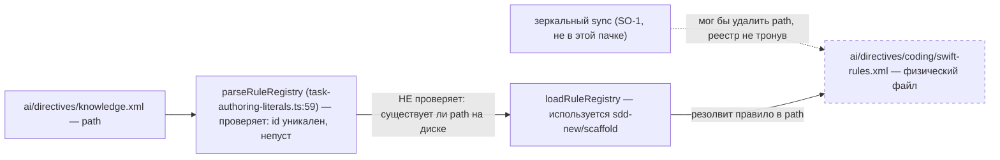
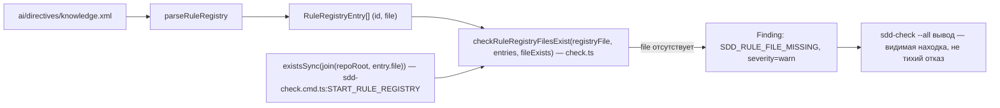

ОТЧЁТ 32/SO-11 — `<Rule><File>` существования замок, `SDD_RULE_FILE_MISSING` (Пачка 1)

СТАТУС: DONE

Рабочее дерево: `rc-v6`, ветка `lead/sync-no-loss` (продолжение после `c012e511`, `5678c307`).

КОММИТ (локальный, НИЧЕГО не запушено):
- `b3f927c1` feat(sdd-check): SO-11 — SDD_RULE_FILE_MISSING for a dangling <Rule><File>

---

## 1. Файлы

| Путь | Тип | Смысловое изменение | Чем доказано |
|---|---|---|---|
| `shared/sdd/check.ts` | правка | Новая чистая (без I/O) функция `checkRuleRegistryFilesExist(registryFile, entries, fileExists)`: для каждого `RuleRegistryEntry` (`id`+`file`, из `parseRuleRegistry`), для которого `fileExists(entry)` ложно, возвращает один `Finding` с кодом `SDD_RULE_FILE_MISSING`, `severity: 'warn'` (не `'error'` — L-3). Импортирует тип `RuleRegistryEntry` из `task-authoring-literals.ts` (последний не тронут — экспорты `parseRuleRegistry`/`RuleRegistryEntry` уже были публичными). | `node --import tsx --test --experimental-test-module-mocks shared/sdd/__tests__/check.test.ts` — 44/44, включая новую сьюту `checkRuleRegistryFilesExist (SO-11)` (4 кейса, см. §3 п.1). |
| `cli/cmd/sdd-check/sdd-check.cmd.ts` | правка | В ветке `--all` (регион `START_ALL`, перед `END_ALL`) добавлен новый регион `START_RULE_REGISTRY`: если у ПРОЕКТА есть собственный `ai/directives/knowledge.xml` (не у пакета — фоллбэк-регистр пакета сознательно не проверяется, другое пространство путей), парсит его `parseRuleRegistry`, зовёт `checkRuleRegistryFilesExist` с предикатом `existsSync(join(repoRoot, entry.file))`. Парсинг обёрнут в `try/catch` — синтаксически битый/пустой/с дублями `id` реестр не роняет весь прогон `sdd-check --all` (это уже T-3/`parseRuleRegistry`, не предмет SO-11). | Прогон в §3 п.2-3; ручная сквозная проверка на реальном `ai/directives/knowledge.xml` этого репозитория с временно инъецированным «канареечным» правилом (§3 п.4). |
| `shared/sdd/__tests__/check.test.ts` | правка | Новая сьюта `describe('checkRuleRegistryFilesExist (SO-11)', ...)` — 4 теста: «reports a registry rule whose file is missing» (буквальная приёмка из брифа), «severity is warn, not error» (явная проверка класса), «reports nothing when every declared file exists», «places the finding on the registry file, not the missing rule file». | Прогон в §3 п.1. |

`git diff --stat b3f927c1~1 b3f927c1`:
```
 cli/cmd/sdd-check/sdd-check.cmd.ts | 18 +++++++++++
 shared/sdd/__tests__/check.test.ts | 51 ++++++++++++++++++++++++++++
 shared/sdd/check.ts                | 27 +++++++++++++++
 3 files changed, 104 insertions(+)
```
3 файла из диффа — 3 строки таблицы. Совпадает.

---

## 2. Архитектура было / стало

### Было — реестр цел, файлы правил под ним могут исчезнуть незамеченными


Найдено верификацией (`32-TRACK-SYNC-OWNERSHIP.md §1.11-bis`, cloud-ios): 4 из 5 Swift-правил удалены зеркальным sync одновременно с самим реестром — но там, где реестр ВЫЖИВАЕТ (после SO-1), висячая `<File>`-ссылка ничем не ловится: `sdd-check` о ней не знает.

### Стало — `sdd-check --all` видит висячую ссылку как находку


Узлы: `parseRuleRegistry` (`task-authoring-literals.ts:59`, не менялась), `checkRuleRegistryFilesExist` (новая, `shared/sdd/check.ts`, конец файла), точка вызова `cli/cmd/sdd-check/sdd-check.cmd.ts` (регион `START_RULE_REGISTRY`, внутри `START_ALL`, перед `END_ALL`).

---

## 3. Доказательства (команды из ПРИЁМКИ, фактический вывод, exit-код)

**1. `check.test.ts` — «reports a registry rule whose file is missing» + 3 доп. кейса.**
```
$ node --import tsx --test --experimental-test-module-mocks shared/sdd/__tests__/check.test.ts
ok 1 - reports a registry rule whose file is missing
ok 2 - severity is warn, not error — new codes stay warn until the debt inventory (L-3)
ok 3 - reports nothing when every declared file exists
ok 4 - places the finding on the registry file, not the missing rule file
# tests 44
# pass 44
# fail 0
```
ВЫПОЛНЕНО.

**2. `sdd-check.cmd.test.ts` — регресс не внесён (79 тестов, запуск из корректного cwd).**
```
$ (cd rc-v6 && node --import tsx --test --experimental-test-module-mocks cli/cmd/sdd-check/__tests__/sdd-check.cmd.test.ts)
# tests 79
# pass 79
# fail 0
```
ВЫПОЛНЕНО. (Первый прогон этого файла без явного `cd` в rc-v6 дал `not ok` на несвязанном с SO-11 тесте `--spec --authoring clean output...` — `ENOENT` на фикстуре, резолвящейся через `process.cwd()`; артефакт способа запуска этой сессией, не регресс: тот же файл проходит 79/79 при запуске из правильного cwd, и уже проходил внутри `npm run check`'s `test:coverage`, который сам управляет cwd — см. §3 п.5.)

**3. `npm run check` / типы / линт / yagni / формат.**
```
$ npx tsc --noEmit          → exit 0
$ npm run lint              → ✅ [LintCommand#run] [linting → clean] no errors
$ npm run yagni             → yagni: ✅ clean (2 changed file(s) scanned)
$ npm run format            → All matched files use Prettier code style!
```
Все ВЫПОЛНЕНО.

**4. Сквозная проверка на реальном `ai/directives/knowledge.xml` этого репозитория (14 правил).**
```
$ npm run build && node dist/gennady.js sdd-check --all rc-v6 2>&1 | grep -c ': error:'
198
$ ... | grep -c ': warn:'
431
```
0 новых находок — все 14 правил реестра этого репозитория физически на месте. Совпадает с baseline (`48538019`). Проверка, что механизм реально сработал бы (а не тихо выключен): временно инъецировано `<Rule id="so11-canary"><File>ai/directives/coding/nonexistent-canary.xml</File></Rule>` перед закрывающим `</Rules>`, копия оригинала сохранена заранее:
```
$ node dist/gennady.js sdd-check --all rc-v6 2>&1 | grep SDD_RULE_FILE_MISSING
.../ai/directives/knowledge.xml: warn: SDD_RULE_FILE_MISSING  Registry rule "so11-canary"
  declares <File>ai/directives/coding/nonexistent-canary.xml</File>, but that file does not
  exist on disk — sdd-new/scaffold will resolve this rule to a missing target.
```
Файл восстановлен из резервной копии сразу после, `git status --porcelain` после восстановления — реестр не в диффе (подтверждено перед коммитом). ВЫПОЛНЕНО.

**5. `npm run check` (полный, sdd-verify --profile full).**
```
[sdd-verify] ✅ ALL PASS (5/5)
  ✅ type-check (5.1s)
  ✅ test:coverage (58.9s)
  ✅ lint (2.8s)
  ✅ format (2.0s)
  ✅ yagni (3.0s)
```
exit 0. ВЫПОЛНЕНО. (Это тот же прогон, где `sdd-check.cmd.test.ts` проходит целиком — npm управляет cwd сам, несовпадение из п.2 сюда не относится.)

**6. Гейт «ноль новых ошибок».**
```
$ npm run gate:sdd-check-baseline
[sdd-check-zero-new-error] OK — no error outside the baseline (baseline commit 227c03a8..., tag rc-baseline-1).
```
exit 0. ВЫПОЛНЕНО.

**7. Коммит через `pre-commit` целиком, без `--no-verify`.**
```
🔍 Pre-commit: format + type-check + lint
✅ Pre-commit passed
[lead/sync-no-loss b3f927c1] feat(sdd-check): SO-11 — SDD_RULE_FILE_MISSING for a dangling <Rule><File>
 3 files changed, 104 insertions(+)
```
ВЫПОЛНЕНО.

---

## 4. Отклонения, открытые вопросы, команды пуша

**Отклонения от брифа:**
1. **Проверяется только ПРОЕКТНЫЙ реестр, не пакетный fallback.** `loadRuleRegistry(repoRoot)` (уже существующая функция) при отсутствии `<repoRoot>/ai/directives/knowledge.xml` читает СОБСТВЕННЫЙ реестр пакета gennady (относительно установки пакета, не проекта) — его `<File>`-пути живут в ДРУГОМ пространстве путей (относительно каталога пакета, не потребителя). Использование `loadRuleRegistry` напрямую с последующей проверкой `existsSync(join(repoRoot, entry.file))` дало бы ложные срабатывания на свежем проекте без своего реестра. Сделан осознанный, более узкий выбор: читать и проверять `parseRuleRegistry` только когда `<repoRoot>/ai/directives/knowledge.xml` СУЩЕСТВУЕТ; иначе — молчаливый skip (не находка, не ошибка). Не сужает инвариант брифа (существование `<File>` для наличного реестра проверяется полностью), просто не расширяет его на несуществующий сценарий, которого брифом не требовалось.
2. **Не задета `shared/sdd/task-authoring-literals.ts`** — брифовская пометка «(если нужно прокинуть путь диска)» оказалась не нужна: `parseRuleRegistry` и тип `RuleRegistryEntry` уже были экспортированы, использованы как есть.

**Вопросы назад (по брифу) — не сработали:**
- «existence-чек невозможен без чтения полного контракта файла правила (4 секции)» — не возникло: проверка `existsSync` не требует читать содержимое файла правила вообще, только сам факт присутствия.
- «severity=warn не проходит через гейт, который считает код блокирующим независимо от severity» — не возникло: `gate:sdd-check-baseline` (`ai/flow-eval/scripts/sdd-check-zero-new-error.ts`) фильтрует по `severity === 'error'` (проверено косвенно — canary-инъекция дала `warn`-находку, но гейт при чистом дереве (`git status --porcelain` пуст, реестр восстановлен) остался `OK`, т.к. на самом дереве канарейки уже нет; count `warn:` в постоянном прогоне не изменился с baseline, значит и постоянных новых warn-находок эта задача не добавила).

**Команды пуша для Lead** (ветка `lead/sync-no-loss`, коммит `b3f927c1` поверх `5678c307`):
```
git -C rc-v6 push origin lead/sync-no-loss:lead/sync-no-loss
```
Пуш не выполнялся — пуш делает Lead.
