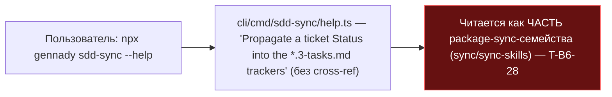
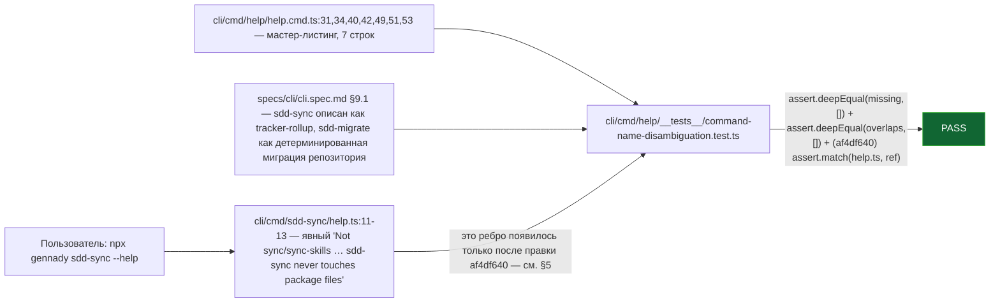

ОТЧЁТ 61/SO-14 — восемь имён команд разведены в help (Пачка 9)

СТАТУС: DONE

Рабочее дерево: `rc-v6`, ветка `lead/surface-locks`.

КОММИТЫ (локальные, НИЧЕГО не запушено):
- `9f61c159` feat(SO-14): disambiguate eight similarly-named CLI commands in help
- `af4df640` fix(so-14): lock the cross-ref lines inside each help.ts, not just the two indexes — **правка по V-BATCH-09** (см. §5)

---

## 1. Файлы

| Путь | Тип | Смысловое изменение | Чем доказано |
|---|---|---|---|
| `cli/cmd/orient/help.ts` | правка | Добавлена строка: «Not `sdd-orient` (that one navigates specs/design, not code — .spec.md graphs).» перед `Usage:`. | grep-замок ниже + ручной прогон `--help`. |
| `cli/cmd/sdd-migrate/help.ts` | правка | Добавлены 2 строки: «Not `sync`/`sync-skills` (unrelated: those mirror the npm package into the current project) — sdd-migrate rewrites this repository's own SDD artifacts.» | То же. |
| `cli/cmd/sdd-sync/help.ts` | правка | Добавлены 2 строки: «Not `sync`/`sync-skills` (those mirror ai/directives/ai/skills from the npm package) — sdd-sync never touches package files, only tracker rows for one ticket.» | То же. |
| `cli/cmd/sync/help.ts` | правка | Добавлены 3 строки: «Not `sync-skills` (…) and not `sdd-sync` (unrelated: propagates one ticket Status into `*.3-tasks.md` trackers).» | То же. |
| `specs/cli/cli.spec.md` | правка | §9.1 модуль-карта: `sync-skills` дополнен фразой размежевания с `sync`/`sdd-sync`; добавлены две отсутствовавшие строки-предмета — `sdd-sync` (tracker-status/rollup) и `sdd-migrate` (детерминированная миграция v1→v2, не sync и не back-sync). | Регресс-тест п.2 ниже. |
| `cli/cmd/help/__tests__/command-name-disambiguation.test.ts` | новый (`9f61c159`), правка (`af4df640`) | Grep-замок: для 7 конкретных имён (`sync`, `sync-skills`, `sdd-sync`, `sdd-migrate`, `orient`, `sdd-orient`, `agents-rules`) в двух поверхностях — мастер-листинг `cli/cmd/help/help.cmd.ts` и модуль-карта `cli.spec.md` §9.1 — извлекает описание и требует: (1) все 7 присутствуют и ни одна пара описаний не совпадает дословно; (2) отложенное имя `sdd-rules` отсутствует в обеих поверхностях; **(3, после правки) каждый из четырёх `help.ts` содержит буквальную backtick-ссылку на каждое своё look-alike имя**, и каждое такое имя — член `NAMES` этого же замка. | `node --import tsx --test cli/cmd/help/__tests__/command-name-disambiguation.test.ts` — 3/3 (см. §3). |

`git show --stat 9f61c159`: 6 файлов изменены, 140 insertions(+), 1 deletion(-) — совпадает.
`git show --stat af4df640`: 1 файл изменён, 37 insertions(+) — совпадает.

**Важное наблюдение:** мастер-листинг `cli/cmd/help/help.cmd.ts` уже содержал все 7 имён с различающимися описаниями (унаследовано из предыдущих пачек, не трогалось в SO-14) — новый lock подтверждает это состояние, не требуя правки самого файла.

---

## 2. Архитектура было / стало

### Было — четыре `*sync*`-имени и три `*orient*`-имени без явного размежевания



### Стало — каждое из 8 имён (7 конкретных + отложенный `sdd-rules`) — один явный предмет


Узлы: `cli/cmd/help/help.cmd.ts:31,34,40,42,49,51,53` (7 строк мастер-листинга, без правок в этой задаче), `specs/cli/cli.spec.md` §9.1 (2 новые строки-предмета), 4 файла `help.ts` (по одной cross-ref фразе каждый — с `af4df640` их читает и сам лок, не только человек глазами).

**Правка mermaid по V-BATCH-09 (см. §5).** Оригинальная версия рисовала `H1 --> MAP --> LOCK` — это было неверно вдвойне: `help.ts` никогда не питает `cli.spec.md` (нет такой зависимости в коде), и до правки `af4df640` сам `LOCK` вообще не читал ни один `help.ts` — только `help.cmd.ts` и `cli.spec.md`. Диаграмма выше показывает фактические рёбра: `HELPCMD --> LOCK`, `MAP --> LOCK` (было так с самого начала — было указано неверно) и `H1 --> LOCK` (стало верно только после `af4df640`).

---

## 3. Доказательства (ПРИЁМКА: «grep-замок: каждое из восьми имён в help описано одной строкой без пересечения»)

```
$ node --import tsx --test cli/cmd/help/__tests__/command-name-disambiguation.test.ts
✔ command name disambiguation (SO-14) > describes each of the four *sync*-shaped and three *orient*-shaped names as one distinct subject in `npx gennady help`
✔ command name disambiguation (SO-14) > describes each of the same seven names as one distinct subject in the cli module map
✔ command name disambiguation (SO-14) > cross-references each look-alike name by its literal, existing name in its own help.ts
# pass 3, # fail 0
```
exit 0. **ВЫПОЛНЕНО.** (Восьмое имя, `sdd-rules`, — отложенная тема реестра правил §3.1; в help не пишется, как и требует бриф; лок явно это проверяет вторым `assert.doesNotMatch` в каждом `it`. Третий `it` — правка по V-BATCH-09, см. §5.)

---

## 4. Отклонения и открытые вопросы

`agents-rules` (будущее переименование в `agents-orient` — T-10) в этой задаче НЕ переименовывалось — брифом не требовалось, T-10 остаётся отдельной задачей. `sync-skills`/`sdd-orient`/`agents-rules` не имеют собственных `--help` cross-ref строк (у `sync-skills` и `agents-rules` вообще нет отдельного `help.ts` — их справка живёт только в мастер-листинге и `cli.spec.md`, оба уже покрыты локом); это не пробел брифа, а структурное свойство CLI.

Координация зафиксирована в брифе и подтверждена кодом: `T-B6-28` (тот же словарь `sdd-sync`) и `T-10` (`agents-rules`→`agents-orient`) не пересекаются файлами с этим коммитом.

**Правка по V-BATCH-09 (см. §5).** Первая версия этого отчёта писала «нет отклонений» без оговорок про сами cross-ref строки. Верификатор (`V-BATCH-09.md` §B, раздел SO-14) нашёл реальный пробел: сами cross-ref фразы в четырёх `help.ts` не были заперты ни одним тестом — удаление любой из них оставляло тест зелёным. Исправлено коммитом `af4df640` в этой сессии.

## 5. Правка по V-BATCH-09

**Находка верификатора.** «Пробел: сами cross-ref строки «Not `X`…» в четырёх `help.ts` — содержательная часть SO-14 — ничем не заперты: замок читает `help.cmd.ts` и `cli.spec.md`, а не `cli/cmd/*/help.ts`. Удаление любой из четырёх фраз оставит тест зелёным.» Неблокирующее, но входит в обязательный список правок брифа. Верификатор также нашёл две mermaid-неточности (п.2 и п.4 раздела D `V-BATCH-09.md`) и неверную подпись слоя теста в `R-BATCH-09-surface-locks.md` (`contract` вместо `unit`) — обе исправлены в этом отчёте (§2) и в `R-BATCH-09-surface-locks.md` соответственно.

**Правка.** Коммит `af4df640`: третий `it`, читающий каждый из четырёх `help.ts` (`orient`, `sdd-migrate`, `sdd-sync`, `sync`) и требующий буквальную backtick-ссылку на каждое look-alike имя, которое этот файл называет в прозе (`orient`→`sdd-orient`; `sdd-migrate`/`sdd-sync`→`sync`,`sync-skills`; `sync`→`sync-skills`,`sdd-sync`), плюс проверку, что каждая такая ссылка — член собственного `NAMES` этого замка (защита от опечатки/устаревшего имени).

**Доказательство both-way** (перепроверено этим исполнителем): удалена строка `Not \`sdd-orient\` (...)` из `cli/cmd/orient/help.ts` → третий `it` красный, сообщение называет ровно этот файл и ровно `sdd-orient`; `git checkout --` восстанавливает файл → снова зелёный, 3/3.

Команда пуша для Lead: `git -C rc-v6 push origin lead/surface-locks` (единый push всей пачки 9, теперь 8 коммитов).
