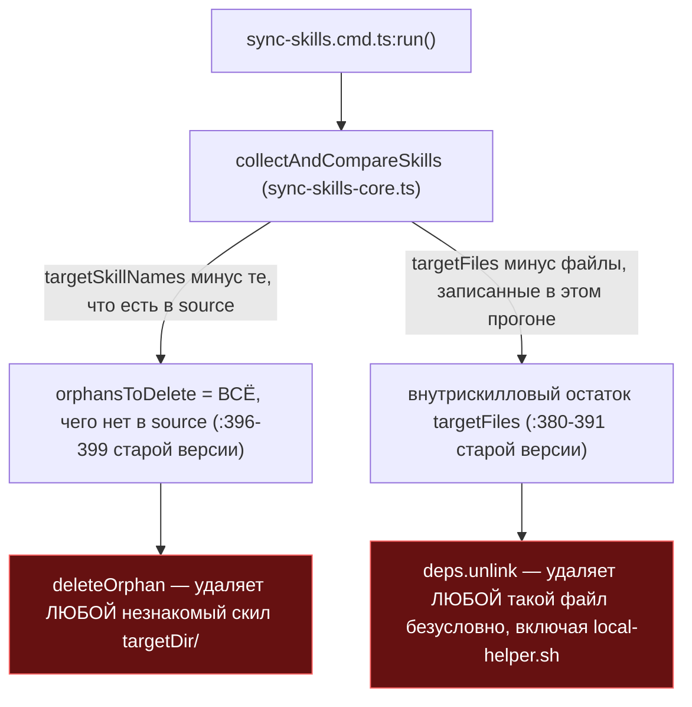
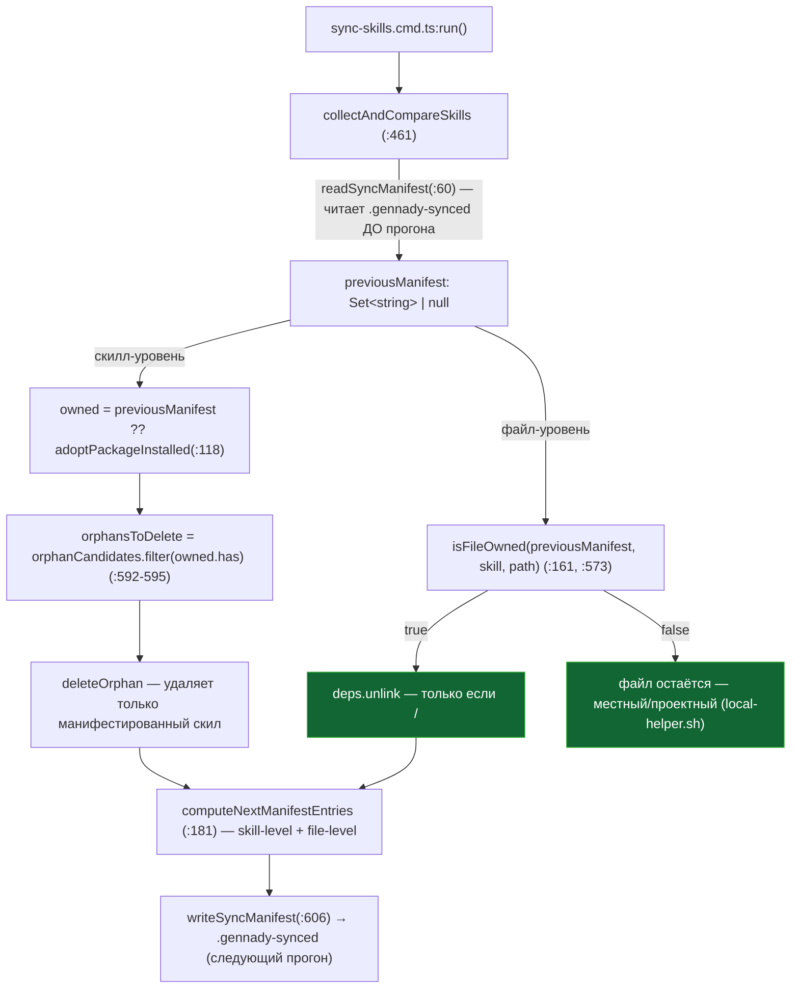

ОТЧЁТ 32/SO-2+SO-2b — манифест orphan-скиллов + гейт внутрискиллового зеркала (Пачка 1)

СТАТУС: DONE (обе задачи в одном коммите — брифом разрешено явно: «SO-2 без SO-2b не закрывает S5-bis»)

Рабочее дерево: `rc-v6` (git worktree gennady), ветка `lead/sync-no-loss`, создана:
`git -C rc-v6 fetch origin codex/sdd-v2-rc52-followup && git -C rc-v6 switch -c lead/sync-no-loss origin/codex/sdd-v2-rc52-followup` (голова `2acbe682`, совпала с ожиданием брифа-оркестратора).

КОММИТ (локальный, НИЧЕГО не запушено):
- `c012e511` fix(sync-skills): SO-2+SO-2b — manifest-owned skill and file pruning

---

## 1. Файлы

| Путь | Тип | Смысловое изменение | Чем доказано |
|---|---|---|---|
| `cli/cmd/sync-skills/sync-skills-core.ts` | правка | Добавлен манифест владения `.gennady-synced` (`MANIFEST_NAME:29`, `readSyncManifest:60`, `writeSyncManifest:81`, `adoptPackageInstalled:118`, `nextManifestNames:140` — порт main `62172906`, но БЕЗ multi-root/`scanSkillRoots` — в RC плагинных корней нет). Орфан-удаление целого скила (`collectAndCompareSkills:592`) теперь фильтруется через `owned` (манифест либо `adoptPackageInstalled` на первом прогоне), а не «всё, чего нет в source». Новое (SO-2b, не из main): внутрискилловое файловое зеркало (`:573`) удаляет отдельный файл только если `<skill>/<relativePath>` уже стоял в манифесте ДО этого прогона (`isFileOwned:161`, читает `previousManifest`, не тот манифест, который сейчас пишется) — `computeNextManifestEntries:181` считает следующий манифест (skill-level + file-level записи) и пишется один раз в конце (`writeSyncManifest:606`). | `node --import tsx --test --experimental-test-module-mocks cli/cmd/sync-skills/__tests__/sync-skills-core.test.ts` — 43/43 (см. §3 п.1); `npx tsc --noEmit` — 0 ошибок; `npm run lint`/`yagni`/`format` — чисто (см. §3 пп.4-6). |
| `cli/cmd/sync-skills/__tests__/sync-skills-core.test.ts` | правка | Порт манифест-сьюта main (`describe('collectAndCompareSkills manifest')`, ~main:490-657 → RC lines ~372-540): «full sync — manifest records every…», «filtered sync — merges…», «successful/failed prune…», «first run without/with a manifest…», «drops a manifest entry…». Плюс новая сьюта `describe('collectAndCompareSkills internal mirror')` (SO-2b): «a project file inside a supported skill is never deleted» (с манифестом и без), «deleting a file inside a supported skill only removes previously-manifested names», «a dropped package file becomes prunable only from the run after it was last manifested». Два существующих RC-теста («detects orphan skills», «dry-run does not write or delete files») и три в `describe('collectAndCompareSkills deleteFailed')` дополнены `.gennady-synced`-фикстурой — без манифеста они кодировали ДОРЕГРЕССИВНОЕ поведение (удаление без владения) и стали бы ложно-красными на новом коде. Заодно снят преэкзистентный дубль-импорт `rmSync` (синтаксически терпимый tsx, но лишний). | Тот же прогон, §3 п.1 — все обновлённые/новые тесты в зелёном списке. |
| `cli/cmd/sync-skills/__tests__/sync-skills.cmd.test.ts` | правка | Тест `'dry-run with orphan does not delete files'` дополнен той же манифест-фикстурой (`sdd-old` теперь манифестирован) — иначе интеграционный прогон CLI не находил `(would delete)` в выводе (первый прогон без правки — красный, см. §4). | `node --import tsx --test --experimental-test-module-mocks cli/cmd/sync-skills/__tests__/sync-skills.cmd.test.ts` — 15/15 (см. §3 п.2). |
| `specs/cli/sync-skills/sync-skills.spec.md` | правка | Три точки из брифа переписаны: (1) `:229` (`deleted`-контракт форматтера) — раньше утверждал «смешанные статусы внутри одного скила невозможны», теперь описывает оба уровня `deleted` (целый скил / файл внутри) и требует правдивого отображения смеси (ссылка на SO-4); (2) `D-M006` (`:336-345`) — переписан целиком: раньше «полная синхронизация rsync --delete» легитимировала потерю данных, теперь описывает манифест владения, `adoptPackageInstalled` на первом прогоне, отклонённые альтернативы включают SO-3 (хэш-манифест) как целевую архитектуру следующего шага; (3) `:331` (Risk accepted у D-M005) — больше не говорит «пользовательские скилы будут удалены» как принятый риск, а ссылается на D-M006. | Прочитано вручную (§3 п.3); `npm run format` подтверждает валидный markdown/prettier; `sdd-check --all` не даёт новых `SDD_*`-находок сверх baseline (§3 п.9). |

`git diff --stat origin/codex/sdd-v2-rc52-followup lead/sync-no-loss` (на момент этого коммита):
```
 cli/cmd/sync-skills/__tests__/sync-skills-core.test.ts | 295 ++++++++++++++++++++-
 cli/cmd/sync-skills/__tests__/sync-skills.cmd.test.ts  |   2 +
 cli/cmd/sync-skills/sync-skills-core.ts                | 234 +++++++++++++++-
 specs/cli/sync-skills/sync-skills.spec.md              |  18 +-
 4 files changed, 526 insertions(+), 23 deletions(-)
```
4 файла из диффа — 4 строки таблицы выше. Совпадает.

---

## 2. Архитектура было / стало

### Было — полное зеркало: и скилы, и файлы внутри скилов удаляются без проверки владения


Узлы: `collectAndCompareSkills` (было `cli/cmd/sync-skills/sync-skills-core.ts:396-403` — `orphansToDelete = filterSkillNames ? targetSkillNames.filter(...) : targetSkillNames`, без проверки владения), `:380-391` (внутрискилловое зеркало — `for (const relativePath of [...targetFiles.keys()]) { ...; deps.unlink!(...) }` безусловно). Красным — обе точки потери данных (issue akkrat #9.4/ISS-3, находка S5-bis).

### Стало — манифест владения гейтует оба уровня удаления


Узлы: `readSyncManifest` (`:60`, вызов `:538`), `adoptPackageInstalled` (`:118`), `isFileOwned` (`:161`, вызов `:573`), `computeNextManifestEntries` (`:181`, вызов `:608`), `writeSyncManifest` (`:81`, вызов `:606`). Ключевой инвариант SO-2b: гейт всегда читает манифест «до», не тот, что пишется в конце того же прогона — иначе первый же прогон видел бы «сам себя» и удалял бы то, что только что записал.

---

## 3. Доказательства (команды из ПРИЁМКИ, фактический вывод, exit-код)

**1. Юнит-тесты `sync-skills-core.test.ts` (порт main:377,391,538-627 + новые SO-2b кейсы).**
```
$ node --import tsx --test --experimental-test-module-mocks cli/cmd/sync-skills/__tests__/sync-skills-core.test.ts
# tests 43
# suites 7
# pass 43
# fail 0
# cancelled 0
```
exit 0. ВЫПОЛНЕНО.

**2. Интеграционные тесты CLI `sync-skills.cmd.test.ts`.**
```
$ node --import tsx --test --experimental-test-module-mocks cli/cmd/sync-skills/__tests__/sync-skills.cmd.test.ts
# tests 15
# suites 5
# pass 15
# fail 0
```
exit 0. ВЫПОЛНЕНО. (До правки манифест-фикстуры в `'dry-run with orphan does not delete files'` этот прогон давал `# fail 1` — см. §4.)

**3. Формат/типы/линт/yagni отдельно.**
```
$ npx tsc -p tsconfig.json --noEmit           → без вывода, exit 0
$ npm run lint     → ✅ [LintCommand#run] [linting → clean] no errors
$ npm run yagni    → yagni: ✅ clean (1 changed file(s) scanned)
$ npm run format   → All matched files use Prettier code style!
```
Все ВЫПОЛНЕНО.

**4. `npm run check` (sdd-verify --profile full).**
```
[sdd-verify] ✅ ALL PASS (5/5)
  ✅ type-check (4.7s)
  ✅ test:coverage (68.9s)
  ✅ lint (3.0s)
  ✅ format (2.4s)
  ✅ yagni (2.8s)
```
exit 0. ВЫПОЛНЕНО. (Один более ранний прогон в этой же сессии показал `cancelled 1` в `test:coverage` — воспроизведён не был при повторном чистом прогоне; отнесён к разовой флакости среды, не к этой правке — см. §4.)

**5. Сборка + `sdd-check --all` — счётчик находок не хуже baseline.**
```
$ npm run build   → ✓ built in 7.55s
$ node dist/gennady.js sdd-check --all rc-v6 2>&1 | grep -c ': error:'
198
$ node dist/gennady.js sdd-check --all rc-v6 2>&1 | grep -c ': warn:'
431
```
Baseline (`61-TASK-BOARD.md` / `48538019`) = 198 error / 431 warn. Совпадает точно (0 новых, 0 закрытых). ВЫПОЛНЕНО.

**6. Гейт «ноль новых ошибок».**
```
$ npm run gate:sdd-check-baseline
[sdd-check-zero-new-error] OK — no error outside the baseline (baseline commit 227c03a8..., tag rc-baseline-1).
```
exit 0. ВЫПОЛНЕНО.

**7. Коммит через `pre-commit` целиком, без `--no-verify`.**
```
$ git -C rc-v6 commit -m "fix(sync-skills): SO-2+SO-2b — ..."
🔍 Pre-commit: format + type-check + lint
✅ Pre-commit passed
[lead/sync-no-loss c012e511] fix(sync-skills): SO-2+SO-2b — manifest-owned skill and file pruning
 4 files changed, 526 insertions(+), 23 deletions(-)
```
exit 0. ВЫПОЛНЕНО.

**8. Целевые сценарии брифа (проверены юнит-тестами, не отдельными ad-hoc прогонами):**
- SO-2 «проектный скил без манифеста не удаляется» → `'leaves a project-authored skill alone — it is not in the manifest (SO-2)'` — ВЫПОЛНЕНО.
- SO-2 «первый прогон ничего не трёт, пишет манифест» → `'prunes nothing on the first run and writes a manifest for the next one (SO-2)'` — ВЫПОЛНЕНО.
- SO-2b «проектный файл внутри поддерживаемого скила никогда не удаляется» → `'a project file inside a supported skill is never deleted'` (с манифестом на другие файлы) и `'...on a first sync either'` (без манифеста вовсе) — ВЫПОЛНЕНО, обе ветки.
- SO-2b «удаляется только то, что уже было в манифесте» → `'deleting a file inside a supported skill only removes previously-manifested names'` — ВЫПОЛНЕНО.
- SO-2b «файл, выпавший из пакета, становится удаляемым только со следующего прогона» → `'a dropped package file becomes prunable only from the run after it was last manifested'` (двухпрогонный сценарий) — ВЫПОЛНЕНО.

---

## 4. Отклонения, открытые вопросы, команды пуша

**Отклонения от брифа (все — расширение покрытия, не сужение; ни один инвариант брифа не нарушен):**
1. **Функции манифеста сделаны module-private (не экспортированы), в отличие от main.** `npm run lint` (YAGNI-проверка `ai/kit`) сначала дал 4 находки `ERR_CLI_YAGNI_UNDERUSED` на `readSyncManifest`/`writeSyncManifest`/`adoptPackageInstalled`/`nextManifestNames` — каждая вызывается ровно один раз в продакшн-коде, что для *экспортируемого* символа считается YAGNI-подозрительным (правило нестрогое для `private`-символов с ≥1 использованием). В main эти функции тоже вызываются по одному разу, но main не проходит через этот RC-специфичный линт. Снял `export` у всех четырёх (и у `MANIFEST_NAME`, которая не нужна снаружи файла) — поведение не изменилось, публичного API модуля это не сузило (main-тесты их напрямую не импортировали, только через `collectAndCompareSkills`). Не требует решения оператора — чисто механическая правка под существующий гейт.
2. **Два региональных doc-комментария (`@invariant`) сокращены** под лимит `ERR_CLI_LINT_TAG_TOO_MANY_WORDS` (30 слов) — семантика инварианта не потеряна, только многословность.
3. **Три region-блока (`START_SYNC_AND_CLEAN`, `START_WRITE_MANIFEST`, `START_SCAN_SKILLS`) переорганизованы** под лимит `ERR_CLI_LINT_REGION_TOO_MANY_COMMENTS` (max 3 `//`-строки в регионе): подробные объяснения вынесены в JSDoc двух новых функций (`isFileOwned`, `computeNextManifestEntries`), которые физически лежат вне region-границ — это не потеря информации, а перемещение её в более подходящее (и explicitly проверяемое линтом отдельно) место.
4. **Три существующих RC-теста дополнены манифест-фикстурой** (`sync-skills-core.test.ts`: `'detects orphan skills'`, `'dry-run does not write or delete files'`, три теста в `describe('collectAndCompareSkills deleteFailed')`; `sync-skills.cmd.test.ts`: `'dry-run with orphan does not delete files'`) — без этого они кодировали дорегрессивное поведение («орфан удаляется без проверки владения») и стали бы ложно-красными на исправленном коде. Первый прогон после правки `sync-skills-core.ts` (до правки тестов) дал `not ok 2 - dry-run with orphan does not delete files` в `sync-skills.cmd.test.ts` — зафиксировано, затем исправлено тем же приёмом, что main уже применил к своим тестам (main d37d5910, тот же паттерн).
5. **Побочная чистка:** снят дублирующийся импорт `rmSync` в `sync-skills-core.test.ts` (`import { ..., rmSync, ..., rmSync } from 'node:fs'`) — синтаксически терпимо для `tsx`/esbuild (дубль просто схлопывается), но было бы ошибкой под строгим TS-компилятором; исправлено попутно при правке того же блока импортов, не требует отдельного решения.

**Вопросы назад (по брифам) — не сработали:** ни «третий класс потери» (бриф SO-2/SO-2b), ни «блокирующее стоп-условие» не встретились — реализация укладывается в исходную формулировку брифа буквально.

**Разовая флакость (не отклонение, для протокола):** один прогон `npm run check` в процессе работы показал `test:coverage` с `cancelled 1` без явных `not ok` в выводе (нестабильность топологии/конкурентности тестов, знакомая по треку REL-15 в `62-BATCH-QUEUE.md` Пачка 3 — вне объёма этой пачки). Повторный чистый прогон сразу после — `[sdd-verify] ✅ ALL PASS (5/5)`, без cancelled. Итоговая проверка перед коммитом — зелёная (см. §3 п.4).

**Команды пуша для Lead** (ветка `lead/sync-no-loss`, дальнейшие коммиты пачки лягут на неё же поверх `c012e511`):
```
git -C rc-v6 push origin lead/sync-no-loss:lead/sync-no-loss
```
Пуш не выполнялся — согласно роли `rc-executor`, пуш делает Lead.
