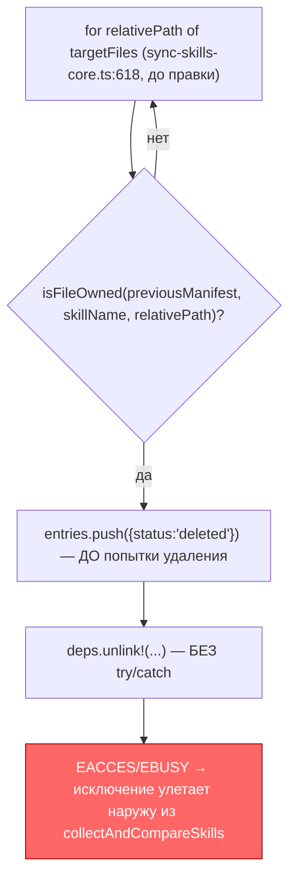
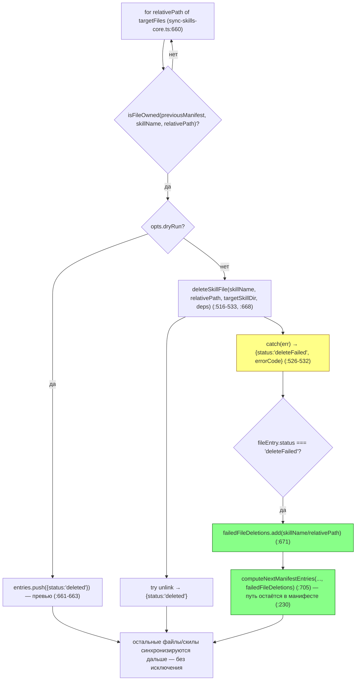

ОТЧЁТ — SO-2c (мини-пачка «Правки ревью PR #29»)

СТАТУС: DONE

Рабочее дерево: `rc-w3`, ветка `lead/sync-no-loss-review` (от `5b37a93e`, PR #29).

КОММИТ (локальный, НИЧЕГО не запушено):
- `c6caf17d` fix(sync-skills): SO-2c — file-level delete failure is deleteFailed, not a crash

---

## 1. Файлы

| Путь | Тип | Смысловое изменение | Чем доказано |
|---|---|---|---|
| `cli/cmd/sync-skills/sync-skills-core.ts` | правка | Файл-уровневое удаление внутри ещё поддерживаемого скила (было `deps.unlink!(...)` без try/catch, `~:622` до правки) вынесено в новую функцию `deleteSkillFile` (`:516-533`), вызывается из цикла (`:660-671`): успех → `deleted`, брошенный EACCES/EBUSY → `deleteFailed` + `errorCode`, остальные файлы того же и других скилов синхронизируются как обычно. `computeNextManifestEntries` (`:195-234`) получил 6-й параметр `failedFileDeletions` (по умолчанию пустое множество) и добавляет эти пути в итоговый манифест, так что упавший файл остаётся владением инструмента и повторная попытка произойдёт на следующем прогоне. | Юнит-тесты §3 п.1 (2 новых теста), полный прогон §3 п.2. |
| `cli/cmd/sync-skills/__tests__/sync-skills-core.test.ts` | правка | Два новых теста в `describe('collectAndCompareSkills deleteFailed')`: (a) «marks one file inside a supported skill as deleteFailed without crashing, and keeps syncing everything else» — мок `unlink` кидает EACCES только на `stale-a.sh`, второй orphan-файл `stale-b.sh` того же скила и обновление `SKILL.md` проходят нормально, исключение наружу не улетает; (b) «keeps a failed file delete in the manifest so the next run retries it» — после EBUSY на `unlink` `.gennady-synced` всё ещё содержит `sdd-execute/stale.sh`. | §3 п.1. |
| `specs/cli/sync-skills/sync-skills.spec.md` | правка | `D-M006`: добавлено одно предложение — то же правило про EACCES/EBUSY (не прерывает синхронизацию, запись остаётся в манифесте для ретрая), что уже было сформулировано для целого скила, теперь явно распространено на отдельный файл внутри ещё поддерживаемого скила (SO-2c), с уточнением, что остальные файлы того же скила и остальные скилы синхронизируются как обычно. | Прочитано вручную; `npm run format`/`npm run check` (§3 п.3) подтверждают валидный markdown. |

`git show --stat c6caf17d`:
```
 .../sync-skills/__tests__/sync-skills-core.test.ts | 82 ++++++++++++++++++++++
 cli/cmd/sync-skills/sync-skills-core.ts            | 71 ++++++++++++++++---
 specs/cli/sync-skills/sync-skills.spec.md          |  2 +-
 3 files changed, 144 insertions(+), 11 deletions(-)
```
3 файла из диффа — 3 строки таблицы. Совпадает.

---

## 2. Архитектура было / стало

### Было — файл-уровневое удаление без обработки ошибок


Узел `Unlink` — было `sync-skills-core.ts:627` (до правки, вызов внутри блока `if (!opts.dryRun)`, без обёртки).

### Стало — обёрнутое удаление, deleteFailed вместо падения, манифест хранит владение для ретрая


Новые узлы: `deleteSkillFile` (`sync-skills-core.ts:516-533`, вызов `:668`), параметр `failedFileDeletions` в `computeNextManifestEntries` (`:195-234`, `wiring :627, :671, :705`). Нетронутая часть (проверка `isFileOwned`, цикл по скилам) осталась прежней — на диаграмме показана без выделения.

---

## 3. Доказательства (команды из ПРИЁМКИ, фактический вывод, exit-код)

**1. Новый юнит-сьют — оба сценария из ПРИЁМКИ.**
```
$ npx tsx --test cli/cmd/sync-skills/__tests__/sync-skills-core.test.ts
ok 4 - marks one file inside a supported skill as deleteFailed without crashing, and keeps syncing everything else
ok 5 - keeps a failed file delete in the manifest so the next run retries it
# tests 47
# suites 7
# pass 47
# fail 0
```
ВЫПОЛНЕНО.

**2. Полный тестовый прогон (`npm --prefix rc-w3 test`, топология deterministic) — регресс не внесён.**
```
# tests 3596
# suites 602
# pass 3586
# fail 0
# cancelled 0
# skipped 10
# duration_ms 41078.518375
```
ВЫПОЛНЕНО.

**3. `npm run check` (sdd-verify --profile full).**
```
[sdd-verify] ✅ ALL PASS (5/5)
  ✅ type-check (3.9s)
  ✅ test:coverage (50.9s)
  ✅ lint (2.9s)
  ✅ format (2.0s)
  ✅ yagni (3.1s)
```
ВЫПОЛНЕНО.

**4. Сборка + `sdd-check --all` — счётчик не хуже baseline; гейт.**
```
$ npm run build
✓ built in 3.59s
$ node dist/gennady.js sdd-check --all rc-w3
[sdd-check] 198 error(s), 431 warning(s) across 212 file(s)
$ npm run gate:sdd-check-baseline
[sdd-check-zero-new-error] OK — no error outside the baseline (baseline commit 227c03a83830124fe2aa22541dd5374beb8a53c6, tag rc-baseline-1).
```
Baseline (`ai/flow-eval/.baseline/sdd-check-227c03a8.json`): 198 error / 431 warning — совпадает точно, не +1 ни в одну сторону. ВЫПОЛНЕНО.

**5. Коммит через pre-commit целиком, без `--no-verify`.**
```
🔍 Pre-commit: check (sdd-verify --profile full — read-only) + directive gates
[sdd-verify] ✅ ALL PASS (5/5)
✓ ai/directives/** matches a fresh rebuild.
✓ axiom-activation audit clean — 28 template(s) checked.
✓ contract-activation audit clean — 28 template(s) + 33 assembled directive(s) checked.
✓ halt-activation audit clean — 33 template(s) + 33 assembled directive(s) checked.
✓ every lazy directive under ai/directives/sdd-v2/** is within budget.
✅ Pre-commit passed
[lead/sync-no-loss-review c6caf17d] fix(sync-skills): SO-2c — file-level delete failure is deleteFailed, not a crash
 3 files changed, 144 insertions(+), 11 deletions(-)
```
ВЫПОЛНЕНО.

---

## 4. Отклонения, открытые вопросы, команды пуша

**Отклонение от буквы брифа (техническое, не по смыслу).** Бриф просил обернуть удаление на месте (`try { deps.unlink!(...) } catch {...}` прямо в цикле). Первая реализация именно так и была написана, но `npm run check` (шаг `lint`) упал: комментарии внутри `#region START_SYNC_AND_CLEAN` (родительский `#region START_ALL`-аналога в этом файле не существует, но вложенность считается для самого `START_SYNC_AND_CLEAN`) превысили лимит 3 строк-комментариев на регион (`ERR_CLI_LINT_REGION_TOO_MANY_COMMENTS`, регион уже был на пределе 3 строк до правки). Решение: вынести обёрнутое удаление в отдельную функцию `deleteSkillFile` с обычным JSDoc (`/** */` не считается комментарием этим чекером — только `//`), внутри региона остался вызов без единой инлайн-строки `//`. Логика и наблюдаемое поведение (статус, `errorCode`, манифест) не изменились — изменилась только форма (функция вместо инлайн try/catch). Тот же паттерн — рефакторинг под линт, не под требование — применён к B2-24 (см. `R-B2-24.md`).

**Открытых вопросов нет.**

**Команды пуша для Lead** (после мержа/ребейза остальной пачки, если потребуется):
```
git -C rc-w3 push origin lead/sync-no-loss-review
```
(коммит `c6caf17d`, вместе с `b7ce8efd` из `R-B2-24.md` — оба на одной ветке `lead/sync-no-loss-review`).
