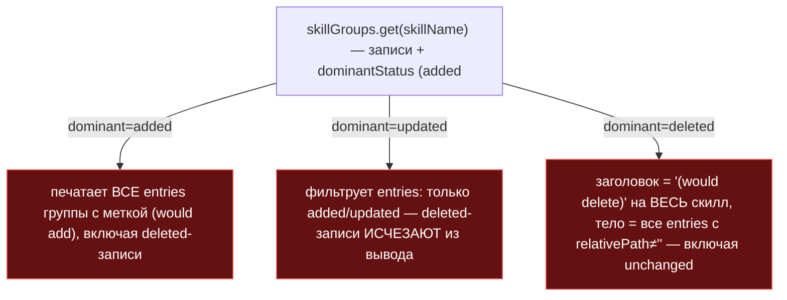
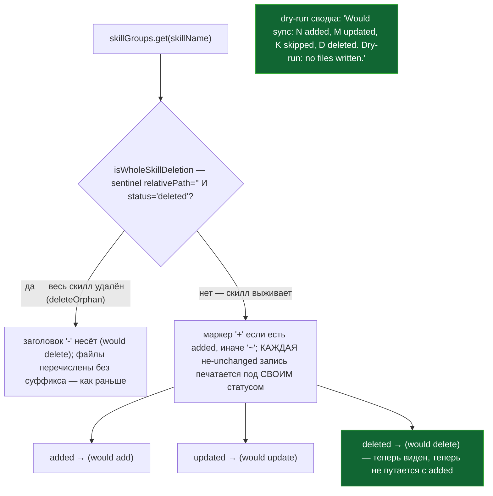

ОТЧЁТ 32/SO-4 — правдивая печать `deleted` в dry-run сводке (Пачка 1)

СТАТУС: DONE

Рабочее дерево: `rc-v6`, ветка `lead/sync-no-loss` (продолжение после `c012e511`, `5678c307`, `b3f927c1`).

КОММИТ (локальный, НИЧЕГО не запушено):
- `e913d14d` fix(sync-skills): SO-4 — dry-run output stops lying about deletions

---

## 1. Файлы

| Путь | Тип | Смысловое изменение | Чем доказано |
|---|---|---|---|
| `cli/cmd/sync-skills/sync-skills-formatter.ts` | правка | Три ветки рендера группы (`dominant added/updated/deleted`, `:88-124` старой нумерации) заменены единой логикой: новая `isWholeSkillDeletion(entries)` (sentinel `relativePath:''`+`status:'deleted'`, из `deleteOrphan`) — единственный случай «скилл целиком удалён», поведение для него не изменилось. Во всех остальных случаях («выживший» скилл) каждая НЕ-`unchanged` запись печатается под СВОИМ настоящим статусом — ничего не фильтруется (баг 1: `deleted` пропадал в группе с dominant `updated`) и ничего не подписывается чужой меткой (баг 2: `deleted` печатался как `(would add)` в группе с dominant `added`; баг 3: живой `unchanged`-файл печатался как удалённый, а заголовок всей группы — как `(would delete)`, когда на самом деле удаляется только часть файлов). Сводка dry-run (`:147-153` старой нумерации) теперь несёт счётчики — `Would sync: N added, M updated, K skipped, D deleted. Dry-run: no files written.` — вместо голого `Dry-run: no files written.`; хвостовая фраза сохранена дословно ради существующих substring-проверок (e2e, FR-SS-15). | `node --import tsx --test --experimental-test-module-mocks cli/cmd/sync-skills/__tests__/sync-skills-formatter.test.ts` — 23/23 (см. §3 п.1). |
| `cli/cmd/sync-skills/__tests__/sync-skills-formatter.test.ts` | правка | Новая сьюта `describe('format mixed group (SO-2b makes this real)', ...)` — 4 теста, по одному на каждый из трёх найденных багов + один на «whole-skill orphan остаётся прежним». Существующий тест `'dry-run summary line is "Dry-run: no files written."'` переименован и переписан на точную сборку новой строки (единственный существующий тест, сломанный сменой контракта — намеренно, не регресс). | Прогон в §3 п.1. |
| `specs/cli/sync-skills/sync-skills.spec.md` | правка | Раздел `SyncSkillsFormatter` (строки ~108-117 старой нумерации): добавлена ветка «удаляется часть файлов ещё поддерживаемого скила (SO-2b)» с точным форматом строки; dryRun-итоговая переписана на новый шаблон с счётчиками. | Прочитано вручную; `npm run format` подтверждает валидный markdown (см. §3 п.3). |
| `specs/cli/cli.spec.md` | правка | `FR-SS-15` переписан: добавлено «каждый файл группы под своим настоящим статусом (SO-4)», итоговая строка приведена к новому шаблону. | Тот же прогон формата. |

`git diff --stat e913d14d~1 e913d14d`:
```
 cli/cmd/sync-skills/__tests__/sync-skills-formatter.test.ts | 78 +++++++++++++++++--
 cli/cmd/sync-skills/sync-skills-formatter.ts                 | 66 +++++++---------
 specs/cli/cli.spec.md                                        |  2 +-
 specs/cli/sync-skills/sync-skills.spec.md                    |  4 +-
 4 files changed, 126 insertions(+), 52 deletions(-)
```
4 файла из диффа — 4 строки таблицы. Совпадает.

---

## 2. Архитектура было / стало

### Было — три ветки, две лгут


Три репро в одном прогоне (`32-TRACK-SYNC-OWNERSHIP.md §1` таблица S5-bis): `local-helper.sh` удалён молча (ветка `updated`, не назван нигде); `PROJECT-NOTES.md` показан `(would add)`, а реально удалён (ветка `added`, ложная метка); `SKILL.md` цел на диске, но вся группа `sdd-audit/` напечатана как `(would delete)` (ветка `deleted`, живой файл объявлен удалённым).

### Стало — одна ветка формирования тела, единственный особый случай — весь скилл


Узлы: `isWholeSkillDeletion` (новая, `sync-skills-formatter.ts`, перед `format`), тело цикла в `format` (регион `START_FORMAT_GROUPS`), сводка (регион `START_SUMMARY`).

---

## 3. Доказательства (команды из ПРИЁМКИ, фактический вывод, exit-код)

**1. `sync-skills-formatter.test.ts` — 3 кейса форматтера из брифа (по одному на ветку) + сводка.**
```
$ node --import tsx --test --experimental-test-module-mocks cli/cmd/sync-skills/__tests__/sync-skills-formatter.test.ts
ok — a deleted file is shown inside a dominant-updated group, not silently dropped
ok — a deleted file inside a dominant-added group keeps its own true label, never (would add)
ok — a partial in-skill deletion never claims the whole skill, and never claims a surviving file is deleted
ok — a whole-skill orphan (sentinel relativePath) is still announced and listed as deleted
ok — dry-run summary line carries counts, not just "no files written" (SO-4)
# tests 23
# pass 23
# fail 0
```
ВЫПОЛНЕНО.

**2. Смежные сьюты — регресс не внесён.**
```
$ node --import tsx --test --experimental-test-module-mocks cli/cmd/sync-skills/__tests__/sync-skills.cmd.test.ts cli/cmd/sync-skills/__tests__/sync-skills-core.test.ts
# tests 81 (суммарно с форматтером)
# pass 81
# fail 0
```
e2e-субстринг-проверка `/Dry-run: no files written/` (`cli/__tests__/e2e/sync-skills.e2e.test.ts:52`) осталась зелёной по построению — хвостовая фраза сохранена дословно. ВЫПОЛНЕНО.

**3. Формат/типы/линт/yagni.**
```
$ npx tsc --noEmit          → exit 0
$ npm run lint              → ✅ [LintCommand#run] [linting → clean] no errors
$ npm run yagni              → yagni: ✅ clean (1 changed file(s) scanned)
$ npm run format             → All matched files use Prettier code style! (после автофикса specs/cli/cli.spec.md — см. §4)
```
Все ВЫПОЛНЕНО.

**4. `npm run check`.**
```
[sdd-verify] ✅ ALL PASS (5/5)
  ✅ type-check (8.3s)
  ✅ test:coverage (72.4s)
  ✅ lint (3.4s)
  ✅ format (1.9s)
  ✅ yagni (5.0s)
```
exit 0. ВЫПОЛНЕНО.

**5. Сборка + `sdd-check --all` — счётчик не хуже baseline.**
```
$ npm run build && node dist/gennady.js sdd-check --all rc-v6 2>&1 | grep -c ': error:'
198
$ ... | grep -c ': warn:'
431
```
Совпадает с baseline (`48538019`). ВЫПОЛНЕНО.

**6. Гейт «ноль новых ошибок».**
```
$ npm run gate:sdd-check-baseline
[sdd-check-zero-new-error] OK — no error outside the baseline (baseline commit 227c03a8..., tag rc-baseline-1).
```
exit 0. ВЫПОЛНЕНО.

**7. Коммит через `pre-commit` целиком, без `--no-verify`.**
```
🔍 Pre-commit: format + type-check + lint
✅ Pre-commit passed
[lead/sync-no-loss e913d14d] fix(sync-skills): SO-4 — dry-run output stops lying about deletions
 4 files changed, 126 insertions(+), 52 deletions(-)
```
ВЫПОЛНЕНО.

---

## 4. Отклонения, открытые вопросы, команды пуша

**Отклонения от строки доски (61-TASK-BOARD.md §1, единственный источник для SO-4 — отдельного брифа 32/§4 текстом не выдавалось для этой задачи, только «Правдивая печать `deleted` в dry-run сводке» + «3 кейса форматтера»):**

1. **Затронуты `specs/cli/sync-skills/sync-skills.spec.md` и `specs/cli/cli.spec.md` (FR-SS-15)** — формально вне узкого списка «Файлы» строки доски (`sync-skills-formatter.ts:88-124`), но напрямую описывают контракт, который эта правка меняет (обе спеки дословно документировали старый, недоговорённый формат dry-run сводки). Правки — по одной строке/абзацу каждая, без расширения объёма задачи. Не выполнить их значило бы оставить спеку лгущей о собственном коде — ровно то, что SO-4 исправляет в самом форматтере.
2. **Точная формулировка новой сводки — `Would sync: ... . Dry-run: no files written.`, а не замена фразы целиком.** `Dry-run: no files written.` — общий литерал, разделяемый с командой `sync` (`shared/common/sync/sync-formatter.shared.ts`, `cli/cmd/sync/sync.types.ts`, e2e-тесты обеих команд, `FR-SYNC-15`) — все они вне списка «Файлы» SO-4. Замена/переформулировка этой фразы задела бы `sync`, что не входит в объём. Выбрано: сохранить фразу как СУФФИКС новой строки — все существующие substring-проверки (`.includes(...)`, regex `/Dry-run: no files written/`) остаются зелёными без единой правки вне `sync-skills`.
3. **`SyncSkillsResult.dryRunSummary` (геттер, `sync-skills.types.ts:88`) НЕ тронут** — он не используется реальным CLI-выводом (`sync-skills.cmd.ts` строит вывод через `format()`, не через `result.dryRunSummary`); эта задача про то, что видит оператор в терминале, а не про альтернативный API геттера. Оставлен как отдельный, самостоятельный контракт.

**Вопросы назад — не сработали:** брифа с явными ИНВАРИАНТАМИ/«ВОПРОСЫ НАЗАД» для SO-4 не было (не входит в 5 подготовленных брифов §4); строка доски и раздел S5-bis треково-документа (`32-TRACK-SYNC-OWNERSHIP.md`) были достаточны для однозначной реализации, стопов не потребовалось.

**Команды пуша для Lead** (ветка `lead/sync-no-loss`, коммит `e913d14d` поверх `b3f927c1`):
```
git -C rc-v6 push origin lead/sync-no-loss:lead/sync-no-loss
```
Пуш не выполнялся — пуш делает Lead.
