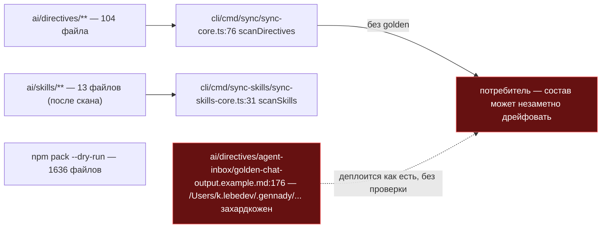
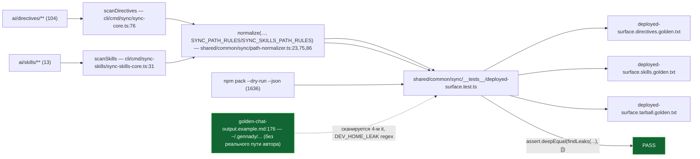

ОТЧЁТ 61/SO-5 — deployed-surface golden + починка найденной утечки пути (Пачка 9)

СТАТУС: DONE

Рабочее дерево: `rc-v6`, ветка `lead/surface-locks`.

КОММИТ (локальный, НИЧЕГО не запушено):
- `041c507a` feat(SO-5): golden-snapshot the deployed surface and fix a dev-home path leak

---

## 1. Файлы

| Путь | Тип | Смысловое изменение | Чем доказано |
|---|---|---|---|
| `ai/directives/agent-inbox/golden-chat-output.example.md` | правка (строка 176) | Найденная утечка вычищена: `/Users/k.lebedev/.gennady/agent-inbox/reports/...` → `~/.gennady/agent-inbox/reports/...` (3 вхождения в одной markdown-строке). | Четвёртый `it` `deployed-surface.test.ts` («ships no file … with a developer home-directory path leak») — до правки падал бы на этом файле, после правки зелёный (см. §3). |
| `shared/common/sync/__tests__/deployed-surface.test.ts` | новый | 4 `it`: (1) golden-список файлов `scanDirectives(ai/directives)`, (2) golden-список `scanSkills(ai/skills)`, (3) golden-список `npm pack --dry-run --json`, (4) безусловный инвариант — ни один файл (после нормализации путей для directives/skills, сырые байты для tarball) не содержит `/Users/<имя>/` или `/home/<имя>/`. | `node --import tsx --test shared/common/sync/__tests__/deployed-surface.test.ts` — 4/4 (см. §3). |
| `shared/common/sync/__tests__/deployed-surface.directives.golden.txt` | новый | Заморожен список 104 путей, которые `sync` реально копирует потребителю. | Тот же прогон, `it` №1. |
| `shared/common/sync/__tests__/deployed-surface.skills.golden.txt` | новый | Заморожен список 13 путей, которые `sync-skills` копирует в `.claude/skills/`. | `it` №2. |
| `shared/common/sync/__tests__/deployed-surface.tarball.golden.txt` | новый | Заморожен список 1636 путей `npm pack --dry-run` (весь npm-tarball). | `it` №3. |
| `shared/common/sync/__tests__/GOLDEN-MANIFEST.md` | новый | Документирует конвенцию `UPDATE_SURFACE_GOLDEN=1`, владельцев намеренного дрейфа каждого golden-файла (по образцу `shared/sdd/__tests__/GOLDEN-MANIFEST.md`, тот же паттерн для `UPDATE_VERIFY_GOLDEN=1`). | Не измеряется тестом — справочный документ рядом с golden. |

`git show --stat 041c507a`: 6 файлов, 1925 insertions(+), 1 deletion(-) — совпадает.

**Отклонение от пути в доске/очереди (см. §4).** `61-TASK-BOARD.md:92` и `62-BATCH-QUEUE.md:145` называют путь `scripts/__tests__/deployed-surface.test.ts`; фактический путь — `shared/common/sync/__tests__/deployed-surface.test.ts`. Обоснование и решение — в §4.

---

## 2. Архитектура было / стало

### Было — деплой без снимка состава и без сканирования утечек



### Стало — три golden-снимка + один безусловный инвариант, утечка вычищена



---

## 3. Доказательства (ПРИЁМКА: «golden (`UPDATE_SURFACE_GOLDEN=1`) + `npm pack --dry-run`»)

```
$ node --import tsx --test --experimental-test-module-mocks shared/common/sync/__tests__/deployed-surface.test.ts
✔ deployed surface (SO-5) > sync ships exactly the frozen ai/directives/** file list
✔ deployed surface (SO-5) > sync-skills ships exactly the frozen ai/skills/** file list
✔ deployed surface (SO-5) > npm pack --dry-run ships exactly the frozen tarball file list
✔ deployed surface (SO-5) > ships no file (directives ∪ skills ∪ tarball) with a developer home-directory path leak
# pass 4, # fail 0
```
exit 0. **ВЫПОЛНЕНО** (golden + `npm pack --dry-run` внутри теста + zero-leak).

Независимая проверка утечки после фикса — репо-wide grep на класс паттерна:
```
$ grep -rE '/Users/[A-Za-z0-9._-]+/|/home/[A-Za-z0-9._-]+/' ai/directives ai/skills 2>/dev/null | grep -v '<user>'
(пусто)
```
0 совпадений вне плейсхолдера `<user>`. **ВЫПОЛНЕНО.**

---

## 4. Отклонения и открытые вопросы

**Путь теста — сознательное отклонение, не ошибка.** `61-TASK-BOARD.md:92` / `62-BATCH-QUEUE.md:145` / `32-TRACK-SYNC-OWNERSHIP.md:451` называют `scripts/__tests__/deployed-surface.test.ts`. Фактический тест лежит в `shared/common/sync/__tests__/deployed-surface.test.ts`. Причина: `scripts/test-topology.ts:19` — `TEST_ROOTS = ['ai','cli','services','shared']` — не включает `scripts/`. Тест по указанному в доске пути **не обнаруживался бы** ни `npm test`, ни `npm run test:topology`, ни pre-commit гейтом `npm run check` — золотой лок существовал бы, но никогда бы не запускался. Расположение рядом с `path-normalizer.ts` (тем же каталогом, что и его прямая зависимость) технически корректно и проходит `test-topology check` ровно в одном слое (`local`, из-за реального `spawnSync('npm', ['pack', ...])` — раздел `LOCAL_BOUNDARY_SIGNALS` `scripts/test-topology.ts:132`). Решение принято исполнителем как техническая правка очевидной ошибки пути в документах плана (не архитектурный выбор) — Lead может закрыть протоколом пункта 121 §«Кто снимает остановку» (техвопрос, ответ уже в коде инфраструктуры) либо потребовать физического переноса в `scripts/__tests__/` без изменения `TEST_ROOTS` (тогда лок перестанет исполняться в CI — не рекомендуется).

**`path-normalizer.ts` не изменён.** Бриф допускал правку «при необходимости»; она не потребовалась — найденная утечка была статичным примером в markdown-фикстуре (не проходит через `normalize()` при рендере, это уже готовый пример вывода чат-бота), а не паттерном, который нормализатор должен переписывать при каждой синхронизации. Общий класс утечек (любой `/Users/<имя>/` или `/home/<имя>/`) теперь ловится безусловным 4-м `it` в `deployed-surface.test.ts`, что и есть предохранитель от рецидива, требуемый брифом.

Координация с **T-9** (тот же golden-паттерн, `UPDATE_SURFACE_GOLDEN=1`) зафиксирована текстом в `GOLDEN-MANIFEST.md`; T-9 в этой пачке не выполнялась (не входит в Пачку 9) — при появлении T-9 её golden должен лечь в тот же `shared/common/sync/__tests__/` либо соседний каталог без дублирования `__tests__`, как требует `61-TASK-BOARD.md:273`.

Команда пуша для Lead: `git -C rc-v6 push origin lead/surface-locks` (единый push всей пачки 9).
