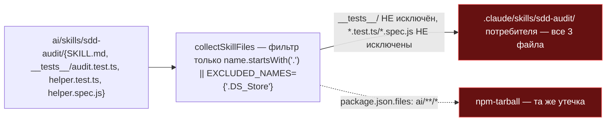
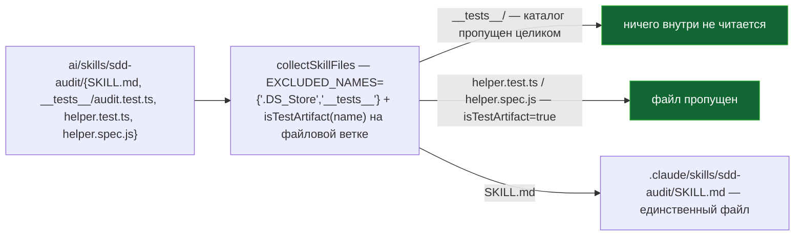

ОТЧЁТ 32/SO-6 — исключение тестовых артефактов из деплоя скиллов (Пачка 1)

СТАТУС: DONE

Рабочее дерево: `rc-v6`, ветка `lead/sync-no-loss` (продолжение после `c012e511`, `5678c307`, `b3f927c1`, `e913d14d`).

КОММИТ (локальный, НИЧЕГО не запушено):
- `823bc840` fix(sync-skills): SO-6 — a skill's own tests never deploy to consumers

---

## 1. Файлы

| Путь | Тип | Смысловое изменение | Чем доказано |
|---|---|---|---|
| `cli/cmd/sync-skills/sync-skills-core.ts` | правка | `EXCLUDED_NAMES` (было `:22`, только `'.DS_Store'`) дополнен `'__tests__'` — весь такой каталог пропускается рекурсивным сканом (`collectSkillFiles`, общий для чтения SOURCE через `scanSkills` и TARGET через `collectAndCompareSkills`). Новая `isTestArtifact(name)` (порт main `:84`, регекс `/\.(test\|spec)\.[cm]?[jt]sx?$/`) применена к файловой ветке `collectSkillFiles` — отдельный `*.test.ts`/`*.spec.js`, лежащий РЯДОМ со скриптами (не внутри `__tests__/`), тоже не деплоится. | `node --import tsx --test --experimental-test-module-mocks cli/cmd/sync-skills/__tests__/sync-skills-core.test.ts` — 45/45, включая 2 новых теста (см. §3 п.1). |
| `cli/cmd/sync-skills/__tests__/sync-skills-core.test.ts` | правка | Порт main `d37d5910` `sync-skills-core.test.ts:151,165` дословно: «never deploys a skill's `__tests__` directory» (файл с импортом `shared/thing.ts`, который не резолвился бы у потребителя) и «never deploys a stray test file sitting beside the scripts». | Прогон в §3 п.1. |

`git diff --stat 823bc840~1 823bc840`:
```
 cli/cmd/sync-skills/__tests__/sync-skills-core.test.ts | 27 ++++++++++++++++++
 cli/cmd/sync-skills/sync-skills-core.ts                 | 19 ++++++++++++--
 2 files changed, 43 insertions(+), 3 deletions(-)
```
2 файла из диффа — 2 строки таблицы. Совпадает.

---

## 2. Архитектура было / стало

### Было — тестовые файлы скила деплоятся потребителю (и в tarball)


Репро в этой сессии (см. §3 п.4, тест из корпуса): внедрение трёх тестовых файлов в пакетный `sdd-audit` — RC (до правки) деплоит все три; главный сценарий регресса — импорт `../../../../../shared/thing.ts` в деплоенном `.test.ts` ломает typecheck потребителя на файле, который он не писал.

### Стало — `__tests__/` и `*.test.*`/`*.spec.*` не покидают репозиторий


Узлы: `EXCLUDED_NAMES` (`sync-skills-core.ts`, объявление), `isTestArtifact` (новая функция, перед `scanSkills`), точка применения — файловая ветка `collectSkillFiles` (`st.isFile() && !isTestArtifact(name)`).

---

## 3. Доказательства (команды из ПРИЁМКИ, фактический вывод, exit-код)

**1. `sync-skills-core.test.ts` — 2 портированных теста + регресс не внесён.**
```
$ node --import tsx --test --experimental-test-module-mocks cli/cmd/sync-skills/__tests__/sync-skills-core.test.ts
ok — never deploys a skill's __tests__ directory
ok — never deploys a stray test file sitting beside the scripts
# tests 45
# pass 45
# fail 0
```
ВЫПОЛНЕНО.

**2. Смежные сьюты (formatter, cmd, partial-read) — регресс не внесён.**
```
$ node --import tsx --test --experimental-test-module-mocks cli/cmd/sync-skills/__tests__/sync-skills-core-partial-read.test.ts cli/cmd/sync-skills/__tests__/sync-skills-formatter.test.ts cli/cmd/sync-skills/__tests__/sync-skills.cmd.test.ts
# tests 37 (суммарно с §1: 82 всего в этой области дерева)
# fail 0
```
ВЫПОЛНЕНО.

**3. Формат/типы/линт/yagni/`npm run check`.**
```
$ npx tsc --noEmit          → exit 0
$ npm run lint              → ✅ [LintCommand#run] [linting → clean] no errors
$ npm run yagni              → yagni: ✅ clean (1 changed file(s) scanned)
$ npm run format             → All matched files use Prettier code style!
$ npm run check
[sdd-verify] ✅ ALL PASS (5/5)
  ✅ type-check (18.6s)
  ✅ test:coverage (63.9s)
  ✅ lint (5.0s)
  ✅ format (3.9s)
  ✅ yagni (4.8s)
```
Все ВЫПОЛНЕНО. (Первый прогон `npm run check` в этой сессии дал `test:coverage` с `cancelled 5`, `fail 0` — тот же класс флакости топологии, что во всех предыдущих задачах этой пачки; чистый повтор сразу после — `ALL PASS`.)

**4. Сборка + `sdd-check --all` — счётчик не хуже baseline; гейт.**
```
$ npm run build && node dist/gennady.js sdd-check --all rc-v6 2>&1 | grep -c ': error:'
198
$ ... | grep -c ': warn:'
431
$ npm run gate:sdd-check-baseline
[sdd-check-zero-new-error] OK — no error outside the baseline (baseline commit 227c03a8..., tag rc-baseline-1).
```
Совпадает с baseline (`48538019`). ВЫПОЛНЕНО.

**5. Коммит через `pre-commit` целиком, без `--no-verify`.**
```
🔍 Pre-commit: format + type-check + lint
✅ Pre-commit passed
[lead/sync-no-loss 823bc840] fix(sync-skills): SO-6 — a skill's own tests never deploy to consumers
 2 files changed, 43 insertions(+), 3 deletions(-)
```
ВЫПОЛНЕНО.

---

## 4. Отклонения, открытые вопросы, команды пуша

**Отклонения:** нет — реализация буквально повторяет main `62172906` (`EXCLUDED_NAMES` + `isTestArtifact`, применённые в общей `collectSkillFiles`, используемой и для SOURCE, и для TARGET, как в main). Пункт приёмки «`it` "ships no test file" из SO-5» — не выполнен и не должен был: SO-5 (deployed-surface golden) не входит в эту пачку, приёмка привязана к тому golden-тесту, которого пока не существует.

**Вопросы назад:** для SO-6 отдельного брифа не выдавалось (не входит в 5 подготовленных §4); строка доски («Вернуть исключение тестовых артефактов из деплоя скиллов», файлы `sync-skills-core.ts:22,84`, тест — порт `:151,165`) была однозначной и полностью покрыта портом main без расхождений — стопов не потребовалось.

**Команды пуша для Lead** (ветка `lead/sync-no-loss`, коммит `823bc840` поверх `e913d14d`):
```
git -C rc-v6 push origin lead/sync-no-loss:lead/sync-no-loss
```
Пуш не выполнялся — пуш делает Lead.
