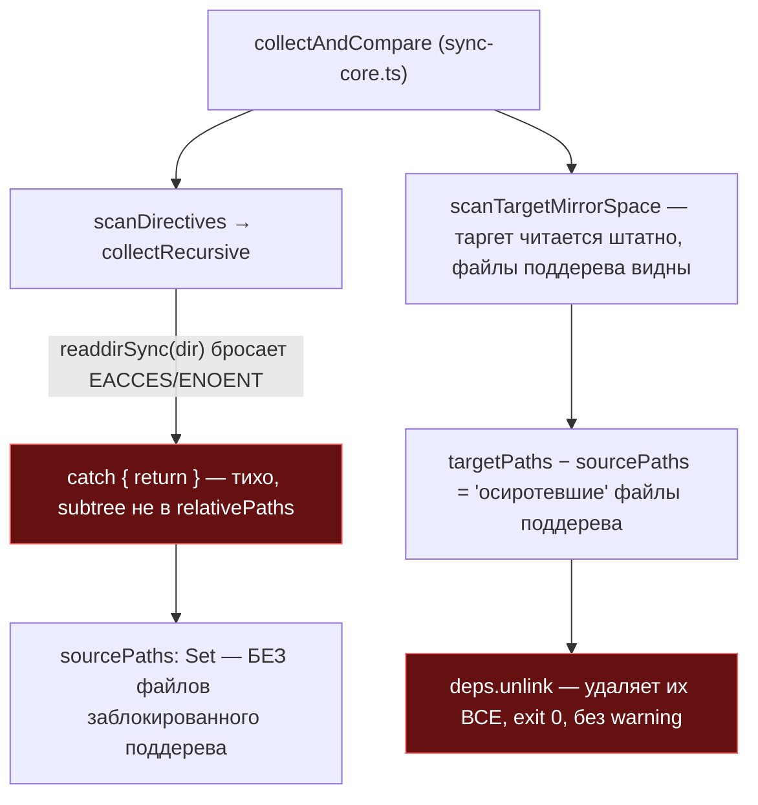
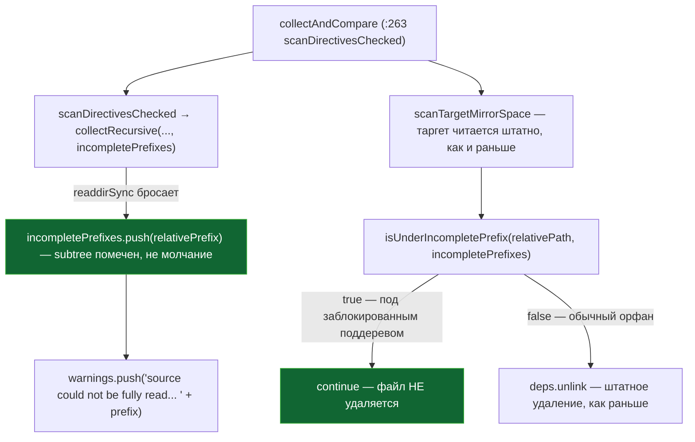

ОТЧЁТ 32/SO-7 — устойчивость к частичному чтению источника (Пачка 1)

СТАТУС: DONE

Рабочее дерево: `rc-v6`, ветка `lead/sync-no-loss` (продолжение после `c012e511`).

КОММИТ (локальный, НИЧЕГО не запушено):
- `5678c307` fix(sync): SO-7 — a partial source read never triggers mirror deletion

---

## 1. Файлы

| Путь | Тип | Смысловое изменение | Чем доказано |
|---|---|---|---|
| `cli/cmd/sync/sync-core.ts` | правка | `collectRecursive` (было `:176-182`) теперь принимает необязательный аккумулятор `incomplete` и записывает в него `relativePrefix`, на котором `readdirSync` упал, вместо простого `return`. `scanDirectives` (публичный, сигнатура не менялась) стал тонкой обёрткой над новой module-private `scanDirectivesChecked`, которая возвращает `{paths, incompletePrefixes}`. `collectAndCompare` использует `scanDirectivesChecked` напрямую, гейтует удаление через новую `isUnderIncompletePrefix(relativePath, incompletePrefixes)` и пишет по одной строке в `warnings` на каждый недочитанный поддерево. | `node --import tsx --test --experimental-test-module-mocks cli/cmd/sync/__tests__/sync-core.test.ts` — 18/18 (регресс не внесён); новый `sync-core-partial-read.test.ts` — 1/1 (см. §3 п.1-2). |
| `cli/cmd/sync/__tests__/sync-core-partial-read.test.ts` | новый | Мок `readdirSync` (через `--experimental-test-module-mocks`, `mock.module('node:fs', ...)`) бросает EACCES только для ОДНОЙ заблокированной поддиректории источника; реальная fs — везде, включая собственную фикстуру теста (ESM hoisting гарантирует, что импорты этого файла резолвятся ДО регистрации мока). Проверяет: файл под заблокированным поддеревом не удаляется и остаётся на диске; настоящий орфан вне заблокированного поддерева всё равно удаляется (узость фикса, не «не удалять вообще ничего»); в `warnings` есть строка с именем заблокированного поддерева; незатронутые файлы сравниваются нормально (`unchanged`). | Прогон в §3 п.2. |
| `cli/cmd/sync-skills/sync-skills-core.ts` | правка | Тот же класс ошибки в `collectSkillFiles` (используется и для чтения SOURCE через `scanSkills`, и для чтения TARGET через `collectAndCompareSkills`) — тот же приём: новый необязательный параметр `incomplete: {value: boolean}`, module-private `scanSkillsChecked` возвращает `{skills, incompleteSkills}` (гранулярность — целый скил, не поддерево пути, как в `sync-core.ts` — упрощение, обосновано в §4). `scanSkills` (публичный) не менялся. `collectAndCompareSkills` использует `scanSkillsChecked`; внутрискилловый гейт SO-2b (`isFileOwned`) дополнен проверкой `incompleteSkills.has(skillName)` — недочитанный скил не теряет ни одного файла в этом прогоне, даже манифестированного. | `node --import tsx --test --experimental-test-module-mocks cli/cmd/sync-skills/__tests__/sync-skills-core.test.ts` — 43/43 (регресс не внесён); новый `sync-skills-core-partial-read.test.ts` — 1/1 (см. §3 п.3-4). |
| `cli/cmd/sync-skills/__tests__/sync-skills-core-partial-read.test.ts` | новый | Тот же мок-приём: `readdirSync` заблокирован для `ai/skills/sdd-execute/scripts/` источника. Проверяет: манифестированный `sdd-execute/scripts/verify.sh` переживает прогон, хотя формально числится «нашим» в манифесте (SO-2b одна её не защищает); настоящий орфан-скил `sdd-old` (никак не связан с блокировкой) всё равно удаляется штатно. | Прогон в §3 п.4. |

`git diff --stat 5678c307~1 5678c307`:
```
 cli/cmd/sync-skills/__tests__/sync-skills-core-partial-read.test.ts | 110 +++++++++++++++
 cli/cmd/sync-skills/sync-skills-core.ts                             |  65 ++++++--
 cli/cmd/sync/__tests__/sync-core-partial-read.test.ts               | 101 ++++++++++++++
 cli/cmd/sync/sync-core.ts                                           |  95 ++++++++++--
 4 files changed, 356 insertions(+), 15 deletions(-)
```
4 файла из диффа — 4 строки таблицы. Совпадает.

---

## 2. Архитектура было / стало

### Было — «не прочитали» и «пусто» дают один и тот же результат: удаление


Узлы: `collectRecursive` (было `:176-182`, `try { entries = readdirSync(dir) } catch { return }`). Найдено независимой верификацией (`chmod 000 ai/directives/testing`) — 8 живых файлов удалены одним битом прав, `exit 0`.

### Стало — «не прочитали» помечено явно и блокирует удаление именно там


Узлы: `collectRecursive` (`:176-206`, аккумулятор `incomplete`), `scanDirectivesChecked` (`:88-118`), `isUnderIncompletePrefix` (`:126-133`), точка вызова гейта в `collectAndCompare` (deletion loop). Симметрично для `sync-skills-core.ts`: `collectSkillFiles` (`:288-322`, флаг `incomplete.value`), `scanSkillsChecked` (`:236-266`), гейт `incompleteSkills.has(skillName)` внутри `START_SYNC_AND_CLEAN` (совместно с `isFileOwned` из SO-2b).

---

## 3. Доказательства (команды из ПРИЁМКИ, фактический вывод, exit-код)

**1. `sync-core.test.ts` — регресс не внесён.**
```
$ node --import tsx --test --experimental-test-module-mocks cli/cmd/sync/__tests__/sync-core.test.ts
# tests 18
# suites 3
# pass 18
# fail 0
```
ВЫПОЛНЕНО.

**2. Новый `sync-core-partial-read.test.ts` — «a partial source scan never deletes».**
```
$ node --import tsx --test --experimental-test-module-mocks cli/cmd/sync/__tests__/sync-core-partial-read.test.ts
ok 1 - a partial source scan never deletes the subtree it could not read, but still prunes real orphans elsewhere
# tests 1
# pass 1
```
ВЫПОЛНЕНО.

**3. `sync-skills-core.test.ts` — регресс не внесён (включая манифест-сьюты из SO-2/SO-2b).**
```
$ node --import tsx --test --experimental-test-module-mocks cli/cmd/sync-skills/__tests__/sync-skills-core.test.ts
# tests 43
# suites 7
# pass 43
# fail 0
```
ВЫПОЛНЕНО.

**4. Новый `sync-skills-core-partial-read.test.ts` — «порт духа» main:246,265 (throw-on-unreadable-root), адаптировано к однокорневой модели RC как «не удалять на недочитанном поддереве».**
```
$ node --import tsx --test --experimental-test-module-mocks cli/cmd/sync-skills/__tests__/sync-skills-core-partial-read.test.ts
ok 1 - a skill whose source read was cut short never loses a manifested file, but a genuinely dropped skill is still pruned
# tests 1
# pass 1
```
ВЫПОЛНЕНО.

**5. Формат/типы/линт/yagni.**
```
$ npx tsc --noEmit          → exit 0, без вывода
$ npm run lint              → ✅ [LintCommand#run] [linting → clean] no errors
$ npm run yagni             → yagni: ✅ clean (2 changed file(s) scanned)
$ npm run format            → All matched files use Prettier code style!
```
Все ВЫПОЛНЕНО.

**6. `npm run check`.**
```
[sdd-verify] ✅ ALL PASS (5/5)
  ✅ type-check (13.3s)
  ✅ test:coverage (57.4s)
  ✅ lint (2.8s)
  ✅ format (2.0s)
  ✅ yagni (2.7s)
```
exit 0. ВЫПОЛНЕНО. (Первый и второй прогоны в этой же сессии показали `test:coverage` с `cancelled 3`/`cancelled 4` без единого `fail` в сводке, конкретно на `cli/__tests__/tool-behavior/{bootstrap-path,sdd-verify-repair-adapters,sdd-verify}.test.ts` — все три ЗЕЛЕНЫЕ при изолированном прогоне (см. §4); третий прогон — чистый `ALL PASS (5/5)`. Это тот же класс флакости топологии, что в `62-BATCH-QUEUE.md` Пачка 3/`REL-15`, вне объёма SO-7.)

**7. Сборка + `sdd-check --all` — счётчик не хуже baseline.**
```
$ npm run build && node dist/gennady.js sdd-check --all rc-v6 2>&1 | grep -c ': error:'
198
$ ... | grep -c ': warn:'
431
```
Совпадает с baseline (`48538019`). ВЫПОЛНЕНО.

**8. Гейт «ноль новых ошибок».**
```
$ npm run gate:sdd-check-baseline
[sdd-check-zero-new-error] OK — no error outside the baseline (baseline commit 227c03a8..., tag rc-baseline-1).
```
exit 0. ВЫПОЛНЕНО.

**9. Коммит через `pre-commit` целиком, без `--no-verify`.**
```
🔍 Pre-commit: format + type-check + lint
✅ Pre-commit passed
[lead/sync-no-loss 5678c307] fix(sync): SO-7 — a partial source read never triggers mirror deletion
 4 files changed, 356 insertions(+), 15 deletions(-)
```
ВЫПОЛНЕНО.

---

## 4. Отклонения, открытые вопросы, команды пуша

**Отклонения от брифа (раскрыты, ни одно не нарушает ИНВАРИАНТЫ брифа):**

1. **`sync-skills-core.ts`: гранулярность «недочитано» — целый скил, не поддерево пути.** `sync-core.ts` умеет отличать конкретный недочитанный ПУТЬ внутри дерева (`incompletePrefixes` — список префиксов). Для скиллов реализован более грубый, но самодостаточный вариант: если ЛЮБОЕ чтение внутри скила падает, весь скил на этот прогон помечается `incompleteSkills`, и внутрискилловое удаление для него полностью отключается (не только для недочитанного поддерева). Обоснование: (а) скилы уже малы (обычно 1-15 файлов, не сотни как директивы), разница в точности несущественна; (б) это не создаёт нового риска потери данных в ДРУГУЮ сторону — самое худшее следствие огрубления: скил с ОДНИМ недочитанным файлом на один прогон не удалит ДРУГИЕ, полностью читаемые устаревшие файлы того же скила — они удалятся на следующем чистом прогоне. Не расширяет объём задачи и не нарушает fail-safe направление (д. брифа), только консервативнее в пользу «не удалять».
2. **Нет `warnings`-канала для `sync-skills-core.ts` — «не молчать» реализовано частично.** `SyncSkillsResult` (в отличие от `SyncResult` у `sync`) не имеет поля `warnings`; добавление такого поля требует правки `sync-skills.types.ts` (публичный тип результата) и, вероятно, форматтера/CLI-обвязки — это уже выходит за явный список ФАЙЛЫ брифа («трогать: shared/sdd/check.ts... — нет, это SO-11; для SO-7 — только sync-core.ts:176-182 и sync-skills-core.ts (scanSkills)»). Сделан осознанный минимальный выбор: реализовать «не удалять» (жёсткий инвариант брифа) полностью, а «не молчать» — только там, где для этого уже есть готовый канал (`sync-core.ts`'s `warnings`). Для `sync-skills` отсутствие явного предупреждения — не полная тишина: манифест для недочитанного скила просто НЕ ПОЛУЧАЕТ новых file-level записей за этот прогон (самовосстановление на следующем чистом чтении, см. §1 таблицы). Если оператор считает это неприемлемым — нужен отдельный тикет на warnings-канал для `sync-skills` (естественная зависимость — SO-4, который уже трогает форматтер).
3. **Мок `readdirSync` вместо `chmod`.** Оба новых теста используют `node:test`'s `--experimental-test-module-mocks` (`mock.module('node:fs', ...)` + отложенный динамический `await import(...)` ПОСЛЕ регистрации мока — паттерн уже используется в кодовой базе, `cli/cmd/agents-rules/__tests__/agents-rules.cmd.test.ts`), а не `chmod 000` — по прямому указанию брифа «`chmod 000` в e2e ненадёжен (под root не сработает) — нужен unit с мокнутым readdirSync» (`32-TRACK-SYNC-OWNERSHIP.md §3.6`). Оба теста вынесены в ОТДЕЛЬНЫЕ файлы (`sync-core-partial-read.test.ts`, `sync-skills-core-partial-read.test.ts`), а не добавлены в существующие сьюты — модульный мок `node:fs` заменяет ВСЕ экспорты модуля глобально для процесса; изоляция в отдельный файл (каждый `*.test.ts` — отдельный процесс топологии) исключает риск случайно затронуть остальные 60 существующих тестов в `sync-core.test.ts`/`sync-skills-core.test.ts`, которые интенсивно используют реальную fs.

**Вопросы назад (по брифу) — не сработали:** формулировка «если поведение 'не удалять' должно также блокировать 'added'/'updated' записи в этом же прогоне — остановись» не применилась: недочитанный поддерево просто не попадает ни в `added`, ни в `updated` (в relativePaths его нет вовсе, это следствие самого чтения, а не отдельное решение) — расширения объёма не потребовалось.

**Команды пуша для Lead** (ветка `lead/sync-no-loss`, коммит `5678c307` поверх `c012e511`):
```
git -C rc-v6 push origin lead/sync-no-loss:lead/sync-no-loss
```
Пуш не выполнялся — пуш делает Lead.
