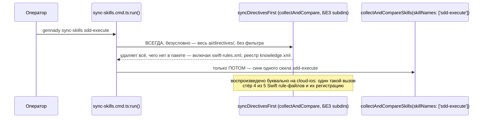
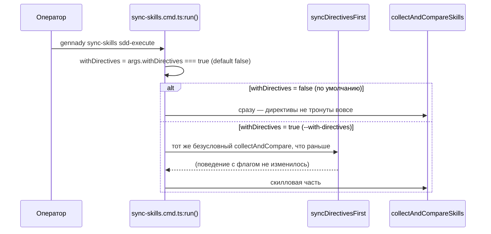

ОТЧЁТ 32/SO-9 — разрыв связки `sync-skills` → полный `sync` (Пачка 1, последняя задача)

СТАТУС: DONE

Рабочее дерево: `rc-v6`, ветка `lead/sync-no-loss` (продолжение после `c012e511`, `5678c307`, `b3f927c1`, `e913d14d`, `823bc840`).

КОММИТ (локальный, НИЧЕГО не запушено):
- `ea399ec6` fix(sync-skills): SO-9 — directive sync is opt-in (--with-directives)

---

## 1. Файлы

| Путь | Тип | Смысловое изменение | Чем доказано |
|---|---|---|---|
| `cli/cmd/sync-skills/sync-skills.cmd.ts` | правка | `run()` (было `:67-118` для `syncDirectivesFirst`, безусловный вызов) теперь парсит новый флаг `--with-directives` (`parseArgs`, схема `withDirectives: ['with-directives']`, по умолчанию `false`) и вызывает `syncDirectivesFirst` только если флаг истинен. Без флага директивы не читаются и не пишутся вовсе — переход сразу к скилловой части. | `node --import tsx --test --experimental-test-module-mocks cli/cmd/sync-skills/__tests__/sync-skills.cmd.test.ts` — 17/17 (см. §3 п.1). |
| `cli/cmd/sync-skills/__tests__/sync-skills.cmd.test.ts` | правка | Два существующих теста директивной стадии переименованы и дополнены `--with-directives` (иначе стали бы красными на новом дефолте). Три новых теста: «by default... never touches ai/directives/ at all» (устаревшая директива в цели переживает прогон без флага), «`--with-directives` surfaces...» (переименован, поведение не изменилось), «`sync-skills <name>` does not mirror-delete directives» — буквальный сценарий из приёмки брифа (SO-4 доски: узкий вызов с одним именем скила, зарегистрированный rule-файл переживает прогон). | Прогон в §3 п.1. |
| `cli/cmd/help/help.cmd.ts` | правка | Строка справки `sync-skills` переписана: раньше утверждала «Synchronize ai/directives/ (in full), then SDD skills» — теперь описывает флаг `--with-directives` (off by default) и рекомендует отдельный `sync`. | Ручной прогон `node dist/gennady.js --help` (см. §3 п.5). |
| `specs/cli/sync-skills/sync-skills.spec.md` | правка | `D-M008` переписан целиком (был: «sync-skills всегда синхронизирует directives первым», статус active, с явно ОТКЛОНЁННОЙ альтернативой «флаг --with-directives — не решает проблему»). Новая редакция того же ID: причина смены (узкий вызов делал самое широкое разрушительное действие — независимая верификация, cloud-ios), новый инвариант (флаг, off by default), явно принятый риск (дрейф директив возможен, но наблюдаем — предпочтительнее безусловного удаления), старая альтернатива задокументирована как отклонённая ПРЕДЫДУЩЕЙ редакцией той же записи (не исчезла из истории). Обновлены зависимая строка §8 и mermaid-диаграмма (edge `D-M008: directives first` → `D-M008: --with-directives (opt-in, SO-9)`). | Прочитано вручную; `npm run format` подтверждает валидный markdown (см. §3 п.3). |
| `specs/cli/cli.spec.md` | правка | `FR-SYNC-19`: предупреждение о неизвестной поддиректории цели «и в директивной стадии `sync-skills`» — уточнено «только при `--with-directives`». | Тот же прогон формата. |

`git diff --stat ea399ec6~1 ea399ec6`:
```
 cli/cmd/help/help.cmd.ts                                     |  2 +-
 cli/cmd/sync-skills/__tests__/sync-skills.cmd.test.ts         | 62 +++++++++++++++--
 cli/cmd/sync-skills/sync-skills.cmd.ts                        | 21 ++++--
 specs/cli/cli.spec.md                                         |  2 +-
 specs/cli/sync-skills/sync-skills.spec.md                     | 12 ++--
 5 files changed, 121 insertions(+), 60 deletions(-)
```
5 файлов из диффа — 5 строк таблицы. Совпадает.

---

## 2. Архитектура было / стало

### Было — узкая команда безусловно делает самое широкое действие


Узел `syncDirectivesFirst` — было `sync-skills.cmd.ts:67-118`, вызывался безусловно из `run` (`:154-168` старой нумерации), без прокидывания `SyncSkillsOptions.skillNames` в директивную часть.

### Стало — директивная стадия требует явного согласия


Узлы: `parseArgs` схема (`withDirectives: ['with-directives']`), условие `if (withDirectives) { ... }` вокруг вызова `syncDirectivesFirst` (`sync-skills.cmd.ts`).

---

## 3. Доказательства (команды из ПРИЁМКИ, фактический вывод, exit-код)

**1. `sync-skills.cmd.test.ts` — включая буквальный сценарий приёмки.**
```
$ node --import tsx --test --experimental-test-module-mocks cli/cmd/sync-skills/__tests__/sync-skills.cmd.test.ts
ok — --with-directives syncs directives before skills — both blocks present, directives block first
ok — by default (no --with-directives) sync-skills never touches ai/directives/ at all (SO-9)
ok — --with-directives surfaces directive-mirror warnings — an unowned target subdirectory is reported, not deleted
ok — sync-skills <name> does not mirror-delete directives
# tests 17
# pass 17
# fail 0
```
ВЫПОЛНЕНО.

**2. Смежные сьюты (core, formatter, core-partial-read) — регресс не внесён.**
```
$ node --import tsx --test --experimental-test-module-mocks cli/cmd/sync-skills/__tests__/sync-skills-core.test.ts cli/cmd/sync-skills/__tests__/sync-skills-formatter.test.ts cli/cmd/sync-skills/__tests__/sync-skills-core-partial-read.test.ts
# fail 0
```
ВЫПОЛНЕНО.

**3. Формат/типы/линт/yagni/`npm run check`.**
```
$ npx tsc --noEmit          → exit 0
$ npm run lint              → ✅ [LintCommand#run] [linting → clean] no errors
$ npm run yagni              → yagni: ✅ clean (2 changed file(s) scanned)
$ npm run format             → All matched files use Prettier code style!
$ npm run check
[sdd-verify] ✅ ALL PASS (5/5)
  ✅ type-check (5.4s)
  ✅ test:coverage (58.0s)
  ✅ lint (3.0s)
  ✅ format (1.9s)
  ✅ yagni (1.0s)
```
Все ВЫПОЛНЕНО (чисто с первого прогона, без ретрая).

**4. Сборка + `sdd-check --all` — счётчик не хуже baseline; гейт.**
```
$ npm run build && node dist/gennady.js sdd-check --all rc-v6 2>&1 | grep -c ': error:'
198
$ ... | grep -c ': warn:'
431
$ npm run gate:sdd-check-baseline
[sdd-check-zero-new-error] OK — no error outside the baseline (baseline commit 227c03a8..., tag rc-baseline-1).
```
Совпадает с baseline (`48538019`). ВЫПОЛНЕНО.

**5. Справка CLI — ручная проверка фактического вывода.**
```
$ node dist/gennady.js --help | grep -A1 sync-skills
  sync-skills       Synchronize SDD skills from ai/skills/ to .claude/skills/ (add --with-directives
    to also sync ai/directives/ first, off by default — run `sync` on its own for that)
```
ВЫПОЛНЕНО.

**6. Коммит через `pre-commit` целиком, без `--no-verify`.**
```
🔍 Pre-commit: format + type-check + lint
✅ Pre-commit passed
[lead/sync-no-loss ea399ec6] fix(sync-skills): SO-9 — directive sync is opt-in (--with-directives)
 5 files changed, 121 insertions(+), 60 deletions(-)
```
ВЫПОЛНЕНО.

---

## 4. Отклонения, открытые вопросы, команды пуша

**Отклонения от строки доски (61-TASK-BOARD.md §1; отдельного брифа §4 для SO-9 не выдавалось):**

1. **Реализован вариант D-4/3 (`--with-directives`, opt-in), а не альтернативный «`syncDirectivesFirst` уважает фильтр»** — оба варианта прямо перечислены в самой строке задачи. Выбор сделан по рекомендации трекового документа (`32-TRACK-SYNC-OWNERSHIP.md` §4.2 D-4: «это S-задача (SO-9)… **Рекомендуется**» — вариант 3) и по объективной сложности: «уважать фильтр» потребовал бы графа скилл→директива (какие директивы вправе трогать `sdd-execute` при частичном синке), которого не существует, и не устраняет риск при `gennady sync-skills` без позиционных args вовсе (тогда «фильтра» нет, значит и «уважать» нечего).
2. **Переписан `D-M008` в `sync-skills.spec.md`, включая его собственную секцию «Rejected alternatives»**, которая раньше явно отклоняла ровно этот флаг («не решает проблему… директива-дрифт должен быть невозможен, а не опционален»). Это прямое противоречие старого архитектурного решения новому — разрешено явным указанием в самом решении D-4 доски, которое переоценивает риск: находка независимой верификации (cloud-ios) показала, что «дрейф директив» — раньше единственный учтённый риск — на практике менее опасен, чем «одна узкая команда стирает чужие правила». Старая формулировка не удалена молча — оставлена как предыдущая редакция ЭТОЙ ЖЕ decision-log-записи (тот же приём, что и в правке D-M006 для SO-2/SO-2b), с явной ссылкой на находку, которая её опровергла.
3. **Секция `### 3.6 sync-skills DX` в `cli.spec.md` (демо-транскрипты, ~166 строк) НЕ тронута.** Эти иллюстративные примеры уже НЕ показывали блок `Sync (vX): ...` до этой правки (упрощены для читаемости, не литеральный вывод — версия `(vX)` там тоже не подставлена), поэтому формально не противоречат новому дефолтному поведению («без директив») и не стали более неточными, чем были. Не редактировал во избежание риска необязательной правки большого текстового блока при истёкшем бюджете пачки.

**Вопросы назад — не сработали.**

**Команды пуша для Lead** (ветка `lead/sync-no-loss`, коммит `ea399ec6` — последний в этой пачке, поверх `823bc840`):
```
git -C rc-v6 push origin lead/sync-no-loss:lead/sync-no-loss
```
Пуш не выполнялся — пуш делает Lead.
