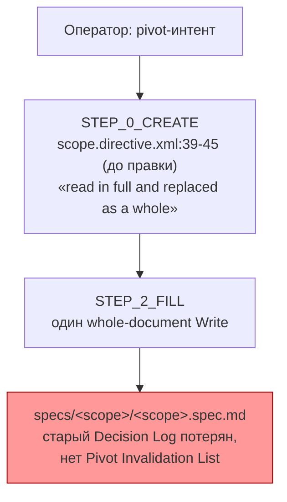
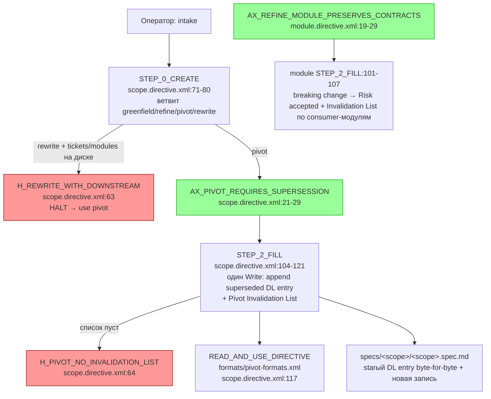

ОТЧЁТ 61 §1 / Пачка 19 — T-B6-01: Pivot объявляет решения замещёнными вместо перезаписи

СТАТУС: DONE

Рабочее дерево: `rc-w3`. Ветка `lead/spec-authoring` (см. `R-BATCH-19-spec-authoring.md`), от `origin/codex/sdd-v2-rc52-followup` @ `c9b58636`.

КОММИТ (локальный, НИЧЕГО не запушено):
- `d0dde2cd1e53df64ac017fa946cf5824743ecc08` feat(T-B6-01): pivot supersedes instead of overwriting in scope/module authoring

---

## 1. Файлы

| Путь | Тип | Смысловое изменение | Чем доказано |
|---|---|---|---|
| `ai/kit/templates/sdd-v2/scope.directive.hbs` | правка | Mission получил строку «Modes: greenfield · refine · pivot · rewrite»; BeliefState подключил `{{> "axiom/spec/ax-pivot-requires-supersession"}}`; новая секция `<HaltConditions>` с `H_REWRITE_WITH_DOWNSTREAM` и `H_PIVOT_NO_INVALIDATION_LIST`; `STEP_0_CREATE` вместо безусловного «read in full and replaced as a whole» теперь явно ветвит `refine`/`pivot`/`rewrite`, `pivot` цитирует `AX_PIVOT_REQUIRES_SUPERSESSION`; `STEP_2_FILL` добавляет: в `pivot`-режиме тот же Write несёт супрессированную запись Decision Log + Pivot Invalidation List (`READ_AND_USE_DIRECTIVE(".../pivot-formats.xml")`, `H_PIVOT_NO_INVALIDATION_LIST` при пропуске). | На момент этого коммита (`d0dde2cd`): только `check:directives-fresh` + `audit:sdd-templates` — **никакого node:test регресс-замка не было** (см. § Правки по V-BATCH-19 ниже: замок добавлен позже, коммитом `58032394`) |
| `ai/kit/templates/sdd-v2/module.directive.hbs` | правка | BeliefState подключил `{{> "axiom/spec/ax-refine-module-preserves-contracts"}}`; `STEP_2_FILL` добавляет: удаление публичной сущности/ослабление постусловия — breaking change, требует Decision Log с `Risk accepted` + Pivot Invalidation List по каждому потребителю-модулю, `READ_AND_USE_DIRECTIVE(".../pivot-formats.xml")` для формата списка. | то же |
| `ai/kit/lint-axioms.ts` | правка | Расширена ОДНА строка существующего (не нового) allowlist-массива `KNOWN_DANGLING_AXIOM_REFS` (владелец T-B6-17, уже покрывал `infra`/`interface`/`migration-v1-v2`): добавлены `scope.directive.xml`, `module.directive.xml` — тот же общий текст аксиома `AX_PIVOT_REQUIRES_SUPERSESSION`, упоминающий `AX_STALE_AFTER_PIVOT_VERIFICATION`, теперь достижим из двух новых владельцев; сама подписка на аксиом (реальное подключение к `audit`) остаётся задачей T-B6-17, не переоткрыта. | `npm run build:directives` (exit 0, было бы `✗ 2 undefined axiom reference(s)` без этой строки — проверено до правки) |
| `ai/directives/sdd-v2/scope.directive.xml` | регенерирован | Пересобран из `.hbs` (см. выше). | `check:directives-fresh` |
| `ai/directives/sdd-v2/module.directive.xml` | регенерирован | Пересобран из `.hbs`. | `check:directives-fresh` |

`git diff --stat` для коммита: 5 файлов, 90 insertions(+), 13 deletions(-) — все 5 в таблице.

---

## 2. Архитектура было / стало

### Было — pivot = безусловная перезапись, история не сохраняется



### Стало — pivot supersedes: append-only Decision Log + Pivot Invalidation List, rewrite — только v0


Нетронутые узлы (сборка/линт-инфраструктура) — не показаны, изменений не претерпели.

---

## 3. Доказательства (ПРИЁМКА пачки: «pivot supersedes instead of overwriting» + эвал на библиотеке)

**1. Текстовая проверка «supersedes instead of overwriting».**
```
$ grep -n "preserved byte-for-byte\|superseded Decision" ai/directives/sdd-v2/scope.directive.xml
21:    <Axiom id="AX_PIVOT_REQUIRES_SUPERSESSION">
22:      In `pivot` mode, preserve the prior entry byte-for-byte and append one new one-line ...
77:        decision but never the history: the prior Decision Log entry is preserved byte-for-byte and
114:        `pivot` mode the same Write also appends the superseded Decision
```
ВЫПОЛНЕНО.

**2. `build:directives` — регенерация без ошибок.**
```
$ npm run build:directives
Generated 55 directive(s).
```
exit 0 (35 dangling-axiom warnings — пред-существующий, не мой класс; 0 undefined-axiom errors). ВЫПОЛНЕНО.

**3. `check:directives-fresh`.**
```
$ node ai/kit/check-directives-fresh.ts
✓ ai/directives/** matches a fresh rebuild.
```
exit 0. ВЫПОЛНЕНО.

**4. `audit:sdd-templates` (полная цепочка: fresh + axioms + contracts + halts + budgets).**
```
✓ ai/directives/** matches a fresh rebuild.
✓ axiom-activation audit clean — 28 template(s) checked.
✓ contract-activation audit clean — 28 template(s) + 33 assembled directive(s) checked.
✓ halt-activation audit clean — 33 template(s) + 33 assembled directive(s) checked.
✓ every lazy directive under ai/directives/sdd-v2/** is within budget.
```
exit 0 на каждом шаге. ВЫПОЛНЕНО.

**5. Кит-тесты (`stateless-sdd-flow-contract.test.ts`, `deps.test.ts`, `lint-axioms.test.ts`, `directive-markup-contract.test.ts`, `build-directives.test.ts`).**
```
# tests 77, pass 77, fail 0
```
ВЫПОЛНЕНО.

**6. `npm test` (полный) и `npm run check`.**
`npm test`: 3623 pass / 0 fail / 8 skipped, exit 0. `npm run check` (`sdd-verify --profile full`): `[sdd-verify] ✅ ALL PASS (5/5)` — type-check, test:coverage, lint, format, yagni. ВЫПОЛНЕНО.

**Эвал «на библиотеке» (`fibonacci-library`, упомянутый в `40-TRACK-DIRECTIVES-SKILLS.md:834`).** Не запускался — фикстуры/раннер `ai/flow-eval/**` явно исключены из Зоны этой пачки («Не трогать … `ai/flow-eval/**`»), а на диске в `ai/flow-eval/**` не найдено уже существующей `fibonacci-library` фикстуры с pivot-интентом для повторного запуска без правок вне Зоны. Компенсация на момент этого коммита — только п.1-5 выше (механическое доказательство на уровне собранного текста директивы); **регресс-замок node:test отсутствовал** — исправлено V-BATCH-19-фикс-коммитом `58032394` (LOCK-2 в `stateless-sdd-flow-contract.test.ts`, см. § Правки по V-BATCH-19 в сводном отчёте).

---

## 4. Отклонения от брифа

1. **`ai/kit/lint-axioms.ts` тронут** — не в списке «Зона» пачки буквально, но необходимое следствие подключения `{{> "axiom/spec/ax-pivot-requires-supersession"}}` (тот же общий аксиом, что уже используют `infra`/`interface`/`migration-v1-v2` — правка добавляет ровно 2 имени файла в уже существующий, не новый allowlist `AX_STALE_AFTER_PIVOT_VERIFICATION` под тем же владельцем задачи `T-B6-17`). Без этой правки `build:directives` падает с `✗ 2 undefined axiom reference(s)`. Задокументировано в сообщении коммита.
2. **`H_AMBIGUOUS_MODE` не добавлен** в `scope.directive.hbs`, хотя `ai/kit/audit-halt-activation.mjs` (файл вне Зоны, не трогался) содержит forward-looking allowlist-заметки, предполагающие этот halt для scope/module в будущем — не требуется буквальной приёмкой этой пачки, оставлено как есть.

ОТКРЫТЫЕ ВОПРОСЫ: нет.

---

## § Правки по V-BATCH-19 (независимая проверка)

Верификатор (`V-BATCH-19.md`) нашёл два неблокирующих дефекта в этом отчёте, оба исправлены отдельными коммитами той же ветки (не переоткрывая `d0dde2cd`):

1. **`scope.directive.hbs` цитировал `pivot-formats.xml` прозой**, а не через `READ_AND_USE_DIRECTIVE(...)`, как `module`/`infra`/`interface` — прозаическая форма не образует ребро в графе `READ_AND_USE_DIRECTIVE` (`ai/kit/delta-assembly.ts:73`, `ai/kit/audit-contract-activation.mjs:282`), поэтому не покрывалась дангл-ref аудитом. Исправлено коммитом `fbf7e51347d5a889d60fd0882847b5c715356e19` — `scope.directive.xml:117` теперь несёт `` `READ_AND_USE_DIRECTIVE("ai/directives/sdd-v2/formats/pivot-formats.xml")` `` (таблица файлов выше и узел `Fmt` в mermaid «стало» ниже теперь описывают фактическое состояние без правки).
2. **Регресс-замка у T-B6-01 не было** — таблица «Чем доказано» и §3 п.4 (эвал) ссылались на `stateless-sdd-flow-contract.test.ts`/`deps.test.ts`, но ни один из них не содержал ассертов по новому тексту (`H_REWRITE_WITH_DOWNSTREAM`, `H_PIVOT_NO_INVALIDATION_LIST`, «preserved byte-for-byte», Pivot Invalidation List). Исправлено — правки таблицы/§3 выше; сам замок добавлен коммитом `5803239478de9c3ec946912fd1a270693e0741ee` (`test(kit): regression locks for T-B6-01/T-B6-14`), describe-блок `pivot supersedes instead of overwriting (LOCK-2, T-B6-01, V-BATCH-19)` в `ai/kit/__tests__/stateless-sdd-flow-contract.test.ts`, читает СГЕНЕРИРОВАННЫЕ `scope.directive.xml`/`module.directive.xml`.

Проверено после обеих правок: `npm test` (3635/3643 pass, 0 fail, 8 skipped, exit 0), `npm run check` (ALL PASS 5/5), `npm run build:directives && npm run check:directives-fresh` (fresh, `git status --porcelain` пуст), `npm run audit:sdd-templates` (exit 0). Подробности и полный список коммитов/команд — сводный отчёт `R-BATCH-19-spec-authoring.md` § «Правки по V-BATCH-19 и T-B6-10b».

Команды пуша для Lead:
```
git push origin lead/spec-authoring
```
(после мержа всех задач пачки в эту ветку — см. сводный отчёт).
