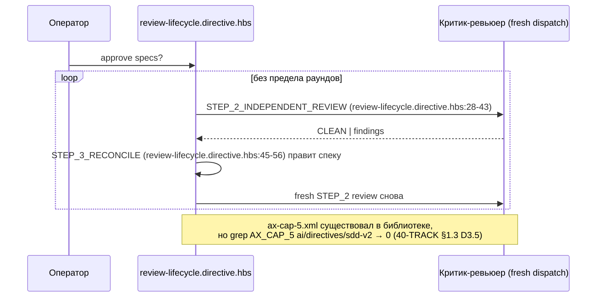
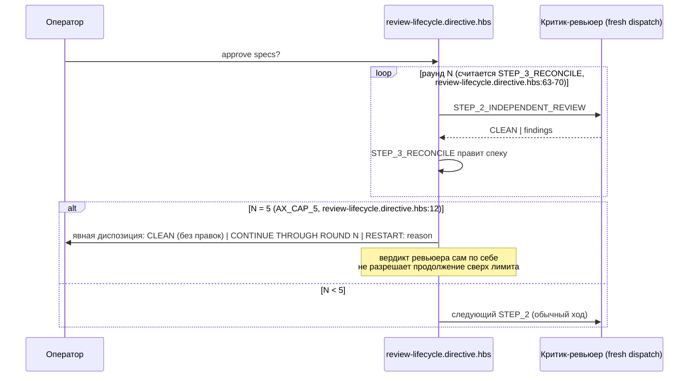
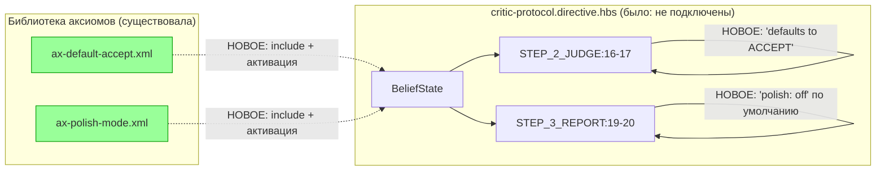

ОТЧЁТ 61 §1 / 62 §«Пачка 20» — T-B6-03: `review-lifecycle` STEP_2⇄STEP_3 ограничен `AX_CAP_5`

СТАТУС: DONE

Рабочее дерево: `rc-w3` (`/private/tmp/claude-503/.../scratchpad/rc-w3`). Ветка `lead/review-critic-bounds` от `origin/codex/sdd-v2-rc52-followup`.

КОММИТ (локальный, НИЧЕГО не запушено):
- `eafc9e35` feat(T-B6-03): bound the review⇄reconcile cycle with AX_CAP_5

---

## 1. Файлы

| Путь | Тип | Смысловое изменение | Чем доказано |
|---|---|---|---|
| `ai/kit/templates/sdd-v2/review-lifecycle.directive.hbs` | правка | `BeliefState` подключает `{{> "axiom/process/ax-cap-5"}}`; `STEP_3_RECONCILE` считает раунды STEP_2⇄STEP_3 и на пятом результате требует явную диспозицию оператора (`CLEAN` / `CONTINUE THROUGH ROUND N` / `RESTART: reason`) вместо бесконечного цикла. | `review-critic-bounds.test.ts` (describe «review-lifecycle: STEP_2⇄STEP_3 is bounded by AX_CAP_5»). |
| `ai/directives/sdd-v2/review-lifecycle.directive.xml` | правка (сборка) | Прямое следствие правки шаблона. | `check:directives-fresh`. |
| `ai/kit/templates/sdd-v2/critic-protocol.directive.hbs` | правка | `BeliefState` подключает `ax-default-accept` и `ax-polish-mode` (обе существовали в библиотеке аксиом, нигде не были собраны — 40-TRACK §1.3 D3.3/D3.6); `STEP_2_JUDGE` активирует `AX_DEFAULT_ACCEPT` (неуверенная находка → ACCEPT по умолчанию); `STEP_3_REPORT` активирует `AX_POLISH_MODE` (`polish: off` по умолчанию, MINOR/INFO не двигают вердикт). | `review-critic-bounds.test.ts` (describe «critic-protocol: AX_DEFAULT_ACCEPT and AX_POLISH_MODE are connected»). |
| `ai/directives/sdd-v2/critic-protocol.directive.xml` | правка (сборка) | Прямое следствие правки шаблона. | `check:directives-fresh`. |
| `ai/kit/__tests__/review-critic-bounds.test.ts` | новый | Регрессионный тест-файл (создан этой задачей, далее расширен ISS-10/T-B6-05/T-B6-20 в следующих коммитах той же пачки) — на момент этого коммита содержит два `describe`: цикл `review-lifecycle` (4 кейса) и активация критик-аксиом (3 кейса). | Сам файл, `node --import tsx --test`. |

`git diff --stat` этого коммита — 5 файлов, все покрыты выше.

---

## 2. Архитектура было / стало

### Было — цикл без верхней границы



### Стало — `AX_CAP_5` считает раунды и требует диспозицию на пятом



Дополнительно — `critic-protocol.directive.hbs`:



---

## 3. Доказательства (команды из ПРИЁМКИ, фактический вывод, exit-код)

**1. Целевые кейсы `review-critic-bounds.test.ts` (на момент этого коммита — 7 тестов, 2 suite).**
```
$ node --import tsx --test ai/kit/__tests__/review-critic-bounds.test.ts ai/kit/__tests__/deps.test.ts \
    ai/kit/__tests__/stateless-sdd-flow-contract.test.ts ai/kit/__tests__/critic-confusion-triage.test.ts
# tests 57, pass 57, fail 0
```
exit 0. ВЫПОЛНЕНО.

**2. `npm run build:directives` + `check:directives-fresh`.**
```
Generated 55 directive(s).
✓ ai/directives/** matches a fresh rebuild.
```
exit 0/0. ВЫПОЛНЕНО.

**3. `audit:sdd-templates` (axioms/contracts/halts/budgets).**
```
✓ axiom-activation audit clean — 28 template(s) checked.
✓ contract-activation audit clean — 28 template(s) + 33 assembled directive(s) checked.
✓ halt-activation audit clean — 33 template(s) + 33 assembled directive(s) checked.
✓ every lazy directive under ai/directives/sdd-v2/** is within budget.
```
exit 0. ВЫПОЛНЕНО.

**4. `cli/__tests__/directive-tool-contract/directive-tool-contract.test.ts` (проверяет, что новая директивная проза не вводит неклассифицированный `npx gennady`-вызов — эта задача текст не добавляла, но проверено на общем срезе пачки).**
```
# tests 45, pass 45, fail 0
```
exit 0. ВЫПОЛНЕНО.

**5. Коммит через `pre-commit` целиком, без `--no-verify` (прошёл с первой попытки).**
```
[sdd-verify] ✅ ALL PASS (5/5)
  ✅ type-check (4.3s)
  ✅ test:coverage (46.5s)
  ✅ lint (8.6s)
  ✅ format (1.9s)
  ✅ yagni (0.5s)
✓ ai/directives/** matches a fresh rebuild.
✓ axiom-activation / contract-activation / halt-activation audit clean.
✓ every lazy directive ... within budget.
✅ Pre-commit passed
[lead/review-critic-bounds eafc9e35] feat(T-B6-03): bound the review⇄reconcile cycle with AX_CAP_5
```
exit 0. ВЫПОЛНЕНО.

---

## 4. Отклонения, открытые вопросы, команды пуша

**Отклонение (по брифу-пачке, не по решению исполнителя).** Доска называет для T-B6-03 файлы `review-lifecycle.directive.hbs, critic-protocol.directive.hbs` — оба тронуты именно так. `ax-default-accept`/`ax-polish-mode` подключены в `critic-protocol.directive.hbs` (а не в `review-lifecycle`), поскольку это критик-специфичные аксиомы из `ai/kit/axiom/critic/**`, естественно ложащиеся рядом с уже подключёнными в том же файле `ax-uncertainty-is-signal`/`ax-confusion-bug`; `AX_CAP_5` — процессный аксиом самого цикла ревью⇄reconcile — подключён в `review-lifecycle.directive.hbs`, где этот цикл буквально описан (STEP_2⇄STEP_3). Соответствует явной формулировке цели в доске: «review-lifecycle STEP_2⇄STEP_3 ограничен AX_CAP_5; ax-default-accept/ax-polish-mode — после T-B6-21» (T-B6-21 уже влит PR #30, зависимость снята).

**Открытые вопросы:** нет.

**Команды пуша для Lead** — см. сводный отчёт `R-BATCH-20-review-critic-bounds.md`.
